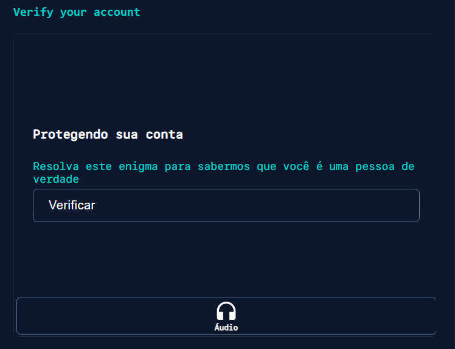

# Curso Alura - Git e GitHub compartilhando e colaborando em projetos

## Aula 1 - Compartilhando Projetos

### Aula 1 - Apresentação - Vídeo 1

Transcrição  
Rodrigo: Olá, seja bem-vindo(a) ao curso de GIT e GitHub. Meu nome é Rodrigo Ferreira, sou um dos instrutores da Alura e acompanharei você ao longo deste curso.

Audiodescrição: Rodrigo Ferreira se descreve como um homem de pele branca, cabelo curto na cor castanha. Está com uma camisa na cor azul.

E não estou sozinho, estou com minha colega Gabrielle Ribeiro.

Gabrielle: Olá, eu sou a Gabi Ribeiro, também sou instrutora aqui na Alura e acompanharei você nesse curso.

Audiodescrição: Gabrielle Ribeiro se descreve como uma mulher parda, com cabelo curto e verde. Usa óculos com armação arredondada, piercing no septo e uma camisa preta. Ambos estão nos estúdios da Alura, sentados em uma mesa redonda e com laptops à sua frente.

O que vamos aprender?  
Rodrigo: Vamos apresentar o que vamos discutir de interessante nesse curso.

Este curso é para você que trabalha com programação, ou que tem interesse em trabalhar com programação, independentemente da linguagem de programação ou da área (se vai trabalhar com back-end, front-end, mobile), pois vamos apresentar ferramentas para compartilhamento de código e para colaboração em código, que é o GitHub e também o GIT.

Nesse curso, você vai aprender o que é esse tal de GitHub, como que ele funciona, como criar uma conta nesse GitHub, criar repositórios, que são os locais onde será compartilhado o seu código, assim como trabalhar em time, compartilhando projetos com outras pessoas e essas outras pessoas também fazendo alterações no código e compartilhando com você.

Gabrielle: Você também vai aprender qual é o fluxo de trabalho dentro do GIT e GitHub.

Rodrigo: E, além disso, vamos utilizar o Prompt de Comandos e a IDE Visual Studio Code para fazer essa integração com o GIT e aprenderemos também como lidar com conflitos, já que num trabalho em equipe, eventualmente alguém pode mexer no mesmo arquivo, numa mesma linha e o GIT consegue nos auxiliar com essa parte de conflitos.

Gabrielle: Você também vai aprender sobre o histórico de versões do GIT e como alterá-lo, apagando e modificando algumas informações.

Rodrigo: Além disso, vamos apresentar algumas ferramentas adicionais do GitHub, como o Gist, para compartilhar trechos de código, como criar um README no seu repositório e o Gitignore, para ignorar determinados arquivos do seu projeto.

Há muita coisa legal que vamos discutir nesse curso, certo Gabi? Se você se interessou, venha conosco e nos encontramos na primeira aula.

#### Aula 1 - Preparando o ambiente: projeto do curso

Neste curso utilizaremos o projeto sorteador de número secreto, que foi desenvolvido nos cursos de lógica de programação. Você pode fazer o [download do projeto inicial neste link:](https://github.com/alura-cursos/3386-git-github/archive/refs/heads/projeto_inicial.zip)

Projeto inicial
Após baixar o arquivo zip, descompacte-o em algum diretório do seu computador e na sequência importe o projeto em sua IDE. No curso, utilizaremos o VSCode como IDE, sendo recomendado que você também utilize essa mesma IDE para facilitar o seu aprendizado.

### Aula 1 - Conheça o GitHub - Vídeo 2

Transcrição  
Gabrielle: Imagine que você finalizou o desenvolvimento de um projeto e agora deseja compartilhar o seu código com outras pessoas. Como isso pode ser feito? Será que é enviando por e-mail uma pasta compactada? Ou talvez colocando em um pendrive?

Rodrigo: Neste curso, vamos trabalhar com o projeto do número secreto. Inclusive, já abrimos o projeto na IDE do Visual Studio Code. A intenção é compartilhar o código, não o projeto.

Nos cursos de lógica de programação, vocês aprenderam a compartilhar este projeto utilizando o Vercel para fazer o que chamamos de deploy, colocando o projeto no ar. Ele gera uma URL que pode ser enviada para as pessoas acessarem o seu projeto.

Porém, não queremos compartilhar o projeto, queremos compartilhar o código. Queremos compartilhar este código HTML, CSS e JavaScript para que outras pessoas desenvolvedoras possam visualizar o código e colaborar com este projeto.

Conhecendo o GitHub  
Gabrielle: Como compartilhamos esse código? Como outra pessoa pode visualizar e, às vezes, até contribuir para o código do nosso projeto?

Rodrigo: Assim como você mencionou, poderíamos enviá-lo por e-mail, compactá-lo, colocá-lo em um pendrive, entre outros.

Mas, da mesma forma que existe um site, como o Vercel, para realizar o deploy do projeto, existem também sites para compartilhar códigos de projetos de programação, onde podemos disponibilizar, deixar aberto para outras pessoas para visualizar, baixar e colaborar com o nosso código.

Há um site que é muito famoso para isso, não é mesmo, Gabi?

Gabrielle: Sim, é o GitHub, que é o site que vamos utilizar neste curso.

Rodrigo: Perfeito. Então, vamos abrir o navegador, abrir uma nova aba e entrar no site: github.com. Esse é um dos sites que oferece esse serviço de hospedagem de projetos e de código-fonte de aplicações.

Ao entrar no site, temos uma explicação de como funciona. Você consegue pesquisar alguns projetos, tem nomes de algumas empresas que o utilizam. Ele oferece esse serviço para hospedar o código do nosso projeto.

Então, fica a questão: será que é necessário pagar? Isso é de graça, Gabi?

Gabrielle: Nós podemos usar este site gratuitamente, só precisamos criar uma conta.

Criando uma conta no GitHub
Rodrigo: Para criar uma conta, caso você ainda não tenha, no canto superior direito no site do GitHub, existe um botão chamado "Sign up" (registrar-se).

Clicando nele, será exibido um formulário para você realizar um cadastro, que é como qualquer outro, pedindo seu nome, e-mail, entre outras informações.

Criaremos uma conta do zero, apenas para mostrar o passo-a-passo. Primeiro, você vai digitar o seu e-mail. Por exemplo, usaremos um e-mail fictício apenas para testar: rodrigo.alura87@gmail.com, pois os instrutores já tem uma conta no GitHub com o seus e-mails pessoais.

Ao clicar no botão de "continue" (continuar), será pedido para gerar uma senha. Nesse caso, incluiremos uma senha qualquer. Ele tem algumas validações, pedindo para você incluir uma senha forte com pelo menos 15 caracteres ou 8 caracteres incluindo um número e uma letra minúscula. Então, não pode digitar 1, 2, 3, 4, 5, 6.

Após clicar em continuar, será pedido para você digitar um username (nome de usuário).

Gabrielle: Esse nome deve ser único para te identificar dentro da plataforma.

Rodrigo: Não podemos colocar, por exemplo, rodrigo, porque provavelmente outra pessoa já criou uma conta com esse nome de usuário. Quando o nome não está disponível, aparece uma mensagem abaixo: "Username rodrigo is not available".

Vamos usar outro nome de usuário, por exemplo, colocaremos rodrigoalura87. Está disponível. Então, vamos continuar o cadastro com esse nome de usuário.

O site pergunta se você deseja receber anúncios e atualizações via e-mail. Vamos digitar "n" para indicar que não queremos. Se você desejar receber anúncios de promoções e afins, deve digitar "y".

Após clicar para continuar, a plataforma precisa verificar se não somos um robô, ou seja, algum software que está criando contas de forma aleatória.

Vamos clicar nesse botão para "Verificar", e tem um CAPTCHA um tanto peculiar. É um pouco diferente dos tradicionais. Ele exibe duas imagens, uma imagem à esquerda com um dedo apontando para alguma direção e à direita tem outro desenho de um animal de pelagem curta.

Há algumas setas que você precisa clicar para fazer esse animal apontar para a mesma direção que os dedos indicam.

Existe a opção de escutar em áudio ou reiniciar o CAPTCHA. Neste caso, vamos apenas virar o animal para a direita e clicar em "Enviar". Ele vai verificar se a resposta está correta e, então, habilitar o botão "Create account" (criar conta).

Pronto. Após criar, o Google Chrome pergunta se queremos salvar a senha no navegador. Podemos salvar.

Agora, o GitHub pede para confirmar a conta. O GitHub te envia um e-mail, fornecendo um código que você precisa colar em "Enter code".

Já temos o e-mail cadastrado aberto, você precisa aguardar um pouco e em breve chegará o e-mail do GitHub. Se for por Gmail, confira as caixas de promoções, social ou spam, pois às vezes acaba indo para lá.

Clicamos no e-mail do GitHub, vamos copiar o código para continuar o cadastro. É um código para confirmar que somos proprietários do e-mail.

Voltamos a aba do GitHub e o colamos. Após a verificação, aparecem algumas perguntas: se trabalhamos sozinhos ou se fazemos parte de uma equipe ou empresa. Vamos selecionar a opção "Just me" (apenas eu), pois trabalharemos majoritariamente sozinhos.

Em seguida, pergunta se você é um estudante ou professor. Lembra-se que, como mencionamos, este site tem um plano gratuito, mas também oferece um plano pago, com algumas opções adicionais. Então, vamos indicar que não sou nem estudante, nem professor, ou seja, marcamos "N/A".

Após clicar para continuar, ele pergunta para que você vai usar o GitHub e quais funcionalidades você tem interesse em utilizar. Tem algumas opções, mas vamos marcar apenas a primeira opção de "Collaborative coding" (programação colaborativa).

Logo abaixo, temos o botão "Continuar" e aí o GitHub apresenta o plano gratuito e o plano de times, que é pago.

E aí, vamos pagar ou vamos usar a opção gratuita?

Gabrielle: Acredito que para o nosso propósito, o plano gratuito é suficiente.

Rodrigo: Você também não precisa pagar, pode usar o plano gratuito. O plano de times, que é privado, tem um custo e, em geral, é mais voltado para grandes empresas, que têm muitas pessoas e, portanto, consegue-se usar mais recursos do GitHub. Não será o nosso caso, então vamos clicar em "Continue for free" (continue gratuitamente).

Feito isso, surge uma animação que parece que estamos navegando no espaço, não é interessante?

Agora, abre-se a página inicial do GitHub. Após você criar a conta, ou se fechar o navegador e fizer login novamente, ele te direciona para essa tela.

Agora que criamos a nossa conta no GitHub, já podemos enviar código para cá, certo?

Gabrielle: Sim, é só importante lembrar que no momento em que for criar sua conta, pode ser que esse formulário seja um pouco diferente, tenha um layout diferente, mas não se preocupe, porque esses passos serão relativamente os mesmos sempre.

Com a nossa conta criada, agora podemos prosseguir para compartilhar o nosso projeto na sequência.

#### Aula 1 - Faça como eu fiz: criando uma conta no GitHub

Agora é com você! Caso ainda não tenha uma conta no GitHub, entre no site e crie uma nova conta, da mesma forma que foi demonstrado no vídeo anterior.

Opinião do instrutor

Para criar sua conta, você precisa [acessar o site do GitHub](https://github.com/) e clicar no botão Sign up.

Imagem com print da tela inicial do site GitHub. Possui um botão de Sign up no canto superior direito, que está realçado com um contorno em vermelho.

Isso abrirá um formulário, que você deve preencher com suas informações de e-mail, uma senha com pelo menos 8 caracteres, incluindo algum número e letra minúscula, e um nome de usuário, que deve ser único. A cada campo preenchido você deve apertar o botão Continue.

Imagem com print do formulário de cadastro do Github. O formulário possui respectivamente os seguintes campos: e-mail, senha e nome de usuário. No canto inferior direito do último campo existe um botão de Continue.

Em seguida, o GitHub te perguntará se você deseja receber atualizações de produtos e anúncios em seu e-mail. Você deve digitar “y” caso queira, ou “n” caso contrário. Por padrão, vamos responder “n” e clicar no botão Continue.

Imagem com print de trecho do formulário de cadastro no GitHub, que pergunta se você deseja receber atualizações de produtos e anúncios em seu e-mail.

Na sequência, o GitHub realizará uma verificação, para garantir que você não é um robô. :)

Clique no botão Verificar.

Caso você seja uma pessoa com deficiência visual, você deve usar o botão Áudio, ao invés do botão Verificar.

Imagem com Print de tela inicial de verificação do cadastro do GitHub. Possui no centro um botão de Verificar e logo abaixo um botão de Áudio.

Iniciado o processo de verificação, duas imagens aparecerão na tela: à esquerda, uma imagem com uma mão apontando em uma direção e, à direita, um animal. Você deve utilizar os botões de seta para esquerda e seta para direita para girar o animal, até que ele esteja na mesma direção apontada pela mão. A imagem a seguir mostra um exemplo:

Imagem com print do teste de verificação do GitHub. À esquerda existe uma imagem com uma mão apontando para a esquerda. Ao lado dessa imagem, à direita, existe uma imagem com um animal e nos seus cantos inferiores há botões de seta para esquerda e seta para direita. Logo abaixo das duas imagens há um botão de enviar.

Depois, você deve clicar no botão Enviar. Assim, o botão Create account será habilitado e você deverá clicar nele.

Imagem com print da verificação do GitHub. Mostra o botão Create account habilitado.

Por fim, o GitHub enviará um código para o seu e-mail. Verifique seu e-mail, inclusive as abas de “Promoções”, “Social” e “Spam”. Após encontrá-lo, informe o código enviado.

Imagem com print da tela do GitHub que pede o código de verificação enviado por email. Há um campo para informar o código.

E voilà! Sua conta no GitHub está criada e pronta para uso.

### Aula 1 - Criando um repositório - Vídeo 3

### Aula 1 -  - Vídeo 4
### Aula 1 -  - Vídeo 5
### Aula 1 -  - Vídeo 6
