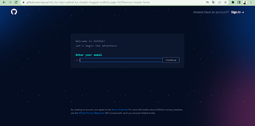
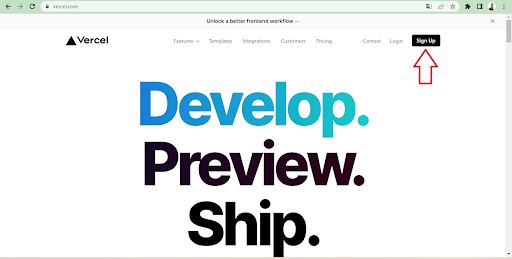
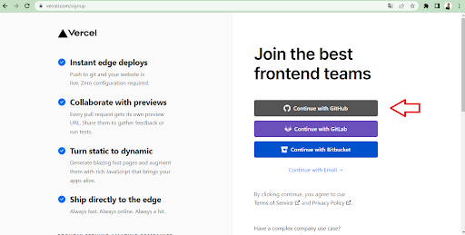

# Curso Alura: Lógica de programação explore funções e listas

## Aula 1 - Interagindo com o HTML

### Aula 1 - Apresentação - Vídeo 1

Transcrição  
Mônica: Olá, estudante! Eu sou a Mônica Hillman e te dou boas-vindas a mais um curso de Lógica de Programação!

Audiodescrição: Mônica se autodescreve como uma mulher branca, de cabelos castanhos com algumas mechas loiras. Usa óculos de grau com armação prateada e piercing no septo. Está com uma camiseta azul-marinho com o desenho de um coelho. À sua frente, um microfone e um notebook sob a mesa. Na outra ponta da mesa, também à sua frente, outra pessoa instrutora. Ao fundo, uma parede na cor azul com linhas brancas.

Guilherme: Olá! Meu nome é Guilherme Lima e sou instrutor e desenvolvedor na Alura!

Audiodescrição: Guilherme é um homem branco, de cabelos e barba castanho-escuros. Usa óculos de grau na cor preta e está com uma camiseta também preta escrito "The Beatles" em letras brancas. À sua frente, uma mesa com microfone e notebook. Na outra ponta, também à sua frente, a instrutora Mônica Hillman.

No primeiro curso de Lógica de Programação, utilizamos bastante alert prompt. Mas, quando acessamos um e-commerce ou site, não é comum que eles fiquem surgindo na tela, não é mesmo?

Pensando nisso, o objetivo principal deste curso é aprender como podemos usar o JavaScript para interagir com a tela, assim como as ferramentas que usamos no dia a dia. Além disso, vamos reforçar os conhecimentos de lógica de programação e colocar nosso projeto no ar para mostrar a outras pessoas.

Mônica: Vamos manter o projeto do número secreto, incluindo novas funcionalidades e tornando-o visualmente mais atraente.

Se você se interessou em aprender tudo isso, nos vemos no próximo vídeo!

### Aula 1 - Manipulando textos - Vídeo 2

Transcrição  
Guilherme: Vamos começar nossos estudos?

Inicialmente, fizemos o download do projeto que usaremos como base durante esse treinamento. Vamos abrir o Visual Studio para analisá-lo!

Neste projeto, temos três arquivos: index.html, style.css e app.js - esse último é onde faremos o desenvolvimento.

Mônica: Apesar de ser parecido com o que estávamos fazendo no curso anterior, veremos algumas diferenças.

Guilherme: Exatamente! Vamos clicar com o botão direito do mouse sobre index.html e selecionar a opção "Open with Live Server" para abri-lo com o Live Server.

Ao abrir, note que temos um projeto visualmente diferente. À esquerda, temos uma caixa de texto, provavelmente para inserir o número secreto.

Abaixo desta caixa, temos dois botões: um na cor azul escrito "Chutar" e um na cor cinza escrito "Novo jogo". À direita da tela, um personagem de cabelo roxo olhando para a caixa de texto.

Essa caixa de texto significa que não vamos mais usar alert prompt, pois queremos que as coisas sejam manipuladas no HTML.

Mônica: Essa característica confere uma aparência mais próxima à de um site real, concorda? Normalmente, não interagimos com caixas dentro do navegador, mas sim com campos de texto integrados à aplicação.

Guilherme: Isso mesmo! Imagine uma situação em que você está fazendo uma compra em um e-commerce e são exibidos 10 prompts de alerta. Isso certamente seria incomum. Portanto, vamos direcionar nosso projeto para uma abordagem mais próxima da experiência real.

O que precisamos fazer é pegar o JavaScript e manipular o HTML. Caso contrário, não vai funcionar.

Mônica: Caso você não saiba, HTML é o que usamos para construir cada elemento da tela. Portanto, queremos conseguir manipulá-los de forma dinâmica, mas não diretamente no HTML, e sim com o auxílio do JavaScript. Isso facilita a inserção caso o texto sofra constantes alterações, assim a pessoa desenvolvedora não precisará acessar o arquivo HTML para procurar a tag ou elemento específico.

Guilherme: O grande benefício de manipular com o JavaScript, principalmente a parte visual, é que vamos garantir uma dinamicidade melhor para o nosso projeto.

Mônica: Sim! Eu, como pessoa desenvolvedora front-end, posso dizer que normalmente colocamos no HTML elementos que não serão alterados ou que sofrerão poucas alterações. Assim, os itens passíveis de sofrerem mais mudanças são alocados no JavaScript.

Guilherme: Vamos acessar o arquivo app.js, que ainda não possui linhas de código. Além disso, é interessante mantermos o arquivo index.html aberto para conseguirmos fazer consultas e entender o que está sendo feito.

Já entendemos como trabalhamos com variáveis. Se queremos, de alguma maneira, apontar para o HTML e manipular algum texto existente nele, é importante lembrarmos qual tag estamos utilizando. Ou seja, qual a propriedade do HTML, se é um título, parágrafo, entre outros.

Na linha 22 do arquivo HTML, temos `<h1></h1>`. Geralmente, a tag h1 é usada para dar nome aos títulos da página.

Mônica: Esta tag vai de h1 até h6, como se fossem níveis, sendo h1 o principal. Por ser o principal, geralmente é o único. Ou seja, apenas um título da página é elencado com a tag de nível h1, o que facilita sua seleção.

Guilherme: Isso! Note que essa tag está vazia, ou seja, não há texto. Então vamos manipulá-lo.

Para isso, no arquivo app.js, criaremos uma variável let cujo título será titulo.

> let titulo =

Para conseguirmos, de fato, alterar o conteúdo do HTML com o JavaScript, precisamos capturar esse fragmento e selecionar h1. Conseguimos fazer isso usando uma palavra reservada chamada document.

> let titulo = document.

Esse document ainda não capta o h1, já que o documento HTML tem muitos elementos. Para que ele saiba o que deve ser selecionado, usamos .querySelector().

É importante que o "S" esteja em maiúsculo, caso contrário, não vai funcionar. Trata-se de um case sensitive, que diferencia maiúsculas e minúsculas.

> let titulo = document.querySelector()

Nos parênteses, passamos entre aspas simples o nome da propriedade (tag) a ser selecionada. No caso, h1:

> let titulo = document.querySelector('h1');

Desta forma, selecionamos o que queríamos.

O próximo passo é inserir um texto dentro desta tag. Para isso, vamos pegar a variável titulo, sem o uso de let, pois usamos apenas para criar esta variável, e chamar .innerHTML.

> let titulo = document.querySelector('h1');  
titulo.innerHTML =

Mônica: O innerHTML tem uma tradução que deixa claro o seu sentido. Se você traduzir, encontrará algo semelhante a "dentro do HTML". Neste caso, dentro do HTML do título.

O interessante sobre o JavaScript é que os atributos e propriedades nativos da linguagem, geralmente deixam claro sua funcionalidade ao ser traduzidos.

Ele precisará receber um valor que será um texto. Como já vimos anteriormente, quando queremos enviar texto, precisamos passá-lo entre aspas.

Guilherme: Pensando nisso, vamos optar pelo texto "Jogo do número secreto":

> let titulo = document.querySelector('h1');  
titulo.innerHTML = 'Jogo do número secreto';

Ao fazer isso. Vamos salvar teclando "Ctrl + S" e voltar ao projeto.

Note que o título com o texto "Jogo do número secreto" surgiu acima da caixa de texto!

Vamos alterar mais uma tag para entendermos melhor.

No código HTML, na linha 23, temos um parágrafo, representado pela tag p:

> `<p class="texto_paragrafo"></p>`

Nesse parágrafo, poderíamos inserir as mensagens que estavam no alerta, como "Escolha um número entre 1 e 10", por exemplo.

Voltemos ao arquivo .js para selecionar o parágrafo do documento HTML. O processo é o mesmo que acabamos de fazer, então vamos criar uma variável chamada paragrafo que será igual a document.querySelector(). Entre parênteses e aspas simples, colocamos o nome da tag: p.

> let titulo = document.querySelector('h1');  
titulo.innerHTML = 'Jogo do número secreto';  
let paragrafo = document.querySelector('p');

Selecionamos a propriedade p. O que precisamos fazer, agora, é alterar seu conteúdo. Para isso, usamos paragrafo.innerHTML e passamos o texto entre aspas:

> let titulo = document.querySelector('h1');  
titulo.innerHTML = 'Jogo do número secreto';

> let paragrafo = document.querySelector('p');  
paragrafo.innerHTML = 'Escolha um número entre 1 e 10';

Mônica: É importante reforçar que o que estamos vendo é específico do JavaScript. Sendo assim, você provavelmente não encontrará funções como innerHTML e querySelector em outras linguagens de programação.

Mas o interessante do JavaScript é exatamente isso: ele funciona tanto para quem trabalha com front-end quanto para quem trabalha com back-end. É por isso que estamos usando durante este curso!

Guilherme: Isso! Após fazer essas alterações, vamos salvar e ver como ficou.

Na aplicação, note que o texto "Escolha um número entre 1 e 10" apareceu acima da caixa de texto, em um tamanho bem menor que o título que está logo acima.

Agora temos um título com o texto "Jogo do número secreto" e, abaixo, um parágrafo cujo texto é "Escolha um número entre 1 e 10"!

### Aula 1 - Criando uma função - Vídeo 3

Transcrição  
Guilherme: O próximo desafio consiste em reconhecer os botões que temos abaixo da caixa de texto: "Chutar" e "Novo jogo".

O botão de novo jogo está desabilitado, o que faz sentido, pois não iremos trabalhar com o novo jogo agora, mas sim com o jogo atual. O objetivo, portanto, é que ao clicar em "Chutar", algo aconteça.

Vamos clicar com o botão direito do mouse e selecionar a opção "Inspecionar". Uma janela abrirá e, nela, vamos em "Mais guias", representado pelo símbolo de suas setas para direita ">>". Em seguida, clicamos em "Console".

Mônica: Nossa intenção é manter o console aberto para ver alguma atividade ao clicar em "Chutar". Por enquanto, é um botão simples, sem ação, mas vamos fazer essa implementação com JavaScript.

Guilherme: No HTML, por volta da linha 27, temos o botão "Chutar" e um elemento onclick.

> `<button onclick="" class="container__botao">Chutar</button>`

Isso significa que iremos escrever algo para o JavaScript executar. Neste caso, passaremos para onclick, entre aspas duplas, a verificação de chute: "verificarChute()", com "v" em minúsculo e "c" em maiúsculo, seguido de parênteses. Faremos desta forma porque será uma função.

> `<button onclick="verificarChute()" class="container__botao">Chutar</button>`

Sempre que criamos uma função em onclick, no HTML, e queremos usá-la no JavaScript, escrevemos o mesmo nome desta função. Ou seja, no arquivo app.js, chamaremos verificarChute().

> verificarChute()

Mônica: No HTML, temos um atributo bastante intuitivo, o onclick, que ao clique precisa acionar uma funcionalidade. Portanto, podemos criar uma função, e, para criar uma função no JavaScript, precisamos descrever em inglês. Sendo assim, adicionamos o termo function antes de verificarChute():

> function verificarChute()

Guilherme: Mas o que é uma função? Independente da linguagem de programação, sempre que pensamos em uma função, pensamos em um trecho de código que executa uma ação ou tem alguma responsabilidade.

Neste caso, queremos uma função que vai verificar o chute que a pessoa deu. Portanto, temos um campo para a pessoa inserir um número e a função vai verificar esse número "chutado". Ou seja, precisamos pegar o valor do chute e verificar se ele é igual ao número secreto.

Para isso, precisaremos ter um escopo, que é o corpo da função. Esse escopo é representado por chaves, dentro das quais implementaremos o conteúdo dessa função:

> function verificarChute() {  
  // Corpo da função  
}

Vale ressaltar que este formato é um padrão, então sempre que criamos uma função precisamos colocar function antes do nome da função. Além disso, é importante lembrar que, seguindo boas práticas de programação, as nossas funções precisam ter nomes descritivos. O nome "v", por exemplo, é muito vago e não nos dá ideia do que uma função faz. Já verificarChute é bem descritivo e qualquer pessoa entenderá do que se trata.

Mônica: A regra que seguimos para declarar variáveis, também funciona para funções. Funções com nomes pouco descritivos são exemplos de má prática e devem ser evitadas!

Guilherme: A função é responsável por executar alguma ação dentro do nosso programa. Por padrão e por convenção, é ideal determinar que as funções tenham apenas uma responsabilidade. Logo, a responsabilidade do botão que verifica o chute, como o nome sugere, é verificar o chute.

No escopo da função, vamos incluir um console.log() com a mensagem "O botão foi clicado!":

> function verificarChute() {  
  console.log('O botão foi clicado!')  
}

Vamos salvar e voltar para a aplicação.

Cada vez que clicamos no botão "Chutar", a função é chamada e a frase "O botão foi clicado!" é impressa no console. Isso significa que o botão está funcionando corretamente!

Em seguida, vamos nos aprofundar na questão de funções e começar a trabalhar em nosso jogo.

### Aula 1 - Para saber mais: diferenças entre html, css e Js


HTML, CSS e JavaScript (JS) são três tecnologias fundamentais para o desenvolvimento web.

O HTML (HyperText Markup Language) é a linguagem de marcação utilizada para estruturar o conteúdo de uma página web. Essa linguagem usa tags para definir a hierarquia dos elementos de uma página. Originado em 1991 por Tim Berners-Lee, o HTML é como o esqueleto de uma página web: trabalha organizando o conteúdo, como títulos, parágrafos, imagens e links, para que tudo fique bem arrumado e no lugar certo.

O CSS (Cascading Style Sheets), criado em 1995, é destacado como uma linguagem de estilos. Ele separa a apresentação da estrutura: é responsável pela apresentação e estilização dos elementos, pois permite controlar cores, fontes, layouts e outros aspectos visuais. É como vestir a estrutura HTML com roupas elegantes para que a página pareça exatamente como você deseja.

O JavaScript, por sua vez, é a única linguagem de programação das três. É responsável por adicionar interatividade e dinamismo às páginas. Possibilita a criação de funcionalidades como animações, validações de formulários e atualizações de conteúdo em tempo real.

O papel de cada tecnologia dessas na construção de aplicações web, de forma bem resumida, é: o HTML estrutura o conteúdo, o CSS define o estilo e o layout, e o JavaScript adiciona funcionalidades dinâmicas.

**Tecnologia - Função - Exemplos de Uso**  
HTML - Linguagem de marcação para estruturar conteúdo - Título, Parágrafo

CSS - Linguagem de estilos para apresentação e estilização. - p { color: blue; } div { background: #f2f2f2; }

JavaScript (JS) - Linguagem de programação para interatividade. - function iniciarJogo() { ... }

A aprendizagem dessas tecnologias é crucial para qualquer pessoa interessada em desenvolvimento web, uma vez que elas formam a base do ambiente digital. Compreender o HTML é necessário para estruturar e organizar o conteúdo de uma página de maneira semântica, o que é vital para a acessibilidade, indexação por motores de busca e uma experiência consistente entre diferentes dispositivos.

O CSS permite que pessoas desenvolvedoras controlem o design e a aparência de seus sites, possibilitando a criação de layouts atraentes e responsivos, que se adaptam a diferentes tamanhos de tela.

Por fim, o JavaScript capacita os desenvolvedores e as desenvolvedoras a criar experiências interativas e dinâmicas, e melhorar a usabilidade ao oferecer às pessoas usuárias funcionalidades mais avançadas.

A proficiência em HTML, CSS e JavaScript permite materializar ideias de maneira criativa e funcional, o que proporciona aos usuários finais uma experiência envolvente e intuitiva.

Além disso, essas habilidades são altamente valorizadas no mercado de trabalho, visto que a demanda por pessoas desenvolvedoras web qualificadas é constante, dada a importância contínua da presença online para empresas e indivíduos. Portanto, aprender e aprimorar essas tecnologias é um investimento significativo para qualquer pessoa que deseja se destacar na área de desenvolvimento web.

Para saber mais ainda sobre as características dessas três tecnologias a [Rafa Ballerini escreveu um artigo](https://www.alura.com.br/artigos/html-css-e-js-definicoes) enfatizando essas diferenças.

### Aula 1 - Desafio: hora da prática

Em uma carreira de desenvolvimento de software, a prática consistente da lógica de programação desempenha um papel fundamental na construção de bases sólidas.

A lógica de programação não apenas permite a criação de algoritmos eficientes e soluções elegantes, mas também desenvolve a capacidade de pensar de forma estruturada e analítica.Essa habilidade é essencial para enfrentar desafios complexos e transformar problemas abstratos em implementações tangíveis.

Pensando nisso, criamos uma lista de atividades (não obrigatórias) focada em prática para melhorar ainda mais sua experiência de aprendizagem. Bora praticar então?

***Desafios***

1. Faça o download de outro projeto [clicando neste link](https://github.com/alura-cursos/js-curso-2/tree/desafio_1) e abra no Visual Studio Code.

2. Altere o conteúdo da tag h1 com document.querySelector e atribua o seguinte texto: Hora do Desafio.

3. Crie uma função que exiba no console a mensagem O botão foi clicado sempre que o botão Console for pressionado.

4. Crie uma função que exiba um alerta com a mensagem: Eu amo JS, sempre que o botão Alerta for pressionado.

5. Crie uma função que é executada quando o botão prompt é clicado, perguntando o nome de uma cidade do Brasil. Em seguida, exiba um alerta com a mensagem concatenando a resposta com o texto: Estive em {cidade} e lembrei de você.

6. Ao clicar no botão soma, peça 2 números inteiros e exiba o resultado da soma em um alerta.

Caso precise de ajuda, opções de solução das atividades estarão disponíveis na seção “Opinião da pessoa instrutora”.

Para te ajudar a verificar seus códigos, está disponível uma possível resolução dos desafios [neste link](https://github.com/alura-cursos/js-curso-2/tree/desafio_1_respostas) para você construir ou validar suas soluções.

### Aula 1 - O que aprendemos?

Aqui está um resumo dos tópicos ensinados nesta aula:

- Carregamos o projeto com o HTML e o CSS para criar a estrutura e o estilo da página que utilizaremos durante o curso;

- Aprendemos a manipular o conteúdo dos elementos HTML, como o H1 e o parágrafo (p), utilizando JavaScript para alterar dinamicamente o texto exibido na página;

- Entendemos a importância da interação entre o HTML e o JavaScript para criar páginas web dinâmicas e interativas.

Na próxima aula:  
Vamos aprender o que são funções de forma prática e qual a sua importância na carreira de desenvolvimento de software!

## Aula 2 - Funções

### Aula 2 - Funções com parâmetros - Vídeo 1

Transcrição  
Guilherme: Vamos aprofundar ainda mais em relação a funções.

Funções com parâmetros
Guilherme: Moni, se você observar o nosso código, especificamente nas linhas 1 e 2 e nas linhas 4 e 5, você pode pensar que ambas são muito diferentes e não têm qualquer semelhança.

app.js:

```JavaScript
let titulo = document.querySelector('h1');
titulo.innerHTML = 'Jogo do número secreto';

let paragrafo = document.querySelector('p');
paragrafo.innerHTML = 'Escolha um número entre 1 e 10';
```

Em uma, pegamos o conteúdo do h1 e, na outra, pegamos o conteúdo do parágrafo, criando variáveis e assim por diante.

Mônica: No entanto, elas estão bem semelhantes. Apesar de pegar elementos diferentes, elas fazem a mesma ação. Elas pegam o elemento, armazenam em uma variável e também alteram seu texto.

Guilherme: Vamos analisar isso detalhadamente? Primeiro, temos let titulo, let paragrafo. Qual é a diferença entre eles?

No caso de let titulo, criamos uma variável para guardar a seleção do h1. Enquanto em let paragrafo, criamos uma variável para guardar o elemento do parágrafo.

Basicamente, estamos fazendo algo do tipo, let campo, let tag ou let elemento, seguindo essa ideia. Um desses campos é o título, o outro é o parágrafo.

Após isso, colocamos um igual à document.querySelector(). Dentro os parênteses, tem algo diferente. No titulo, buscamos pelo h1, no outro, buscamos por uma tag p.

Portanto, a única diferença aqui é a tag.

Na linha seguinte, pegamos a valor desse campo, que um é título e o outro é parágrafo, e fazemos campo.innerHTML para atribuir outro valor.

A diferença está no texto de cada um. O texto do título é "jogo do número secreto" e o texto do parágrafo é "escolha um número entre 1 e 10".

Exemplo

> let campo = document.querySelector(tag)  
campo.innerHTML = texto

Você pode perguntar: "Guilherme, isso não vai funcionar. O que você está fazendo?".

A explicação é a seguinte:

Sempre que temos padrão de código ou um código muito parecido, onde apenas alguns detalhes são modificados, podemos isolar esse comportamento em uma função.

Em vez de escrever quatro linhas de código, escrevemos menos linhas.

Mônica: Sim, é uma boa prática evitar a repetição de código com funções!

Guilherme: Nesse caso, utilizamos dois seletores. O seletor do h1 e o seletor do p.

Mas imagine se no nosso projeto tivéssemos que lidar com 50 seletores, como h1, h2, parágrafo e outros diversos seletores? Seria bastante difícil e trabalhoso escrever o mesmo código 50 vezes.

Mônica: Agora, você pode estar se perguntando: "Por que primeiro você mostra o modo errado e depois o modo correto?". Bom, não é errado, estamos apenas aprimorando uma boa prática.

Guilherme: Na verdade, o código que temos está em evolução. Isso é comum. Lembre-se, a maneira atual não é a maneira errada, pois o código ainda funciona.

No contexto em que estamos inseridos, a estrutura atual funciona. A questão é: "Como podemos tornar esse código independente do campo, onde passamos uma tag e passamos um texto?". Poderemos fazer isso usando funções.

Por isso, vamos criar uma nova função a partir da linha 7, usando o termo function. Esta função terá um nome, por exemplo, exibirTextoNaTela().

Mônica: Para seguir o padrão de boas práticas, a primeira letra de cada palavra deve ser maiúscula, exceto a primeira.

Guilherme: Abrimos e fechamos chaves e recortamos a lógica do campo dentro do bloco da função.

Mônica: Também, vamos adicionar o ponto e vírgula no final dessas duas linhas.

Guilherme: Sim, Moni! Essa é a razão pela qual o Pair Programming (programação em dupla) é tão útil.

Mônica: Pronto, na linha 14 após o console.log(), falta um ponto e vírgula também. Portanto, vamos conferindo e fazendo as alterações necessárias à medida que avançamos.

```JavaScript
function exibirTextoNaTela() {
    let campo = document.querySelector(tag);
    campo.innerHTML = texto;
}
function verificarChute() {
    console.log('O botão foi clicado!');
}
```

Guilherme: Agora vem a parte desafiadora. Precisamos fazer com que o código funcione usando uma função.

O que é diferente é a tag, o h1 e o p. Por isso, na hora de invocar essa função, podemos especificar que o JavaScript deve usar a função exibirTextoNaTela() especificamente para o h1. Posteriormente, o JavaScript deverá usar a função exibirTextoNaTela() especificamente para o parágrafo.

Vamos comentar a linha do let titulo ao paragro.innerHTML, adicionando // no começo. Assim, poderemos usar a função que criamos.

```JavaScript
// let titulo = document.querySelector('h1');
// titulo.innerHTML = 'Jogo do número secreto';

// let paragrafo = document.querySelector('p');
// paragrafo.innerHTML = 'Escolha um número entre 1 e 10';
```

Na linha abaixo da função, vamos digitar exibirTextoNaTela(). Assim, primeiro criamos a função e, agora, estamos de fato executando esta função.

Queremos exibir o texto na tela. Porém, o texto na tela refere-se ao h1. Para conseguir capturar o h1 e passar dentro da tag no querySelector(), vamos passar a tag como parâmetro da função. Ou seja, escrevemos tag entre os parênteses de function exibirTextoNaTela().

Com isso, na chamada da função exibirTextoNaTela(), passados o h1 entre aspas. Pois, queremos que esse valor de tag seja substituído pela string h1. Dessa forma, todos os lugares onde existir tag serão substituídos por h1.

Mas, queremos fazer o mesmo para o parágrafo também. Em uma nova linha, basta escrever exibirTextoNaTela() para o parágrafo, ou seja, informando o p entre aspas.

```JavaScript
function exibirTextoNaTela(tag) {
    let campo = document.querySelector(tag);
    campo.innerHTML = texto;
}

exibirTextoNaTela('h1');
exibirTextoNaTela('p');
```

Mônica: Através desses parênteses após o nome da função, conseguimos nos comunicar com aquela função sobre o que queremos que aconteça lá dentro.

Guilherme: Perceba que na primeira vez que chamamos a função exibirTextoNaTela(), passando o h1, todo lugar que tiver tag será substituído pelo h1.

Na segunda vez que chamamos essa função exibirTextoNaTela(), passando p, todo lugar que tiver tag será substituído pelo valor p.

Mônica: Sim, mas também temos que informar o texto para o campo.innerHTML. O que é texto? Também é algo que precisaremos comunicar para essa função. Então, dentro dos parênteses da função na linha 7, vamos adicionar uma vírgula para informar outro parâmetro que essa função vai receber e adicionamos o texto.

Agora, onde chamamos o exibirTextoNaTela(), vamos informar o texto que queremos. Após enviar o primeiro parâmetro, adicionamos uma vírgula, e enviamos o segundo parâmetro.

Na primeira chamada da função, o segundo parâmetro será Jogo do número secreto entre aspas. Na segunda chamada, será o texto Escolha um número entre 1 e 10 também entre aspas.

```JavaScript
function exibirTextoNaTela(tag, texto) {
    let campo = document.querySelector(tag);
    campo.innerHTML = texto;
}

exibirTextoNaTela('h1', 'Jogo do número secreto');
exibirTextoNaTela('p', 'Escolha um número entre 1 e 10');
```

No curso anterior, mencionamos muito que o JavaScript lê linha a linha. Por isso, estamos criando a função e chamando-a depois.

Mas, se colocássemos a função depois, também funcionaria. O JavaScript pega tudo que está declarado como função, guarda em algum lugar para ser lido somente quando invocamos (chamamos) essa função.

Guilherme: Lembrando que isso é algo específico do JavaScript, tanto que não estamos fazendo desta forma. Preferimos declarar a função e, abaixo, usar essa função.

Podemos apagar da linha 1 a 5, onde tínhamos os trechos comentados de código. Dessa forma, evoluímos o nosso código.

Qual é o desafio agora? Precisamos testar para verificar se as alterações funcionam. Vamos voltar no navegador. Ainda temos os textos: "Jogo do nome secreto" e "Escolha um número entre 1 e 10". Excelente!.

Ao clicar em "Chutar", aparece a mensagem no console:

O botão foi clicado.

Mônica: Portanto, aprendemos dois tipos de funções: com parâmetros e sem parâmetros. No entanto, essas não são as únicas operações que podemos realizar com funções.

### Aula 2 - Funções com retorno - Vídeo 2

Transcrição  
Mônica: Já criamos dois tipos de funções: uma para exibir textos na tela e outra para verificar a interação com o botão.

Agora, precisamos gerar um número aleatório. Como isso é uma nova funcionalidade, podemos implementá-la utilizando funções.

Funções com retorno
Guilherme: Vamos criar uma nova função na linha 13 do nosso código, após verificarChute().

Repare que quando começamos a escrever function, o Visual Studio Code já sugere a criação de um function statement. Quando confirmamos, pressionando "Enter", a estrutura básica de uma função é criada automaticamente.

app.js:

> function name(params) {  
  
}

Aproveite as sugestões da IDE!

No lugar de name, podemos nomear a função da forma que achamos mais adequado. Vamos chamá-la de gerarNumeroAleatorio.

Mônica: Há uma sugestão para que um parâmetro seja adicionado à função. Mas, neste caso, não precisamos disso, pois desejamos que a máquina gere um número aleatório sem a necessidade de receber qualquer informação prévia.

Por isso, podemos apagar params que está entre os parênteses, deixando-os vazios.

Guilherme: Para gerar o número aleatório, utilizaremos o código que conhecemos: Math.random(). Será uma função que multiplica por 10 e soma 1 para ter um número entre 1 e 10.

Mônica: A função Math.random() retorna um valor decimal, mas queremos um número inteiro. Por isso, colocamos a expressão matemática entre parênteses e utilizamos parseInt() para converter o resultado em um número inteiro.

```JavaScript
function gerarNumeroAleatorio() {
    parseInt(Math.random() * 10 + 1);
}
```

Guilherme: Dessa forma, isolamos esse processo. Em outras palavras, existe uma parte da nossa aplicação que é capaz de gerar esse número aleatório.

Imagine se tivéssemos um código com 500 linhas. Encontrar onde é gerado um número aleatório poderia ser bem complicado. Ao utilizar a função, a aplicação fica mais fácil de ser compreendida.

Não nos aprofundamos em Math.random(), porque já aprendemos essa função anteriormente. Dúvidas sobre essa função? Revisite o curso anterior!

Mônica: Agora, precisamos guardar o valor do número aleatório em algum lugar para posteriormente fazer sua verificação.

Guilherme: Por isso, vamos criar na linha 1 a variável let numeroSecreto que vai ser igual à função gerarNumeroAleatorio().

> let numeroSecreto = gerarNumeroAleatorio();

Mas, temos um problema. Diferente das outras funções, como exibirTextoNaTela() e verificarChute(), esperamos que a função gerarNumeroAleatorio() nos retorne uma informação.

Mônica: Atualmente, o que acontece em nosso código? Essa função é chamada na linha 1, ela é executada e gera um número aleatório. Mas para onde vai essa informação? Ela precisa ser armazenada na memória.

Guilherme: Ao gerar o número aleatório, queremos que a função nos retorne esse número que terá valor entre 1 e 10. Para garantir esse comportamento, precisamos informar que queremos este retorno utilizando a palavra reservada return na linha 16, antes de toda a expressão matemática.

```JavaScript
function gerarNumeroAleatorio() {
    return parseInt(Math.random() * 10 + 1);
}
```

Mônica: Com isso, o valor gerado será atribuído à variável numeroSecreto através do retorno da função.

Guilherme: Nesse ponto, podemos perceber que existem diferentes modelos de funções. Por exemplo, temos uma função que não possui parâmetros e nem retorno, que é a função verificarChute().

Temos a função exibirTextoNaTela(). Ela realiza a tarefa de exibir um texto na tela, mas não esperamos que ela nos devolva uma informação. Por isso, ela possui parâmetros que são as informações que queremos exibir, mas não possui um retorno.

Na função de gerarNumeroAleatorio(), não definimos nenhum parâmetro. Por isso, não tem nenhuma informação entre os parênteses. Contudo, há um retorno. Qual é o retorno? A geração de um número entre 1 e 10.

E o que fazemos quando essa função é chamada, ou seja, quando a utilizamos na linha let numeroSecreto?

Note que não estamos utilizando a função quando a declaramos como function. Nesse momento, apenas estamos declarando que a função existe. Para efetivamente usar a função, precisamos invocá-la como gerarNumeroAleatorio().

Com isso, pegamos o resultado retornado pela função e o armazenamos na variável chamada numeroSecreto.

Agora, vamos testar a geração desse número secreto para certificar que a função funciona corretamente.

Mônica: Precisamos imprimir esse número em algum lugar.

Guilherme: Podemos imprimi-lo no console. Podemos substituir o texto do console.log() da função verificarChute() pela variável numeroSecreto.

```JavaScript
function verificarChute() {
    console.log(numeroSecreto);
}
```

Após salvar o arquivo, voltamos ao projeto no navegador e atualizamos a página. Desse modo, o número secreto só será exibido quando clicarmos no botão "Chutar".

Vamos limpar o console com "CTRL + L" e clicar em "Chutar". Foi gerado o 8.

8

Clicamos de novo, foi gerado novamente o número 8.

Mônica: O número 8 não está sendo gerado repetidamente, o que acontece é que chamamos a função de geração de número aleatório apenas uma vez. Essa primeira vez gerou o número 8 aleatoriamente. Nas vezes seguintes, estamos apenas imprimindo o mesmo número.

Guilherme: Se atualizamos a página e limpamos o console, podemos clicar em "Chutar" de novo. Ai, sim, teremos outro número gerado.

5

Conclusão  
Guilherme: Já criamos três tipos de funções: funções com retorno, funções com parâmetros e funções sem retorno e sem parâmetros.

Mônica: Além disso, exploramos algo novo. Antes, havíamos criado variáveis que recebiam valores do tipo string ou número. Agora, estamos atribuindo funções às variáveis.

### Aula 2 - Tipo booleano - Vídeo 3

Transcrição  
Guilherme: Agora é a hora da verdade. No HTML do nosso programa, temos uma propriedade chamada input após o parágrafo de "Escolha um número entre 1 e 10". O que ela faz?

index.html:

> `<input type="number" min="1" max="10" class="container__input">`

Se observamos o jogo no navegador, esse campo input é onde a pessoa jogadora irá inserir um número entre 1 e 10.

Nesse campo, podemos digitar o valor 5, por exemplo. Para chutar esse valor, clicamos no botão "Chutar". Mas, o número aleatório gerado foi 6, erramos.

Mônica: No momento, só imprimimos o número aleatório, não o nosso chute.

Guilherme: Então, o que queremos fazer? Ao clicar em "Chutar", queremos pegar o valor especificado no input que é a entrada da pessoa usuária, e compará-lo com o número aleatório. Inicialmente, vamos mostrar no console para conferir se acertamos ou erramos o chute.

Tipo booleano
Mônica: Como queremos um elemento que está dentro do HTML, usaremos um modo muito semelhante ao que fizemos para pegar o parágrafo e o título.

Guilherme: Porém, temos uma diferença. Diferentemente do h1 e p, o que queremos é obter a informação inserida, não exibi-la. Portanto, não usaremos a função de exibirTextoNaTela().

Na função verificarChute(), vamos criar um campo novo. Por exemplo, let chute vai ser igual à document.querySelector(). Entre os parênteses, vamos escrever o input entre aspas.

Como sabemos que é a campo input? Porque verificamos a linha 25 do código HTML, onde escrito input do tipo número de 1 a 10. Esse é o campo que queremos.

Pegamos essa informação, porém queremos apenas o valor inserido no campo. Não queremos o HTML completo. Por exemplo, queremos apenas o valor 5 que foi digitado.

Quando temos um input e queremos apenas o valor inserido, utilizamos .value após a seleção que fizemos. Precisa ser escrito desta maneira. Lembre-se de colocar o ponto e vírgula ao final.

app.js:

```JavaScript
function verificarChute() {
    let chute = document.querySelector('input').value;
    console.log(numeroSecreto);
}
```

Mônica: E por qual motivo fazemos isso? Quando usamos o h1 e p, guardamos o texto direto dentro da variável. Mas o input não é um texto, é um valor inserido por alguém, portanto, usamos .value.

Guilherme: Em seguida, vamos fazer a comparação dentro do console para verificar que tipo de resposta vai ser gerada.

No console.log(), vamos escrever chute == numeroSecreto.

```JavaScript
function verificarChute() {
    let chute = document.querySelector('input').value;
    console.log(chute == numeroSecreto);
}
```

Por que utilizamos == e não =? Sempre que usamos =, queremos atribuir um valor. Quando usamos ==, queremos comparar um valor.

No JavaScript, existem outras formas de comparação. Mas, esses dois já são suficientes para nós por enquanto.

O que faremos no navegador? Iremos clicar no botão de "Novo jogo" para dar um refresh na tela. Em seguida, vamos inserir um valor e clicar no botão "Chutar". O que esse botão fará? Vai verificar o nosso chute. Ou seja, vai pegar o valor que inserimos e mostrará no console se o chute é igual ao número secreto.

Antes de tudo, vamos limpar o nosso console mais uma vez com "Ctrl + L". Agora, insira um número 2 no campo de input e apertamos "Chutar".

false

Apareceu algo diferente. O que é um false no JavaScript? Vamos pesquisar?

No buscador, vamos colocar false JavaScript e entrar na documentação do JavaScript sobre booleanos. Olha que interessante.

O tipo booleano é um nome muito comum para outras linguagens de programação também. É um valor que pode ser verdadeiro ou falso.

Quando desenvolvemos o jogo pela primeira vez, o que ele esperava quando fazíamos as comparações? Se é verdadeiro ou se é falso.

Sempre que encontramos o nome booleano na programação, seja no JavaScript ou outras linguagens, esperamos que esse valor será verdadeiro ou falso.

Pode haver um valor ou outro diferente. Talvez o JavaScript trabalhe um pouco diferente, mas o que importante para nós é entender se esse valor é verdadeiro ou falso.

Mônica: Percebam como o conhecimento vai aumentando, porque já conhecemos vários tipos. Aprendemos sobre o tipo string (texto), o tipo number (número), e agora o tipo boolean (verdadeiro ou falso).

Guilherme: Podemos até manipular o jogo para dar verdadeiro. Vamos remover temporariamente a chamada da função gerarNumeroAleatorio() que guardamos na variável numeroSecreto. No lugar, vamos colocar um número qualquer, como o 5.

Exemplo

> let numeroSecreto = 5;

No navegador, vamos digitar o número 5 no campo de input para verificar qual tipo de retorno que será exibido no console.

> true

É retornado o valor true que, em inglês, significa verdadeiro. E false significa falso.

Vamos desfazer a última alteração no código para ser gerado, de fato, um número aleatório.

Conclusão  
Em resumo, sempre que fazemos uma comparação, esperamos um valor verdadeiro ou falso - mais conhecido como tipo booleano.

Na sequência, o que vamos fazer? Podemos usar uma alternativa ao console, para exibir na tela uma resposta que faça mais sentido.

#### Aula 2 - Anatomia de uma função

A anatomia de uma função em JavaScript é composta por diversas partes que definem seu comportamento. É importante compreender esses elementos para criar funções reutilizáveis e modularizar o código de forma eficiente.

Assim, conhecer a estrutura das funções em JavaScript é fundamental para dominar a linguagem e desenvolver aplicações complexas de forma organizada e funcional.

Com base no que vimos nesta aula, analise as afirmações abaixo e marque apenas as opções verdadeiras sobre funções.

Selecione 3 alternativas

- As funções em JavaScript podem ter um nome.

As funções em JavaScript podem ter um nome. Na verdade, é uma prática comum dar um nome descritivo às funções para facilitar a leitura e o entendimento do código. Esses nomes são usados para chamar a função posteriormente ou para se referir a ela dentro do próprio código, permitindo que você reutilize a função em diferentes partes do programa.

- Palavra-chave function: É usada para declarar uma função em JavaScript.

Isso! Toda função em JavaScript é declarada utilizando a palavra-chave function. Essa palavra-chave é utilizada para criar uma função.

- Parênteses (): Após o nome da função (se houver), os parênteses são usados para definir os parâmetros da função.

Os parênteses em uma função no JavaScript são usados para conter os argumentos que a função recebe, permitindo a passagem de informações para a função e influenciando seu comportamento e resultados.

#### Aula 2 - Função que verifica números

Você é uma pessoa desenvolvedora de software que trabalha com JavaScript e precisa criar uma função que verifique se um número é positivo, negativo ou zero. Sua tarefa é implementar uma função que recebe como parâmetro um número inteiro e exibe uma mensagem no console conforme as seguintes regras:

- Se o número for maior que zero, a mensagem deve ser: "O número é positivo."
- Se o número for menor que zero, a mensagem deve ser: "O número é negativo."
- Se o número for igual a zero, a mensagem deve ser: "O número é zero."

Você pode utilizar a estrutura de controle if-else para verificar as condições e exibir a mensagem correspondente no console. Sabendo disso, analise as alternativas abaixo e marque aquela que possui o código que atende todas as regras citadas acima.

```JavaScript
function verificarNumero(numero) {
  if (numero > 0) {
    console.log("O número é positivo.");
  } else if (numero < 0) {
    console.log("O número é negativo.");
  } else {
    console.log("O número é zero.");
  }
}
```

Neste código, usamos a estrutura de controle if-else para verificar as três possibilidades: se o número é maior que zero, se é menor que zero ou se é igual a zero. Dependendo da condição, a função imprime a mensagem correspondente no console.

### Aula 2 - Para saber mais: funções com JavaScript

As funções desempenham um papel central na programação e no desenvolvimento de software, permitindo encapsular blocos de código reutilizáveis e executáveis. Elas podem ser definidas para executar tarefas específicas, desde cálculos simples até manipulação complexa de dados. As funções em JavaScript podem ter ou não parâmetros, bem como retornar ou não valores.

|Tipo de Função | Exemplo de Código | Uso |
|:---:|:---:|:---:|
|Sem retorno e sem parâmetro|function saudacao() { ... }|Execução de bloco de código simples.|
|Sem retorno e com parâmetro|function cumprimentar(nome) { ... }|Execução de bloco de código com argumentos.|
|Com retorno e sem parâmetro|function gerarNumeroAleatorio() { ... }|Cálculo e retorno de um valor específico.|
|Com retorno e com parâmetro|function somar(a, b) { ... }|Cálculo e retorno baseado em argumentos.|
|Função anônima|let saudacao = function() { ... };|Definição de função sem nome localmente.|
|Arrow function|let quadrado = x => x * x;|Definição concisa de funções curtas.|

Seu uso é essencial para criar aplicações dinâmicas, interativas e eficientes em JavaScript. Porém, você não precisa criar todos os tipos de funções neste momento. Acompanhe as aulas e saiba que essas variações existem e conforme a necessidade, vamos mergulhando cada vez mais profundamente em lógica e JavaScript.

### Aula 2 - Desafio: hora da prática

Saber como usar funções é um dos conceitos fundamentais da programação e do desenvolvimento de software. As funções desempenham um papel crucial na organização, modularização e reutilização de código.

Pensando nisso, criamos uma lista de atividades (não obrigatórias) focada em prática para melhorar ainda mais sua experiência de aprendizagem. Bora praticar então?

**Desafios**  

1. Criar uma função que exibe "Olá, mundo!" no console.

2. Criar uma função que recebe um nome como parâmetro e exibe "Olá, [nome]!" no console.

3. Criar uma função que recebe um número como parâmetro e retorna o dobro desse número.

4. Criar uma função que recebe três números como parâmetros e retorna a média deles.

Criar uma função que recebe dois números como parâmetros e retorna o maior deles.

Criar uma função que recebe um número como parâmetro e retorna o resultado da multiplicação desse número por ele mesmo

Caso precise de ajuda, opções de solução das atividades estarão disponíveis na seção “Opinião da pessoa instrutora”.

Opinião do instrutor

Para te ajudar a verificar seus códigos,está disponível uma possível resolução dos [desafios neste link](https://github.com/alura-cursos/js-curso-2/tree/desafio_2) para você construir ou validar suas soluções.

Boa sorte nos estudos!

### Aula 2 - O que aprendemos?

Explique com suas próprias palavras os principais conceitos que você aprendeu nesta aula.

Minha Resposta:  
Nesta aula eu aprendi sobre as funções e seus parametros, também sobre o retorne de uma função que pode ser do tipo boleano por exemplo.

Luri(I.A)  
Parabéns pela dedicação aos estudos! Você mencionou funções e seus parâmetros, o que é ótimo! Além disso, aprendemos que funções podem retornar valores, como números aleatórios gerados com `Math.random()`, e que esses valores podem ser utilizados em outras partes do código. Também vimos que funções podem retornar valores booleanos, como `true` ou `false`, que podem ser usados para controlar o fluxo do programa. Continue estudando e praticando!

## Aula 3 - Reiniciando o Jogo

### Aula 3 - Verificando o chute - Vídeo 1

Transcrição  
Guilherme: Môni, acredito que deveríamos mostrar no console um valor True ou False para mostrar a criação do jogo para os amigos.

Mônica: É bom reforçar que o console é uma ferramenta para a pessoa desenvolvedora e não para a usuária.

Guilherme: Então, considerando que nós já discutimos a questão dos valores booleanos, vamos fazer um if() e else().

Em function verificarChute(), abaixo de let chute, escrevemos if(). Se o chute for igual ao número secreto, isso significa que acertamos. Então, nos parênteses passamos chute == numeroSecreto e adicionamos chaves.

Para passar a informação indicando que a pessoa acertou, podemos exibir o texto na tela no lugar do h1, passando outro valor, por exemplo, "acertou".

Para isso, nas chaves e na linha abaixo, escrevemos exibirTextoNaTela(). Nos parênteses passamos 'h1', 'Acertou!' e salvamos.

```JavaScript
//Código omitido
function verificarChute() {
    let chute = document.querySelector('input').value;
    
    if (chute == numeroSecreto) {
        exibirTextoNaTela('h1', 'Acertou!');
        }
}
//Código omitido
```

Será muito difícil acertar no chute, então, na primeira linha de código, em let numeroSecreto passamos o número 7.

> let numeroSecreto = 7;

Para testar, acessamos o jogo, digitamos o número "7" e clicamos em "Chutar". Feito isso, o texto exibido muda de "Jogo do número secreto" para "Acertou!".

Mônica: Deu certo!

Guilherme: Mas, repare que a mensagem "Escolha um número entre 1 e 10" continua sendo exibida. Podemos definir uma mensagem melhor quando a pessoa acerta o número.

Para isso, na linha 16, escrevemos exibirTextoNaTela() e dentro dos parênteses passamos 'p', 'Você descobriu o número secreto!'.

```JavaScript
//Código omitido
function verificarChute() {
    let chute = document.querySelector('input').value;
    
    if (chute == numeroSecreto) {
        exibirTextoNaTela('h1', 'Acertou!');
                exibirTextoNaTela('p', 'Você descobriu o número secreto!')
        }
}
```

Para testar novamente, abrimos o jogo e passamos o número "7". Feito isso, visualizamos a mensagem "Acertou! Você descobriu o número secreto!". Ficou muito bom!

Nos casos de erro, precisamos informar se o número que foi chutado é maior ou menor que o número da sorte. Para isso, na linha 17 escrevemos else e adicionamos chaves. Dentro delas, passamos if(chute > numeroSecreto) seguido de chaves.

Dentro das chaves e na linha abaixo escrevemos exibirTextoNaTela(). Nos parênteses, passamos 'p', 'O número secreto é menor'.

Na linha seguinte escrevemos else {}. Nas chaves passamos 'p', 'O número secreto é maior'.

```JavaScript
//Código omitido
function verificarChute() {
    let chute = document.querySelector('input').value;
    
    if (chute == numeroSecreto) {
        exibirTextoNaTela('h1', 'Acertou!');
        exibirTextoNaTela('p', 'Você descobriu o número secreto!');
        } else {
                if (chute > numeroSecreto) {
                        exibirTextoNaTela('p', 'O número secreto é menor');
                } else {
                        exibirTextoNaTela('p', 'O número secreto é maior');
                }
        }
}
//Código omitido
```

Feito isso, na primeira linha de código, apagamos o número 7 e escrevemos gerarNumeroAleatorio().

> let numeroSecreto = gerarNumeroAleatorio();

Abrimos o jogo e testaremos novamente. Chute um número, Môni.

Mônica: Número 2.

Guilherme: Repare que a mensagem "O número secreto é maior" é exibida na tela.

Chutarei o número 8. A mensagem exibida é "O número secreto é menor".

Mônica: Número 4.

Guilherme: O número é maior. Vou tentar o número 6. Feito isso, a mensagem exibida é "Acertou! Você descobriu o número secreto!".

Deu certo! Para jogar de novo, atualizamos a página.

Mônica: Número 4.

Guilherme: O número é menor, 2 também.

Mônica: Então é o número 1.

Guilherme: Deu certo! Temos a ideia do jogo sem o alert e o prompt, entendendo como criar funções e usando retorno.

Repare que essa questão de termos uma função que exibe na tela, passando somente a tag, ficou muito interessante.

### Aula 3 - Contando tentativas - Vídeo 2

Transcrição
Mônica: Seguindo a lógica do jogo que estávamos desenvolvendo com o prompt e o alert, falta exibir o número de tentativas.

Guilherme: Exatamente, Môni! É interessante sabermos que foram necessárias, por exemplo, 5 tentativas para descobrir o número secreto. Faremos isso agora!

Implementando o número de tentativas
Na linha 16, alteramos o conteúdo do texto da tag p para Você descobriu o número secreto com 5 tentativas!.

> let mensagemTentativas = `Você descobriu o número secreto com 5 tentativas!`;

Para controlar o número de tentativas, na linha 2, criamos uma variável chamada tentativas e inicializamos com o valor 1. A lógica do nosso jogo é que, desde o início, caso o número seja acertado de primeira, já teremos ali uma tentativa.

> let tentativas = 1;

Se passarmos uma template string diretamente para exibir o texto na tela, talvez o HTML não entenda. Isso porque ele espera uma string e não uma template string, que é algo que somente o JavaScript entende.

Sendo assim, na linha 17, criamos uma variável chamada let mensagemTentativas = Você descobriu o número secreto com 5 tentativas. Para indicar que essa string é uma template string usamos as crases no início e no final.

Mônica: Feito isso, vamos ao invés de deixar definido o número de tentativas, apagamos o 5 e passamos ${tentativas}.

```JavaScript
//Código omitido
if (chute == numeroSecreto) {
        exibirTextoNaTela('h1', 'Acertou!');
        let mensagemTentativas = `Você descobriu o número secreto com  ${tentativas} tentativas!`;
        exibirTextoNaTela('p', 'Você descobriu o número secreto com 5 tentativas!');
        } else {
            if (chute > numeroSecreto) {
                            exibirTextoNaTela('p', 'O número secreto é menor');
            } else {
                            exibirTextoNaTela('p', 'O número secreto é maior');
            }
        }
```

Guilherme: No entanto, devemos nos lembrar que se o número for acertado de primeira, a frase será "Você descobriu o número secreto com 1 tentativas". Então, precisamos criar uma variável para tentativas.

Na linha 17 escrevemos let palavraTentativa igual à tentativas > 1 ? 'tentativas' : 'tentativa'. Em seguida, na linha 18, apagamos a palavra tentativas e passamos ${palavraTentativa}.

Mônica: Também precisamos trocar o parâmetro que enviava texto. Então, na linha 19 apagamos o texto e passamosmensagemTentativas.

```JavaScript
//Código omitido
if (chute == numeroSecreto)
        exibirTextoNaTela('h1', 'Acertou!');
        let palavraTentativa = tentativas > 1 ? 'tentativas': 'tentativa';
        let mensagemTentativas = `Você descobriu o número secreto com ${tentativas} ${palavraTentativa}!`;
        exibirTextoNaTela('p', mensagemTentativas);
//Código omitido
```

Mônica: O JavaScript é uma linguagem não-tipada, então quando informamos que vamos receber um parâmetro, não precisamos especificar qual o seu tipo. Isso nos permite trocar o tipo do parâmetro para uma variável.

Guilherme: Agora, precisamos atualizar a contagem de tentativas sempre que o chute for errado.

Para isso, no fim do else{} escrevemos tentativas++.

```JavaScript
//Código omitido
function verificarChute() {
        let chute = document.querySelector('input').value;
        if (chute == numeroSecreto) 
                exibirTextoNaTela('h1', 'Acertou!');
                let palavraTentativa = tentativas > 1 ? 'tentativas': 'tentativa';
                let mensagemTentativas = `Você descobriu o número secreto com ${tentativas} ${palavraTentativa}!`; 
                exibirTextoNaTela('p', mensagemTentativas);
        } else {
                if (chute > numeroSecreto) { exibirTextoNaTela ('p', '0 número secreto é menor');
                } else {
                        exibirTextoNaTela('p', 'O número secreto é maior');
                }
                tentativas++;
        }
```

Guilherme: Agora, vamos testar o jogo para verificar se tudo está funcionando corretamente. No navegador, atualizamos a página do jogo.

Primeiro tentamos o número "5". A mensagem exibida é "O número secreto é menor". Tentamos "2" e o número secreto é menor. Em seguida, tentamos o número "3". A mensagem exibida é "Você descobriu o número secreto com 3 tentativas!".

Agora, vamos testar da outra forma. Para isso, na primeira linha do código, apagamos gerarNumeroAleatorio() e escrevemos 2.

> let numeroSecreto = 2;

Atualizamos o jogo e chutamos o número "2". Feito isso, aparece a mensagem "Você descobriu o número secreto com 1 tentativa!".

Mônica: Importante ressaltar que a contagem considera apenas a primeira tentativa de acerto. Em caso de acertos posteriores, não são consideradas uma tentativa. Somamos apenas os casos de erro.

Guilherme: Para finalizar, na primeira linha de código, apagamos o 2 e voltamos o gerarNumeroAleatório().

Agora, sim, temos as mensagens corretas no singular e plural, dependendo do número de tentativas realizadas para descobrir o número secreto.

### Aula 3 - Botão reiniciar - Vídeo 3

Transcrição  
Guilherme: Tem uma parte do jogo que me deixa um pouco confuso. Vou digitar o número "5" e depois clicar em "Chutar". Feito isso aparece a mensagem dizendo que o número secreto é menor.

Perceba que o número 5 continua aparecendo no campo. Seria interessante que a cada tentativa o campo fosse limpo. Faremos isso agora!

Implementando o campo vazio  
Analisando nosso código, percebemos que, quando acertamos o chute, deixamos o número exibindo na tela. Mas, quando erramos, é melhor deixarmos o campo de texto limpo.

Para isso, abaixo da linha tentativas++, escrevemos limparCampo. Como isso é algo que o Javascript não sabe o que é, podemos criar uma função.

Mônica: Inclusive, essa é uma prática que pode nos ajudar em outros casos futuros em que queiramos limpar o campo de texto.

Guilherme: Na linha 35, escrevemos function limparCampo(). Sua única responsabilidade será limpar o campo, dela não esperamos nenhum retorno.

Então, após os parênteses adicionamos chaves. Dentro, passamos a variável chute igual à document.querySelector('input').

Não colocamos .value porque não estamos querendo pegar o valor. Ao invés disso, na linha seguinte, passamos chute.value igual à '', ou seja, uma string vazia.

```JavaScript
//Código omitido
function limparCampo() {
    chute = document.querySelector('input');
    chute.value = '';
}
```

Mônica: Strings são sempre textos entre aspas. Como não definimos nenhum texto, o campo deve ficar vazio.

Guilherme: Vamos testar! Abrimos o jogo e atualizamos a página. Digitamos o número 5 e clicamos em "Chutar". Aparece a mensagem "O número secreto é menor" e o campo fica vazio.

Depois, chutamos o número "4" e a mensagem "Você descobriu o número secreto com 3 tentativas" aparece. Abaixo, o campo exibe o número4. Deu certo!

Se analisarmos o jogo, temos um botão chamado "Novo Jogo". Faremos com que quando o número for acertado ele seja habilitado. Depois podemos fazer a implementação.

index.html

Mônica: Podemos abrir o arquivo index.html para identificar como o botão está sendo desativado.

Na linha 28 temos o botão com clique vazio. No fim desse trecho de código, encontramos o disable. É isso o que está desativando o botão. Sendo assim precisamos editar esse atributo para ativá-lo.

Habilitando o Botão Novo Jogo
app.js

Guilherme: Não mexeremos no HTML. Então, voltamos para o arquivo app.js.

Mônica: O botão precisa ser ativado quando o número secreto for ativado e assim iniciar um novo jogo.

Guilherme: Exatamente! A primeira coisa que faremos é pegar esse botão do HTML.

Porém, temos um problema. Existem dois botões, então se definirmos document.querySelector("button"), como estávamos fazendo antes,o código provavelmente selecionará o primeiro botão ao buscar entre todos os elementos.

Repare que o segundo botão possui uma característica diferente, o id="reiniciar".

O id é um atributo que especifica o botão e deve ser único, não pode ser usado em outro lugar.

Então, na linha 20, escrevemos document.getElementById.

Lembrando que, por padrão, o "E", "B" e "I" precisam ser letras maiúsculas.

Mônica: Para especificar qual é o id que queremos, colocamos parênteses. Dentro adicionamos aspas seguido da palavra reiniciar, o nome do ID. Precisa ser igual ao HTML.

Guilherme: Se nessa mesma linha adicionarmos um ponto, que é como acessaremos esse elemento, a ferramenta sugere vários atributos.

Mônica: Segundo a lógica, queremos remover o atributo que faz com que o botão seja desativado. Nesse caso, irá funcionar se usarmos o removeAttribute. Existem várias funções, mas essa é a que queremos, remover o atributo e não o removeAttributeNS(Node).

Guilherme: Então, em após removeAttribute() adicionamos aspas simples e escrevemos disable.

```JavaScript
//Código omitido
function verificarChute() {
    let chute = document.querySelector('input').value;

    if (chute == numeroSecreto) {
        exibirTextoNaTela('h1', 'Acertou!');
        let palavraTentativa = tentativas > 1 ? 'tentativas' : 'tentativa';
        let mensagemTentativas = `Você descobriu o número secreto com ${tentativas} ${palavraTentativa}!`;
        exibirTextoNaTela('p', mensagemTentativas);
        document.getElementById('reiniciar').removeAttribute('disabled');
//Código omitido
```

Guilherme: Agora, vamos testar. No jogo, chutamos o número "5" e a mensagem "Você descobriu o número secreto com 1 tentativa!" aparece. Logo em seguida, note que o botão "Novo jogo" é habilitado.

O próximo passo é fazermos com que esse botão funcione e comece um novo jogo.

### Aula 3 - Reiniciando o Jogo - Vídeo 4

Transcrição  
Guilherme: Agora definiremos uma funcionalidade para o botão "Novo Jogo". Ao clicá-lo, queremos que as tentativas sejam zeradas e um novo número seja sorteado.

Mônica: Como queremos que isso seja iniciado com um clique, então usaremos o onClick.

Definindo a funcionalidade do botão Novo Jogo
index.html

Guilherme: Se acessarmos o HTML, na linha 28 temos um onclick vazio. Após o sinal de igual, dentro de aspas duplas, criamos uma função chamada reiniciarJogo().

Lembrando que precisamos usar os parênteses para indicar que é uma função.

```HTML
//Código omitido
class="container_input">
<div class="chute container_botoes">
    <button onclick="verificarChute()"
    class="container botao">Chutar</button>
    <button onclick="reiniciarJogo()" id="reiniciar"
    class="container_botao" disabled>Novo jogo</
    button>
    </div>
</div>
```

app.js

Feito isso, voltamos no app.js. No fim do código, na linha 41, criamos a função reiniciarJogo(), que não receberá nenhum parâmetro.

Vamos executar essa função quando o botão for clicado, diferente de como geralmente usamos funções no JavaScript, aqui não invocamos a função.

Ao iniciar o jogo queremos que um novo número secreto seja sorteado. Então, adicionamos chaves e dentro passamos numeroSecreto igual à gerarNumeroAleatorio().

Mônica: Em seguida, precisamos que o campo fique vazio e que as tentativas sejam iniciadas como 1.

Guilherme: Isso mesmo! Então, passamos limparCampo() e na linha abaixo tentativas = 1.

```JavaScript
//Código omitido
function reiniciarJogo() {
    numeroSecreto = gerarNumeroAleatorio();
    limparCampo();
    tentativas = 1;
}
```

Guilherme: Vamos testar. Primeiro precisamos acertar o número secreto, então digitamos "5".

Depois, clicamos no botão "Novo jogo". Um novo número é sorteado, mas temos um problema, a mensagem "Acertou" e "Você descobriu o número secreto em 1 tentativa" continuam aparecendo. Precisamos mudar isso.

Para facilitar, copiamos as linhas 9 e 10, referente as funções exibirTextoNaTela() e colamos na linha 45. Agora, faremos as alterações necessárias.

Vamos testar de novo. Ao acertar o número secreto clicamos em "Novo jogo" e a mensagem muda para "Jogo do número secreto. Escolha um número entre 1 e 10".

Mônica: Deu certo! Está funcionando, mas há código repetido e isso não é uma boa prática.

Guilherme: Verdade, Môni! Suponhamos que o jogo foi atualizado para a versão 2.0. Nesse caso, se na linha 9, mudarmos o texto para "Jogo do número secreto 2.0" quando rodarmos o jogo pela segunda vez, essa mensagem não será exibida.

Fazer essa alteração nos dois trechos de código não é uma boa prática. Sendo assim, precisamos isolar esse comportamento em uma função.

Na linha 9, criamos a função exibirMensagemInicial(). A única responsabilidade dessa função será exibir as mensagens iniciais.

Então, colamos as duas funções exbirNaTela() e colamos logo abaixo.

```JavaScript
function exibirMensagemInicial() { 
    exibirTextoNaTela('h1', 'Jogo do número secreto'); 
    exibirTextoNaTela('p', 'Escolha um número entre 1 e 10'); I
}
//Código omitido
```

Guilherme: Agora, precisamos colocar essa mensagem inicial na função reiniciarJogo(). Para isso, apagamos as linhas 48 e 49. No lugar, passamos a função exibirMensagemInicial().

```JavaScript
//Código omitido
function reiniciarJogo() {
    numeroSecreto = gerarNumeroAleatorio();
    limparCampo();
    tentativas = 1;
    exibirMensagemInicial()
}
```

Mônica: Em seguida, precisamos chamar a nova função fora de qualquer outra função para ser iniciada na primeira vez que o app.js for lido.

Guilherme: Exatamente! Então, na linha 14, escrevemos exibirMensagemInicial(). Lembrando que poderia ser em outra linha.

```JavaScript
function exibirMensagemInicial() { 
    exibirTextoNaTela('h1', 'Jogo do número secreto'); 
    exibirTextoNaTela('p', 'Escolha um número entre 1 e 10'); I
}

exibirMensagemInicial()
//Código omitido
```

Guilherme: Vamos testar. Chutamos até acertar. Depois, clicamos em "Novo Jogo" e ele é iniciado. Deu certo!

Porém, repare que ainda temos um problema. Sempre que clicamos em "Novo Jogo", ele traz um novo jogo. Seria interessante se pudéssemos restaurar o status da nossa aplicação o campo desabilitado. Faremos isso.

No fim do código, na função reiniciarJogo() passamos document.getElementById(). Nos parênteses adicionamos aspas simples e escrevemos reiniciar seguido do atributo .setAttribute().

Dentro dos parênteses, passamos o nome do atributo que queremos setar, então 'disabled'. Adicionamos vírgula e passamos o segundo parâmetro true.

```JavaScript
//Código omitido
function reiniciarJogo() {
    numeroSecreto = gerarNumeroAleatorio();
    limparCampo();
    tentativas =1;
    exibirMensagemInicial();
    document.getElementById('reiniciar').setAttribute('disabled', true)
}
```

Voltamos no jogo. Repare que começamos com o botão "Novo Jogo" desabilitado. Após acertar o número da sorte ele é habilitado. Ao clicá-lo ele desabilita novamente.

### Aula 3 - Calculadora de Média e Situação do Aluno

Você foi contratado (a) para desenvolver uma calculadora de média e verificar a situação de aprovação de um aluno com base em suas quatro notas. A média para aprovação é 5. Sua tarefa é implementar duas funções em JavaScript:

calcularMedia(nota1, nota2, nota3, nota4)=> Esta função recebe as quatro notas do aluno como parâmetros e retorna a média calculada com base nessas notas.
verificarAprovacao(media) => Esta função recebe a média do aluno como parâmetro e retorna "Aprovado" se a média for maior ou igual a 5, caso contrário, retorna "Reprovado".
Utilize esses valores para as notas:

> let nota1 = 7;  
let nota2 = 6;  
let nota3 = 3;  
let nota4 = 5;

Posto disso, analise cada afirmação abaixo e marque apenas aquelas que mostram partes de código que seguem as regras de negócio citadas acima.

> function verificarAprovacao(media) {  
    return media >= 5 ? "Aprovado" : "Reprovado";  
}

Isso aí! A função verifica se a média passada como parâmetro é maior ou igual a 5 e retorna um valor em formato de texto informando se foi aprovado ou reprovado.

> function calcularMedia(nota1, nota2, nota3, nota4) {  
  let media = (nota1 + nota2 + nota3 + nota4) / 4;  
  return media;  
}

Certo! Esta função calcula a média aritmética das quatro notas fornecidas. Primeiro, ela soma as quatro notas e depois divide essa soma por 4, que é o número total de notas. E por fim retorna o resultado dessa operação, que é a média do aluno.

### Aula 3 - Desafio: hora da prática

Saber como usar funções é um dos conceitos fundamentais da programação e do desenvolvimento de software. As funções desempenham um papel crucial na organização, modularização e reutilização de código.

Pensando nisso, criamos uma lista de atividades (não obrigatórias) focada em prática para melhorar ainda mais sua experiência de aprendizagem. Bora praticar então?

Desafios

1. Crie uma função que calcule o índice de massa corporal (IMC) de uma pessoa, a partir de sua altura, em metros, e peso, em quilogramas, que serão recebidos como parâmetro.

2. Crie uma função que calcule o valor do fatorial de um número passado como parâmetro.

3. Crie uma função que converte um valor em dólar, passado como parâmetro, e retorna o valor equivalente em reais. Para isso, considere a cotação do dólar igual a R$4,80.

4. Crie uma função que mostre na tela a área e o perímetro de uma sala retangular, utilizando altura e largura que serão dadas como parâmetro.

5. Crie uma função que mostre na tela a área e o perímetro de uma sala circular, utilizando seu raio que será fornecido como parâmetro. Considere Pi = 3,14.

6. Crie uma função que mostre na tela a tabuada de um número dado como parâmetro.

Caso precise de ajuda, opções de solução das atividades estarão disponíveis na seção “Opinião da pessoa instrutora”.

Para te ajudar a verificar seus códigos, deixo disponível uma possível resolução dos desafios [neste link](https://github.com/alura-cursos/js-curso-2/tree/desafio_3) para você construir ou validar suas soluções.

Boa sorte nos estudos!

### Aula 3 - O que aprendemos?

Nesta aula:

- Aprendemos como criar um programa para verificar se o “chute” inserido é igual ao número secreto definido. Utilizamos estruturas condicionais para tomar decisões com base no resultado dessa comparação;

- Criamos uma variável para armazenar a quantidade de tentativas realizadas pelo usuário;

- Vimos a importância de consultar a documentação da linguagem e das bibliotecas utilizadas no desenvolvimento do programa. A documentação é uma fonte valiosa de informações que nos auxilia na compreensão de conceitos e no uso correto das funcionalidades disponíveis.

Na próxima aula:  
Vamos aprender como funcionam as listas (ou arrays, em inglês) e como são fundamentais na carreira de desenvolvimento de software!

## Aula 4 - Listas

### Aula 4 - Documentação sobre listas - Vídeo 1

Transcrição  
Mônica: O jogo já parece completo. Conseguimos jogar e já existem várias funcionalidades. Contudo, seria interessante se o mesmo número não fosse sorteado várias vezes. No vídeo anterior, percebemos que o número 5 foi sorteado duas vezes seguidas.

Guilherme: E você desconfiou.

Mônica: Sim, mas pensei que a "inteligência artificial" estava ajudando o Guilherme.

Guilherme: Não queremos sortear um número que já saiu, então pensaremos em uma lógica para definir quando esse número poderá ser inserido. Portanto, acessaremos a documentação do JavaScript, porque ela ensina uma estrutura de dados comum, não só em JavaScript, como em Python, Java e outras linguagens de programação, conhecida como listas ou, no termo técnico em inglês, Array.

Em uma nova aba, pesquisamos por "array JavaScript" e abriremos a documentação do JavaScript sobre array, que é o primeiro link dos resultados. Essa documentação define um Array da seguinte forma:

O objeto Array do JavaScript é um objeto global usado na construção de 'arrays': objetos de alto nível semelhantes a listas.

Essa explicação não é totalmente compreensível, então continuaremos lendo a documentação para entendermos melhor. Abaixo dessa explicação inicial, temos a demonstração da criação de uma lista de frutas.

> var frutas = ["Maçã", "Banana"];  
>
> console.log(frutas.length);
> // 2

Ele utilizou var para declarar uma variável, mas é semelhante ao let. Então seria como let frutas =. Depois temos uma estrutura diferente, onde utilizamos colchetes ([]). }=Isso não é exclusivo do JavaScript, a maioria das linguagens de programação utiliza colchetes para se tratar de listas.

Sempre que criarmos uma lista, conseguimos visualizar o tamanho dessa lista. No exemplo, temos dois elementos separados por uma vírgula: "Maçã", Banana". Entretanto, existem métodos que auxiliam para sabermos algumas informações dessa lista como o tamanho dela e qual é o primeiro ou o segundo elemento.

Nessa lista de frutas com maçã e banana, o primeiro elemento da lista sempre terá o índice zero, e para acessarmos qualquer elemento dessa lista, utilizamos seus respectivos índices. Então no segundo exemplo, da documentação, para encontrar Maçã ele escreve o nome da lista e o índice.

> var primeiro = frutas[0];  
// Maçã

Vamos fazer esse teste no console do navegador. Para isso, clicamos com o botão direito na página, selecionamos "Inspecionar" e, nas abas da parte superior, clicaremos em "Console".

Dica: Caso a aba console não esteja aparecendo, clique nas setas duplas ">>" para abrir o menu flutuante e selecione "Console".

Com o Console aberto, pressionaremos "Ctrl + L" para limparmos qualquer conteúdo que tenha escrito nele e escreveremos uma lista chamada "numeros", porque faz mais sentido para o nosso projeto:

> let numeros = [1,5,9]

Sempre que falarmos em lista, utilizaremos os colchetes e, dentro dos colchetes, podemos criar uma lista de palavras, como no exemplo da documentação, ou de números. Na nossa lista "numeros", temos os elementos 1, 5 e 9.

Pressionando "Enter", criamos essa lista. Agora se escrevemos numeros, o console retorna que essa é uma lista de três elementos: 1, 5 e 9.

> numeros  
>
> (3) [1, 5, 9]

Para verificarmos quantos elementos temos em uma lista, podemos utilizar nomeDaLista.length. Nesse caso, codamos numeros.length. O método .length sempre retorna a quantidade de elementos que temos na lista.

Importante: Precisamos saber como escrever "length". O final é "GTH". A maioria das pessoas programadoras inverte a escrita para "GHT", invertendo o "H" e o "T".

> numeros.length  
3

Mônica: Embora o método length seja do JavaScript, ele também é usado em algumas outras linguagens. Entintando, existem outros métodos que se utilizam para lista, então podem ter outros nomes em outras linguagens. Ainda assim, é importante sabermos que há ferramentas para facilitar o nosso acesso às listas.

Guilherme: Agora, eu quero obter alguns elementos da lista numeros. Como eu já disse, se quisermos somente o valor 1, por exemplo, que é o primeiro elemento da lista, usaremos sempre o índice 0.

Qualquer lista começa pelo índice 0, depois temos o índice 1 e o índice 2, nesse caso, respectivamente os números 1, 5 e 9. Portanto, se codarmos numeros[0], passando o índice entre colchetes, que é o símbolo da lista, teremos como retorno o número 1.

> numeros[0]  
1

Para praticarmos mais, criaremos uma lista de linguagens de programação. Então escreveremos let linguagens = ['javaScript', 'java', 'python'] e pressionamos "Enter".

> let linguagens = ['javascript', 'java', 'python']

Então temos a linguagem JavaScript, que estamos usando, e as linguagens Java e Python, que também são linguagens de programação. Agora como fazemos para acessar o elemento java?

Mônica: Escrevemos linguagens[1].

> linguagens[1]  
'java'

Guilherme: Lembrando que usamos o índice 1 porque o elemento javascript está com o índice 0. Se quisermos o último elemento dessa lista, usamos o índice 2, porque a sequência dos índices é 0, 1, 2. Com o índice 2 ele retorna o python.

> linguagens[2]  
'python'

Agora, o que acontece se pedimos um índice que não existe? Por exemplo, se pedirmos linguagens[90], não teremos nenhum resultado, então ele retorna "undefined" (indefinido). Então ele não sabe o que é.

> linguagens[90]  
undefined

Mônica: Ele não inventa nenhum número. Ele avisa mesmo que não tem.

Guilherme: Se temos uma lista muito grande, como é comum do cotidiano do trabalho de dev, e quisermos o último elemento da lista, temos um método para isso no exemplo da documentação. No espaço do índice, ele passa o tamanho da lista menos 1.

> var ultimo = frutas[frutas.length - 1];  
// Banana

Por que o nomeDaLista.length - 1 mostra o último elemento?

Mônica: Porque o tamanho não começa com zero. Ele está contando todos os elementos da lista.

Guilherme: Se o índice começa com o valor zero, se fizermos diminuirmos o tamanho da lista em 1, obteremos o último elemento da lista. Vamos fazer esse teste também na nossa lista de linguagens.

> linguagens[linguagens.length - 1]  
'python'

Ele retornou o Python, e faz sentido. O 'javascript' está no índice zero, o 'java' está no índice 1 e o 'python' no índice 2.

Mônica: Como tamanho de lista é 3, linguagens.length - 1 é como 3 - 1, que é igual a 2 , ou seja, temos o índice 2. Ficou igual ao linguagens[2], que também retorna Python.

Guilherme: Existem outros métodos que podemos usar para inserirmos ou removermos um elemento na lista ou limparmos a lista. Também podemos buscar um elemento baseado em alguma lógica ou regra, como "quero só os elementos da lista que possuam números".

Esse não é o foco desse curso, mas existem outros cursos aqui na Alura sobre esses assuntos. O que nós precisamos entender é que colocaremos no nosso projeto uma lista de números que já foram sorteados, e esses números não podem ser sorteados novamente.

### Aula 4 - Implementando a lista - Vídeo 2

Transcrição  
Mônica: Anteriormente analisamos a documentação de Arrays (listas), mas por que estávamos testando no console?

Guilherme: Sendo franco, por preguiça. Eu não queria criar um novo projeto e abrir um documento. É comum quando queremos testar algo rapidamente, usarmos o console.

Mônica: Ótimo, mas agora vamos praticar com o jogo.

Guilherme: Vamos! A ideia agora é criar uma lista para os números secretos que já foram sorteados para não os sortear novamente.

Mônica: Precisamos pensar onde queremos que essa lista. Queremos adicionar itens nela quando um número aleatório é gerado, mas existe uma particularidade do Javascript.

Como mencionei várias vezes, o Javascript lê linha a linha. Se declararmos a lista depois de algum comando, antes de chamar a função que gera o número aleatório, ocorrerá um erro.

Guilherme: Exato. Então eu cliquei no começo da linha 1 e pressionei "Enter", para deixar a linha 1 vazia. Você que está vendo a aula faça o mesmo. Na linha 1, criaremos uma variável chamada listaDeNumerosSorteados, que será uma lista vazia, ou seja, deixamos colchetes vazio ([]).

> let listaDeNumerosSorteados = [];

Mônica: Assim como criamos um texto vazio, que são strings sem nada dentro, escrevendo "", para criar uma lista vazia, abrimos e fechamos colchetes.

Guilherme: Em seguida, acessaremos nossa função gerarNumeroAleatorio(), que está na linha 37.

```JavaScript
function gerarNumeroAleatorio() {
    return parseInt(Math.random() * 10 + 1);
}
```

Nessa função, guardaremos o número aleatório, porque já estamos retornando ele diretamente. Então removeremos o return onde geramos o número aleatório com a função Math.random() e arredondamos para cima. Ao invés disso, escreveremos let numeroEscolhido.

```JavaScript
function gerarNumeroAleatorio() {
    let numeroEscolhido = parseInt(Math.random() * 10 + 1);
}
```

Mônica: Lembrando de seguir o padrão com camelCase. Então, numero com 'n' minúsculo e Escolhido com 'E' maiúsculo.

Guilherme: Agora queremos verificar se já temos o número escolhido na nossa lista. Portanto, faremos uma verificação com um if():

```JavaScript
function gerarNumeroAleatorio() {
    let numeroEscolhido = parseInt(Math.random() * 10 + 1);
    if (listaDeNumerosSorteados)
}
```

Repare que é muito comum verificarmos se um elemento já está na lista ou não. Para tudo que é recorrente, é importante tentarmos descobrir se não existe algum método pronto, ou alguém que já passou por isso e deixou uma solução possível.

Felizmente, alguém já passou por isso e criou um método chamado includes(), que verifica se o elemento está na lista. Se estiver, retorna true e, se não estiver, retorna false. Assim, podemos tomar decisões a partir desse resultado.

```JavaScript
function gerarNumeroAleatorio() {
    let numeroEscolhido = parseInt(Math.random() * 10 + 1);
    if (listaDeNumerosSorteados.includes())
}
```

Mônica: Precisamos informar para o includes() o que ele precisa verificar se está incluído na lista.

Guilherme: Isso! E como ele é uma função, usamos parênteses e, dentro dos parênteses, passamos o numeroEscolhido. Cuidado para não passar o numeroSorteado.

```JavaScript
function gerarNumeroAleatorio() {
    let numeroEscolhido = parseInt(Math.random() * 10 + 1);
    if (listaDeNumerosSorteados.includes(numeroEscolhido)) {
    }
}
```

Atenção: O número escolhido está entre os parênteses de includes(), que é uma função dentro dos parênteses do if(), então, ao final, fechamos dois parênteses.

Se o número já foi sorteado, fazemos algo chamado recursão, ou seja, chamaremos a própria função gerarNumeroAleatorio() novamente, gerando um novo número aleatório. Com isso, ele verificará novamente se aquele número já foi escolhido ou não.

```JavaScript
function gerarNumeroAleatorio() {
    let numeroEscolhido = parseInt(Math.random() * 10 + 1);
    if (listaDeNumerosSorteados.includes(numeroEscolhido)) {
        return gerarNumeroAleatorio();
    }
}
```

Portanto, pediremos para que um novo número seja gerado caso o número já esteja na lista.

Mônica: É importante frisar que o includes() é algo específico do JavaScript. Pode ser que a linguagem que você escolheu para seguir na sua jornada tenha outro método ou nome para resolver o mesmo problema, mas, como o Gui mencionou, é sempre importante verificarmos se o problema que estamos enfrentando foi resolvido na documentação da linguagem.

Guilherme: Esse é um método comum. Provavelmente a maioria das linguagens já possui um método específico para verificar se um elemento está ou não na lista.

Agora tratar o caso do else, em que o elemento não está na lista. Se não está na lista, queremos retornar o numeroEscolhido, e para isso usaremos o return:

```JavaScript
function gerarNumeroAleatorio() {
    let numeroEscolhido = parseInt(Math.random() * 10 + 1);
    if (listaDeNumerosSorteados.includes(numeroEscolhido)) {
        return gerarNumeroAleatorio();
    } else {
        return numeroEscolhido;
    }
}
```

Mônica: Faz sentido, mas temos algo a mais a considerar. A lista sempre estará vazia do jeito que estamos fazendo agora. Nós precisamos inserir o número que foi sorteado na lista para conseguir fazer a verificação adequada.

Guilherme: Agora temos o desafio de inserir algo na listaDeNumerosSorteados. Observem que, quando escrevemos um ponto final (.) após listaDeNumerosSorteados, existem várias opções de métodos que podemos trabalhar nas listas, como o includes().

Para adicionarmos algo na lista com JavaScript, utilizaremos o método push(). Sendo assim, dentro do else e antes do return, escreveremos listaDeNumerosSorteados.push(). Dentro dos parênteses do método push(), passaremos o numeroEscolhido, que é a informação que queremos adicionar à lista.

```JavaScript
//código omitido
} else {
    listaDeNumerosSorteados.push(numeroEscolhido);
    return numeroEscolhido;
}
```

Lembrete: O nome do método pode ser diferente em outras linguagens. Em JavaScript, o método para adicionar elementos na lista é o push(), mas em outras linguagens pode ter outros nomes.

Mônica: O método push() adiciona o elemento que passamos nos parênteses ao final da lista. Se passarmos o mouse por cima do nome push(), no VS Code, teremos uma explicação de como o método funciona.

Guilherme: Abaixo do listaDeNumerosSorteados.push(numeroEscolhido), escreveremos console.log(listaDeNumerosSorteados) e salvaremos nossas alterações para conseguirmos testá-las.

Informação: Utilize o console.log() para checar o comportamento do código.

Antes de testarmos, perceba que o código atual está gerando 10 números, o que é muito. Sendo assim, alteraremos a variável numeroEscolhido, que está logo no começo da função gerarNumeroAleatorio. Deixaremos apenas os valores de 1 a 3, mudando o multiplicador da variável para 4.

> let numeroEscolhido = parseInt(Math.random() * 4 + 1);

Após salvarmos nossas alterações, vamos retornar para a página do nosso jogo, onde o Console já está aberto. Pressionaremos "Ctrl + L" para limparmos o Console.

No campo de texto da página, escreveremos o número 5 e clicaremos no botão "Chutar".

Mônica: Antes de testarmos, precisamos atualizar a página para que um novo número seja sorteado.

Guilherme: Atualizei a página e limpei o Console novamente. "Chutei" novamente o número 5, mas ele não está mostrando nada no Console.

Mônica: Ele só mostrará a lista de números sorteados no Console quando acertamos o número secreto ou começarmos um novo jogo.

Guilherme: No caso, o número correto era 4 e, quando eu acertei e cliquei no botão "Novo jogo", a lista com o número sorteado aparece no console. Percebemos que ele sorteou o número 4 e depois o número 1.

Como o número 4 saiu no índice 0, significa que o número sorteado só pode ser de 1 a 3. Sendo assim, vamos fazer novos sorteios até adivinhar todos os números. Quando isso acontece, recebemos um erro, pois não há mais números para sortear além desses.

Lembrando, pessoal, usamos uma recursão, chamando a função gerarNumeroAleatorio() dentro da própria função. Como o nosso projeto é pequeno, não tem problema, mas se for um projeto grande, precisamos ter muito cuidado para não chamarmos uma função de verificação para um banco de dados grande, que precisa repetir a verificação até acertar um único número.

Mesmo com o nosso banco de dados sendo pequeno, chegamos a um erro, mas estamos felizes com ele. Isso porque sabemos como resolver e vamos te mostrar como no próximo vídeo.

### Aula 4 - Limitando os números sorteados - Vídeo 3

Transcrição  
Guilherme: Estamos com um erro que informa que atingimos o tamanho máximo de chamadas para a função Math.random(), porque temos todos os números já sorteados na nossa lista.

Mônica: Havíamos limitado a quatro números e todos eles foram sorteados.

Guilherme: Esse foi o problema. Instruímos o programa a não sortear os números que já haviam saído. O sorteio dos números aconteceu na ordem: 4, 1, 3 e 2, sendo que o número 4 ficou no índice 0 o número 2 ficou no índice 3. Todos foram sorteados e agora não temos mais possibilidade de sortear um número.

Não pensamos em uma maneira de limpar nossa lista caso ela atinja o número máximo de elementos, então agora, criaremos uma variável para ter a quantidade de elementos na lista. Ainda na função gerarNumeroAleatorio(), abaixo do let numeroEscolhido, escreveremos let quantidadeDeElementosNaLista = listaNumerosSorteados.length;.

Agora que já sabemos a quantidade de elementos que essa lista tem, podemos codar uma verificação se o número máximo foi atingido. Para isso, mudaremos o multiplicador em numeroEscolhido para 3: (Math.random() * 3 + 1).

Em seguida, abaixo da quantidadeDeElementosNaLista, escreveremos uma condicional: se a quantidadeDeElementosNaLista for 3, iremos limpar essa lista.

```JavaScript
function gerarNumeroAleatorio() {
    let numeroEscolhido = parseInt(Math.random() * 3 + 1);
    let quantidadeDeElementosNalista = listaDeNumerosSorteados.length;

    if (quantidadeDeElementosNaLista == 3) {
        listaDeNumerosSorteados = [];
        }
    //código omitido
}
```

Agora, nosso jogo tem um pequeno desafio, pois temos somente 3 números que podem ser sorteados. Vamos começar um novo jogo, mas a resposta já aparece no Console.

Mônica: Lembrando que precisamos clicar no botão "Novo jogo" para ele sortear um novo número aleatório.

Guilherme: O primeiro número sorteado foi o 2, depois o 1 e por último o 3. Quando acertamos o último número da lista, que é o 3, e clicamos no botão "Novo jogo", o comportamento esperado é o esvaziamento da lista, e é isso que acontece.

Mônica: Ele esvaziou a lista e adicionou um novo número sorteado ao índice 0.

Guilherme: O cuidado que precisamos ter no nosso código é em relação ao limite do número sorteado. O mesmo valor que usarmos para multiplicar o Math.random(), usaremos na condicional que iguala a quantidadeDeElementosNaLista.

Mônica: Para não precisarmos mudar sempre em dois locais, podemos torná-lo dinâmico, criando uma nova variável para isso. Faremos isso no começo do código, abaixo da variável listaDeNumerosSorteados.

Guilherme: Podemos chamar essa variável de numeroLimite e deixaremos o valor dessa variável como 10.

```JavaScript
let listaDeNumeros Sorteados = [];
let numeroLimite = 10;
let numeroSecreto = gerarNumeroAleatorio();
let tentativas = 1; I
//código omitido
```

Mônica: Voltaremos para função gerarNumeroAleatorio e, na linha onde criamos a variável numeroEscolhido, trocaremos o multiplicador por numeroLimite. Também faremos a substituição na condicional que criamos.

```JavaScript
function gerarNumeroAleatorio() {
    let numeroEscolhido = parseInt(Math.random() * numeroLimite + 1);
    let quantidadeDeElementosNalista = listaDeNumerosSorteados.length;
    if (quantidadeDeElementosNaLista == numeroLimite) {
        listaDeNumerosSorteados = [];
        }
    //código omitido
}
```

Guilherme: Dessa forma, temos o sorteio de 1 a 10 e não permitimos que os números que já foram sorteados apareçam novamente, a menos que todos os números já tenham sido sorteados.

### Aula 4 - Manipulação de Listas em JavaScript

Você foi encarregado (a) de criar um pequeno programa para gerenciar uma lista de compras. O programa deve permitir que o usuário adicione itens à lista e, em seguida, exiba o conteúdo da lista na tela. Além disso, a pessoa usuária deve ser capaz de ver um item específico da lista, digitando o índice do item desejado.

```JavaScript
let listaCompras = [];

listaCompras.push("Maçã");
listaCompras.push("Arroz");
listaCompras.push("Leite");
listaCompras.push("Pão");
listaCompras.push("Carne");
```

Sabendo disso, analise as alternativas abaixo e marque apenas as sentenças verdadeiras:

listaCompras.lengthexibe a quantidade de elementos de uma lista.

Isso aí! A propriedade length é usada para obter a quantidade de elementos em uma lista/array em JavaScript.

O código listaCompras[3] vai exibir o item Pão.

Isso aí! O código listaCompras[3] na verdade vai exibir o item "Pão", já que índice 0 é Maçã, 1 é Arroz, 2 é Leite e o 3 é Pão.

### Aula 4 - Para saber mais: vamos ler mais sobre listas?

Uma array no JavaScript é uma estrutura de dados que permite armazenar e organizar vários valores em uma única variável. Os valores em uma array podem ser de qualquer tipo de dado, como números, strings, objetos, outras arrays e assim por diante. As arrays em JavaScript são indexadas, o que significa que cada valor dentro dela é associado a um índice numérico, começando geralmente do índice 0.

Criando uma array  
Você pode criar uma array em JavaScript declarando uma variável e atribuindo-lhe valores entre colchetes [].

> let frutas = ["Maçã", "Uva", "Laranja"];

Acessando os valores
Os elementos de uma array são acessados usando índices numéricos, que começam em 0.

Índice - Elemento
0 - "Maçã"
1 - "Uva"
2 - "Laranja"
console.log(frutas[0]); // Saída: "Maçã"
console.log(frutas[2]); // Saída: "Laranja"

Adicionando novos elementos
Para adicionar um elemento ao final da array, você pode usar o método push.

> frutas.push("Morango");  
console.log(frutas); // Saída: ["Maçã", "Uva", "Laranja", "Morango"]

Removendo o último elemento
Para remover o último elemento, você pode usar o método pop.

> frutas.pop();  
console.log(frutas); // Saída: ["Maçã", "Uva", "Laranja"]

Quais linguagens de programação usam arrays?
Aqui está uma lista de algumas linguagens de programação que utilizam arrays:

JavaScript
Python
Java
C++
C#
Ruby
PHP
Swift
Kotlin
Go

Outras linguagens também suportam o uso de arrays ou estruturas de dados semelhantes para armazenar coleções de valores. Aprender sobre arrays é importante porque elas desempenham um papel fundamental no desenvolvimento de aplicações de software.

As listas ou Arrays fornecem uma maneira eficiente de armazenar e acessar conjuntos de dados, permitindo que os programadores organizem informações de forma lógica e manipulem esses dados de maneira eficaz.

Tendo o conhecimento de como trabalhar com arrays, é possível criar algoritmos mais poderosos, resolver problemas de programação de forma mais eficiente e criar aplicações mais dinâmicas e interativas.

### Aula 4 - Desafio: hora da prática

Saber como usar listas é um dos conceitos fundamentais da programação e do desenvolvimento de software.

Pensando nisso, criamos uma lista de atividades (não obrigatórias) focada em prática para melhorar ainda mais sua experiência de aprendizagem. Bora praticar então?

Desafios

1. Crie uma lista vazia, com o nome listaGenerica.
2. Crie uma lista de linguagens de programação chamada linguagensDeProgramacao com os seguintes elementos: 'JavaScript','C','C++', 'Kotlin' e 'Python'.
3. Adicione à lista linguagensDeProgramacao os seguintes elementos: 'Java', 'Ruby' e 'GoLang'.
4. Crie uma lista com 3 nomes e exiba no console apenas o primeiro elemento.
5. Crie uma lista com 3 nomes e exiba no console apenas o segundo elemento.
6. Crie uma lista com 3 nomes e exiba no console apenas o último elemento.

Caso precise de ajuda, opções de solução das atividades estarão disponíveis na seção “Opinião da pessoa instrutora”.

Opinião do instrutor

Para te ajudar a verificar seus códigos, está disponível uma possível resolução dos desafios [neste link](https://github.com/alura-cursos/js-curso-2/tree/desafio_4) para você construir ou validar suas soluções.

Boa sorte nos estudos!

### Aula 4 - O que aprendemos?

Nesta aula:

- Aprendemos a melhorar o código existente, tornando-o mais eficiente e legível. Neste caso, refatoramos a função que realiza o sorteio do número secreto, tornando-a mais robusta e garantindo que o número sorteado não seja repetido;

Na próxima aula:  
Você terá a chance de colocar todo o conhecimento que adquiriu em prática resolvendo um desafio. Até lá, boa sorte!

## Aula 5 - Publicando o Projeto

### Aula 5 - Speech - Vídeo 1

Transcrição  
Mônica: Já temos um jogo com todas as funcionalidades necessárias, mas podemos realizar uma atividade bônus: fazer com que o computador leia tudo que está escrito, assim, acompanharemos melhor o jogo.

Guilherme: É importante destacar o incrível trabalho realizado pelo time de Front-end. Na linha 7 há um script, script src, contendo o seguinte código:

`<script src="https://code.responsivevoice.org/responsivevoice. js"></script>`

Ele traz alguns códigos em Javascript para o nosso projeto que possuem a capacidade de falar. Portanto, escrevemos um texto e ele conseguirá narrá-lo. Vamos fazer isso?

Mônica: Vale lembrar que isto não é nativo do Javascript. Se não houvesse a importação através do script, o recurso não funcionará no projeto.

Guilherme: Exatamente!! Um detalhe importante: se você quiser conhecer mais sobre ele, o nome é Responsive Voice. Basta buscar no navegador e acessar a documentação, ResponsiveVoice Text To Speach, com orientações de uso. Não é necessário criar uma conta para utilizá-lo.

Então, Moni, em que momento faz sentido inserir esse código de Javascript para funcionar na nossa aplicação?

Mônica: Sempre que exibirmos o texto na tela, pois assim, o código carrega a escrita e também fala.

Guilherme: Isso! Até esse texto que estamos utilizando:

```Javascript
let numerolimite = 10;
let numeroSecreto = gerarNumeroAleatorio();
let tentativas = 1;

function exibirTextoNaTela (tag, texto)
    { let campo = document.querySelector(tag); 
        campo.innerHTML = texto;
}
```

Podemos usá-lo para falar.

Mônica: Estamos nos referindo ao parâmetro texto da função exibirTextoNaTela.

Guilherme: É necessário ter muita atenção, principalmente com relação à diferença entre letras maiúsculas e minúsculas, ok? Vamos escrever responseVoice.speak, sendo que .speak, que quer dizer "fale".

Mônica: Uma correção necessária é que não é Responsive Voice, mas, sim ResponsiveVoice, assim como o nome da documentação.

Guilherme: Certo! responsiveVoice.speak():

```Javascript
function exibirTextoNaTela(tag, texto) {
    let campo = document.querySelector(tag)
        campo.innerHTML = texto;
        responsiveVoice.speak(texto)
```

Dentro de responsiveVoice.speak(), vamos indicar o que queremos. Temos que seguir alguns parâmetros. O primeiro parâmetro é o texto. E de onde vem este texto que vamos falar? Vem de 'Jogo do número secreto', 'Escolha um número entre 1 e 10':

```Javascript
}
function exibirMensagemInicial() {
    exibirTextoNaTela ('h1', 'Jogo do número secreto');
        exibirTextoNaTela('p', 'Escolha um número entre 1 e 10');
}
```

No segundo parâmetro, precisaremos especificar qual idioma estamos utilizando. Vamos checar na documentação os idiomas disponíveis. São várias opções e escolheremos: "Brazilian Portuguese Female".

Mônica: É uma mulher que vai falar em português brasileiro.

Guilherme: Infelizmente não consigo copiar. Vou precisar escrever manualmente. Por favor, Moni, você me ajudaria nisso? Vamos lá!:

```Javascript
// código omitido. 
function exibirTextoNaTela(tag, texto) {
    let campo = document.querySelector(tag)
        campo.innerHTML = texto;
        responsiveVoice.speak(texto, 'Brazilian Portuguese Female', )

}
function exibirMensagemInicial() {
    exibirTextoNaTela ('h1', 'Jogo do número secreto');
        exibirTextoNaTela('p', 'Escolha um número entre 1 e 10');
}
```

Ao final, conseguiremos alterar uma propriedade, que é a velocidade da fala. Para isso, vamos escrever entre chaves {rate:} e definir um valor. Vamos escolher um valor que já testamos: 1.2. Ao final das chave e parênteses, adicionaremos ponto e vírgula:

```Javascript
// código omitido. 
function exibirTextoNaTela(tag, texto) {
    let campo = document.querySelector(tag)
        campo.innerHTML = texto;
        responsiveVoice.speak(texto, 'Brazilian Portuguese Female', {rate:1.2});
}
function exibirMensagemInicial() {
    exibirTextoNaTela ('h1', 'Jogo do número secreto');
        exibirTextoNaTela('p', 'Escolha um número entre 1 e 10');
}
```

Está correto assim, Moni?

Mônica: Sim! agora vamos testar?

Guilherme: Vamos atualizar a página. Feito isso, apareceu uma "caixinha". Ela indica que podemos habilitar o som ou não. Apertando "Deny" (Recusar), não permitiremos a fala. Por outro lado, clicando em "Allow" (Permitir), permitiremos que o programa fale.

Vamos aumentar o som do programa. Atenção! Pois o volume pode ficar alto! Vamos lá! Em 3, 2, 1:

Voz do programa: Escolha um número entre 1 e 2.

Mônica: Que tecnologia de primeira!

Guilherme: Isso é tecnologia! No campo "Escolha um número entre 1 e 10", vamos inserir o número 4 e apertar o botão "Chutar".

Voz do programa: O número secreto é menor.

Guilherme: O programa disse que o número secreto é menor. Agora, vamos passar o número 3.

Voz do programa: Acertou.

Guilherme: Agora temos nosso jogo que é capaz de dizer o que está ocorrendo na tela!

### Aula 5 - GitHub - Vídeo 2

Transcrição  
Guilherme: Tudo que é bom e belo necessita ser mostrado, certo? Nós precisamos compartilhar as coisas incríveis que fazemos com outras pessoas. E mais, você já imaginou, Moni, se as pessoas pudessem realmente jogar esse jogo que acabamos de desenvolver pelo celular?

Mônica: Seria legal!

Guilherme: Acessar uma página, um endereço, e conseguir jogar. É sobre isso que estamos falando e é isso que vamos fazer agora!

Mônica: Uma conquista boa é uma conquista compartilhada!

Guilherme: Que frase bonita! Você sabe de quem é?

Mônica: Não.

Guilherme: A ideia, portanto, é pegar o jogo que criamos e que funciona no nosso computador e deixar disponível para que qualquer pessoa, em qualquer lugar do mundo, acesse um determinado endereço e consiga jogar o que nós desenvolvemos.

Para isso, selecionaremos todo o código que está no Visual Studio Code. Quando digo todo, é tudo mesmo: o img; o app.js; o index.html; e o style.css. Vamos pegar tudo isso e colocar num lugar que chamamos de cloud (nuvem). Disponibilizar em um servidor que as pessoas possam acessar.

Um dos locais de cloud onde podemos hospedar nosso código é o GitHub. Sempre que acessamos o GitHub, e logamos na nossa conta, aparece a nossa foto de perfil e nome.

Caso você não tenha conta no GitHub e queira criar, basta acessar "Sign up" no canto superior direito. Em seguida, aparecerá uma janela de boas-vindas com um campo em que preencheremos nosso e-mail. É importante fornecer um e-mail válido pois haverá uma verificação de segurança.

Após inserir o e-mail, basta escolher um nome de usuário. Você receberá neste e-mail uma notificação para confirmar que é você mesmo. Lembre-se, o GitHub é gratuito. Qualquer pessoa pode usar. Não precisa fornecer número de cartão de crédito ou informações semelhantes.

Com a conta criada e confirmada, você estará com tudo pronto para utilizar o GitHub!

Para conseguirmos, de fato, disponibilizar esse projeto que desenvolvemos no Visual Studio Code, criaremos um repositório no GitHub.

O repositório é um local em que armazenamos nossos projetos.

Mônica: No canto superior direito da tela, localizaremos nosso avatar (com a nossa foto). Ao selecioná-lo, aparecerá uma lista de opções. Acessaremos a terceira: "Your repositories" (Seus repositórios). Na guia de repositórios, vamos selecionar "New".

Guilherme: Caso você já esteja logado no GitHub, pode abrir o navegador, pesquisar repo.new e apertar "Enter", isso te levará diretamente à página de criação de repositório.

Estamos na página de criação de repositórios, "Create a new repository". Qual é o nome desse repositório? Precisamos preencher o campo "Repository name" com ele.

Mônica: O nome é "Jogo do número secreto". Acho que não é possível adicionar um nome tão grande.

Guilherme: Certo! O nome será "jogo-do-numero-secreto".

Vale lembrar que não podemos ter dois projetos com nomes parecidos em nosso mesmo repositório.

Não nos preocuparemos com nenhuma das outras configurações. Basta apertar "Create repository" ao final da página.

O próximo passo é copiar todo o código que já fizemos e colá-lo no GitHub. Podemos fazer isso nesta tela mesmo?

Mônica: Sim. Podemos acessar o link "uploading an existing file". Na outra tela, encontraremos a opção para arrastar ou escolher arquivos. Como temos uma pasta, além de arquivos, é mais fácil arrastar.

Guilherme: Para isso, temos que abrir a pasta do computador onde está o projeto, selecionar os arquivos e arrastá-los.

Mônica: Com isso, todos os arquivos serão carregados, inclusive as imagens.

Guilherme: Em seguida, apertaremos o botão verde "Commit Changes", que serve para inserir de fato essas alterações.

Mônica: Até existe uma opção de descrever o que está acontecendo. Mas, automaticamente, o GitHub informa que estamos colocando arquivos através de um upload.

Guilherme: Apertado o botão de "Commit Changes", nosso projeto foi carregado. Agora, como podemos realmente disponibilizar esse projeto que nós criamos, de modo que qualquer pessoa possa acessá-lo a partir de um endereço?

Utilizaremos uma aplicação chamada vercel.com. Ela aponta para um dos nossos repositórios do GitHub e realiza im Deploy (desdobramento), que é justamente a ação de disponibilizar o projeto para as pessoas.

Mônica: Vamos apertar o botão "Start Deploying", que está no centro da página. Em seguida, aparecerão algumas opções: "Continue with GitHub"; "Continue with GitLab"; e "Continue with Bitbucket". Escolheremos a primeira para importarmos um repositório do GitHub.

Guilherme: Quando abrimos o GitHub, ele mostra todos os repositórios existentes. No caso, queremos disponibilizar para as pessoas o repositório do Jogo do Número Secreto. Então, localizaremos "jogo-do-numero-secreto" e apertaremos "Import".

Um detalhe importante é que podemos alterar esse nome, pensando que será o nome pelo qual as pessoas vão poder acessar a aplicação. Vamos substituí-lo por "jogo" e apertar "Deploy". Espero que funcione! Depois analisamos as demais etapas.

Ele está fazendo a configuração e o Deploy da aplicação.

Mônica: Este é o momento de deixar o computador, levantar, tomar uma água e voltar quando estiver pronto!

Guilherme: O processo foi bem rápido! E ele mostrou uma mensagem na tela: "Parabéns, você fez o seu Deploy na Vercel". Quer dizer, caso você esteja fazendo o deploy pela primeira vez, parabéns, você está colocando o seu primeiro projeto no ar para as pessoas poderem acessar.

Mônica: Ele vai fazer uma prévia do nosso site. Para abri-lo e conseguir ter acesso ao link que será compartilhado, é só clicar na prévia.

Guilherme: Clicamos na prévia e apareceu a verificação, perguntando se desejamos colocar o áudio do jogo. Vamos habilitar o áudio apertando "Allow".

No campo "Escolha um número entre 1 e 10", passaremos o número 5 e apertaremos "Chutar".

Voz do programa: O número secreto é menor.

Está funcionando corretamente! O número é menor. Agora vamos passar o número 2.

Voz do programa: O número secreto é menor.

Por fim, vamos passar o número 1.

Voz do programa: Acertou! Você descobriu o número secreto.

Conseguimos descobrir o número secreto com 4 tentativas. Nosso jogo está funcionando corretamente!

Espero que você tenha gostado. Compartilhe esse código com outras pessoas. Abra no celular e teste. Vai funcionar!

### Aula 5 - Para saber mais: criando conta no GitHub e Vercel (passo a passo)

Criando a conta no GitHub  
O GitHub é uma plataforma de hospedagem de código-fonte e colaboração amplamente utilizada por pessoas desenvolvedoras de software para gerenciar e compartilhar projetos. Ele oferece recursos de controle de versão, permitindo que equipes de programadores trabalhem juntas de maneira eficiente, realizando alterações, revisões e resolvendo conflitos de código de forma colaborativa. É como se fosse a “rede social” de devs! 😀

Além disso, o GitHub facilita o rastreamento de problemas e solicitações de pull, tornando o processo de desenvolvimento mais transparente e organizado.

O primeiro passo para você criar uma conta no GitHub é acessar o site do [GitHub através deste link](https://github.com/) e clicar em Sign up.


Print da página inicial do GitHub com um campo de e-mail na parte inferior esquerda; no canto superior direito no topo da página há dois botões um de cadastro Sign up e o outro de login Sign in.

Na sequência, você verá uma página como essa:


Print da página de cadastro do GitHub onde há um campo de preenchimento de email no centro com um botão continue do lado direito.

Faça o seguinte:

Digite o seu e-mail;
Crie uma senha;
Digite um nome de usuário;

Se desejar receber atualizações e anúncios de produtos por e-mail, digite "y" para sim ou "n" para não;

Clica no botão Continue.  
Após preencher suas informações pessoais e clicar em Continue, clique em Create Account e você receberá uma confirmação de cadastro por email. Depois de validar sua conta é só utilizar os serviços do GitHub :)

**Criando a conta na Vercel**  
A Vercel, por sua vez, é uma plataforma de hospedagem e implantação de aplicativos da web moderna, especializada em oferecer experiências de carregamento rápido e desempenho otimizado. Ela é frequentemente utilizada para hospedar sites estáticos e aplicações de página única (ou SPAs), aproveitando técnicas avançadas e eficiente aos usuários finais.

A Vercel simplifica a implantação contínua e a escalabilidade automática, permitindo que os (as) desenvolvedores (as) concentrem-se na criação de excelentes experiências digitais sem se preocuparem com a complexidade subjacente da infraestrutura.

Primeiro passo para você criar uma conta no Vercel é acessar o [site do Vercel através deste link](https://vercel.com/) e clicar em Sign up.



Print da página inicial da Vercel onde há um botão de Login e outro de cadastro Sign Up ambos no canto superior direito.

Após clicar em Sing up você verá uma página como essa:  


Print d página de cadastro do Vercel com três botões no lado direito da página, com a primeira opção de iniciar com GitHub, segunda opção com GitLab e terceira opção com Bitbucket.

Então, clique em continuar com GitHub e pronto, sua conta foi criada! Agora é só utilizar os serviços da Vercel :)

### Aula 5 - Projeto final do curso

Aqui você pode baixar o [zip da aula 05](https://github.com/alura-cursos/js-curso-2/archive/refs/heads/aula_5.zip) ou acessar os [arquivos no Github](https://github.com/alura-cursos/js-curso-2/tree/aula_5)!

### Aula 5 - Parabéns

Chegou o momento de celebrar sua grande conquista!  


Neste curso de lógica, todas as barreiras foram vencidas e você mergulhou na programação. Você aprendeu como preparar o ambiente de desenvolvimento até a criação de um jogo completo com diferentes interações.

E o melhor de tudo é que agora você faz parte da comunidade de pessoas desenvolvedoras que têm acesso a um vasto ecossistema de ferramentas, documentação e suporte técnico.

Nossa… Quanta coisa legal!

"A coragem não é ausência do medo; é a persistência apesar do medo.." (Desconhecido)

Agora, dê uma nota para o curso, faça download do seu certificado e comemore bastante essa conquista.

Guilherme Lima
Monica Hillman

### Aula 5 - Carreira em programação - Vídeo 3

Olá! Essa aula foi super legal, né? Nela, o Fabrício, a Etianne e o Rafael falaram sobre a carreira em programação, desde o início até o nível sênior. Eles deram dicas importantes para quem está começando, como a importância de ter foco, estudar com consistência e construir um bom portfólio.

Eles também falaram sobre a importância da lógica de programação, que é a base para qualquer linguagem de programação. E, por fim, discutiram sobre a carreira em Y, que permite que você siga o caminho técnico ou de gestão.

Este vídeo é oferecido pela FIAP, a faculdade do ecossistema da Alura.

Quer conhecer mais sobre a FIAP, cursos e graduações relacionadas à temática deste vídeo? Basta clicar nos links a seguir:

[FIAP](https://www.fiap.com.br/?utm_source=plataforma-alura&utm_content=%5BA-partir-do-zero-iniciante-em-programa%C3%A7%C3%A3o%5D&utm_campaign=connect-the-dots)
[Graduação em Análise e Desenvolvimento de Sistemas](https://www.fiap.com.br/?utm_source=plataforma-alura&utm_content=%5BA-partir-do-zero-iniciante-em-programa%C3%A7%C3%A3o%5D&utm_campaign=connect-the-dots)
[Graduação em Sistemas de Informação](https://www.fiap.com.br/online/graduacao/bacharelado/sistemas-de-informacao/?utm_source=plataforma-alura&utm_content=%5BA-partir-do-zero-iniciante-em-programa%C3%A7%C3%A3o%5D&utm_campaign=connect-the-dots)

### Aula 5 - Conclusão - Vídeo 4

Transcrição  
Parabéns!! Chegamos ao final de mais um treinamento da Alura!!

Mônica: Nessa formação, aprendemos conceitos essenciais para a nossa trajetória como pessoas desenvolvedoras.

Guilherme: É importante lembrar que a vida de desenvolvimento de software - criando aplicações, sejam telas ou Back-end, escrevendo códigos em JavaScript, HTML, CSS e assim por diante - requer dedicação: muito tempo de estudo e esforço.

Algumas coisas não vão funcionar, outras vão. Já aconteceu comigo de ir dormir e no outro dia, perceber a solução de algo que não estava funcionando.

Mônica: Perdi a conta de quantas vezes eu sonhei com soluções.

Guilherme: É isso mesmo. Faz parte do processo!

Se você achou os dois primeiros cursos um pouco desafiadores, pensou "será que isso é para mim?" Minha dica pessoal para você é: não desista. Os primeiros passos realmente são mais complexos.

Pode parecer confuso entender como as coisas estão acontecendo na tela, mas, não perca a motivação, não perca a vontade de continuar, porque nós também já passamos por esses momentos, seja na faculdade ou em trabalhos anteriores.

Mônica: Sim, e ter pessoas ao nosso lado é essencial nesse processo. Nós temos uma comunidade gigante no Discord, onde existem grupos de estudos, eventos, lives, e muito mais. Participe!

Guilherme: Além disso, não deixe de ajudar as pessoas no Fórum da Alura e Discord, assim como mencionado pela Moni.

Também não se esqueça de avaliar o curso destacando o que você mais gostou. Nos encontramos nos próximos cursos! Boa sorte na sua carreira de desenvolvimento!!

### Aula 5 - Referências

1. [Lógica de Programação Crie seus primeiros programas usando Javascript e HTML](https://www.casadocodigo.com.br/products/livro-programacao?_pos=1&_sid=4661f8240&_ss=r)

Este livro apresenta uma abordagem totalmente prática. Uma didática pensada no iniciante, com a qual os conceitos são apresentados com motivações práticas, através do surgimento da necessidade para depois mostrar a solução.

2. [Lógica de programação com Portugol](https://www.casadocodigo.com.br/products/livro-portugol?_pos=2&_sid=4661f8240&_ss=r)

Neste livro, Joice Mendes e Rafael Muniz apresentam todos os conceitos necessários para a criação da lógica de programação e dos algoritmos. Você vai aprimorar sua percepção lógica e aprender a aplicá-la na programação, cobrindo tópicos desde a sintaxe do Portugol, variáveis, comandos, estruturas condicionais, operadores relacionais e lógicos, estruturas de repetição, até vetores, matrizes e funções. O material é recheado com 85 exemplos de código, 55 exercícios de fixação com gabarito e um projeto prático ao longo do aprendizado. Todos os capítulos contam com um vídeo complementar disponibilizado na internet.

3. Livro: ["Estruturas de Dados e Algoritmos com JavaScript"](https://www.google.com.br/books/edition/Estruturas_de_dados_e_algoritmos_com_Jav/0nWKDwAAQBAJ?hl=pt-BR&gbpv=1&dq=estrutura+de+dados+javascript&printsec=frontcover)

Este livro aborda de forma detalhada as estruturas de dados e algoritmos mais comuns, fornecendo exemplos práticos em JavaScript.

4.Site: [MDN Web Docs](https://developer.mozilla.org/pt-BR/)

A documentação oficial da Mozilla Developer Network (MDN) é uma excelente fonte de informações sobre JavaScript. Lá você encontrará explicações detalhadas sobre a sintaxe, recursos da linguagem e exemplos de código.

5. [Eloquent JavaScript 3rd edition (2018)](https://eloquentjavascript.net/)

Este é um livro sobre JavaScript, programação e as maravilhas do mundo digital. Um guia essencial para toda a pessoa desenvolvedora web. Em inglês.

6. [Algoritmos - Teoria e Prática, Thomas H. Cormen](https://books.google.com.br/books/about/Algoritmos_Teoria_e_Pr%C3%A1tica.html?id=6iA4LgEACAAJ&source=kp_book_description&redir_esc=y)

Este livro apresenta um texto abrangente sobre o moderno estudo de algoritmos para computadores. É uma obra clássica, cuja primeira edição tornou-se amplamente adotada nas melhores universidades em todo o mundo, bem como padrão de referência para profissionais da área.

7. [JavaScript: O Guia Definitivo](https://www.amazon.com.br/JavaScript-Guia-Definitivo-David-Flanagan/dp/856583719X/ref=sr_1_1?keywords=javascript&qid=1701835643&sr=8-1&ufe=app_do%3Aamzn1.fos.6121c6c4-c969-43ae-92f7-cc248fc6181d)

Referência completa para programadores, JavaScript: O guia definitivo fornece uma ampla descrição da linguagem JavaScript básica e das APIs JavaScript do lado do cliente definidas pelos navegadores Web. Recomendado para programadores experientes que desejam aprender a linguagem de programação da Web e para programadores JavaScript que desejam ampliar seus conhecimentos e dominar a linguagem, este é o guia do programador e manual de referência de JavaScript completo e definitivo.

8. [HTML5 e CSS3 Domine a web do futuro](https://www.casadocodigo.com.br/products/livro-html-css?_pos=2&_sid=ee24eb627&_ss=r)

Neste livro você irá aprender a criar páginas elegantes de forma simples! HTML e CSS, quando bem utilizados, podem ser o sucesso de um projeto e, com os novos recursos, muito do que antes era trabalhoso agora não é mais.

Aprenda as melhores técnicas para escrever seu site por meio de exemplos práticos de funcionalidades úteis do cotidiano. Construa menus, aplique efeitos, estilize elementos visuais, melhore a semântica da sua página e muito mais!

9. [Guia Front-End O caminho das pedras para ser um dev Front-End](https://www.casadocodigo.com.br/products/livro-guia-frontend?_pos=5&_sid=ee24eb627&_ss=r)

Neste livro, Diego Eis nos guia sobre o mundo de desenvolvimento web por meio de uma análise franca e objetiva de diversas tecnologias adotadas, necessidades do mercado e postura profissional. Você não vai aprender diretamente sobre essas tecnologias aqui, mas certamente vai desenvolver um senso mais apurado e uma nova forma de olhar para elas, o que é fundamental nesse mundo de aprendizado não linear.
