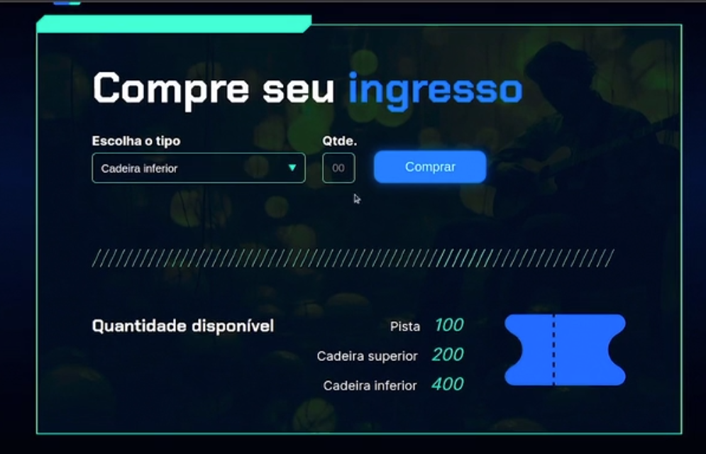

# Curso Alura - Lógica de programação praticando com desafios

## Aula 1 - Projeto Sorteador de Numeros

### Aula 1 - Apresentação - Vídeo 1

Transcrição  
Jacqueline: Olá, boas-vindas a este curso! Eu sou Jacqueline Oliveira, engenheira de software e instrutora na Alura.

Audiodescrição: Jacqueline se descreve como uma mulher de pele branca, com cabelos longos e loiros lisos, olhos castanhos, vestindo uma camisa preta. Ela está sentada no estúdio da Alura, ao lado esquerdo de uma mesa preta com um notebook e um microfone pretos à sua frente, com uma parede clara ao fundo iluminada em gradiente de azul e lilás.

Porém, não estou sozinha. Estou bem acompanhada pelo Rodrigo.

Rodrigo: Te dou boas-vindas também! Sou Rodrigo Ferreira, um dos instrutores na escola de Programação da Alura.

Audiodescrição: Rodrigo se descreve como um homem de pele branca, com cabelo curto castanho, olhos castanhos, usando uma camisa azul. Ele também está sentado no estúdio da Alura, porém ao lado direito da mesa.

Lhe damos as boas-vindas a mais um curso para treinar e praticar lógica de programação!

O que vamos aprender?  
Jacqueline: O objetivo do curso é reforçar todos os conceitos vistos em lógica de programação, como o uso de variáveis, condicionais, e estruturas de repetição, para consolidar os conhecimentos adquiridos.

Rodrigo: Exato! Para quem está começando agora a dar os primeiros passos com programação, é uma área nova, com muitos conceitos, alguns até um pouco mais difíceis, mas a melhor forma de aprender e se familiarizar é com a prática.

Então, nos cursos de lógica de programação, você aprenderá a desenvolver um projeto, e neste curso, proporemos alguns projetos distintos. Em cada aula, apresentaremos um projeto, explicaremos a ideia e você terá que tentar criar esse projeto por conta própria.

Caso tenha dificuldade ou dúvidas, também mostraremos uma solução implementando o passo a passo para que você tenha uma ideia de como seria o processo de cada um desses projetos.

Jacqueline: Trabalharemos com quatro novos projetos, todos com a parte de front-end já desenvolvida que disponibilizaremos para você. Não se preocupe, pois o objetivo não é mergulhar profundamente em front-end. O principal alvo é praticar a lógica, como resolver uma situação envolvida no projeto, isto é, o desafio do projeto.

Rodrigo: Cada projeto terá funcionalidades específicas e focaremos na parte de algoritmos, de lógica de programação com o uso de variáveis, condicionais, loops, arrays e funções, tudo o que foi visto em outros cursos e será reforçado aqui com diferentes projetos.

Assim, você poderá criar um portfólio com vários projetos, praticar bastante, e se familiarizar cada vez mais com a programação, para posteriormente prosseguir com outros cursos e formações da Alura.

Jacqueline: Estou ansiosa para começar! Vamos iniciar, Rodrigo?

Rodrigo: Vamos conhecer esses projetos e colocar a mão na massa para praticar bastante a lógica de programação.

### Aula 1 - Projetos do curso

Neste curso, praticaremos lógica de programação em alguns projetos distintos, no formato de desafios, sendo que em cada aula será apresentado um novo contexto. Você pode baixar os projetos iniciais de cada aula no seguinte link:

[Projeto inicial](https://github.com/alura-cursos/3411-praticando-logica/archive/refs/heads/projeto_inicial.zip)

Após baixar o arquivo zip, descompacte-o em algum diretório do seu computador e na sequência importe o projeto em sua IDE. No curso, utilizaremos o VSCode, sendo recomendado que você também utilize essa mesma IDE para facilitar o seu aprendizado.

Tudo pronto?

Bons estudos!

### Aula 1 - Apresentação do projeto Sorteador - Vídeo 2

Transcrição  
Rodrigo: Antes de começarmos o curso, tivemos uma mudança. Você deve ter percebido, estamos com um cenário diferente. Estamos nas nossas respectivas casas, pois decidimos fazer uma alteração nesse curso.

Como algumas pessoas estavam com dificuldades para aplicar os conhecimentos e resolver os desafios sozinhas, decidimos gravar uma aula extra. No entanto, essa aula será a primeira. A antiga primeira foi adiada, tornou-se a segunda, e assim por diante.

Nessa aula, teremos um projeto, mas ele não será um desafio para você tentar implementar sozinho. Vamos desenvolver um projeto para reforçar os conhecimentos de HTML, CSS, JavaScript, para que você consiga ter uma base mais sólida e, a partir da aula 2, consiga desenvolver os desafios por conta.

Mesmo que na formação tenhamos os dois primeiros cursos, cujo foco foi dar uma base inicial, percebemos que ainda era necessário reforçar esses conhecimentos. O nosso objetivo é esse, certo, Jacque?

Jacqueline: Exatamente, Rodrigo.

Conhecendo o projeto
Vamos começar. Trabalharemos com o projeto de um sorteador de números. Quando você fizer o download do projeto, receberá a seguinte estrutura de arquivos: uma pasta "img", dentro da qual há algumas imagens, um arquivo app.js vazio, o index.html com o HTML e o style.css. É possível consultar essa estrutura pelo explorador lateral de arquivos do VS Code, com o projeto aberto.

Vamos conhecer o projeto e falar um pouco desses arquivos.

Estamos seguindo a linha dos cursos anteriores, então estamos usando a extensão Live Server do VS Code. Vamos clicar com o botão direito no index.html e clicar em "Open With Live Server". Isso abrirá o nosso projeto no navegador.

Na tela do nosso sorteador de números, vamos digitar no campo "Quantidade de números" um número que representará a quantidade de números que serão sorteados. Vamos digitar, por exemplo, um 3. Nos campos "Do número" e "Até o número", devemos escolher o número inicial e o número final do sorteio. Vamos sortear números de 1 a 10, por exemplo.

Quando clicarmos no botão "Sortear", abaixo dos três campos, ele vai mostrar o resultado — neste caso, ele sorteou 8, 7 e 4.

Você receberá esse front-end e nós vamos programar essa lógica em conjunto. Certo, Rodrigo?

Rodrigo É um projeto bem simples e seguindo a mesma ideia. Temos um HTML, já temos o CSS, que está com um layout bonito, com essas cores e imagens, mas o que interessa para nós é a funcionalidade.

Perceba que é um projeto bem simples. Temos um formulário com três campos. A pessoa que for usar, vai digitar os três valores e clicar no botão de sortear. Temos que ter um código JavaScript com a lógica de ler os valores digitados, o algoritmo de gerar os números aleatórios seguindo esses valores e a exibição na tela.

À direita do botão "Sortear", há um botão de reiniciar, que limpa os campos para começar um novo sorteio. Esse é o objetivo desse projeto.

Nessa primeira aula, nós vamos fazer juntos. A Jacque vai programar no computador dela, eu vou estar apoiando e você vai nos acompanhar.

Jacqueline: Exatamente. No VS Code, com o projeto sorteador de números abertos, vamos voltar ao explorador lateral. Se nós observarmos o interior da pasta "img", temos as imagens usadas no layout do front-end, do nosso site.

Temos utilizado projetos unindo front-end e back-end para te proporcionar um portfólio bacana e te manter mais próximo do que vemos no mercado, onde você sempre terá múltiplos projetos abertos, no front e no back. Reforçamos que você sempre trabalhará um pouco com cada um.

Na pasta "img", nós temos as imagens. Já no index.html, é onde temos a estrutura do site.

O HTML, relembrando, é uma linguagem de marcação. Ele vai marcar através de tags o que deve acontecer e como a página deve estar estruturada. No interior do arquivo HTML temos, por exemplo, uma tag head (cabeçalho, em inglês), e entre a abertura e o fechamento dessa tag, temos referências, links e o título "Sorteador de números".

```HTML
<head>
    <meta charset="UTF-8">
    <meta name="viewport" content="width=device-width, initial-scale=1.0">
    <link rel="preconnect" href="https://fonts.googleapis.com">
    <link rel="preconnect" href="https://fonts.gstatic.com" crossorigin>
    <link href="https://fonts.googleapis.com/css2?family=Chakra+Petch:wght@700&family=Inter:wght@400;700&display=swap" rel="stylesheet">
    <link rel="stylesheet" href="style.css">
    <title>Sorteador de números</title>
</head>
```

No "corpo" (body) desse HTML, temos um campo label (rótulo) dentro de uma divisão, o qual possui o texto "Quantidade de números", e logo abaixo, o input que ele vai ter, cujo valor mínimo é 1.

```HTML
<body>
    <div class="container">
        <!-- Código omitido -->
                    <div class="container__campo">
                        <label class="texto__paragrafo">Quantidade de números</label>
                        <input class="container__input" id="quantidade" type="number" min="1">
                    </div>
            <!-- Código omitido -->
</body>
```

Isso corresponde exatamente ao que estamos vendo na página do navegador: um label chamado "Quantidade de números". Se pressionarmos a seta para baixo que existe no canto direito do campo "Quantidade de números", o valor diminui, mas nunca fica menor que 1.

O HTML está estruturando a página. Por isso, vamos acessá-lo muitas vezes para fazer referências e buscar esses elementos para interagir no JavaScript.

Voltando ao VS Code, se acessarmos o arquivo style.css que contém a parte de CSS, veremos que ele tem algumas classes, como .container__campo, .container_input e .container_botao. Esse arquivo corresponde à parte de estilização, ou seja, doa as características e a forma como os elementos serão vistos na tela — por exemplo, qual o tamanho do ponteiro, se vai ter ponteiro, se vai estar bloqueado e que cor ele terá.

Se renomearmos esse arquivo, por exemplo, para styleteste.css, quando voltarmos ao nosso sorteador no navegador, a estilização terá sumido. Ele vai continuar funcionando porque nosso JavaScript ainda estará fazendo esse trabalho, porém o estilo não estará mais aplicado.

Você precisa entender essa divisão nitidamente: o HTML diz o que está na página, o CSS estiliza e deixa essa página bonita e o JavaScript interage dinamicamente, fazendo a lógica do negócio.

Vamos retornar o nome do arquivo alterado para style.css.

Rodrigo: Temos essa separação entre HTML, CSS, JavaScript, onde cada linguagem cuida de uma parte do nosso projeto. Nosso foco principal não é no HTML e no CSS, portanto, em todos os desafios, já teremos o HTML e o CSS pronto.

Nosso foco é na lógica de programação, no código JavaScript, que se relaciona com os eventos. Ou seja, quando clicarmos em determinado botão, queremos fazer alguma coisa. Vamos escrever o algoritmo, pegar uma variável, fazer um cálculo e alterar a página.

Jacqueline: Exatamente. No projeto atual, podemos observar que está tudo funcionando porque no nosso arquivo app.js, isso já está programado. Contudo, neste momento, apagaremos todo o conteúdo desse arquivo para fazermos tudo juntos, do zero. Vamos lá?

Iniciando a construção do código  
Após esvaziar o arquivo app.js, nada mais funcionará no nosso sorteador. Se preenchermos os campos no navegador e clicarmos em "Sortear", ele não vai fazer nada e nada acontecerá.

Como decidiremos por onde começar, Rodrigo? Se queremos capturar aqueles inputs que a pessoa digitou para fazer alguma coisa com eles, qual será a nossa primeira estratégia?

Rodrigo: Teremos que escrever o código JavaScript. Contudo, devemos lembrar de uma coisa importante: temos que olhar sempre a página HTML, porque nela está a estrutura da página, os elementos. No JavaScript, o que vamos fazer é manipular esses elementos, recuperar os campos, os seus valores e outros elementos.

Portanto, todo o código JavaScript se baseia no HTML. Um bom ponto de partida seria pensar no que vai disparar a nossa lógica, que é o clique do botão "Sortear". Na nossa página HTML tem um botão "Sortear".

Quando ele for clicado, temos que chamar um código no JavaScript. Então, acho que esse é o primeiro ponto a ser considerado. Precisamos olhar no HTML onde está aquele botão de sortear e ver se ele tem uma função. Caso não tenha, devemos colocar uma função onClick (no clique) para disparar o nosso código JavaScript e começar a escrever o nosso algoritmo.

Jacqueline: Perfeito, Rodrigo. Enquanto você estava falando, eu estava abrindo o local do código a ser estudado, no index.html. Repare que temos uma div, que é o chute container__botoes. Nela, temos dois botões, o sortear e o reiniciar. Eles têm respectivamente os IDs, btn-sortear e btn-reiniciar.

```HTML
<div class="chute container__botoes">
     <button onclick="sortear()" id="btn-sortear" class="container__botao">Sortear</button>
     <button onclick="reiniciar()" id="btn-reiniciar" class="container__botao-desabilitado" >Reiniciar</button>
</div>
```

Quando clicamos no botão de sortear, ele dispara uma função chamada sortear(). Isso significa que, no nosso app.js, precisaremos criar essa função. Esse é o primeiro passo. Vamos acessar o arquivo app.js pelo explorador lateral e faremos uma function em seu interior chamada sortear.

> function sortear(){  
}

O que queremos fazer quando sortearmos? Precisaremos recuperar aqueles campos. Como o Rodrigo falou, onde estão aqueles campos? Quais são os campos que queremos recuperar?

Queremos recuperar a quantidade que foi digitada dentro de três campos input do arquivo HTML, cujos IDs são quantidade, de e ate, que representam os três campos do formulário.

```HTML
<div class="container__campo">
    <label class="texto__paragrafo">Quantidade de números</label>
    <input class="container__input" id="quantidade" type="number" min="1">
</div>

<div class="container__campo">
    <label class="texto__paragrafo">Do número</label>
    <input class="container__input" id="de" type="number" min="1">
</div>

<div class="container__campo">
    <label class="texto__paragrafo">Até o número</label>
    <input class="container__input" id="ate" type="number" min="1">
</div>
```

Recuperaremos esses três campos inicialmente para começar a fazer alguma coisa. Como faremos isso, Rodrigo?

Dentro da nossa function sortear(), podemos criar umas variáveis e buscar o conteúdo que tiver informado lá. Vamos fazer isso?

Rodrigo: Certo. Como a Jacque estava mostrando, sempre temos que olhar para o HTML. Temos que saber qual elemento queremos buscar e como vamos buscá-lo.

As tags do HTML têm propriedades, como id, class e várias outras. Aquela que nos ajuda a encontrar um elemento é o id, que é um identificador único. A Jacque mostrou que cada campo tem um id.

Podemos recuperar um elemento pelo seu id e guardar o conteúdo dele numa variável. Vamos relembrar como declarar uma variável , Jacque?

Jacqueline: Sim. Entre as chaves da função, vamos usar o let para criar uma variável. Podemos usar um nome bem intuitivo e parecido com o que queremos. Então, se queremos recuperar a quantidade, vamos criar uma variável chamada quantidade e adicionar um sinal de igual à sua frente.

```JavaScript
function sortear(){
    let quantidade = 
}
```

O que fazemos para buscar essa variável? Como recuperamos o elemento do HTML, Rodrigo?

Rodrigo: Reforçando, no JavaScript já existe uma variável global — ou seja, a qual não precisamos declarar. Ela se chama document, e representa o documento. Vamos adicioná-la após o sinal de igual.

```JavaScript
function sortear(){
    let quantidade = document
}
```

O documento é como se fosse a página HTML. Nessa variável, podemos adicionar um ponto e chamar alguma função para ela fazer alguma coisa.

```JavaScript
function sortear(){
    let quantidade = document.
}
```

Existem diferentes formas de recuperar um elemento na página. Uma delas é com a função getElementById() que, como o nome diz, vai buscar um elemento pelo seu ID. Se sabemos o ID do elemento na página e queremos recuperá-lo, escreveremos document.getElementById() e passamos entre os parênteses dessa função, o ID do elemento que queremos recuperar como retorno, entre aspas simples (por se tratar de uma string).

```JavaScript
function sortear(){
    let quantidade = document.getElementById('quantidade')
}
```

Jacqueline: Exatamente. Como nós vimos, os IDs dos elementos que queremos são quantidade, de e ate. Primeiro, vamos pegar o quantidade e dizer que queremos pegar o valor que está contido naquele input. Para isso, vamos adicionar um .value após os parênteses e finalizar a linha com ponto e vírgula.

```JavaScript
function sortear(){
    let quantidade = document.getElementById('quantidade').value;
}
```

Rodrigo: Jacque, isso é importante. Quando vamos recuperar um elemento no HTML, chamamos o document.getElementById() e passamos o ID. Isso devolve a tag HTML.

Se não adicionássemos o .value, estaríamos guardando na variável quantidade o elemento HTML, ou seja, a tag input. Contudo, não queremos o input inteiro, somente o valor que a pessoa digitou. O .value serve para indicar que queremos guardar o valor, e não o input.

Jacque: Exatamente.

Para aplicar a mesma lógica nos outros dois campos, podemos copiar e colar a primeira linha duas vezes abaixo de si, substituindo respectivamente a string entre os parênteses de getElementById() para de e ate.

Além disso, vamos substituir o nome das duas variáveis para de e ate.

```JavaScript
function sortear(){
    let quantidade = document.getElementById('quantidade').value;
    let de = document.getElementById('de').value;
    let ate = document.getElementById('ate').value;
}
```

Jacqueline: Depois disso, vamos conferir se estamos recuperando corretamente, utilizando aquele recurso que já vimos algumas vezes, o alert.

Abaixo das variáveis, vamos pular uma linha e só dar um alert() na página para não se preocupar em exibir o resultado naquele campo de resultado por enquanto, e ver se a nossa variável vai ser exibida corretamente.

Entre os parênteses do alert, vamos adicionar a quantidade e a quantidade recuperada. Para isso, vamos usar aquele recurso para concatenar uma palavra e uma variável: um par de crases, entre as quais adicionaremos a string Quantidade: e ${quantidade}, entre cifrão e chaves, que servirá para referenciar a variável que queremos.

Com isso, queremos que ele concatene e mostre para nós o texto "Quantidade:" e a quantidade recolhida.

```JavaScript
function sortear(){
    let quantidade = document.getElementById('quantidade').value;
    let de = document.getElementById('de').value;
    let ate = document.getElementById('ate').value;
    
    alert(`Quantidade: ${quantidade}`);
}
```

Faremos a mesma coisa para os outros campos, copiando essa linha com "Ctrl+C", e colando duas vezes abaixo de si com "Ctrl+V", substituindo respectivamente o conteúdo entre crases, de Quantidade: ${quantidade} para Do número: ${de} e Até o número: ${ate}.

```JavaScript
function sortear(){
    let quantidade = document.getElementById('quantidade').value;
    let de = document.getElementById('de').value;
    let ate = document.getElementById('ate').value;
    
    alert(`Quantidade: ${quantidade}`);
    alert(`Do número: ${de}`);
    alert(`Até o número: ${ate}`);
}
```

Jacqueline: Já podemos ir no nosso site aberto no Live Server e ver se isso vai funcionar. A partir do momento que adicionarmos as quantidades e clicar em sortear, ele deve exibir o resultado para nós em formato de alert.

Voltando ao sorteador aberto no navegador, vamos preencher os campos dizendo que queremos cinco números, que vão do 2 ao 98. Quando clicarmos em "Sortear", ele vai mostrar o texto "Quantidade: 5" em formato de caixa de alerta, no topo da página. Ao clicar em "OK" nessa caixa, veremos outra com o texto "Do número: 2" e, ao clicar em "OK" novamente, veremos a terceira caixa com o texto "Até o número: 98". Podemos clicar em "OK" para fechá-la.

Conseguimos realizar a primeira parte. Recuperamos os valores para poder programar o resto da lógica, que consiste em fazer o sorteio e exibir os cinco números dentro do intervalo informado.

#### Aula 1 - Para saber mais: Relembrando as diferenças entre HTML, CSS E JS

Para praticar lógica de programação de forma interessante e visual, optamos por trazer projetos completos, que irão compor seu portfólio e fazer com que a sua experiência em desenvolvimento de aplicativos seja mais próxima ao que é feito no mercado de trabalho.

Sendo assim, os projetos apresentados sempre têm três arquivos distintos em sua composição: um com extensão HTML, outro com extensão CSS e outro com extensão JS.

Vamos relembrar, por meio de uma atividade de um dos cursos que é pré-requisito a esse, a diferença entre esses três tipos de tecnologias:

Para saber mais: [Diferenças entre HTML, CSS e JS](https://cursos.alura.com.br/course/logica-programacao-funcoes-listas/task/137213)

#### Aula 1 - Para saber mais: Entendendo o DOM

Quando uma página da web é carregada em um navegador, esse navegador cria uma representação do DOM dessa página. Mas o que é esse DOM, afinal?

O DOM (Document Object Model) é uma representação da estrutura de um documento HTML, onde os elementos são organizados em uma árvore hierárquica e cada nó possui propriedades e métodos. Isso permite que desenvolvedores acessem, modifiquem, removam ou adicionem elementos e conteúdo HTML dinamicamente através de scripts.

É por isso que, em nosso código JavaScript, frequentemente acessamos o valor de um elemento na página por meio do objeto document, referenciando-o pelo identificador ou por outra propriedade. Um exemplo disso é o uso de document.getElementById().

No artigo [O que é o DOM?](https://www.alura.com.br/artigos/o-que-e-o-dom), da Ellen Pimentel, você poderá aprofundar seu conhecimento sobre DOM e a forma de manipulá-lo.

### Aula 1 - Criando a função para sortear - Vídeo 3

Transcrição  
Rodrigo: Já conseguimos dar o primeiro passo na nossa função de sorteio. Recuperamos os elementos da página HTML e fizemos um teste com um alerta para verificar se o valor estava chegando corretamente no código.

Também reforçamos a ideia de recuperar elementos na página. Para isso, precisamos conhecer a página HTML e saber qual é o elemento que queremos recuperar, seja um parágrafo, um botão, ou outro — no nosso caso, foi um input. Para recuperá-lo, precisamos ser capazes de referenciar esse elemento de alguma forma. Utilizamos o id, que geralmente é uma boa opção para recuperar um elemento.

As tags já tinham ids, caso contrário, poderíamos adicionar ids na tag input dos três inputs. Como não precisamos da tag no nosso código JavaScript, mas sim o valor que foi digitado, utilizamos a propriedade .value, que obtém o valor digitado na caixa de texto da página.

Convertendo o texto em número
Tudo funcionou bem, mas antes de continuar nosso código, acreditamos que podemos fazer uma melhoria para ter uma garantia.

Quando recuperamos um elemento com document.getElementById(), e o .value, ele vai recuperar o valor que foi digitado dentro da caixa de texto. No entanto, a caixa de texto do navegador, a tag input, geralmente aceita letras também. Nesse caso, ela não vai aceitar, mas poderiam ter letras ali.

Portanto, esse .value retorna uma string (texto). Mas no nosso algoritmo, sabemos que são números. Então, podemos usar uma função no JavaScript para forçar que essa variável seja do tipo numérico.

Jacqueline: Exatamente. Acessando as linhas em que declaramos as variáveis, vamos utilizar, a função parseInt(), de modo que seus parênteses envolvam o document.getElementById().value.

Temos também a parseFloat, que poderíamos usar para declarar que é um tipo float, mas vamos usar parseInt para indicar que vai chegar um número do tipo inteiro.

```JavaScript
function sortear(){
    let quantidade = parseInt(document.getElementById('quantidade').value);
    let de = parseInt(document.getElementById('de').value);
    let ate = parseInt(document.getElementById('ate').value);
    
    alert(`Quantidade: ${quantidade}`);
    alert(`Do número: ${de}`);
    alert(`Até o número: ${ate}`);
}
```

Se posicionarmos o cursor em cima de uma das variáveis antes de adicionar o parseInt(), a IDE exibirá uma caixa de mensagem informando que a variável é do tipo any (qualquer), ou seja, pode vir qualquer coisa. Após o parseInt(), a IDE exibirá o tipo number, sendo, portanto, capaz de entender que virá um número.

Rodrigo: Temos, então, mais uma função, o parseInt(). Ela recebe como parâmetro o texto ou o elemento no qual faremos parse (conversão) para inteiro. Vamos fazer isso para as três variáveis ali, a quantidade, o de e o até.

Com isso, nosso código recupera o elemento e adiciona dentro do parseInt(), garantindo que o retorno será do tipo inteiro e não mais string no código JavaScript.

Implementando o sorteio
Jacqueline: Mas agora queremos ver o sorteio. Colocamos lá do número 2 ao 98, e queremos saber como vamos sortear esse número. Não precisamos reinventar a roda e ficar pensando como fazer esse sorteio, pois certamente temos funções prontas para essa tarefa.

Rodrigo: Esse é o próximo passo do nosso algoritmo. Já temos os valores, agora temos que fazer a parte mais difícil, que é escolher um número aleatório entre o de e o até. Podemos começar a fazer uma nova função para ter essa lógica, mas não precisamos implementá-la do zero, conseguimos pesquisar uma solução pronta.

Jacqueline: Exatamente. Abaixo das chaves da função sortear(), vamos criar uma nova função com o function, e podemos chamá-la de obterNumeroAleatorio, porque é isso que ela fará.

```JavaScript
function sortear(){
    // Codigo omitido
}
function obterNumeroAleatorio() {
}
```

Vamos ter que passar para essa função aquele intervalo entre o valor mínimo e o máximo como parâmetro, para ele nos dar um número dentro daquele intervalo. Para isso, vamos colocar um min e um max entre parênteses.

```JavaScript
function sortear(){
    // Codigo omitido
}
function obterNumeroAleatorio(min, max) {

}
```

Rodrigo: Criamos uma função separada, cujo objetivo é apenas gerar um número aleatório entre o mínimo e o máximo.

Na nossa função principal, a sortear(), podemos criar uma variável e guardar o retorno dessa função nessa variável. Onde temos os três alertas seguidos, vamos apagar os três e criar em seu lugar uma variável numero que vai receber o retorno da nova função. Portanto, vamos adicionar o igual na variável numero e vamos chamar o obterNumeroAleatorio(), passando entre parênteses o que foi capturado no de e no ate.

Na linha de baixo, para conferir, vamos fazer um alert, mostrando esse numero que foi sorteado.

```JavaScript
function sortear(){
    let quantidade = parseInt(document.getElementById('quantidade').value);
    let de = parseInt(document.getElementById('de').value);
    let ate = parseInt(document.getElementById('ate').value);
    
    let numero = obterNumeroAleatorio(de, ate);
    alert(numero);
}

function obterNumeroAleatorio(min, max) {

}
```

Jacqueline: Construímos a estrutura da função nova e fizemos sua chamada na função principal. Agora vamos construir a parte da inteligência, ou seja, a forma com a qual obtemos esse número aleatório.

Rodrigo: Para isso, vamos pesquisar. Em vez de implementar um algoritmo do zero, no qual temos dois números e uma lógica que gera um número aleatório entre eles, podemos pesquisar na internet, pois esse é um cálculo muito comum.

Vamos pesquisar no Google se tem algum site, blog ou fórum com essa informação, porque, com certeza, pessoas já precisaram fazer isso.

> números aleatórios em javascript

Ao digitar a busca acima, encontramos duas páginas que indicam a função Math.random(). Uma delas é da Alura, a qual referenciaremos abaixo para que você acesse e conheça.

Acesse o artigo da Alura A função Math.random() no JavaScript na criação de números pseudoaleatórios.
No momento, vamos utilizar a página que explica a função Math.random(), do site Developer Mozilla.

Acessando essa página, vemos a indicação da função mencionada, que serve para pegar um número aleatório. A página mostra para nós como poderíamos escrever essa função, com um exemplo na seção "Gerando um número aleatório entre dois valores".

```JavaScript
function getRandomArbitrary(min, max) {
  return Math.random() * (max - min) + min;
}
```

Vamos começar a "brincar" com isso e ver como vai ficar. No código acima, selecionaremos e copiaremos a linha return Math.random() * (max - min) + min.

Voltando ao código, vamos colar entre as chaves de obterNumeroAleatorio(), e ver se vai funcionar.

```JavaScript
function obterNumeroAleatorio(min, max) {
    return Math.random() * (max - min) + min;
}
```

Voltando ao nosso sorteador aberto no navegador, colocaremos que queremos um número entre 2 e 40, 10, por exemplo. Quando clicarmos em "Sortear", ele exibirá a primeira caixa de diálogo da resposta com números quebrados, com várias casas decimais.

6.916911577052566

O número não veio como inteiro, e não é exatamente assim que queremos. Nesse caso, queremos que seja exibido o número 7.

Nesse caso, temos que voltar à página da documentação para analisar. Em seu interior, na seção "Gerando um número aleatório entre dois valores", da qual copiamos o código, encontramos a seção "Gerando um número inteiro aleatório entre dois valores", que tem um Math.floor() para fazer um ajuste e não mostrar o número quebrado.

Ele vai retornar um número maior do que o min, mas nunca igual ao max, ou seja, ele nunca será igual ao número final. Contudo, esse ainda não é o código que queremos.

Desceremos mais a página até encontrar a seção "Gerando um número inteiro aleatório entre dois valores, inclusive". Vamos utilizar essa função porque queremos um valor entre dois números, incluindo o último possível. Se colocarmos de 2 a 10, por exemplo, queremos permitir que ele também retorne o 10.

```JavaScript
function getRandomIntInclusive(min, max) {
  min = Math.ceil(min);
  max = Math.floor(max);
  return Math.floor(Math.random() * (max - min + 1)) + min;
}
```

Vamos copiar a linha return Math.floor(Math.random() * (max - min + 1)) + min no código de exemplo dessa função. Podemos usá-la direto, sem o ceil() e o floor() anteriores.

return Math.floor(Math.random() * (max - min + 1)) + min;
Copiar código
Vamos colar essa linha no lugar da outra, entre as chaves da nossa função de sorteador. O novo código possui um pequeno ajuste em relação ao anterior.

```JavaScript
function obterNumeroAleatorio(min, max) {
    return Math.floor(Math.random() * (max - min + 1)) + min;
}
```

Rodrigo: Essa é a versão otimizada para o nosso cenário. Queremos que ele sorteie um número inteiro, não um número decimal, e que ele leve em consideração o mínimo e o máximo de maneira inclusiva.

Como foi mostrado, o site que acessamos possui uma documentação explicando a função Math.floor(). Perceba que já tem uma função que faz o que queremos, utilizando o Math.random() para escolher um número aleatório.

Portanto, não precisaríamos tentar fazer do zero essa lógica de gerar número aleatório, pois já temos isso pronto no JavaScript. Só precisamos recolher alguns exemplos no tutorial e usar o mais próximo do que precisamos para o nosso projeto.

Jacqueline: Vamos testar para ver se com essa alteração veremos o retorno sem aquele número quebrado. Voltando ao nosso sorteador aberto no navegador, colocaremos o valor 1 em "Quantidade de números", e os valores de 2 a 10 novamente. Quando sortearmos, a janela de diálogo retornará o número 8, um valor inteiro, conforme desejado.

Contudo, se alterarmos o valor de "Quantidade de números" para 5, ele continuará retornando um único valor. Vamos precisar fazer essa chamada ao método obterNumeroAleatorios() dentro de alguma repetição.

Rodrigo: Sim. Vamos sortear uma vez e usar aquela variável quantidade que, até então, não estava sendo usada para nada. Vamos ter que fazer uma repetição, ou seja, um loop (laço) para sortear um número de acordo com a quantidade que a pessoa digitar no campo "Quantidade de números".

Jacqueline: Exatamente. Para isso, podemos apagar as linhas let numero = obterNumeroAleatorio(de, ate) e alert(numero), entre as chaves da função sortear(), para recomeçar a estrutura.

```JavaScript
function sortear(){
    let quantidade = parseInt(document.getElementById('quantidade').value);
    let de = parseInt(document.getElementById('de').value);
    let ate = parseInt(document.getElementById('ate').value);
    
}
```

Vamos sortear com uma estrutura de repetição e depois vamos guardar isso em algum lugar para exibir. Para isso, vamos um array (arranjo). Não vamos ter um número só, mas sim um array onde haverá vários números — quantos a pessoa desejar.

No lugar do código removido, vamos criar uma variável sorteados que vai representar esse array. Vamos fazer um let sorteados e adicionar um sinal de igual. Para declarar o nosso array, vamos abrir e fechar os colchetes.

```JavaScript
function sortear(){
    let quantidade = parseInt(document.getElementById('quantidade').value);
    let de = parseInt(document.getElementById('de').value);
    let ate = parseInt(document.getElementById('ate').value);
    
    let sorteados = [];
}
```

Qual é a estrutura de repetição que você nos recomenda, Rodrigo?

Rodrigo: Podemos utilizar um laço for, que vai percorrer do primeiro ao segundo número que a pessoa digitou. Se ela digitou 5, é de 1 a 5, se ela digitou 20, de 1 a 20. O laço for é um exemplo que pode ser usado para fazer a lógica de percorrer determinados elementos e fazer alguma coisa nesse intervalo percorrido.

Jacqueline: Vamos fazer isso aqui. Abaixo de let sorteados = [], vamos pular uma linha e fazer o for(). Entre seus parênteses, vamos colocar um let e a variável de iteração que, por padrão, chamamos de i. Nós a iniciamos com o valor 0, adicionamos um ponto e vírgula e o comando i < quantidade para dizer "enquanto i for menor do que a quantidade que a pessoa digitou.

Por fim, adicionamos outro ponto e vírgula e o comando i++ para incrementar a variável i de 1 em 1.

```JavaScript
function sortear(){
    let quantidade = parseInt(document.getElementById('quantidade').value);
    let de = parseInt(document.getElementById('de').value);
    let ate = parseInt(document.getElementById('ate').value);
    
    let sorteados = [];
    
    for (let i = 0; i < quantidade; i++) {
    
    }
}
```

Entre as chaves desse for, aí sim, precisamos fazer atribuir obterNumeroAleatorio() a uma variável e colocar o valor dessa variável no array.

Rodrigo: Criamos um laço que vai de zero até a quantidade que a pessoa digitou. A estrutura do laço for tem o formato visto acima. Criamos uma variável i que vai de 0 até quantidade para ser o controlador do laço e evitar que ele execute infinitamente.

É dentro do laço que precisamos chamar o obterNumeroAleatorio(), e o número de vezes que vamos chamar essa função vai depender da quantidade que a pessoa digitou e que vamos usar no controle do for.

Jacqueline: Acima do laço, vamos criar a variável numero com let numero.

```JavaScript
function sortear(){
    let quantidade = parseInt(document.getElementById('quantidade').value);
    let de = parseInt(document.getElementById('de').value);
    let ate = parseInt(document.getElementById('ate').value);
    
    let sorteados = [];
    let numero;
    
    for (let i = 0; i < quantidade; i++) {
    
    }
}
```

Dentro das chaves do laço, por sua vez, vamos colocar o numero, que receberá obterNumeroAleatorio(de, ate). Ou seja, ele vai fazer isso quantas vezes forem necessárias.

Desceremos uma linha, na qual precisamos fazer mais alguma coisa. Uma vez que obtivemos o número, precisamos adicioná-lo ao nosso array. Para isso, vamos adicionar um sorteados.push() para colocar o valor. Então, vamos colocar numero entre parênteses.

```JavaScript
function sortear(){
    let quantidade = parseInt(document.getElementById('quantidade').value);
    let de = parseInt(document.getElementById('de').value);
    let ate = parseInt(document.getElementById('ate').value);
    let sorteados = [];
    let numero;
    for (let i = 0; i < quantidade; i++) {
        numero = obterNumeroAleatorio(de, ate);
        sorteados.push(numero);
    }
}
```

Teoricamente, se a pessoa escolher cinco números, ele vai rodar cinco vezes, chamando o número aleatório e guardando-o no array. E depois, para conferir, podemos imprimir esse array. Abaixo das chaves do for, vamos pular uma linha e fazer um alert() desse array sorteados.

```JavaScript
function sortear(){
    let quantidade = parseInt(document.getElementById('quantidade').value);
    let de = parseInt(document.getElementById('de').value);
    let ate = parseInt(document.getElementById('ate').value);
    let sorteados = [];
    let numero;
    for (let i = 0; i < quantidade; i++) {
        numero = obterNumeroAleatorio(de, ate);
        sorteados.push(numero);
    }
    alert(sorteados);
}
```

Vamos para o nosso sorteador aberto no navegador. Vamos pedir para escolher 5 números, de 1 a 20, e clicaremos em "Sortear". O resultado será exibido na caixa de alerta no topo da página.

1, 2, 14, 4, 8.

Os números do resultado estão dentro da faixa, sempre antes de 20. Isso significa que o código funciona corretamente.

Até o momento, cumprimos nossa missão. Recuperamos os valores, fizemos uma função para obter um número aleatório e fizemos um loop para devolver os números aleatórios selecionados no campo "Quantidade de números".

A seguir, vamos melhorar nossa aplicação, exibindo no label os números sorteados e fazendo alguns outros tratamentos para torná-la mais coesa.

Rodrigo: Perfeito. Conseguimos fazer o segundo passo, que era gerar os números aleatórios. Conforme o alert que criamos para exibir o resultado, a nossa aplicação está funcionando bem.

Devemos reforçar que copiar funções de sites de documentações é bem comum no nosso dia a dia. Futuramente, você vai precisar fazer alguma lógica ou algoritmo que outras pessoas já precisaram. Nesses casos, você pode pesquisar na internet por sites e fóruns ou usar ferramentas de inteligência artificial, como o ChatGPT.

Se você conhece o ChatGPT, você pode pedir a ele que gere uma função de sortear números aleatórios. Obviamente, nem sempre a ferramenta acerta, então, é bom sempre testar para ver se o código gerado por ela vai funcionar.

A seguir, continuaremos o nosso projeto.

#### Aula 1 - Para saber mais: A função Math.random()

A função Math.random() em JavaScript é uma função integrada que gera um número pseudoaleatório decimal entre 0 (inclusivo) e 1 (exclusivo). Isso significa que o número gerado estará em um intervalo de [0, 1), onde 0 é incluído, mas 1 não é.

Quando você chama Math.random(), obtém um número aleatório como resultado. Exemplo de código:

> let numeroAleatorio = Math.random();  
console.log(numeroAleatorio); // Isso imprimirá um número aleatório entre 0 (inclusivo) e 1 (exclusivo)

Esse recurso é frequentemente utilizado em diversas aplicações para gerar números aleatórios que podem ser usados em jogos, simulações, sorteios, geração de senhas aleatórias, entre outras funcionalidades onde a aleatoriedade é necessária.

Para criar números aleatórios em um intervalo diferente de [0, 1), você pode manipular o resultado de Math.random() multiplicando-o e adicionando valores conforme necessário, exatamente como fizemos em vídeo no nosso projeto Sorteador de números.

Para saber mais sobre essa função, não deixe de ler o [artigo A função Math.random() no JavaScript](https://www.alura.com.br/artigos/funcao-math-random-javascript-numeros-pseudoaleatorios) na criação de números pseudoaleatórios, que contém exemplos de utilização e manipulação do valor.

### Aula 1 - Exibindo os números sorteados - Vídeo 4

Transcrição  
Rodrigo: Conseguimos completar mais uma etapa. Agora nosso algoritmo é capaz de gerar números aleatórios. Adicionamos um alerta para exibir na tela e verificamos que tudo funcionou corretamente. Até pesquisamos uma função para gerar números aleatórios e a implementamos no site. Inclusive, poderíamos ter usado inteligência artificial nessa parte.

Nosso próximo passo é não exibir os números na página, ao invés de um alerta. Embaixo dos botões, há um texto onde pretendemos exibir esses valores.

Exibindo os valores em forma de texto
Jacqueline: Exatamente. Portanto, precisaremos conferir novamente o HTML para descobrirmos o elemento que precisamos buscar. No site, temos o texto "números sorteados", que é precisamente onde queremos colocar esses cinco números que estão aparecendo em forma de alerta.

Vamos novamente ao index.html, onde verificaremos onde está este texto. Ele está na linha 43, dentro da `<label class="texto__paragrafo">`: "Números sorteados: nenhum até agora". Portanto, temos o elemento com o id resultado, e nele temos uma label com esse texto. Teremos que recuperar esse o resultado e colocar exatamente a tag da label nesse elemento. Inclusive, copiaremos a linha da label, para adicioná-la, e voltaremos para o arquivo app.js.

> `<label class="texto__paragrafo">`Números sorteados: nenhum até agora`</label>`

O primeiro passo é declarar o resultado para conseguirmos obter esse elemento. Então, no final da function sortear(), abaixo do for() criaremos a variável resultado codando: let resultado = document.getElementById('resultado').

Rodrigo: Nessa situação, queremos fazer o contrário da anterior. Anteriormente estávamos recuperando os elementos e recuperando o que a pessoa digitou na tela. Agora, não queremos ler uma informação da tela, queremos colocar uma informação na tela.

Temos a nossa variável resultado, no código JavaScript, e precisamos passar essa informação para página, concatenar dentro da página. Então, é o caminho inverso. Sendo assim, não vamos usar o .value, porque esse elemento que recuperamos não é uma tag input. Usamos o document.getElementById(), porque queremos o elemento HTML. Aquela tag era uma div, e nela vamos passar a tag label.

Jacqueline: Então, obtemos o elemento resultado do HTML e passamos para a variável resultado no JavaScript. Para colocar esse elemento na página HTML, na linha abaixo escrevemos resultado.innerHTML. Com o .innerHTML, conseguimos passar o elemento na página, que será justamente a linha que copiamos.

Porém, ao invés do texto "Números sorteados: nenhum até agora", mudaremos para Números sorteados: ${sorteados}, passando a array dos números sorteados. Contudo, como estamos concatenando com outra variável, precisamos deixar toda a tag <label> </label> entre crases.

Arquivo app.js

```Javascript
function sortear(){
    //código omitido

    let resultado = document.getElementById('resultado')
    resultado.innerHTML = `<label class="texto__paragrafo">Números sorteados: ${sorteados}</label>`
} 

function obterNumeroAleatorio(min, max) {
    return Math.floor(Math.random() * (max - min + 1)) + min;
}
```

Teoricamente, esse código é o suficiente para exibirmos na tela. Já tiramos o alert(). Então, vamos testar lá se vai funcionar. Abrindo a página do sorteador, preencheremos os campos, indicando que queremos 5 números entre 1 e 10. Ao clicarmos no botão "Sortear", o resultado aparece na tela: "Números sorteados: 3, 5, 8, 3, 2". Deu certo.

Quantidade de números: 5

Do número: 1

Até o número: 10

Números sorteados: 3, 5, 8, 3, 2

Conhecendo o .textContent  
Rodrigo: Percebemos que para lermos um elemento da página, chamamos o .value, se for um campo de texto. Para colocarmos uma informação na página, temos o .innerHTML. Isso é algo que vamos fazer bastante nos desafios das próximas aulas, então você precisará fazer essa lógica.

Tem uma outra propriedade também, que é o .textContent, que é quando queremos colocar um texto dentro de um elemento na página. Seria equivalente ao que fizemos, ou seja, podemos usar o .textContent ou o .innerHTML.

Geralmente, usamos o .textContent quando temos um texto simples: uma frase, uma palavra, uma string, um número. No caso que fizemos, não temos um texto simples, e sim uma tag HTML inteira. Então, tem a tag, label, ID e outras coisas, então usamos o .innerHTML, porque queremos colocar um trecho de código HTML internamente nesse elemento.

Dica: Para exibir textos simples na tela, podemos usar o .textContent, porém, quando precisamos manipular o conteúdo HTML de um elemento interno, usamos o .innerHTML.

Corrigindo o sorteio de números repetidos
Rodrigo: Deu certo, mas temos um problema nos números que foram sorteados.

Jacqueline: Reparei também, Rodrigo. Quando diminuí o range de 1 para 10, ele gerou números repetidos: ele sorteou o 3 duas vezes e não queremos sorteio repetido. Imagina, duas pessoas ganhando o mesmo presente? Isso é problema de família, não dá. Então, precisamos encontrar uma maneira de proteger quando o número tiver sido sorteado, para ele não ser sorteado novamente. Então, vamos fazer um ajuste no nosso método.

Acessando novamente o arquivo app.js, dentro da função sortear(), temos o for(). Nesse for(), temos a variável numero, que recebe o obterNumeroAleatorio().

```Javascript
for (let i = 0; i < quantidade; i++) {
    numero = obterNumeroAleatorio(de, ate);
    sorteados.push(numero);
}
```

Antes de efetivamente passar os números aleatórios para a array, podemos consultar se o número já existe na array. Se já estiver, mandamos chamar outro número aleatório, até que ele consiga gerar um número que ainda não está lá.

Rodrigo: Nessa função, obterNumeroAleatorio(), que até copiamos daquele site, passamos o de e o ate para ele gerar, porém, ele não sabe se aquele número já foi gerado antes. A única coisa que ele faz é gerar os números. Se há números repetidos que não queremos, precisamos reescrever o código para fazer esse controle.

Precisamos fazer um outro loop, porque já temos um loop for() que está fazendo essa lógica de 0 até a quantidade que a pessoa digitou. Nesse outro loop, enquanto o número que pedimos para ele gerar já tiver sido sorteado, ele precisa sortear outro, até gerar um número que não foi sorteado no momento. É isso que faremos.

Jacqueline: Exatamente. Como conhecemos vários métodos de repetição, podemos usar o while(), que é justamente essa palavra-chave enquanto. Enquanto o número sorteado já estiver na array, temos que sortear outro.

```Javascript
for (let i = 0; i < quantidade; i++) {
        numero = obterNumeroAleatorio(de, ate);
        
        while (sorteados.includes(numero))
        
        sorteados.push(numero);
}
```

Então, no while(), para verificarmos se o número já está na array, usamos o sorteados.includes(), passando o numero entre os parênteses.

Rodrigo: Então, sorteados é a nossa variável array, e todo array no JavaScript tem essa função chamada includes(), que devolve um booleano: true (verdadeiro) ou false (falso). O que esse while() está dizendo é: "enquanto a variável sorteados tem incluído esse numero". Enquanto for true, vamos entrar no nosso loop e pedir para ele fazer um novo sorteio. Porque, se isso der verdadeiro, é porque aquele número que sorteado já está dentro do nosso array, o que não queremos.

Jacqueline: Então vamos fazer outro sorteio. Para isso, dentro do while(), chamamos novamente o numero recebendo o obterNumeroAleatorio(de, ate);. E ele ficará fazendo esse loop até que todos os números sejam exclusivos.

```Javascript
for (let i = 0; i < quantidade; i++) {
        numero = obterNumeroAleatorio(de, ate);
        
        while (sorteados.includes(numero)) {
            numero = obterNumeroAleatorio(de, ate);
        }
        
        sorteados.push(numero);
}
```

Vamos testar para ver se agora ele não vai mais repetir? Voltamos ao sorteador e pedimos, mais uma vez, 5 números de 1 a 10. Ao clicarmos no botão "Sortear", temos: 8, 9, 3, 10, 2. Se clicarmos em "Sortear" novamente, aparece: 7, 1, 8, 9, 3. Fazendo isso mais algumas vezes, notamos que já parou de repetir números, ou seja, conseguimos corretamente proteger para não termos número repetido, fazendo esse loop dentro do for().

Parece uma coisa complexa, por termos um loop dentro de outro, mas não, faz todo sentido. Exatamente o que você falou: não podemos ficar alimentando um array enquanto esse já existir aquele número ali dentro.

Conclusão  
Rodrigo: E perceba, então, que o array, que é um objeto do JavaScript, nos ajuda. Ele tem várias funções, e usamos duas delas: o includes e o push. Com o includes(), passamos um elemento e ele indica se aquele elemento já existe dentro do array, devolvendo um booleano: true ou false. E o push "empurra", ou seja, coloca o elemento dentro do array.

Há outros métodos também no array, que você pode pesquisar na documentação, para quando tiver alguma situação em que deseja fazer algo com um array. Por exemplo, colocar ou remover um elemento, verificar se um elemento já existe ou descobrir quantos elementos tem no array. Para todas essas situações, tem funções no array que podemos utilizar.

Então, conseguimos concluir mais uma etapa. Nosso sorteador está sorteando os números e está exibindo na tela, evitando repetição. A princípio, terminamos o nosso projeto, mas está faltando o botão "Reiniciar", que no momento não faz nada.

Jacqueline: Pois é. Ele está com uma propriedade que nem nos permite clicar em "Reiniciar". É algo que deveríamos poder fazer, já que tivemos um sorteio. Após acabar o sorteio e exibir o resultado, deveríamos poder reiniciar esse sorteio.

Rodrigo: Então, no próximo vídeo, vamos implementar o último botão, e a última lógica, para fechar o nosso projeto de sorteador de número secreto.

### Aula 1 - Botão de reiniciar - Vídeo 5

Transcrição  
Rodrigo: O sorteador já está funcionando e gerando números, mas ainda precisamos implementar a última lógica do botão de reiniciar.

Basicamente, essa lógica vai limpar os três inputs, substituindo o texto existente por um texto vazio, e retornar os números sorteados que ficam abaixo dos botões para o texto original, "nenhum até agora".

Esse botão serve para resetar tudo para que o site volte ao estado original, como quando uma pessoa acessa pela primeira vez.

Lógica do botão de reiniciar
Jacqueline: Atualmente, o botão "Reiniciar" está cinza e não permite clique - ao contrário do botão "Sortear" que está azul e com ponteiro de mão que indica o clique.

Para entender a diferença entre ambos, vamos conferir os botões no arquivo index.html:

index.html:

```HTML
<div class="chute container__botoes">
        <button onclick="sortear()" id="btn-sortear" class="container__botao">Sortear</button>
        <button onclick="reiniciar()" id="btn-reiniciar" class="container__botao-desabilitado" >Reiniciar</button>
</div>
```

Cada um tem seu id, que é único, mas também possuem classes diferentes. Um chama a classe container__botao e o outro tem a classe container__botao-desabilitado. Isso indica que algo diferente está acontecendo, pois se tivesse apenas container__botao, provavelmente eles estariam com a mesma configuração.

Mas, onde conseguimos entender o que é container__botao e container__botao-desabilitado?

Rodrigo: A propriedade class, que as tags HTML possuem, referencia trechos de código do CSS, que cuida da parte visual. Essas duas classes são nomes que colocamos para referenciar dois elementos que estão no arquivo CSS do projeto.

Jacqueline: No arquivo CSS do nosso projeto, após container__botoes, podemos encontrar container__botao e container__botao-desabilitado:

style.css:

```CSS
.container__botao {
    border-radius: 16px;
    background: #1875E8;
    padding: 16px 24px;
    font-size: 24px;
    width: 100%;
    font-weight: 700;
    border: none;
    cursor: pointer;
}
.container__botao-desabilitado {
    border-radius: 16px;
    background: #6f6f70;
    padding: 16px 24px;
    font-size: 24px;
    width: 100%;
    font-weight: 700;
    border: none;
    cursor: not-allowed;
}
```

São duas classes com suas propriedades. O container__botao define um tamanho, um fundo azul, o tipo de cursor, que é um ponteiro, enquanto o container__botao-desabilitado define que ele tem um fundo cinza e que o cursor é aquele que não permite clicar.

Antes de limpar os campos, precisamos alterar esse status do botão, deixá-lo como o botão que não está desabilitado, para que a pessoa possa clicar nele.

Mudando a classe do botão
Rodrigo: Essas duas classes referem-se a elementos visuais, por isso estão no código CSS. Mas não vamos mexer no CSS, pois ele já está configurado. O que vamos fazer é trocar a classe CSS no JavaScript.

É possível manipular a classe de um elemento no JavaScript, removendo ou adicionando classes.

E, ao fazer essa troca das classes, o próprio navegador já entende que vai ter que trocar o visual, porque trocou a classe - e no arquivo CSS, essa outra classe tem esse outro comportamento.

Isso deve ser feito na função de sortear(). Após fazer o sorteio e colocar o elemento na página, precisamos trocar a classe CSS do botão de reiniciar para ele ficar com a mesma classe que tem no botão de sortear.

Jacqueline: Portanto, depois de exibir o resultado, no resultado.innerHTML, vamos chamar alguém para trocar a classe do botão. Pode ser um método, por exemplo, alterarStatusBotao().

Rodrigo: Vamos deixá-lo separado em uma função, para não deixar o código da função sortear() muito extenso.

app.js:

```JavaScript
function sortear() {
        // código omitido…

        resultado.innerHTML = `<label class="texto__paragrafo">Números sorteados: ${sorteados}</label>`;
        alterarStatusBotao();
}
```

Jacqueline: Então, ele vai exibir o resultado dos números sorteados e também alterar o status do botão para que a pessoa possa clicar e reiniciar, limpando os campos.

Agora que declaramos alterarStatusBotao(), precisamos criar essa função. No final do nosso código, vamos criar uma nova função chamada alterarStatusBotao().

Essa função não precisa de parâmetros, pois simplesmente vamos verificar o status e trocar.

Para alterar o status do botão, precisamos primeiramente pegar o elemento. Qual o elemento que queremos trocar ou verificar? No HTML, vamos conferir qual é o id desse botão. Nesse caso, é btn-reiniciar.

Devemos fazer um getElementById para recuperar esse botão, e verificar qual a classe que ele tem, se ele está com a classe container__botao-desabilitado ou container__botao.

Basta fazer um let botao igual à document.getElementById() para pegar o btn-reiniciar.

```JavaScript
function alterarStatusBotao() {
        let botao = document.getElementById('btn-reiniciar');
}
```

Rodrigo: Até agora, criamos uma nova função e recuperamos o elemento. Porém, o elemento que queremos agora não é mais o input, nem o texto. É o botão reiniciar.

Jacqueline: Em seguida, precisamos fazer uma verificação. Se ele estiver desabilitado, precisamos deixá-lo habilitado. Isso indica que vamos ter que usar um condicional, ou seja, um if/else. Se algo estiver acontecendo, faz isso aqui. Se não, vamos ter outra tratativa para esse botão.

Como verificamos se o botao está com essa classe container__botao-desabilitado ou container__botao?

Rodrigo: Um elemento HTML pode ter múltiplas classes - diferentemente do ID, que só pode ter um. Isto é, pode ter zero, uma ou cinquenta classes.

Então, quando recuperamos o elemento com JavaScript e o guardamos numa variável, podemos acessar uma propriedade chamada classList dessa variável. O nome é bem intuitivo. Ele fornece a lista de classes desse elemento.

E, a partir da classList, podemos chamar uma função para verificar se ela contém uma determinada classe.

Jacqueline: Dentro dos parênteses do if, vamos colocar botao.classList.contains(). Se ele contiver aquela característica do botão desabilitado, precisamos fazer algo. Vamos copiar o nome dessa classe, container__botao-desabilitado e colar dentro do contains(), entre aspas simples.

Se botao.classList contém o desabilitado, o que precisamos fazer? Remover essa classe e incluir aquela outra, que é a do botão comum.

Para isso, no corpo do if, vamos chamar botao.classList novamente. No classList, podemos usar a função remove() para remover uma classe.

Assim, informamos que se tiver a classe container__botao-desabilitado, devemos removê-la. Por isso, vamos copiar novamente o nome da classe container__botao-desabilitado para colocá-la dentro do remove().

Após remover, devemos adicionar a classe do botão comum, pois senão informar um estilo, fica um botão padrão sem estilização. Em outras palavras, precisamos adicionar a classe container__botao para ele ficar igual ao botão do sortear.

Na próxima linha, vamos escrever botao.classList.add(), passando o container__botao para ser adicionado.

```JavaScript
function alterarStatusBotao() {
        let botao = document.getElementById('btn-reiniciar');
        if (botao.classList.contains('container__botao-desabilitado')) {
                botao.classList.remove('container__botao-desabilitado');
                botao.classList.add('container__botao');
        } else {
        }
}
```

Se tem botão desabilitado, tira o desabilitado e coloca o comum. E no else é justamente o oposto. Se não tem o desabilitado, significa que tem o habilitado.

Então, devemos fazer um remove() no container__botao e o add() no container__botao-desabilitado. Será o processo inverso.

```JavaScript
function alterarStatusBotao() {
        let botao = document.getElementById('btn-reiniciar');
        if (botao.classList.contains('container__botao-desabilitado')) {
                botao.classList.remove('container__botao-desabilitado');
                botao.classList.add('container__botao');
        } else {
                botao.classList.remove('container__botao');
                botao.classList.add('container__botao-desabilitado');
        }
}
```

Vamos testar se a programação vai funcionar? Vamos acessar o sorteador no navegador.

Vamos definir a quantidade de números como 5, indo de 1 a 20 . Após clicar em "Sortear", ele nos dá a resposta e libera o botão "Reiniciar" para ser clicado.

Porém, não acontece nada ao clicar no "Reiniciar", pois ainda não programamos seu comportamento. É preciso programar o que o reiniciar vai fazer. Mas a parte de alterar status, já foi bem-sucedida.

Adicionando comportamento no botão de reiniciar
Rodrigo: Então, fizemos esse algoritmo, que é chamado, na verdade, no botão de sortear. Depois que faz o sorteio, chama essa função que troca o status e libera o botão de reiniciar.

Agora, vamos precisar de uma nova função, que é a função que está sendo chamada pelo botão de reiniciar.

Jacqueline: O botão reiniciar, cujo id é btn-reiniciar, chama uma função chamada reiniciar(). Também devemos programá-la no JavaScript.

No final do código, vou criar uma nova function chamada reiniciar(). E qual é o objetivo dela? Limpar todos os campos. Basta pegar o value de todos os campos e colocar esse valor como vazio.

Portanto, podemos copiar todas as referências que fizemos aos campos de quantidade, de e ate. Por exemplo, vamos copiar o document.getElementById('ate').value, colá-lo três vezes dentro das chaves da nova função e substituir o nome do campo.

Esses três campos devem receber vazio, isto é, sinal de igual e aspas simples vazias.

```JavaScript
function reiniciar() {
        document.getElementById('quantidade').value = '';
        document.getElementById('de').value = '';
        document.getElementById('ate').value = '';
}
```

Rodrigo: Para limpar o valor que foi digitado dentro de um input no HTML, é só atribuir uma string vazia ao value dele.

Ele tinha um valor que tinha sido digitado pela pessoa. Quando cair nessa função, ele vai pegar o valor e substituir por uma string vazia. Desse modo, a página vai ficar limpa.

Jacqueline: Além disso, também precisamos redefinir o resultado. Para isso, faremos documento.getElementById('resultado'), passando innerHTML em vez de value.

Ele vai receber aquele texto original que tinha no HTML, que é o "Números sorteados: nenhum até agora". Devemos copiar esse trecho da tag `<label>` do texto__paragrago e colá-lo após o sinal de igual.

Por fim, precisamos chamar nosso método para alterar o status do botão. Uma vez que reiniciamos, o botão vai ficar inativo de novo, porque já vai estar tudo limpo.

Dentro do reiniciar(), também vamos chamar o alteraStatusBotao().

```JavaScript
function reiniciar() {
        document.getElementById('quantidade').value = '';
        document.getElementById('de').value = '';
        document.getElementById('ate').value = '';
        document.getElementById('resultado').innerHTML = '<label class="texto__paragrafo">Números sorteados: nenhum até agora</label>';
        alterarStatusBotao();
}
```

Rodrigo: Até por isso que foi interessante colocar numa função essa lógica de alterar o status. Senão, teríamos que duplicar aquele código, tanto na função de sortear, quanto na de reiniciar.

Jacqueline: Exatamente. Vamos agora fazer o sorteio. Novamente, queremos sortear 5 números, de 1 a 20. Após clicar em "Sortear", o botão de reiniciar ficou ativo.

Ao reiniciar, os três campos ficaram limpos, o label ficou como "nenhum até agora" e o botão de reiniciar tornou a ficar inativo, porque não faz sentido reiniciar se ele está todo limpo.

Rodrigo: Conseguimos finalizar o nosso projeto e implementar todas as funcionalidades!

Próximos passos  
Rodrigo: O objetivo dessa aula extra que gravamos posteriormente é reforçar conhecimentos de algoritmo, lógica, recuperação de elementos na página, adição de novas informações na página e a lógica de reiniciar a partir do projeto do sorteio de números.

Após concluir os dois cursos da formação e mais essa aula extra, as pessoas vão ter uma base mais sólida. E a partir da aula 2, será mais fácil implementar individualmente os desafios que vamos propor.

Nessa aula, fizemos a resolução juntos, mas, nas próximas, vamos apresentar um desafio e a ideia é que você tente fazê-lo sozinho(a), usando esses conhecimentos. Se tiver alguma dificuldade, você pode voltar para essa aula para reforçar os conhecimentos dos cursos anteriores.

Jacqueline: Agora vamos partir para os desafios!

#### Aula 1 - Faça como eu fiz: alterando o status do botão

Agora é com você! Faça o mesmo procedimento que foi demonstrado no vídeo anterior, escrevendo o código para alterar o status do botão Reiniciar.

Já implementou o código necessário para alterar o status do botão “Reiniciar”? Se tiver alguma dúvida, basta clicar em Opinião do instrutor.

Ver opinião do instrutor
Opinião do instrutor

Primeiramente, você precisará criar uma função com o nome alterarStatusBotao, que será chamada ao final da função sortear():

```JavaScript
function alterarStatusBotao() {

}
```

Agora, dentro do bloco, será necessário declarar uma variável que irá corresponder ao botão “reiniciar”.

> let botao = document.getElementById('btn-reiniciar');

Feito isso, precisaremos criar um bloco if/else, que irá verificar qual a classe que está presente no elemento. Se estiver desabilitado, precisaremos remover e incluir a classe comum do botão. Caso contrário, removeremos a classe de botão comum e incluiremos a de desabilitado:

Dentro do bloco if, teremos o seguinte código:

```JavaScript
 if (botao.classList.contains('container__botao-desabilitado')) {
    botao.classList.remove('container__botao-desabilitado');
    botao.classList.add('container__botao');
  } 
```

Por fim, dentro do bloco else, você precisa desfazer o que foi feito no bloco if:

```JavaScript
else {
    botao.classList.remove('container__botao');
    botao.classList.add('container__botao-desabilitado');
  }   
```

Pronto! Abra a página do projeto no navegador e verifique se tudo está funcionando conforme o esperado.

Confira o código final do desafio:

```JavaScript
function alteraStatusBotao() {
  let botao = document.getElementById('btn-reiniciar');
  if (botao.classList.contains('container__botao-desabilitado')) {
    botao.classList.remove('container__botao-desabilitado');
    botao.classList.add('container__botao');
  } else {
    botao.classList.remove('container__botao');
    botao.classList.add('container__botao-desabilitado');
  }   
}
```

#### Aula 1 - Programando a função reiniciar()

Suponha que você esteja trabalhando em um sistema de vendas, no qual o usuário informa o total de itens e o valor unitário. Com base em algumas regras, o sistema aplica um desconto de 5% sobre o valor total.

As regras são as seguintes:

Inclusão de 10 ou mais itens; e
Valor unitário igual ou superior a R$ 100,00.
O valor deverá ser exibido num alert e depois a função reiniciar() deverá ser chamada.

Os seguintes códigos foram escritos para implementar essa funcionalidade e a funcionalidade de reiniciar os valores:

```Javascript
function calcular() {
  let quantidade = parseInt(document.getElementById('quantidade').value);
  let valor = parseFloat(document.getElementById('valor').value);
  let total = quantidade * valor;
  if (quantidade >= 10 || valor >= 100) {
    total = total - (total / 100 * 5);
  }
  alert(`Valor total: ${total} `);
}
function reiniciar() {
  quantidade.value = '';
  valor.value = '';
}
```

Entretanto, os campos não estão sendo limpos após o cálculo do valor total.

Escolha TODAS as alternativas que indicam os problemas de lógica do código anterior:

Alternativa correta  
Necessário ajustar a função reiniciar(), pois as variáveis quantidade e valor foram declaradas dentro da função calcular().

Como a função reiniciar() é uma função distinta, só poderíamos aproveitar a variável caso ela tivesse sido declarada globalmente, sem o uso do parseInt e parseFloat. Sendo assim, é necessário modificar a função reiniciar() para o seguinte código:

```Javascript
function reiniciar() {
  document.getElementById('quantidade').value = '';
  document.getElementById('valor').value = '';
}
```

Uma outra alternativa seria declarar as variáveis globalmente, onde o código completo ficaria da seguinte forma:

```Javascript
let quantidade = document.getElementById('quantidade');
let valor = document.getElementById('valor');

function calcular() {
  let total = parseInt(quantidade.value) * parseFloat(valor.value);
  if (quantidade.value >= 10 || valor.value >= 100) {
    total = total - (total / 100 * 5);
  }
  alert(`Valor total: ${total} `);
  reiniciar();
}
function reiniciar() {
  quantidade.value = '';
  valor.value = '';
}
```

Alternativa correta
A função reiniciar() não está sendo chamada após a exibição do alert.

Para que o campos campos sejam limpos imediatamente após a exibição do valor total, é necessário chamar a função reiniciar:

> alert(`Valor total: ${total}`);  
reiniciar();

#### Aula 1 - Mão na massa: proteção na entrada de valores

Ao efetuar mais testes em nossa aplicação Sorteador de Números, você observará que está sendo permitido colocar um valor no campo “Do número” maior que o valor informado no campo “Até o número”, o que não é recomendável. O ideal é emitir um alerta para que o usuário reveja se inseriu os dados corretamente.

Agora é a sua vez de colocar a mão na massa! Implemente uma proteção dentro da função sortear para que esse alerta seja exibido.

Se tiver alguma dúvida, basta clicar em Opinião do instrutor.

Opinião do instrutor

Para realizar essa verificação, podemos incluir o código imediatamente após recuperar os valores dos campos, nessa posição demonstrada abaixo, por exemplo:

```JavaScript
function sortear(){
  let quantidade = parseInt(document.getElementById('quantidade').value);
  let de = parseInt(document.getElementById('de').value);
  let ate = parseInt(document.getElementById('ate').value);
  //insira sua proteção AQUI
  //código omitido 
}
```

Para fazer a verificação, vamos precisar fazer um condicional, que deverá exibir um alerta e parar a aplicação caso o número informado no campo “Do número” seja superior ou igual ao campo “Até o número”. Para isso, podemos escrever o seguinte código e incluir a partir da linha citada acima:

```JavaScript
  if (de >= ate) {
    alert('Campo "Do número" deve ser inferior ao campo "Até o número". Verifique!');
    return;
  }
```

Veja que utilizamos dentro do bloco if o comando return. Esse comando, usado dentro desse bloco e sem de fato retornar nada, serve para que a função sortear() seja interrompida nesse ponto, sem seguir para as linhas de baixo. Isso é muito útil quando você não quer que o código adicional seja executado dada alguma circunstância específica. Nesse caso, por exemplo, se o usuário informou erroneamente os valores, não faz sentido continuar com o sorteio.

#### Aula 1 - Mão na massa: proteção no total de números sorteados

Fizemos uma proteção em nosso loop for para que nunca sejam sorteados números repetidos dentro de um intervalo. Porém, o que acontece se o usuário escolher uma quantidade de números para sortear superior aos números de um determinado intervalo? Por exemplo, caso escolha para sortear 5 números de 10 a 13, conforme a imagem abaixo:

alt text: Tela do projeto “Sorteador de Números”, exibindo na lateral esquerda as seguintes opções: “Quantidade de números”, com o input do número 5 no campo de texto; “Do número”, com o input do número 10 no campo de texto; e “Até o número”, com o input do número 13 no campo de texto. A tela também apresenta botões com a funcionalidade “Sortear” e “Reiniciar”, e logo abaixo, no canto inferior esquerdo, exibe o retorno das informações a serem obtidas no sorteio, onde se lê a mensagem “Números sorteados: nenhum até agora”. A composição de cores do layout segue uma identidade visual em diversos tons de azul, trazendo como ilustração de destaque o desenho de uma jovem negra, de cabelos cacheados, em vestimenta de astronauta, iluminada em tons de roxo.

Isso vai gerar um loop infinito, pois a execução ficará presa o tempo inteiro na repetição while e o sorteio não será realizado. Para conferir essa informação, feche a página do navegador. Faça essa alteração no código, incluindo um alert dentro do bloco while; logo em seguida, abra novamente a página com o Live Server e veja os alerts acontecendo ao repetir o teste com os mesmos valores descritos na imagem acima:

```JavaScript
for (let i = 0; i < quantidade; i++) {
    numero = obterNumeroAleatorio(de, ate);

    while (sorteados.includes(numero)) {
      numero = obterNumeroAleatorio(de, ate);
      alert('Tentando obter número inédito');
    }
    sorteados.push(numero);
  }
```

Veja que você vai ter uma sequência de alerts que não vão parar de ser exibidos, caracterizando ali o loop infinito. Feche novamente o navegador para interromper a execução.

Como podemos proteger essa situação? Podemos verificar se a quantidade de números escolhidos no campo “Quantidade de números” é igual ou inferior ao intervalo de números entre os campos “Do número” e “Até o número”. Isso irá prevenir que esse erro aconteça.

Agora, então, é a sua vez de colocar a mão na massa! Vamos implementar essa proteção?

Se tiver alguma dúvida, basta clicar em Opinião do instrutor.

Opinião do instrutor

Para realizar essa proteção, podemos inserir o nosso código exatamente embaixo da proteção incluída na atividade anterior, pois precisamos já ter recuperado os valores informados nos três campos do HTML. Observe:

```JavaScript
function sortear(){
  let quantidade = parseInt(document.getElementById('quantidade').value);
  let de = parseInt(document.getElementById('de').value);
  let ate = parseInt(document.getElementById('ate').value);
  if (de >= ate) {
    alert('Campo "Do número" deve ser inferior ao campo "Até o número". Verifique!');
    return;
  }
  //insira seu código AQUI
  //código omitido
```

Aqui vamos incluir um novo condicional para verificar a situação que desejamos evitar. Se positivo, iremos também interromper a função sortear(). Uma sugestão de implementação é a seguinte:

```JavaScript
if (quantidade > (ate - de + 1)) {
    alert('Campo "Quantidade" deve ser menor ou igual ao intervalo informado no campo "Do número" até o campo "Até o número". Verifique!');
    return;
  }
```

Aqui, em nosso exemplo, para escolhermos 5 números exclusivos, precisaríamos escolher o intervalo de 10 a 14, pois as possibilidades de sorteio seriam 10, 11, 12, 13 e 14. É por esse motivo que fazemos a verificação se a quantidade é maior que o cálculo (até - de + 1), pois se fosse igual ou inferior não apresentaria o erro de loop infinito.

### Aula 1 - O que aprendemos?

Nessa aula, você aprendeu como:

- Analisar o código de uma página HTML para entender sua estrutura e planejar o código de sua funcionalidade;

- Declarar variáveis no JavaScript para armazenar elementos recuperados da página;

- Recuperar elementos da página com JavaScript, com o uso da função document.getElementById();

- Recuperar valores digitados em campos de um formulário na página, via propriedade value;

- Utilizar o recurso de Template String, do JavaScript, para concatenar valores de variáveis em String.

- Utilizar a função parseInt, no JavaScript, para converter um valor do tipo String para um número inteiro;

- Fazer uma estrutura de repetição utilizando for para gerar números aleatórios no sorteador;

- Declarar uma variável do tipo array para representar uma lista;

- Adicionar um elemento a um array com a função push;

- Utilizar um código já desenvolvido por terceiros para realizar o sorteio de um número aleatório dentro de um intervalo.

- Declarar um bloco condicional if/else para implementar a funcionalidade de alterar o status do botão Reiniciar.

- Acessar a lista de classes que um elemento da página possui, via propriedade classList;

- Verificar se um elemento da página possui uma determinada classe CSS, via função classList.contains();

- Remover uma classe CSS de um elemento da página, via função classList.remove();

- Adicionar uma classe CSS a um elemento da página, via função classList.add();

- Modificar o código HTML de um elemento na página, via propriedade innerHTML.

## Aula 2 - Projeto AluGames

### Aula 2 - Apresentação do projeto AluGames - Vídeo 1

Transcrição  
Jacqueline: Olá! Vamos praticar lógica de programação com JavaScript. Quero ver o que você tem de projeto interessante para trabalharmos neste curso.

Rodrigo: Perfeito! Já fizemos o download do arquivo .zip que vamos disponibilizar como atividade no curso. Quando você descompactá-lo no computador, irá encontrar uma pasta chamada "desafios-iniciante-programacao". Dentro dela, existem quatro pastas com quatro projetos:

"alugames"
"amigo-secreto"
"carrinho-compras"
"ingresso"
Em cada aula, vamos trabalhar em um projeto diferente. Nesta primeira aula, vamos focar no projeto AluGames. Começaremos importando-o no Visual Studio Code.

Conhecendo o projeto
Rodrigo: Esse é o primeiro projeto que vamos explorar, então precisamos entender qual será nosso desafio, certo?

Jacqueline: Exatamente! Vamos examinar o arquivo index.html no navegador e visualizar o que o projeto "alugames" tem para nos desafiar.

Rodrigo: Clicaremos com o botão direito sobre index.html e usaremos a opção "Open with Live Server" para executar o projeto. Ele será aberto no navegador e podemos observar a estrutura do projeto, que se assemelha ao sistema de uma loja que aluga jogos de tabuleiro, e nossa função será implementar a funcionalidade do aluguel desses jogos.

Jacqueline: Esse projeto é interessante, pois nos remete a uma confraternização que tivemos na empresa, não é mesmo? Fomos para uma casa de jogos e para reservar um jogo para nosso time, tínhamos que clicar em "Alugar".

Além disso, conseguíamos visualizar quais jogos estavam alugados e quais estavam disponíveis. Quando não queríamos mais jogar determinado jogo, tínhamos a opção de devolver e então o jogo ficava disponível para outra pessoa. É isso que vamos simular neste projeto.

Rodrigo: Exatamente, iremos simular o aluguel de jogos.

Nosso foco será na parte de lógica de programação e algoritmos, testando variáveis, controle de condicionais, loops, arrays, e tudo que aprendemos na formação de iniciação em programação.

A ideia desse primeiro projeto é simples. Basicamente, temos uma lista de jogos com o botão "Alugar" quando o jogo estiver disponível e o botão "Devolver" se estiver alugado.

Nosso objetivo é construir a funcionalidade: ao clicar no jogo que está disponível, o texto do botão muda para "Devolver" e a capa do jogo fica um pouco mais escura, indicando que ele está alugado, e ao clicar em "Devolver", o botão retorna para o texto "Alugar".

Jacqueline: Isso mesmo! Agora, vamos ao código para efetivamente mostrar como usaremos a lógica de programação a nosso favor para implementar esse controle em nossos botões.

Rodrigo: Analisando o Visual Studio Code, o projeto segue a mesma estrutura dos cursos de lógica de programação. Temos o arquivo index.html, página HTML que mostramos no navegador e cujo código já estará pronto, pois nosso foco é na lógica com JavaScript. Além disso, temos uma pasta para o CSS, com a parte visual, e outra para as imagens.

No entanto, o que nos interessa é a pasta "js", que tem o arquivo app.js, onde você deverá implementar o desafio. O que observamos foi o desafio finalizado, mas no desafio que vamos disponibilizar para você, os botões não estarão funcionando, ou seja, quando clicados, não acontecerá nada.

Você precisará examinar a estrutura do HTML, entender qual função está sendo chamada, e criar no arquivo app.js (já importado na página) todo o algoritmo para fazer o efeito. Ao clicar no jogo, deverá verificar se está alugado, trocar o texto do botão e mudar o visual do elemento.

Então, a sua tarefa será implementar todo esse algoritmo.

Jacqueline: Exatamente! A ideia é que você pegue este projeto e, antes de assistir ao próximo vídeo, tente implementar o seu desafio para consolidar seus conhecimentos de lógica de programação. Aos poucos, vamos resolver com você o desafio.

Rodrigo: Isso mesmo. Tente implementar por conta própria. Caso encontre dificuldades em algum ponto, não se preocupe, pois nos próximos vídeos, eu e Jacque vamos implementar do zero, mostrando o passo a passo para você ter uma noção de como é iniciar o projeto.

No entanto, é muito importante que você tente completar o desafio individualmente para consolidar esses conhecimentos e praticar a lógica de programação.

### Aula 2 - Obtendo o jogo clicado - Vídeo 2

Transcrição  
Jacqueline: Como foi o desafio? Conseguiu superá-lo ou teve alguma dificuldade? Vamos começar a resolução e esperamos que você tenha conseguido, que esteja gostando de praticar a lógica, de implementar projetos reais, com um front-end atraente e programando a parte do back-end.

Vamos começar, Rodrigo?

Rodrigo: Vamos lá! Caso você não tenha conseguido completar ou tenha estagnado em alguma parte, não se preocupe. Mostraremos um exemplo de como solucionar esse primeiro desafio.

Resolução do desafio da AluGames
Rodrigo: Na tela, temos o site do AluGames, nosso primeiro projeto, aberto no navegador. Nesse momento, estamos com o projeto inicial com o qual você vai começar. Portanto, se clicarmos nos botões "Alugar" ou "Devolver", nada acontecerá. A ideia é implementarmos do zero.

Com o Visual Studio Code aberto, temos o arquivo index.html que foi disponibilizado. O que precisamos está na pasta "js": o arquivo app.js, que está vazio. Nele, começaremos a escrever nosso código.

Jacqueline: Qual é a primeira coisa que nós geralmente verificamos? No arquivo index.html, o botão dispara uma ação. Essa ação é representada no app.js por uma função. Então, precisamos criar uma função que precisa se chamar alterarStatus() para começar a interagir com esse botão.

Rodrigo: Perfeito. Para implementar o código, como a Jacque mencionou, temos que observar como está no HTML. Na tag `<a>`, que representa os botões, existe essa função alterarStatus() pré-definida, a qual teremos que criar. Então, vamos começar por ela.

Criando a função alterarStatus()
No arquivo app.js, vamos criar uma função com function chamada alterarStatus(). Essa função recebe um parâmetro que é o id do jogo. Cada jogo na tela tem um identificador único. O primeiro é o 1, depois o 2, o 3, e precisamos desse número para saber qual jogo foi clicado.

Criada a função, vamos abrir e fechar chaves. Entre elas, começaremos a escrever o código.

app.js:

> function alterarStatus(id) {  
}

Qual é o próximo passo, Jacque? Quando clicarmos no botão na tela e a função alterarStatus() for chamada, o que precisamos fazer?

Jacqueline: Precisamos recuperar qual foi o jogo, qual é o nome dele, e interagir de fato com os elementos HTML para poder trabalhar a nossa lógica.

Rodrigo: Perfeito. Então, vamos ao arquivo index.html. Analisando a estrutura da página, cada jogo está representado no código HTML pela tag <li>. Na página de exemplo, temos três jogos, ou seja, três tags `<li>`.

index.html:

```HTML
<li class="dashboard__items__item" id="game-1">
    <div class="dashboard__item__img">
        
    </div>
    <p class="dashboard__item__name">Monopoly</p>
    <a onclick="alterarStatus(1)" href="#" class="dashboard__item__button">Alugar</a>
</li>
<li class="dashboard__items__item" id="game-2">
    <div class="dashboard__item__img">
        
    </div>
    <p class="dashboard__item__name">Ticket to Ride</p>
    <a onclick="alterarStatus(2)" href="#" class="dashboard__item__button">Alugar</a>
</li>
<li class="dashboard__items__item" id="game-3">
    <div class="dashboard__item__img dashboard__item__img--rented">
        
    </div>
    <p class="dashboard__item__name">Takenoko</p>
    <a onclick="alterarStatus(3)" href="#" class="dashboard__item__button dashboard__item__button--return">Devolver</a>
</li>
```

A tag `<li>` tem um id, ou seja, um identificador único para cada jogo, como game-1, game-2, e game-3. Podemos recuperar esse elemento `<li>`, porque ele tem as informações que precisaremos manipular no código.

Para fazer isso, vamos usar o recurso para recuperar um elemento pelo ID no JavaScript. Teremos que recuperar o elemento e guardá-lo, então vamos usar variáveis.

Declarando a variável gameClicado
No escopo da função alterarStatus(), criaremos uma variável com let chamada gameClicado, que receberá document.getElementById(). Vamos chamar essa função que recupera o elemento pelo ID e passar para ela entre aspas simples o id do elemento. Nesse caso, seria game-1.

app.js:

```Javascript
function alterarStatus(id) {
    let gameClicado = document.getElementById('game-1');
}
```

Jacqueline: Exato, porque no atributo onClick do arquivo HTML, é passado apenas o número (1) em vez do texto completo (game-1).

Rodrigo: Então, no arquivo index.html, no onClick, é chamada a função alterarStatus() e passado entre parênteses o ID, o número do elemento. Nessa página está tudo estático, mas em um projeto real, isso seria montado de maneira dinâmica, usando a integração com o back-end.

Dito isso, no arquivo app.js, o nome não pode permanecer como game-1, pois dessa forma ficará fixo e sempre referenciará o primeiro jogo. É necessário substituir o número 1 pelo ID correspondente, concorda, Jacque?

Jacqueline: Exatamente, Rodrigo. Precisamos concatenar com o ID recebido para recuperar, de fato, qual jogo foi clicado.

Rodrigo: Vamos utilizar a expressão do JavaScript que envolve o uso do símbolo de crase. Escreveremos game- entre crases e, em seguida, usaremos o sinal de dólar seguido de chaves (${}) para concatenar com a variável id.

```Javascript
function alterarStatus(id) {
    let gameClicado = document.getElementById(`game-${id}`);
}
```

Assim, será trazido "game-" seguido de um 1, 2, 3, conforme o jogo selecionado, sendo o id fornecido como parâmetro na função. Com isso, o jogo selecionado será efetivamente recuperado.

Agora, o que precisamos fazer, Jacque?

Jacqueline: Precisamos entender se o jogo está alugado, se está disponível. Em algum momento, também será necessário recuperar esta informação, certo?

Rodrigo: Verdade! Se observarmos o arquivo index.html, notaremos que na estrutura, dentro da tag `<li>`, temos uma `<div>` com a imagem do jogo, um parágrafo (`<p>`) com o nome do jogo, e o botão propriamente dito (`<a>`), que é o botão de clique. Qual desses elementos precisaremos manipular?

Declarando as variáveis imagem e botao
Rodrigo: Olhando diretamente no código, o que deveremos recuperar é, na verdade, o botão representado pela tag `<a>`. Quando clicamos em "Alugar", o texto do botão precisa mudar. Então, precisamos recuperar a tag `<a>`. Além disso, precisamos recuperar o elemento `<div>`.

Na página HTML, o último jogo da lista vem como alugado por padrão. Como podemos diferenciar se o jogo está alugado olhando apenas para o código HTML?

Se observarmos, a `<div>` do último jogo tem uma classe CSS chamada dashboard__item__img--rented, sendo "alugado" a tradução de "rented". Os outros jogos não têm essa classe. Então, para marcar o jogo como alugado ou não, temos que colocar essa classe na `<div>`.

Sendo assim, precisamos recuperar no arquivo JavaScript tanto a `<div>` quanto o botão.

Jacqueline: Exato! A classe que identificamos no código HTML é responsável por tornar o jogo opaco, destacando que ele está alugado.

Rodrigo: Essa estilização foi disponibilizada pelo time que desenvolveu o front-end, os códigos HTML e CSS, e nós vamos seguir o mesmo padrão utilizado.

Retornando ao arquivo app.js, o próximo passo, agora que sabemos qual jogo foi clicado, é pegar a `<div>` e a tag `<a>` do jogo clicado. Vamos recuperar essas informações e guardá-las em variáveis da mesma forma no escopo da função alterarStatus().

Primeiramente, vamos declarar a variável imagem que receberá o método gameClicado.querySelector(), para selecionar um elemento na página dentro de gameClicado e filtrar pelo `<li>`. Precisamos retornar ao arquivo index.html e identificar se existe algum ID para ser recuperado.

A variável imagem será correspondente ao elemento `<div>`, que não tem id, mas tem a classe CSS dashboard__item__img. Vamos copiá-la, retornar ao código JavaScript, e colar entre os parênteses do método querySelector() usando um ponto (.) para indicar ser uma classe.

```Javascript
function alterarStatus(id) {
    let gameClicado = document.getElementById(`game-${id}`);
    let imagem = gameClicado.querySelector('.dashboard__item__img');
}
```

Com isso, pedimos para gameClicado procurar um elemento com classe dashboard__item__img, e assim recuperamos um elemento na página.

Agora precisamos fazer o mesmo processo para o botão. Para isso, podemos duplicar a linha anterior e alterar o nome da variável para botao. Nesse caso, a classe será dashboard__item__button, presente na tag `<a>`.

```Javascript
function alterarStatus(id) {
    let gameClicado = document.getElementById(`game-${id}`);
    let imagem = gameClicado.querySelector('.dashboard__item__img');
    let botao = gameClicado.querySelector('.dashboard__item__button');
}
```

Com isso, recuperamos todos os elementos necessários para manipular no JavaScript.

Jacqueline: Exatamente. Já fornecemos muitas dicas e acreditamos que, com essas informações, seja possível avançar mais no desafio.

Criando um alerta alert()
Jacqueline: Nesse momento, poderíamos apenas pegar o nome e exibir um alerta para confirmar que estamos capturando corretamente o jogo em que clicamos. O que você acha, Rodrigo?

Rodrigo: Perfeito! Então, vamos testar se gameCLicado é o que foi realmente clicado?

No arquivo index.html, o nome do jogo está na tag <p>, que tem outra classe, a dashboard__item__name. Vamos copiá-la e colá-la temporariamente abaixo da variável botao. Em seguida, vamos duplicar a linha anterior e criar outra variável chamada nomeJogo, passando essa classe para o método querySelector().

```Javascript
function alterarStatus(id) {
    let gameClicado = document.getElementById(`game-${id}`);
    let imagem = gameClicado.querySelector('.dashboard__item__img');
    let botao = gameClicado.querySelector('.dashboard__item__button');
    let nomeJogo = gameClicado.querySelector('.dashboard__item__name');
}
```

Agora, recuperamos a `<div>` que contém a imagem, o botão e o nome do jogo. Para testar e verificar se estamos capturando corretamente o nome do jogo, vamos criar um alert().

Neste alerta, vamos passar a variável nomeJogo. Como usamos o método querySelector() nesta variável, é retornada a tag HTML. Não queremos imprimir a tag HTML, mas sim o texto dentro da tag <p>. Para fazer isso, podemos usar as propriedades textContent ou innerHTML.

```Javascript
function alterarStatus(id) {
    let gameClicado = document.getElementById(`game-${id}`);
    let imagem = gameClicado.querySelector('.dashboard__item__img');
    let botao = gameClicado.querySelector('.dashboard__item__button');
    let nomeJogo = gameClicado.querySelector('.dashboard__item__name');
    
    alert(nomeJogo.textContent);
}
```

Podemos testar, correto, Jacque? Será que imprimimos um alerta com o nome do jogo clicado?

Jacqueline: Exatamente, queremos conferir se aparecerá o nome "Monopoly" ao clicar.

Rodrigo: De volta ao navegador, ao clicar sobre o botão "Alugar" abaixo do jogo "Monopoly", deverá aparecer um pop-up com o nome "Monopoly".

Da mesma forma, ao clicar no segundo jogo, "Ticket to Ride", será retornado o nome dele no pop-up. O terceiro jogo está com o botão "Devolver", mas ao clicar nele, também será exibido o texto do jogo em que clicamos ("Takenoko").

Conclusão  
Rodrigo: Finalizamos o primeiro passo: já recuperamos os elementos e criamos um alerta para garantir que o elemento clicado foi o correto. Porém, ainda falta a parte principal, correto, Jacque?

Jacqueline: Isso mesmo. Precisamos implementar a mesma lógica para alterar o nome do botão e determinar se a imagem estará opaca ou visível. Resolveremos isso em sequência.

Esperamos que você, como pessoa desenvolvedora, esteja aproveitando, e que com essa primeira dica que fornecemos, você consiga avançar mais no desafio!

#### Aula 2 - Faça como eu fiz: recuperando elementos

Agora é com você! Faça o mesmo procedimento que foi demonstrado no vídeo anterior, escrevendo o código para recuperar o jogo que foi clicado na página.

Opinião do instrutor

Você precisará declarar uma função chamada alterarStatus, no arquivo app.js:

> function alterarStatus(id) {  
}

Agora, dentro dessa função, será necessário declarar variáveis que representam as informações recuperadas da página:

```JavaScript
function alterarStatus(id) {
    let gameClicado = document.getElementById(`game-${id}`);
    let imagem = gameClicado.querySelector('.dashboard__item__img');
    let botao = gameClicado.querySelector('.dashboard__item__button');
    let nomeJogo = gameClicado.querySelector('.dashboard__item__name');

    alert(nomeJogo.textContent);
}
```

Pronto! Abra a página do projeto no navegador e verifique se o nome do jogo é exibido na tela após clicar no botão.

### Aula 2 - Alterando status do jogo clicado - Vídeo 3

Transcrição  
Jacqueline: Já conseguimos perceber que, conforme clicamos no botão, ele recupera corretamente o nome do jogo. Portanto, a interação com o HTML foi executada corretamente. No entanto, precisamos agora implementar a lógica de alterar o botão para "Devolver" ou "Alugar", de acordo com a ação realizada no jogo.

Rodrigo: Perfeito! A parte principal é essa funcionalidade.

Alterando o status do jogo clicado
Rodrigo: Vamos voltar para o Visual Studio Code e remover o alert() que inserimos apenas para testar se tudo estava funcionando conforme esperado. Também vamos apagar a variável nomeJogo, pois não precisamos pegar o nome do jogo, afinal, apenas a imagem e o botão serão modificados.

Trecho a ser removido do arquivo app.js:

> let nomeJogo = gameClicado.querySelector('.dashboard__item__name');
>
> alert(nomeJogo.textContent);

Agora que já temos as variáveis gameClicado, imagem e botao, precisamos executar a seguinte lógica: se o jogo foi alugado, o botão muda para "Devolver", e se foi devolvido, o botão deve ser "Alugar" novamente.

Adicionando um bloco condicional
Jacqueline: Nesse caso, devemos usar condicionais. Certo, Rodrigo?

Rodrigo: Certo. Portanto, precisaremos de um bloco if. No if, abrimos e fechamos parênteses, em seguida abrimos e fechamos chaves, e depois adicionamos o else.

```JavaScript
function alterarStatus(id) {
    let gameClicado = document.getElementById(`game-${id}`);
    let imagem = gameClicado.querySelector('.dashboard__item__img');
    let botao = gameClicado.querySelector('.dashboard__item__button');

    if () {
    
    } else {
    
    }
}
```

Entre os parênteses do bloco if, precisamos passar uma condição booleana, que possa ser verdadeira (true) ou falsa (false). Então surge a questão: como sabemos se o jogo foi alugado ou não? Qual condição devemos passar?

Precisaremos verificar no HTML. Podemos avaliar se o jogo foi alugado ou não com base na classe do elemento `<div>`, correspondente à imagem no arquivo JavaScript.

Se a classe dashboard__item__img--rented estiver presente, significa que o jogo foi alugado. Se não estiver, significa que o jogo está disponível.

Então, Jacque, podemos fazer o if com base nessa classe CSS, certo?

Jacqueline: Exatamente!

Rodrigo: Portanto, vamos copiar a classe e retornar para o arquivo app.js. Nesse momento, essa classe está aplicada à variável imagem. Portanto, precisaremos usar if (imagem).

Jacque, como podemos saber se um elemento HTML tem uma classe ou não no JavaScript? Há uma maneira de descobrir isso?

Jacqueline: Com certeza, Rodrigo. Como podemos descobrir?

Rodrigo: Todo elemento HTML tem uma propriedade chamada classList, que retorna a lista de classes que o elemento possui. Como sabemos, diferente do id, uma classe pode ser compartilhada entre várias tags e uma tag pode ter múltiplas classes. O id é único na página e cada elemento tem apenas um id.

A propriedade classList, como o próprio nome indica, retorna todas as classes do elemento. No entanto, nosso interesse é apenas saber se existe uma classe específica.

Sendo assim, logo após a propriedade classList em imagem.classList, podemos chamar o método contains(), que diz se o elemento, em sua lista de classes, contém determinada classe. Entre os parênteses e aspas simples, passamos o nome da classe que queremos verificar se existe.

```JavaScript
if (imagem.classList.contains('dashboard__item__img--rented')) {

} else {

}
```

Com isso, caso a classe especificada exista no elemento imagem, o resultado será true.

Jacqueline: É importante salientar que estamos trabalhando com muitos elementos, como getElementById(), querySelector(), classList, mas o mais importante é a lógica.

Como obter um elemento, como obter uma classe, como recuperar um dado, é fácil pesquisar no Google e descobrir como fazer. Porém, a lógica sobre o que precisa ser feito para que o recurso funcione da forma que precisamos, é a parte a que devemos nos atentar e praticar.

Rodrigo: Dessa forma, já recuperamos. Se entrar no if, significa que o elemento em que clicamos tem a classe dashboard__item__img--rented, e se possui essa classe, é porque o jogo está alugado. Estando alugado, precisamos retornar o botão para "Devolver".

Esse será o raciocínio e agora precisamos implementar esse algoritmo, isto é, essa lógica. Se o elemento tem a classe dashboard__item__img--rented, precisamos removê-la do elemento.

Com isso em mente, no escopo do bloco if, vamos chamar a variável imagem seguida da propriedade classList e de uma função para remover uma classe específica do elemento, chamada remove(), para a qual passaremos a classe que desejamos remover.

```JavaScript
if (imagem.classList.contains('dashboard__item__img--rented')) {
    imagem.classList.remove('dashboard__item__img--rented');
} else {

}
```

Feito isso, podemos copiar a linha que acabamos de criar e colar no bloco else, já que, em else, temos o contrário, ou seja, precisamos adicionar a classe ao invés de removê-la.

Jacqueline: Provavelmente, a propriedade terá um método add(), por exemplo, para fazer a inserção dessa classe na lista.

Rodrigo: Então, ao invés de remove(), teremos a função add() para adicionar uma classe ao elemento.

```JavaScript
if (imagem.classList.contains('dashboard__item__img--rented')) {
    imagem.classList.remove('dashboard__item__img--rented');
} else {
    imagem.classList.add('dashboard__item__img--rented');
}
```

Com isso, conseguimos ter o efeito de: clicar; verificar se a classe está presente; se estiver, removê-la; e se não estiver, adicioná-la.

Jacqueline: Vamos testar para conferir se funciona corretamente?

Rodrigo: De volta ao navegador, o jogo "Monopoly", por exemplo, não tem a classe específica, então não está opaco. Ao clicar no botão "Alugar", ele deverá ficar opaco.

Em seguida, se clicarmos de novo, será removida a classe. Dessa forma, temos o projeto funcionando e alternando entre remover e adicionar a classe, usando o código.

Ajustando o botão
Jacqueline: Demais! Agora só falta ajustar o texto do botão.

Rodrigo: Isso mesmo. Além de alternar a classe do elemento, precisamos trocar o texto do botão. Lembrando que o botão também tem sua classe, pois quando o jogo está alugado, ele fica com uma cor preta em vez do azul. Então, será necessário fazer ambos os ajustes.

Vamos voltar para o código. Dentro do próprio if, faremos uma situação e no else fazemos a situação contrária. Agora, não queremos mais modificar imagem, mas sim botao.

Assim, chamaremos botao.. Para alterar o texto do elemento <a> no HTML, usamos a propriedade textContent.

Se entramos no if, é porque o jogo está alugado, e ao clicar no botão, queremos deixá-lo disponível. Então, vamos atribuir ao texto o valor "Alugar" entre aspas simples.

Em seguida, vamos copiar esse código e colar no else, porém, definindo o texto como "Devolver" entre aspas simples. Com isso, já conseguimos alterar o texto do botão.

```JavaScript
if (imagem.classList.contains('dashboard__item__img--rented')) {
    imagem.classList.remove('dashboard__item__img--rented');
    botao.textContent = 'Alugar';
} else {
    imagem.classList.add('dashboard__item__img--rented');
    botao.textContent = 'Devolver';
}
```

Ainda faltam os CSS para fazer o efeito de mudança de cor. No arquivo index.html, a tag <a> do botão, quando está marcada como alugado, tem a classe dashboard__item__button--return. Vamos copiar essa classe, retornar ao código JavaScript, e fazer o mesmo processo.

```JavaScript
if (imagem.classList.contains('dashboard__item__img--rented')) {
    imagem.classList.remove('dashboard__item__img--rented');
    botao.classList.remove('dashboard__item__button--return');
    botao.textContent = 'Alugar';
} else {
    imagem.classList.add('dashboard__item__img--rented');
    botao.classList.add('dashboard__item__button--return');
    botao.textContent = 'Devolver';
}
```

No bloco if, chamamos a variável botao seguida da propriedade classList e da função remove(), passando para ela a classe que desejamos remover do botão.

É importante lembrar que estamos trabalhando com o botão, não a imagem.

Para finalizar, copiamos a linha e colamos no bloco else, onde queremos adicionar (add()).

Jacqueline: Com isso, temos o resultado simples de um bloco condicional if que vai executar algumas operações para devolver e outras para alugar. Vamos testar?

Rodrigo: Com a tela aberta no navegador, vamos clicar em "Alugar". O botão deverá alterar o visual, bem como o texto do para "Devolver" e a cor de azul para preto. Ao clicar em "Devolver", ele volta ao estado anterior. Isso deve funcionar com qualquer um dos jogos.

Conclusão  
Rodrigo: Conseguimos finalizar nosso projeto!

Jacqueline: Ficou muito legal! Esperamos que você também tenha conseguido concluir. Em breve, teremos muitos mais desafios.

Rodrigo: Há outros projetos que iremos aprender para continuar treinando essa parte de lógica de programação.

Jacqueline: Então, faça uma pausa, tome um café, e daqui a pouco faremos mais desafios!

#### Aula 2 - Faça como eu fiz: alugando e devolvendo jogos

Faça como eu fiz: alugando e devolvendo jogos
Próxima Questão

Agora é com você! Faça o mesmo procedimento que foi demonstrado no vídeo anterior, escrevendo o código para alterar o status do jogo que foi clicado na página.

Ver opinião do instrutor
Opinião do instrutor

Você precisará alterar a função alterarStatus, substituindo o alert por um bloco condicional que será baseado no status atual do jogo:

```JavaScript
if (imagem.classList.contains('dashboard__item__img--rented')) {

} else {

}
```

Agora, dentro do bloco if, será necessário remover as classes da imagem e do botão, além de alterar o texto do botão:

```JavaScript
if (imagem.classList.contains('dashboard__item__img--rented')) {
    imagem.classList.remove('dashboard__item__img--rented');
    botao.classList.remove('dashboard__item__button--return');
    botao.textContent = 'Alugar';
}
```

Por fim, dentro do bloco else, você precisa desfazer o que foi feito no bloco if:

```JavaScript
else {
    imagem.classList.add('dashboard__item__img--rented');
    botao.classList.add('dashboard__item__button--return');
    botao.textContent = 'Devolver';
}
```

Pronto! Abra a página do projeto no navegador e verifique se tudo está funcionando conforme o esperado.

Confira o código final do desafio:

```JavaScript
function alterarStatus(id) {
    let gameClicado = document.getElementById(`game-${id}`);
    let imagem = gameClicado.querySelector('.dashboard__item__img');
    let botao = gameClicado.querySelector('.dashboard__item__button');
    let nomeJogo = gameClicado.querySelector('.dashboard__item__name');

    if (imagem.classList.contains('dashboard__item__img--rented')) {
        imagem.classList.remove('dashboard__item__img--rented');
        botao.classList.remove('dashboard__item__button--return');
        botao.textContent = 'Alugar';
    } else {
        imagem.classList.add('dashboard__item__img--rented');
        botao.classList.add('dashboard__item__button--return');
        botao.textContent = 'Devolver';
    }
}
```

### Aula 2 - Condicionais com if/else

Suponha que você esteja trabalhando em um sistema de adoção de pets, na funcionalidade que calcula a probabilidade de adoção de um determinado pet.

As seguintes regras devem ser seguidas nessa funcionalidade:

A probabilidade deve ser calculada baseada em uma nota de 0 a 10;
Se a nota for maior do que 7, a probabilidade deve ser alta;
Se a nota for entre 5 e 7, a probabilidade deve ser média;
Se a nota for menor do que 5, a probabilidade deve ser baixa.
Todo pet deve iniciar com nota 10, devendo essa nota ser penalizada de acordo com o peso e a idade do pet, baseado nos seguintes critérios:

Se o pet tiver mais do que 10kg de peso, a nota deve ser penalizada em 2 pontos. Caso o peso seja maior do que 20kg, a penalização deve ser de 4 pontos;
Se o pet tiver 8 anos ou mais de idade, a nota deve ser penalizada em 2 pontos. Caso a idade seja igual ou maior do que 14 anos, a penalização deve ser de 4 pontos.
Você escreveu o seguinte código para implementar essa funcionalidade:

```JavaScript
function calcularProbabilidadeAdocao() {
    let peso = document.getElementById('peso').value;
    let idade = document.getElementById('idade').value;
    let nota = 10;
    if (peso > 20) {
        nota - 4;
    } 
    if (peso > 10) {
        nota - 2;
    }
    if (idade >= 14) {
        nota - 4;
    }
    if (idade >= 8) {
        nota - 2;
    }
    return nota;
}
```

Entretanto, o código não está calculando corretamente a probabilidade de adoção conforme as regras citadas anteriormente.

Escolha TODAS as alternativas que indicam os problemas de lógica do código anterior:

Os blocos condicionais que fazem a penalização estão incorretos.

As penalizações do peso e da idade devem ser realizadas apenas uma vez, sendo então necessário utilizar um else if e não dois ifs sequenciais. O código deveria ser escrito assim:

```JavaScript
if (peso > 20) {
    nota - 4;
} else if (peso > 10) {
    nota - 2;
}
if (idade >= 14) {
    nota - 4;
} else if (idade >= 8) {
    nota - 2;
}
```

Alternativa correta  
As linhas de código dentro de cada bloco if, que penalizam a nota, estão incorretas.

Dentro de cada if está sendo feito o cálculo da nova nota, entretanto esse novo valor não está sendo atribuído na variável nota. Por exemplo, esse if:

```JavaScript
if (peso > 20) {
    nota - 4;
}
// Deveria ter sido escrito assim:
if (peso > 20) {
    nota = nota - 4;
}
```

Repare que agora a variável nota está sendo modificada corretamente.

### Aula 2 - Desafio: hora da prática

Os desafios não obrigatórios a seguir objetivam a prática dos conceitos trabalhados nesta aula. Os desafios 1 e 2 estão diretamente relacionados ao projeto Alugames e os demais foram pensados para reforçar o conteúdo de Lógica.

Vamos praticar?

- No projeto Alugames, uma confirmação ao devolver um jogo, solicitando ao usuário que confirme a devolução antes que ela seja concluída. Isso pode ajudar a evitar devoluções acidentais.

- No projeto Alugames, crie uma função para imprimir no console a informação sobre quantos jogos foram alugados.

- Crie um programa que verifica se uma palavra ou frase é um palíndromo.

- Crie um programa com uma função que receba três números como argumentos e os retorne em ordem crescente. Exiba os números ordenados.

- Caso precise de ajuda, opções de solução das atividades estarão disponíveis na seção “Opinião da pessoa instrutora”.

Opinião do instrutor

Desafio 1: Adicione uma confirmação ao devolver um jogo, solicitando ao usuário que confirme a devolução antes que ela seja concluída. Isso pode ajudar a evitar devoluções acidentais.

```Javascript
function alterarStatus(id) {
    let gameClicado = document.getElementById(`game-${id}`);
    let imagem = gameClicado.querySelector('.dashboard__item__img');
    let botao = gameClicado.querySelector('.dashboard__item__button');
    let nomeJogo = gameClicado.querySelector('.dashboard__item__name');

    if (imagem.classList.contains('dashboard__item__img--rented')) {
        // Adiciona uma confirmação antes de devolver o jogo
        if (confirm(`Você tem certeza que deseja devolver o jogo ${nomeJogo.textContent}?`)) {
            imagem.classList.remove('dashboard__item__img--rented');
            botao.classList.remove('dashboard__item__button--return');
            botao.textContent = 'Alugar';
        }
    } else {
        imagem.classList.add('dashboard__item__img--rented');
        botao.classList.add('dashboard__item__button--return');
        botao.textContent = 'Devolver';
    }
}
```

Desafio 2: Para imprimir na tela a informação sobre quantos jogos foram alugados, você pode modificar a função alterarStatus() para contar os jogos alugados e exibir essa informação no console. Aqui está um exemplo de como você pode fazer isso:

```Javascript
let jogosAlugados = 0;

function contarEExibirJogosAlugados() {
    console.log(`Total de jogos alugados: ${jogosAlugados}`);
}
function alterarStatus(id) {
    let gameClicado = document.getElementById(`game-${id}`);
    let imagem = gameClicado.querySelector('.dashboard__item__img');
    let botao = gameClicado.querySelector('.dashboard__item__button');
    let nomeJogo = gameClicado.querySelector('.dashboard__item__name');

    if (imagem.classList.contains('dashboard__item__img--rented')) {
        imagem.classList.remove('dashboard__item__img--rented');
        botao.classList.remove('dashboard__item__button--return');
        botao.textContent = 'Alugar';
        jogosAlugados--;
    } else {
        imagem.classList.add('dashboard__item__img--rented');
        botao.classList.add('dashboard__item__button--return');
        botao.textContent = 'Devolver';
        jogosAlugados++;
    }
    contarEExibirJogosAlugados();
}
// Inicializa a contagem considerando que os jogos já começam alugados
document.addEventListener('DOMContentLoaded', function() {
    jogosAlugados = document.querySelectorAll('.dashboard__item__img--rented').length;
    contarEExibirJogosAlugados();
});
```

Este exemplo adiciona um evento DOMContentLoaded que é acionado quando a página é carregada. Nesse momento, ele conta a quantidade inicial de jogos alugados. Certifique-se de ajustar o código conforme necessário para se adequar ao seu projeto.

Desafio 3: Função que verifica se uma palavra é um palíndromo

Confira a resolução no [Alura+: Funções no JavaScript que você precisa conhecer](https://cursos.alura.com.br/extra/alura-mais/funcoes-no-javascript-que-voce-precisa-conhecer-c1503)

Desafio 4: Função para ordenar números em sequência

```JavaScript
function ordenarNumeros(a, b, c) {
    const numerosOrdenados = [a, b, c].sort((x, y) => x - y);
    console.log(`Números ordenados: ${numerosOrdenados.join(', ')}`);
}
// Exemplo de uso:
ordenarNumeros(3, 1, 5); // Deve exibir "Números ordenados: 1, 3, 5"
```

### Aula 2 - O que aprendemos?

Nessa aula, você aprendeu como:  

- Analisar o código de uma página HTML para entender sua estrutura e planejar o código de sua funcionalidade;

- Recuperar elementos da página com JavaScript, com o uso das funções document.querySelector() e document.getElementById();

- Declarar variáveis no JavaScript para armazenar elementos recuperados da página;

- Acessar a lista de classes que um elemento da página possui, via propriedade classList;

- Verificar se um elemento da página possui uma determinada classe CSS, via função classList.contains();

- Remover uma classe CSS de um elemento da página, via função classList.remove();

- Adicionar uma classe CSS a um elemento da página, via função classList.add();

- Alterar o texto de um elemento da página, via propriedade textContent;

- Declarar um bloco condicional if/else, para implementar a funcionalidade de alterar o status de um jogo.

## Aula 3 - Projeto Carrinho de Compras

### Aula 3 - Apresentação do projeto Carrinho de Compras - Vídeo 1

Transcrição  
Rodrigo: Na segunda aula, embarcaremos em um novo projeto, explorando outros exemplos para aprimorar nosso conhecimento em outros temas relacionados à lógica de programação.

Novo desafio  
Rodrigo: Qual será nosso próximo desafio, Jacque?

Jacqueline: Nosso segundo desafio será criar um Carrinho de compras, algo muito comum no nosso dia a dia, principalmente em relação às compras online.

Já estamos com o HTML aberto, para visualizá-lo, clicamos com o botão direito e depois em "Open with Live Server". Feito isso, a página abre no navegador.

Na lateral direita, identificamos que já temos um item no carrinho, um celular. Para adicionar outro item, clicamos na combobox, na lateral esquerda da página.

Feito isso, abre uma lista com produtos. Selecionamos Óculos VR e clicamos no botão "Adicionar". Ao fazer isso, o produto aparece no carrinho, que também disponibiliza o valor total dos produtos.

Como é muito comum que as pessoas adicionem e depois limpe os itens do carrinho, criaremos esse botão para as informações serem resetadas, ou seja, os itens removidos e o valor zerado. Esse é nosso desafio!

Rodrigo: Esse desafio é um pouco mais complexo que o anterior, afinal, teremos que construir um formulário, ler o produto selecionado na combobox, extrair o nome, preço, quantidade, fazer um cálculo de soma e também criar um botão de limpar. Porém, tudo isso é possível com nosso conhecimento em lógica de programação.

Para isso, continuaremos usando variáveis, condicionais, funções, entre outras coisas.

Disponibilizamos o projeto inicial para você, lembrando que nenhum dos botões estará funcionando, você precisará implementar isso por conta própria.

Caso você tenha dificuldade, na sequência, a Jaque implementará o passo a passo e apresentará uma das formas de resolver esse desafio.

Jacqueline: Exatamente! Boa sorte no desafio. Te esperamos no vídeo seguinte com a solução.

### Aula 3 - Obtendo o produto adicionado - Vídeo 2

Transcrição  
Rodrigo: O desafio dessa aula é um pouco mais avançado. Caso você não tenha conseguido, não se preocupe, faremos um passo a passo.

Inclusive, é importante lembrar que a resolução que apresentaremos nas próximas aulas não é um gabarito oficial, afinal, seu código não precisa ficar exatamente igual. Existem formas diferentes de solucionar esse desafio.

Jacqueline: Exatamente, Rodrigo. Desenvolvimento é um trabalho de criatividade, certo? Cada pessoa desenhará sua solução da forma que achar melhor.

Rodrigo: Sendo assim, as variáveis, momes das funções, provavelmente estarão diferentes, mas o importante é que funcione.

Começando o desenvolvimento do código
Jacqueline: Precisamos começar analisando o HTML. Na primeira versão do projeto nenhum botão funciona mais, nem o de adicionar item, nem o de limpar. É exatamente esse código que disponibilizamos para você.

No arquivo app.js construiremos o código, porém, antes disso, precisamos entender a estrutura do index.html. Geralmente começamos pelo botão e suas funcionalidades.

Rodrigo: Sendo assim, precisamos criar as funções adicionar e limpar que os botões estão chamando, mas que ainda não existem no arquivo JavaScript.

app.js

Jacqueline: Exatamente. Então, no app.js, vamos escrever function adicionar() {}, que por enquanto não receberá nenhum parâmetro. Abaixo, também criamos a function limpar() {}.

```JavaScript
function adicionar() {

}

function limpar() {

}
```

Quando há muitas coisas para serem feitas, uma boa opção é fazer comentários no código, como se fosse um roteiro. Nesse projeto, por exemplo, precisamos pegar valores, calcular subtotal, adicionar no carrinho, os comentários vão ajudar a deixar tudo mais organizado e objetivo.

O que precisamos fazer primeiro na função adicionar(), Rodrigo?

Rodrigo: Essa função é chamada quando a pessoa clica no botão, então a primeira coisa que deve ser feita é recuperar os valores do formulário, ou seja, o produto escolhido e a quantidade digitada no campo de texto.

Jacqueline: Então, para adicionar um comentário, na linha abaixo da função adicionamos // e o texto recuperar valores nome do produto, quantidade e valor.

Rodrigo: O próximo passo acho que seria calcular o preço, ou seja, multiplicar o valor unitário vezes a quantidade que a pessoa digitou.

Jacqueline: Então, na linha seguinte, escrevemos o segundo comentário //calcular o preço, nosso subtotal.

Rodrigo: Na sequência, devemos adicionar o produto no carrinho, pois além de definir qual item foi escolhido também precisamos do subtotal do item.

Jacqueline: Exato! Por isso, adicionamos o comentário //adicionar no carrinho. A partir disso precisamos atualizar o total de todas as compras que faremos. Certo? Adicionamos o comentário //atualizar o valor total.

```JavaScript
function adicionar() {
//recuperar valores nome do produto, quantidade e valor 
//calcular o preço, o nosso subtotal 
//adicionar no carrinho 
//atualizar o valor total

}

function limpar() {

}
```

Rodrigo: Ótimo, Jacque! Esse é um passo a passo do código que vamos criar.

Jacqueline: Começaremos pelo primeiro item, que é recuperar valores, nome do produto, quantidade e valor.

Para isso, precisaremos consultar o HTML novamente para sabermos como recuperar esses dados.

index.html

Jacqueline: Nesse arquivo, analisaremos onde estão os produtos. Repare que, na linha 25, os produtos estão listados com o ID, portanto é assim que podemos recuperá-los. Para isso, usaremos o método getElementById, que é muito conhecido . Na linha abaixo, notamos que em value, o produto já possui um nome e o valor juntos. Portanto, precisaremos fazer um tratamento para separá-los e assim calcular o subtotal que precisamos, seguido do total.

app.js

Jacqueline: Voltamos para o arquivo app.js. Criaremos uma variável utilizando o let chamada nomeProduto igual à document.getElementById(). Como parâmetro, em aspas simples, passamos produto.

Vamos recuperar também a quantidade. Se acessarmos novamente o index.html, notamos que também há o id quantidade. Então, quando id tem um nome parecido com o que precisamos, facilita muito nesse processo de recuperação.

Sendo assim, na linha abaixo, escrevemos let quantidade igual à document..getElementById(). Nos parênteses, dentro de aspas simples, passamos quantidade.

```JavaScript
function adicionar() {
    //recuperar valores nome do produto, quantidade e valor 
    let nomeProduto = document.getElementById('produto'); 
    let quantidade = document.getElementById('quantidade');
```

Rodrigo: Desta forma recuperamos o produto escolhido e a quantidade. Acho que já podemos fazer um teste para verificar se está funcionando.

Jacqueline: Vamos! Na linha abaixo, passamos alert(nomeProduto.value) e na seguinte alert(quantidade.value).

```JavaScript
function adicionar() {
    //recuperar valores nome do produto, quantidade e valor 
    let nomeProduto = document.getElementById('produto'); 
    let quantidade = document.getElementById('quantidade');
    alert(nomeProduto)
    alert(quantidade)
```

Rodrigo: Lembrando que as variáveis estão armazenando o retorno do document.getElementById, que retorna a tag HTML. É por isso que usamos o value, para obter o valor escolhido.

Jacqueline: Feito isso, acessamos o carrinho no navegador. Clicamos no combobox Produto, selecionamos o celular e depois clicamos em "Adicionar".

Ao fazer isso, o alert indica a mensagem completa:

Celular - R$ 1400

Ao clicarmos no botão "Ok", aparece uma janela vazia, pois não definimos nenhuma quantidade.

Então, na lateral esquerda, no campo Qtde., definimos 1 e clicamos novamente em "Adicionar". Aparece o primeiro alert, novamente e ao clicar em "Ok" aparece a quantidade, nesse caso 1.

Rodrigo: Funcionou certinho! A dica é fazer o código aos poucos e testar sempre.

Assim, concluímos a primeira etapa. Recuperamos os elementos do formulário e fizemos um alerta. Na sequência, continuaremos desenvolvendo, pois teremos que adicionar no carrinho e realizar outros cálculos, que são outras etapas.

Jacqueline: Exatamente, até porque no nosso desafio, temos uma única tag para o nome do produto e para o valor e precisamos separá-las. Descobriremos como fazer isso em breve.

#### Aula 3 - Faça como eu fiz: Função para adicionar produto

Agora é com você! Faça o mesmo procedimento que foi demonstrado no vídeo anterior, escrevendo o código para recuperar o produto que foi selecionado no formulário.

Ver opinião do instrutor
Opinião do instrutor

Você precisará declarar as funções adicionar e limpar, no arquivo app.js:

```Javascript
function adicionar() {

}
function limpar() {

}
```

Agora, dentro da função adicionar, será necessário declarar variáveis que representam o produto selecionado e a quantidade digitada no formulário, além de exibir seus valores com a função alert:

```Javascript
function adicionar() {
    let nomeProduto = document.getElementById('produto');
    let quantidade = document.getElementById('quantidade');

    alert(nomeProduto.value);
    alert(quantidade.value);
}
```

Pronto! Abra a página do projeto no navegador e verifique se as informações estão sendo exibidas corretamente.

### Aula 3 - Calculando o valor do produto - Vídeo 3

Transcrição  
Rodrigo: Concluímos o primeiro passo, recuperamos os valores do formulário, fizemos um alert e verificamos que está funcionando, conseguimos extrair o produto e a quantidade selecionada. Agora, vamos para os próximos passos.

Avançando no Desafio
Jacqueline: Inclusive, um dos desafios é pegar um campo com o ID de produto e dividir isso em duas variáveis, afinal, precisamos do nome do produto e do valor unitário separados.

Analisando novamente o HTML, notamos que o nosso value da linha 32 tem o nome do produto, um hífen e o valor. Precisaremos tratar isso.

Então, no app.js, mudamos o nome da primeira variável de nomeProduto para produto. Depois, no fim dessa mesma linha, passamos .value.

Feito isso, na linha abaixo criamos a varável let nomeProduto e let valorUnitario. Agora, precisamos extrair o valor do campo de produto.

Para isso, faremos um recurso chamado Split que separa strings em arrays. Embora pareça redundante, o que faremos exatamente é separar usando um separador.

Após let nomeProduto adicionamos o sinal de igual e passamos produto.split(). Em seguida, precisamos definir quem é o separador, ou seja, o que vamos remover. Então, nos parênteses e dentro de aspas simples, escrevemos -, ou seja, o hífen.

Queremos separar o nome do produto do valor usando o hífen como delimitador.

Nesse caso, o hífen vai dividir a informação em duas partes. Temos uma informação antes do hífen e uma informação após o hífen. Queremos a informação antes, que é a primeira posição. Portanto, definiremos que é a posição zero.

```Javascript
function adicionar() {
    //recuperar valores nome do produto, quantidade e valor
    let produto = document.getElementById('produto').value;
    let nomeProduto = produto.split('-')[0];

//Código omitido
```

Rodrigo: Exatamente. Resumindo, o Split é uma função do JavaScript que divide um texto com base no caractere passado como delimitador, retornando um array. Sendo assim, o tamanho do array dependerá de quantas vezes esse caractere aparece.

No nosso caso, sabemos que o hífen aparece apenas uma vez. Assim, temos duas posições, a posição zero, que é o que vem antes do hífen, e a posição um, que contém a cifra e o preço do produto após o hífen.

Jacqueline: Agora, faremos o mesmo para o valor unitário. Nesse caso, além de separar os valores, queremos que o valor não tenha o cifrão.

Rodrigo: Isso é muito comum, às vezes temos uma string e precisamos manipulá-la, remover uma parte ou substituir um valor por outro. Portanto, muitas vezes precisamos realizar essas operações em um texto.

Se usarmos a mesma instrução de split('-') na posição 1, teríamos como retorno o R$. Como queremos apenas o número, podemos passar produto.split('R$'). Como nesse caso queremos o valor que está após o cifrão, definimos, entre colchetes, a posição 1.

Jacqueline: Testaremos então! Para isso, no primeiro alert apagamos o .value. Depois, logo abaixo, acrescentamos outro alert(valorUnitario).

O código fica da seguinte forma:

```Javascript
function adicionar() {
    //recuperar valores nome do produto, quantidade e valor
    let produto = document.getElementById('produto').value;
    let nomeProduto = produto.split('-')[0];
    let valorUnitario produto.split('R$')[1];
    let quantidade = document.getElementById('quantidade'); 
    alert(nomeProduto);
    alert(valorUnitario);
    alert(quantidade.value);

//Código omitido
```

Agora, vamos verificar se recuperamos os dados exatamente como precisávamos. No navegador, selecionamos o produto Celular, definimos a Quantidade como "1" e clicamos no botão "Adicionar".

Feito isso, aparece uma janela informando o nome do produto "Celular". Ao clicar em "Ok" visualizamos o valor do produto sem o cifrão "1400". Ao clicar novamente em "Ok" temos a quantidade "1". Assim, conseguimos recuperar os três valores corretamente.

Agora, precisamos calcular um subtotal, pois se quiséssemos dois celulares o valor exibido teria que ser a soma dos dois, R$2.800. Então, na linha 10, abaixo do último alert, criamos a variável let preco igual à quantidade.value * valorUnitario. Para verificarmos se o subtotal ficou correto, passamos na linha abaixo o alert(preco).

```Javascript
function adicionar() {
    //recuperar valores nome do produto, quantidade e valor
    let produto = document.getElementById('produto').value;
    let nomeProduto = produto.split('-')[0];
    let valorUnitario = produto.split('R$')[1]; 
    let quantidade = document.getElementById('quantidade'); 
    alert(nomeProduto);
    alert(valorUnitario);
    alert(quantidade.value);
    let preco = quantidade.value * valorUnitario;
    alert(preco);
    
//Código omitido
```

Voltamos no navegador, selecionamos o item celular, definimos a Quantidade como "2" e clicamos em "Adicionar". Feito isso, aparece a primeira janela com o nome do item, seguido pelo preço, a quantidade e a soma total dos produtos.

Segunda tarefa cumprida com sucesso!

Rodrigo: Isso mesmo. Conseguimos os valores e fizemos o tratamento no nome utilizando o Split, uma função muito útil para quebrar os valores em pequenos trechos. Por fim, fizemos o cálculo e imprimimos na tela.

O passo seguinte é adicionar o produto na lista do carrinho. É isso que aprenderemos no vídeo seguinte. Até lá!

#### Aula 3 - Faça como eu fiz: realizando cálculos

Agora é com você! Faça o mesmo procedimento que foi demonstrado no vídeo anterior, escrevendo o código para separar o nome do preço do produto, além de calcular o seu valor de acordo com a quantidade.

Opinião do instrutor

Você precisará declarar novas variáveis na função adicionar, para representar o nome do produto e o seu preço, utilizando a função split para fazer a separação dessas informações:

```Javascript
let produto = document.getElementById('produto').value;
let nomeProduto = produto.split('-')[0];
let valorUnitario = produto.split('R$')[1];
let quantidade = document.getElementById('quantidade');

alert(nomeProduto);
alert(quantidade.value);
```

Agora, você precisa calcular o preço do produto, de acordo com a quantidade, e armazená-lo em outra variável:

```Javascript
let preco = quantidade.value * valorUnitario;
alert(preco);
```

Pronto! Abra a página do projeto no navegador e verifique se as informações estão sendo exibidas corretamente.

### Aula 3 - Adicionando produto no carrinho - Vídeo 4

Transcrição  
Rodrigo: Parabéns por concluir mais uma etapa do projeto!

Agora, vamos para o terceiro passo, o qual é um pouco mais complexo, já que envolve a manipulação da página HTML. Precisamos pegar o produto escolhido e adicioná-lo na lista de produtos na página.

Jacqueline: Antes de prosseguir, removeremos todos os alerts da função adicionar(), afinal, já fizemos os testes necessários. Aproveitamos também para subir o comentário //calcular o preço, nosso subtotal na linha acima de let preco.

Quando concluirmos esse código, podemos optar por apagar os comentários.

Adicionando Produtos ao carrinho de compras
index.html

Agora daremos continuidade. Para adicionar produtos ao carrinho, precisamos verificar no HTML onde estão sendo exibidos os produtos no carrinho.

Na linha 56 encontramos um H2 chamado Produtos no carrinho. Logo abaixo, temos um section class com o id lista-produtos. Repare que, sempre que abrimos o site, já tem um produto adicionado no carrinho, o celular de R$1.400.

É justamente isso que visualizamos no código. Há um span class, com 1x o produto celular, seguido do valor. Isso indica que, para cada item que adicionarmos, precisamos gerar um bloco de texto semelhante na lista de produtos.

Rodrigo: Cada item no carrinho é representado pela tag section. Portanto, essa seção inteira representa um produto adicionado ao carrinho.

É isso que precisaremos fazer no JavaScript, pegar o produto escolhido e criar uma nova seção para adicioná-la na seção principal, na qual o id é lista-produtos.

Jacqueline: Sendo assim, para facilitar, copiamos o trecho de código da section class="carrinho__produtos__produto", que vai da linha 60 até a 62. Feito isso, voltamos para o app.js.

app.js

Na linha 9, criamos uma let carrinho igual à document.getElementById(). Nos parênteses e dentro de aspas simples, passamos lista-produtos.

Rodrigo: Modificaremos o HTML interno desse elemento, adicionando uma nova tag HTML section conforme comentamos anteriormente. Porém, para facilitar, podemo utilizar o recurso do template string do JavaScript.

Jacqueline: Exatamente, então, para cada produto, passaremos carrinho.innerHTML. Adicionamos o sinal de igual, abrimos crases e colamos o trecho de código que copiamos.

Feito isso, fazemos a alteração necessária no código. Por exemplo, o 1x se refere a quantidade. Como já temos a variável quantidade na linha 6, apagamos e passamos ${quantidade}.

Rodrigo: Faremos o mesmo para o nome do produto e o subtotal. Assim, o código fica da seguinte forma:

```Javascript
function adicionar() {
    //recuperar valores nome do produto, quantidade e valor
    let produto = document.getElementById('produto').value;
    let nomeProduto = produto.split('-')[0];
    let valorUnitario produto.split('R$ ')[1]; =
    let quantidade = document.getElementById('quantidade'); 
        //calcular o preço, o nosso subtotal
    let preco = quantidade.value * valorUnitario;
    let carrinho = document.getElementById('lista-produtos');
    carrinho.innerHTML = carrinho.innerHTML + `<section class="carrinho__produtos__produto">
    <span class="texto-azul">${quantidade}x</span> ${nomeProduto} <span class="texto-azul">R${preco}</span>
  </section>`;
```

Rodrigo: Lembrando que isso dependerá do HTML. Eventualmente, você, como pessoa desenvolvedora, precisará alterar o JavaScript se quiser manipular a página. Pegar as mesmas tags e adaptar para tornar o site dinâmico, substituindo os valores fixos pelos valores que recuperamos nos passos anteriores.

Jacqueline: Agora, vamos verificar se o item foi adicionado no carrinho. Abrimos o navegador, selecionamos o produto Fone de ouvido e definimos a quantidade como 2. Ao clicar no botão "Adicionar" dá erro no carrinho.

Rodrigo: Repare que o erro é referente a quantidade.

Jacqueline: Repare que, quando puxamos a variável quantidade do document.getEelementById, não usamos .value, como fizemos no produto. Então, em todos os locais que usamos quantidade, precisamos repetir o .value.

Para facilitar, podemos apagar o .value do restante do código e passar somente no fim da variável let quantidade. Dessa forma:

```Javascript
function adicionar() {
    //recuperar valores nome do produto, quantidade e valor
    let produto = document.getElementById('produto').value;
    let nomeProduto = produto.split('-')[0];
    let valorUnitario produto.split('R$ ')[1]; =
    let quantidade = document.getElementById('quantidade').value; 
        //calcular o preço, o nosso subtotal
    let preco = quantidade * valorUnitario;
    let carrinho = document.getElementById('lista-produtos');
    carrinho.innerHTML = `<section class="carrinho__produtos__produto">
    <span class="texto-azul">${quantidade}x</span> ${nomeProduto} <span class="texto-azul">R${preco}</span>
  </section>`;
```

Salvamos o código, agora testaremos novamente. Com o produto fone de ouvido selecionado, definimos a quantidade 12 e clicamos em "Adicionar". Feito isso aparece no carrinho a quantidade e o valor total R$ 1.200.

Se adicionarmos mais produtos, nesse caso 19 Oculus VR, repare que ao clicar em "Adicionar" o produto anterior some do carrinho.

Sendo assim, precisamos informar que essa lista precisa ter tudo o que já tinha mais os novos itens, ou seja, precisa concatenar. Então, na linha 10, após o sinal de igual, passamos carrinho.innerHTML +.

```Javascript
function adicionar() {
    //recuperar valores nome do produto, quantidade e valor
    let produto = document.getElementById('produto').value;
    let nomeProduto = produto.split('-')[0];
    let valorUnitario produto.split('R$ ')[1]; =
    let quantidade = document.getElementById('quantidade').value; 
        //calcular o preço, o nosso subtotal
    let preco = quantidade * valorUnitario;
    let carrinho = document.getElementById('lista-produtos');
    //adicionar no carrinho
        carrinho.innerHTML = carrinho.innerHTML + `<section class="carrinho__produtos__produto">
    <span class="texto-azul">${quantidade}x</span> ${nomeProduto} <span class="texto-azul">R${preco}</span>
  </section>`;
```

Primeiro adicionamos 12 fones de ouvido e depois 18, feito isso notamos que os produtos estão sendo adicionados corretamente no carrinho com os subtotais corretos.

Rodrigo: Perfeito! Na sequência calcularemos o valor total, fazer a limpeza da quantidade e por fim criar o botão de limpar.

Jacqueline: Esperamos que você esteja conseguindo fazer essas implementações e gostando do desafio. Até o vídeo seguinte!

#### Aula 3 - Faça como eu fiz: comprando produtos

Agora é com você! Faça o mesmo procedimento que foi demonstrado no vídeo anterior, escrevendo o código para adicionar o produto no carrinho.

Opinião do instrutor

Você precisará declarar uma nova variável, na função adicionar, para representar o carrinho de compras da página:

let carrinho = document.getElementById('lista-produtos');
Copiar código
Agora, precisa concatenar no html desse carrinho o novo produto adicionado, utilizando as mesmas tags html que representam um produto no carrinho:

```Javascript
carrinho.innerHTML = carrinho.innerHTML + `<section class="carrinho__produtos__produto">
    <span class="texto-azul">${quantidade}x</span> ${nomeProduto} <span class="texto-azul">R${preco}</span>
  </section>`;
```

Pronto! Abra a página do projeto no navegador e verifique se o produto está sendo adicionado corretamente no carrinho.

### Aula 3 - Calculando valor total do carrinho - Vídeo 5

Transcrição  
Rodrigo: Agora vamos para a etapa final do nosso projeto, criar o cálculo total dos produtos do carrinho.

Jacqueline: Para isso, é necessário acumular os valores de cada produto adicionado. Por exemplo, se tivermos um fone de ouvido e cinco óculos no carrinho, precisamos somar todos esses valores. Então, precisaremos de um variável que faça isso.

Porém, não podemos criar essa variável na função adicionar, pois se ao clicarmos no botão "Adicionar" essa função for chamada e zerar o total, não vai funcional. Sendo assim, o ideal é que essa variável fique fora dessa função.

Calculando o total dos produtos no carrinho de compras
Jacqueline: Então, na primeira linha de código, passamos let totalGeral igual à 0. A cada adição de um novo produto no carrinho, esse valor será adicionado ao totalGeral.

Então, na linha 17, após totalGeral adicionamos o sinal de igual e passamos totalGeral + preco, ou seja, o que calculamos como subtotal na linha 10, que é a multiplicação da quantidade pelo valor unitário do produto.

Tendo o totalGeral calculado, precisamos atualizar o valor total exibido na página. Para isso, precisamos encontrar o elemento HTML que apresenta o valor total.

index.html

Na página HTML temos o elemento carrinho__total com o id valor-total, seguido do valor.

Rodrigo: Esse é o elemento que precisamos manipular para atualizar o valor total dos produtos do carrinho.

app.js

Jacqueline: Voltamos para o arquivo app.js. Na linha abaixo de totalGeral, passamos let campoTotal igual à document.getElementById(). Nos parênteses e dentro de aspas simples, passamos valor-total.

Agora, precisamos atualizar o valor desse campo com o valor da variável totalGeral. Para isso, na linha abaixo, passamos campoTotal.textContent, adicionamos o sinal de igual, abrimos crases e passamos R$ ${totalGeral}.

```Javascript
function adicionar() {
    //recuperar valores nome do produto, quantidade e valor
    let produto = document.getElementById('produto').value;
    let nomeProduto = produto.split('-')[0];
    let valorUnitario = produto.split('R$')[1];
    let quantidade = document.getElementById('quantidade').value; 
    //calcular o preço, o nosso subtotal
    let preco = quantidade * valorUnitario;
    let carrinho = document.getElementById('lista-produtos');
    //adicionar no carrinho
    carrinho.innerHTML = carrinho.innerHTML + `<section class="carrinho__produtos__produto">
    <span class="texto-azul">${quantidade}x</span> ${nomeProduto} <span class="texto-azul">R${preco}</span>
  </section>`;
    //atualizar o valor total
    totalGeral = totalGeral + preco;
    let campoTotal = document.getElementById('valor-total'); 
    campoTotal.textContent = R$ ${totalGeral}``;
}
function limpar() {

}
```

Feito isso, vamos testar a aplicação. Voltamos na página, selecionamos 1 fone de ouvido no carrinho. Depois, adicionamos 1 microfone. Deu certo, o valor total está correto.

Porém, repare que ainda temos o item celular, que aparece automaticamente no carrinho, assim que abrimos a página. Precisamos remover esse produto padrão.

Rodrigo: Portanto, assim como inicializamos o valor total como zero, é necessário inicializar o carrinho vazio, sem nenhum produto predefinido.

Jacquline: Já recuperamos a tag lista-produtos na linha 11. Agora, o que precisamos fazer é adicioná-la na linha 2 do código. Para isso, copiamos e colamos esse trecho de código e passamos .innerHTML igual a '', ou seja, vazio. Portanto, ao acessar a página, não deve ter nenhum item.

```Javascript
let totalGeral = 0; 
document.getElementById('lista-produtos').innerHTML = '';

//Código omitido
```

Rodrigo: Lembrando que isso deve estar fora da função, caso contrário, sempre que clicarmos no botão "Adicionar" o carrinho será zerado.

Jacqueline: Vamos testar novamente. Ao abrir a página, repare que o produto não está no carrinho, porém o valor total não está zerado. Isso significa que precisaremos inicializar a tag do total com zero.

Faremos o mesmo procedimento anterior. Na linha 19, copiamos o trecho de código document.getElementById('valor-total') e colamos na linha 3 do código, seguido de .textoContent = 'R$ 0'.

```Javascript
let totalGeral = 0;
document.getElementById('lista-produtos').innerHTML = '';
document.getElementById('valor-total').textoContent = 'R$ 0';

//Código omitido
```

Acessamos a página e notamos que deu certo, não aparece nenhum item no carinho e o valor aparece zerado. Em seguida, adicionamos 2 fones de ouvido, seguido de 3 celulares. Ao fazer isso os produtos parecem no carrinho, assim como as quantidades e a soma total do carrinho.

Perceba que, o campo quantidade sempre fica autopreenchido com o valor que definimos anteriormente. Também podemos limpá-lo após adicionar um item.

Rodrigo: Isso mesmo, apenas a quantidade, não é para limpar o carrinho.

Jacqueline: Então, faremos essa implementação antes de criarmos o botão limpar. Na linha 22, escrevemos quantidade igual à 0.

Rodrigo: Mas, observe que na linha 10, pegamos o valor do campo do HTML. Então, precisamos repetir o document.getElementById.

Jacqueline: Exatamente, então, na linha 22, apagamos quantidade e passamos document.get.ElementById(''quantidade).value = 0.

```Javascript
//Código omitido

//atualizar o valor total
totalGeral = totalGeral + preco;
let campoTotal = document.getElementById('valor-total'); 
campoTotal.textContent = `R$ ${totalGeral}`;
document.getElementById('quantidade').value = 0;
```

Rodrigo: Essa ação fica dentro da função, pois queremos executá-la a cada clique no botão Adicionar.

Jacqueline: Para testar, adicionamos um fone de ouvido. Feito isso, o campo Quantidade é zerado. Deu certo!

Rodrigo: Agora, falta criarmos o botão Limpar.

Jacqueline: Esse botão precisa limpar o carrinho, o total e o total geral que acumula valores, ou seja, resetar as variáveis para zero ou vazio.

Analisando o código, repare que já fizemos isso. Antes da função adicionar(), zeramos a variável totalGeral na linha 1, abaixo, zeramos o carrinho e o total. Nossa função zerar precisará fazer o mesmo.

Rodrigo: Então podemos copiar as três primeiras linhas de código e passar na função que estava vazia.

Jacqueline: Exatamente! Então copiamos e dentro das chaves da função limpar(), colamos.

Rodrigo: Um detalhe importante é que, como a primeira linha da função limpar está usando o keyword let, estamos redefinindo a variável, então temos que remover essa palavra. Portanto, atribuir zero no total, mas a declaração da variável nas primeiras linhas do código permanecerá.

Jacqueline: Isso mesmo, feito isso o código fica da seguinte forma:

```Javascript
//Código omitido
}
function limpar() {
    totalGeral = 0;
    document.getElementById('lista-produtos').innerHTML = '';
    document.getElementById('valor-total').textContent = 'R$ 0';
}
```

Feito isso, na primeira linha de código, apagamos o valor 0 e deixamos apenas let totalGeral. Em seguida, apagamos as duas linhas document e substituímos pela função limpar().

```Javascript
let totalGeral;
limpar();
function adicionar() {
    //recuperar valores nome do produto, quantidade e valor
    let produto = document.getElementById('produto').value;
    let nomeProduto = produto.split('-')[0];
    let valorUnitario = produto.split('R$')[1];
    let quantidade = document.getElementById('quantidade').value; 
    //calcular o preço, o nosso subtotal
    let preco = quantidade * valorUnitario;
    let carrinho = document.getElementById('lista-produtos');
    //adicionar no carrinho
    carrinho.innerHTML = carrinho.innerHTML + `<section class="carrinho__produtos__produto">
    <span class="texto-azul">${quantidade}x</span> ${nomeProduto} <span class="texto-azul">R${preco}</span>
  </section>`;
    //atualizar o valor total
    totalGeral = totalGeral + preco;
    let campoTotal = document.getElementById('valor-total'); 
    campoTotal.textContent =  `R$ ${totalGeral}`;
    document.get.ElementById('quantidade').value = 0;
}

function limpar() {
    let totalGeral 0; =
    document.getElementById('lista-produtos').innerHTML = '';
    document.getElementById('valor-total').textContent = 'R$ 0';
}
```

Ao acessar a página o carrinho aparece zerado, assim como o valor total. Adicionamos 2 celulares e depois 1 Oculus Vr. Feito isso, os produtos aparecem no carrinho com a soma dos valores. Em seguida, clicamos no botão "Limpar" e o carrinho é zerado. Tudo certo!

Rodrigo: Concluímos mais um desafio! Essas implementações foram mais trabalhosas, pois envolveram vários passos como pegar o campo, fazer o tratamento, adicionar na lista, calcular o valor total e limpar o carrinho.

Esse foi um exemplo de como utilizar conceitos de programação declarando variáveis e chamando funções, tanto locais como globais. Assim, reforçamos nosso conhecimento em lógica de programação.

Jacqueline: Lembrando de seguir esse processo de criação de código, sempre testando as implementações e fazendo as correções necessárias.

Rodrigo: Na sequência faremos um terceiro desafio que será um novo projeto com outras possibilidades para consolidar os conhecimentos em lógica de programação.

#### Aula 3 - Faça como eu fiz: finalizando a compra e limpando o carrinho

Agora é com você! Faça o mesmo procedimento que foi demonstrado no vídeo anterior, escrevendo o código para atualizar o valor total do carrinho, e também o código para limpar o carrinho.

Opinião do instrutor

Você precisará declarar uma nova variável para representar o valor total do carrinho, sendo que essa variável deve ser declarada no início do arquivo app.js, ou seja, fora das funções:

> let totalGeral;

Agora, na função adicionar, será necessário calcular e atualizar o novo valor total, além de zerar a quantidade:

```Javascript
totalGeral = totalGeral + preco;
let campoTotal = document.getElementById('valor-total');
campoTotal.textContent = `R$ ${totalGeral}`;
document.getElementById('quantidade').value = 0;
```

Em sequência, você precisa escrever o código da função limpar, que será responsável por zerar o carrinho e o valor total da compra:

```Javascript
function limpar() {
    totalGeral = 0;
    document.getElementById('lista-produtos').innerHTML = '';
    document.getElementById('valor-total').textContent = 'R$0';
}
```

Por fim, você precisa chamar a função limpar no início do arquivo app.js, após a declaração da variável totalGeral:

```Javascript
limpar();
```

Pronto! Abra a página do projeto no navegador e verifique se todas as funcionalidades estão funcionando conforme o esperado.

Confira o código final do arquivo app.js:

```Javascript
let totalGeral;
limpar();
function adicionar() {
    let produto = document.getElementById('produto').value;
    let nomeProduto = produto.split('-')[0];
    let valorUnitario = produto.split('R$')[1];
    let quantidade = document.getElementById('quantidade').value;
    let preco = quantidade * valorUnitario;
    let carrinho = document.getElementById('lista-produtos');
    carrinho.innerHTML = carrinho.innerHTML + `<section class="carrinho__produtos__produto">
    <span class="texto-azul">${quantidade}x</span> ${nomeProduto} <span class="texto-azul">R${preco}</span>
  </section>`;

    totalGeral = totalGeral + preco;
    let campoTotal = document.getElementById('valor-total');
    campoTotal.textContent = `R$ ${totalGeral}`;
    document.getElementById('quantidade').value = 0;
}
function limpar() {
    totalGeral = 0;
    document.getElementById('lista-produtos').innerHTML = '';
    document.getElementById('valor-total').textContent = 'R$0';
}
```

#### Aula 3 - Variáveis e cálculos

Suponha que você está desenvolvendo um programa para calcular o custo total de uma viagem de carro com base em diferentes fatores. Você deseja que os usuários informem a distância da viagem (em quilômetros), a eficiência do carro (em quilômetros por litro), o preço da gasolina por litro e a velocidade média durante a viagem (em quilômetros por hora). Com essas informações, você calculará o custo total da viagem.

Agora, você precisa criar uma função que recebe esses valores como entrada e retorna o custo total da viagem. Você escreveu o seguinte código para representar uma função que realiza o cálculo:

```Javascript
function calcularCustoViagem(distancia, eficiencia, precoGasolina, velocidadeMedia) {
    // codigo do calculo aqui
}
```

Escolha a alternativa que apresenta o código correto da função completa para cálculo do custo total da viagem:

```Javascript
function calcularCustoViagem(distancia, eficiencia, precoGasolina, velocidadeMedia) {
    let tempoViagem = distancia / velocidadeMedia;
    let consumoCombustivel = distancia / eficiencia;
    let custoTotal = consumoCombustivel * precoGasolina;
    return custoTotal;
}
```

Esse código calcula corretamente o custo total da viagem, usando variáveis apropriadas para cada parte do cálculo.

### Aula 3 - Desafio: hora da prática

Os desafios não obrigatórios a seguir objetivam a prática dos conceitos trabalhados nesta aula. O desafio 1 está diretamente relacionado ao projeto Carrinho de compras e os demais foram pensados para reforçar o conteúdo de Lógica.

Vamos praticar?

1. Adicione validações no código para garantir que o usuário só consiga adicionar produtos ao carrinho se tiver selecionado um produto válido e inserido uma quantidade válida. Se a entrada não for válida, exiba uma mensagem de erro apropriada.

2. Crie um formulário simples com campos de entrada e utilize JavaScript para recuperar os valores digitados nos campos usando a propriedade value. Exiba os valores no console e na tela.

3. Tenha um elemento HTML na página (por exemplo, um parágrafo) e utilize JavaScript para modificar seu conteúdo usando a propriedade textContent.

4. Faça a soma de duas variáveis numéricas e apresente no console com uma mensagem amigável em Template String.

5. Receba, no mínimo, duas sentenças como uma string e utilize split() para quebrá-la em frases menores com base em um ponto e vírgula como delimitador.

6. Receba uma string contendo números separados por vírgulas. Utilize split() para separar os números e exibi-los no console.

Caso precise de ajuda, opções de solução das atividades estarão disponíveis na seção “Opinião da pessoa instrutora”.

Opinião do instrutor

Desafio 1: Validação de Entrada

```JavaScript
let totalGeral;
limpar();
function adicionar() {
    let produto = document.getElementById('produto').value;
    let quantidade = document.getElementById('quantidade').value;
    // Verificar se o produto selecionado é válido
    if (!produto || produto.trim() === "") {
        alert("Selecione um produto válido.");
        return;
    }
    // Verificar se a quantidade inserida é válida
    if (isNaN(quantidade) || quantidade <= 0) {
        alert("Insira uma quantidade válida.");
        return;
    }
    let nomeProduto = produto.split('-')[0];
    let valorUnitario = parseFloat(produto.split('R$')[1]);
    let preco = quantidade * valorUnitario;
    let carrinho = document.getElementById('lista-produtos');
    carrinho.innerHTML = carrinho.innerHTML + `<section class="carrinho__produtos__produto">
    <span class="texto-azul">${quantidade}x</span> ${nomeProduto} <span class="texto-azul">R${preco}</span>
 </section>`;
    totalGeral = totalGeral + preco;
    let campoTotal = document.getElementById('valor-total');
    campoTotal.textContent = `R$ ${totalGeral}`;
    document.getElementById('quantidade').value = 0;
}
function limpar() {
    totalGeral = 0;
    document.getElementById('lista-produtos').innerHTML = '';
    document.getElementById('valor-total').textContent = 'R$0';
}
```

Desafio 2: Captura de Valores do Formulário

Código em html:

```HTML
<html>
<body>
<form id="meuForm">
    <label for="campoNome">Nome:</label>
    <input type="text" id="campoNome" name="nome">
    <label for="campoIdade">Idade:</label>
    <input type="text" id="campoIdade" name="idade">
    <button type="button" onclick="capturarValores()">Capturar Valores</button>
  <div id='mostraNome'><span>Seu nome e idade irão aparecer aqui.</span></div>
</form>
<script src="script.js"></script>
</body>
</html>
```

Código em Javascript:

```JavaScript
function capturarValores() {
    const nome = document.getElementById('campoNome').value;
    const idade = document.getElementById('campoIdade').value;
    document.getElementById('mostraNome').textContent = `Nome: ${nome}, Idade: ${idade}`;
    console.log(`Nome: ${nome}, Idade: ${idade}`);
}
```

Desafio 3: Modificação de Código HTML

Código em html:

```HTML
<html>
    <body>
<p id="meuParagrafo">Texto original</p>
<button onclick="modificarConteudo()">Modificar Conteúdo</button>
<script src="script.js"></script>
  </body>
</html>
```

Código em Javascript:

```JavaScript
function modificarConteudo() {
    const paragrafo = document.getElementById('meuParagrafo');
    paragrafo.textContent = 'Novo texto modificado dinamicamente!';
}
```

Desafio 4: Soma de dois números

```JavaScript
const numero1 = 10;
const numero2 = 20;
const soma = numero1 + numero2;
const mensagem = `A soma de ${numero1} e ${numero2} é ${soma}.`;
console.log(mensagem);
```

Desafio 5: Separar duas sentenças com ponto e vírgula

```JavaScript
const duasSentencas = "Criar o que não existe ainda deve ser a pretensão de todo sujeito que está vivo; A tarefa mais importante de uma pessoa que vem ao mundo é criar algo"
const frasesSeparadas = duasSentencas.split(';');
console.log(frasesSeparadas);
```

Desafio 6: Separar número com split()

```JavaScript
const numerosSeparados = "10,20,30,40,50";
const arrayNumeros = numerosSeparados.split(',');
console.log(arrayNumeros);
```

### Aula 3 - O que aprendemos?

Nessa aula, você aprendeu como:

- Utilizar a função split() no JavaScript, para separar trechos de uma String por um determinado delimitador;

- Recuperar valores digitados em campos de um formulário na página, via propriedade value;

- Modificar o código HTML de um elemento na página, via propriedade `innerHTML;

- Utilizar o recurso de Template String do JavaScript, para concatenar valores de variáveis em String.

## Aula 4 - Projeto Ingresso Online

### Aula 4 - Apresentação do projeto Ingresso Online - Vídeo 1

Transcrição  
Jacqueline: Temos mais desafios para praticar lógica. O que vamos apresentar agora?

Rodrigo: Agora vamos trabalhar no projeto de Compras de ingressos. Importamos esse terceiro projeto no Visual Studio Code e vamos seguir com o mesmo processo: examinar o projeto rodando para entender qual é a proposta do desafio.

Então, vamos clicar com o botão direito no arquivo index.html (no Explorador de arquivos, na aba esquerda da tela), escolher a opção de rodar o live server ("Open With Live Server"). O projeto será aberto no navegador.

Está aqui o nosso terceiro desafio! Trata-se de uma simulação da funcionalidade de compra de ingressos do site fictício E-ticket.



página de compra de ingressos do site e-ticket. sobre um fundo preto e azul-marinho, uma área de título "Compre seu ingresso" emoldurada por uma linha verde neon. abaixo do título, os campos "Escolha o tipo", com uma lista suspensa de opções, o campo "Quantidade" com um campo para inserir texto e o botão "Comprar". Abaixo disso, um quadro de título "quantidade disponível" indicando "Pista - 100", "Cadeira superior - 200" e "Cadeira inferior - 400". ao lado, um ícone azul de ticket de ingresso.

E como funciona o projeto?

Nós temos um formulário com dois campos que a pessoa terá que preencher. Ela escolhe qual é o tipo de ingresso, seja cadeira inferior, cadeira superior ou pista, vai digitar uma quantidade e clicar no botão de comprar.

Embaixo, temos as informações das quantidades disponíveis por tipo de ingresso. Se comprarmos, por exemplo, 50 unidades do ingresso do tipo pista, esse painel deve decrementar 50 unidades do tipo Pista e exibir apenas com 50 ingressos disponíveis, pois o total disponível atual é de 100 unidades.

Quando preenchemos o formulário e clicamos no botão de comprar, perceba que a quantidade realmente diminui. Se tentarmos comprar as 50 unidades restantes, a quantidade de ingressos pista é atualizada para zero.

Nesse momento, o site não deveria permitir eu comprar mais um ingresso do tipo pista. Ao clicar no botão para comprar, é exibido um alerta em forma de pop-up: Quantidade indisponível para pista!

Essa é a proposta do desafio! No entanto, vamos entregar o projeto sem essa funcionalidade, porque é seu trabalho tentar implementá-la utilizando os conhecimentos de lógica de programação.

Jacqueline: A situação de tentar comprar algum produto num site e ele ficar indisponível é muito comum. Se você tentou comprar ingressos para o show da Taylor Swift, certamente apenas viu na sua tela o alerta de "ingressos indisponíveis" e sofreu!

Nós vamos implementar essa funcionalidade agora, no site da E-ticket. Nos encontramos no próximo vídeo!

### Aula 4 - Obtendo ingresso escolhido - Vídeo 2

Transcrição  
Jacqueline: Vamos verificar se nossas pessoas estudantes conseguiram realizar o desafio. Estou curiosa para saber se a implementação da funcionalidade de selecionar o tipo de ingresso e subtrair a quantidade de ingressos disponíveis foi uma boa experiência. Vamos realizar esse código em conjunto?

Rodrigo: Se você não conseguiu, não há problema! Nós apresentaremos uma solução possível, passo a passo.

Então, vamos para o Visual Studio Code. Abriremos o arquivo app.js, que está em branco, sem qualquer implementação. Precisamos analisar novamente a página HTML e entender sua estrutura. Então, vamos abrir o arquivo index.html.

Nela, a partir da linha 23, temos um formulário com dois campos: um para o tipo de ingresso e outro para a quantidade. Além disso, há um botão que submete essa requisição.

Observando esse botão, nota-se a propriedade onclick. Ela chama a função comprar() do JavaScript, que no momento não existe.

index.html

> `<button onclick="comprar()" type="button">Comprar</button>`

Vamos começar por essa função.

Vamos abrir o arquivo app.js e, aqui, criaremos a função comprar() da seguinte maneira:

```Javascript
function comprar() {

}
```

Essa função não recebe nenhum parâmetro, como observamos no HTML.

Agora, precisamos realizar um processo similar ao anterior: recuperar os elementos na página para obter as informações que foram digitadas nos campos.

Jacqueline: Isso é crucial, porque é a partir do tipo de ingresso e da quantidade escolhidos que toda a nossa lógica será desenvolvida.

Rodrigo: O primeiro passo é recuperar essas informações e guardá-las em variáveis. Vamos criar uma variável tipo para recuperar o elemento na página utilizando document.getElementById().

Passamos o ID do elemento como parâmetro desse método. Para saber o ID do elemento, preciamos conferir o arquivo HTM. O campo do tipo é construído pela tag select, que desenha aquela combo box (menu suspenso de opções), cujo ID é 'tipo-ingresso'. Então:

> let tipo = document.getElementById('tipo-ingresso');

De forma similar, o campo da quantidade é uma tag input, um campo de texto, que tem como ID 'qtd'. Então, também precisamos guardar essa informação em uma variável:

> let qtd = document.getElementById('qtd');

Com isso, provavelmente conseguimos recuperar as duas informações.

Vamos também fazer um alerta para confirmar se as opções escolhidas, tanto no campo tipo quanto na quantidade, estão sendo enviadas corretamente para o JavaScript. Pegaremos o valor (value) enviado pela pessoa para cada tag HMTL:

```Javascript
alert(tipo.value);
alert(qtd.value);
```

Podemos testar.

Jacqueline: Lembrando que é sempre importante fazer isso. Não adianta já começar a programar toda a lógica sem conferir se o básico necessário foi feito corretamente.

É preferível realizar por etapas, testando gradualmente, como estamos recomendando. Caso contrário, se houver algum erro após a escrita do código inteiro, encontrá-lo será mais complexo.

Vamos abrir o navegador na página de compra de ingressos. Vamos escolher, por exemplo, "pista", e digitar, por exemplo, 15 unidades.

Clicaremos no botão de comprar, e observe o que acontece: aparece um pop-up com a mensagem "pista". Ao que parece, recuperamos corretamente o tipo. Outro pop-up com o texto "15" também apareceu, que foi o que digitamos no campo de quantidade.

Concluímos o primeiro passo: conseguimos recuperar as informações do formulário. Agora, precisamos criar um algoritmo para decrementar a quantidade disponível de ingressos quando eles são comprados.

Jacqueline: Também precisamos identificar as quantidades disponíveis. Temos muitas tarefas para fazer aqui! Vamos continuar o nosso código logo em seguida.

#### Aula 4 - Faça como eu fiz: recuperando elementos do formulário

Agora é com você! Faça o mesmo procedimento que foi demonstrado no vídeo anterior, escrevendo o código para recuperar o ingresso que foi selecionado no formulário.

Opinião do instrutor

Você precisará declarar a função comprar, no arquivo app.js:

```Javascript
function comprar() {

}
```

Agora, dentro dessa função, você precisa declarar variáveis que representam o tipo de ingresso selecionado e a quantidade digitada no formulário, além de exibir seus valores com a função alert:

```Javascript
function comprar() {
    let tipo = document.getElementById('tipo-ingresso');
    let qtd = document.getElementById('qtd');
    alert(tipo.value);
    alert(qtd.value);
}
```

Pronto! Abra a página do projeto no navegador e verifique se as informações estão sendo exibidas corretamente.

### Aula 4 - Realizando compra para tipo pista - Vídeo 3

Transcrição  
Jacqueline: Nosso alerta foi acionado corretamente, já estamos exibindo corretamente o tipo de ingresso e a quantidade desejada. Agora queremos verificar se a quantidade desejada está disponível para venda e realmente efetuar a compra. Vamos implementar essa lógica!

Rodrigo: Vamos excluir esses dois alertas do arquivo JavaScrip, pois já sabemos que o tipo e a quantidade estão sendo obtidos corretamente.

Neste código, teremos que usar condicionais novamente, porque a lógica para verificar a quantidade disponível e decrementá-la após a compra é baseada no tipo escolhido no formulário.

Então, vamos inserir um if () que será baseado no valor do tipo, que será verificado no parâmetro desse if. Então, if(tipo.value == 'pista'){} significa que a pessoa selecionou 'pista' no combo box da página.

Agora, podemos colocar a lógica aqui dentro do if() ou, para evitar um código gigante, podemos dividir em funções.

Jacqueline: Isso melhora a legibilidade do nosso código e, se precisarmos realizar a manutenção para um tipo específico, por exemplo, conseguimos fazê-lo diretamente na função.

Rodrigo: Então, se a condição desse if for satisfeita, vamos chamar uma função comprarPista(). E precisamos levar como parâmetro dela a quantidade digitada no formulário, ou seja, o qtd.value.

app.js

```Javascript
function comprar() {
    let tipo = document.getElementById('tipo-ingresso');
    let qtd = document.getElementById('qtd').value;
    if (tipo.value == 'Pista') {
        comprarPista(qtd.value);
        }
}
```

Agora, precisamos criar a função comprarPista(), que recebe uma quantidade qtd como parâmetro.

A lógica de compra de ingressos da pista ficará apenas dentro dessa função comprarPista(), para que a função comprar() principal não fique extensa.

O que precisamos fazer nessa função? Se a pessoa escolheu 'pista', qual seria o algoritmo que precisamos implementar aqui?

Jacqueline: O primeiro passo seria recuperar a quantidade disponível de ingressos 'pista'. Vamos obter essa informação do HTML.

Rodrigo: Então, voltando ao site, temos a quantidade atual disponível de ingressos por tipo no painel inferior da página de compra. Então, precisamos recuperar esse número 100, quantidade disponível dos ingressos do tipo Pista.

Para isso, precisamos verificar no HTML qual é a tag, se tem um ID, onde está esse número 100 na página.

Então, voltando ao código do index.html, na parte inferior existe uma seção com as quantidades disponíveis. É uma lista, com a tag ul, e cada tipo de ingresso tem uma tag li. Dentro da tag li tem o texto com o tipo e uma tag span que está delimitando a quantidade. Cada tag dessas tem um ID, que é o que precisamos recuperar no JavaScript.

index.html

```html
<section>
        <h2>Quantidade disponível</h2>
        <ul class="lista">
                <li>Pista<span id="qtd-pista">100</span></li>
                <li>Cadeira superior<span id="qtd-superior">200</span></li>
                <li>Cadeira inferior<span id="qtd-inferior">400</span></li>

        </ul>
        
</section>
```

O ID que queremos é o qtd-pista. Então, no app.js, teremos que criar a variável qtdPista recebendo document.getElementById('qtd-pista').

app.js

```Javascript
function comprarPista(qtd) {
    let qtdPista = document.getElementById('qtd-pista')
}
```

Conseguimos recuperar a quantidade. Agora, precisamos verificar se a quantidade digitada no formulário é menor ou igual à quantidade disponível na pista.

Jacqueline: Se for superior, teremos que exibir aquela mensagem de que não temos a quantidade desejada disponível.

Vamos precisar fazer um condicional aqui. Então, if(){}. A ideia aqui é verificar se a quantidade digitada é maior do que a quantidade disponível de ingressos 'pista'. Ou seja, if(qtd > qtdPista){};.

Isso significa que a pessoa está tentando comprar mais ingressos do que temos disponíveis. Então, vamos exibir um alerta com a mensagem "Quantidade indisponível para tipo pista":

Então:

```Javascript
function comprarPista(qtd) {
    let qtdPista = document.getElementById('qtd-pista');
    if (qtd > qtdPista) {
        alert('Quantidade indisponível para tipo pista');
        }
}
```

Desta forma, se a pessoa tentar comprar mil ingressos, mas temos apenas cem disponíveis, ela receberá essa mensagem de indisponibilidade.

Por outro lado, se cair no else, é porque temos a quantidade desejada disponível. Agora, qual será a lógica nesse caso?

Jacqueline: Primeiramente, precisamos informar que a compra foi realizada com sucesso. Além disso, a quantidade disponível precisa ser subtraída conforme as compras são feitas. Por exemplo, se inicialmente tivermos 100 itens disponíveis, ao realizar a compra de uma unidade, ficaremos com 99.

Rodrigo: Vamos copiar o alert() para adicionar uma notificação após o else, com o texto "Compra realizada com sucesso".

Mas, antes de exibir a mensagem, é necessário atualizar a quantidade disponível do tipo de ingresso na página.

A quantidade disponível, que já recuperamos anteriormente e armazenamos na variável qtdPista, precisa ser decrementada pela quantidade comprada e atualizada na página. Para isso, a qtdPista deve receber o valor atual menos a quantidade que a pessoa comprou. Ou seja: qtdPista - qtd.

No entanto, apenas calculamos e ainda não atualizamos a página. O elemento HTML da quantidade é uma tag li/span, então ela não tem uma propriedade value pois não é um campo de formulário.

Então, para essa atualização, devemos utilizar a propriedade textContent para modificar o texto do elemento.

Além disso, a variável qtdPista está recebendo document.getElementById('qtd-pista'), a tag HTML. Mas, na hora de realizar a comparação no if, precisamos usar qtdPista.textContent, pois queremos comparar com o texto e não com a tag.

```Javascript
function comprarPista(qtd) {
    let qtdPista = document.getElementById('qtd-pista');
    if (qtd > qtdPista.textContent) {
        alert('Quantidade indisponível para tipo pista');
    } else {
        qtdPista = qtdPista - qtd;
        qtdPista.textContent = qtdPista;
        alert('Compra realizada com sucesso!');
    }
}
```

Jacqueline: Vamos testar para garantir que esteja tudo funcionando corretamente.

Rodrigo: Na página, vamos selecionar a opção Pista (que, por padrão, tem 100 unidades) no campo do tipo de ingresso e tentar reservar 50 unidades de ingresso. Ao clicar no botão para comprar, não acontece nada.

Jacqueline: Teremos que revisar nosso código. Erros são comuns e vão sendo corrigidos progressivamente.

Rodrigo: Uma observação importante sobre nosso código é que, na função comprar(), recuperamos a quantidade digitada no formulário através de qtd.value. Mas, no JavaScript, quando recuperamos elementos da página, a informação retorna sempre como string (texto). Porém, em nosso caso, a quantidade não é um texto, é um número.

Portanto, precisamos converter esse valor para um número. Para isso, vamos usar a função parseInt() do JavaScript, que conhecemos nos cursos anteriores de lógica.

Na linha que declara a variável qtd, vamos envolver toda a recuperação do elemento HTML com a função parseInt(), também adicionando um .value:

> let qtd = document.getElementById('qtd').value;

Vamos receber um erro no parâmetro qtd.value na chamada da função compraPista(), porque não precisamos mais usar o .value, já que qtd já tem seu valor convertido:

```Javascript
if (tipo.value == 'Pista') {
        comprarPista(qtd);
}
```

Desta forma, o document.getElementById.('qtd').value captura o texto digitado como texto e converte para um número inteiro.

Na função comprarPista, o parâmetro qtd já é retornado como um número inteiro. No entanto, a qtdPista, que está recuperando a quantidade disponível da página, deve passar pelo mesmo processo e ser convertida para um número inteiro.

Lembrando que a propriedade value não é utilizada neste caso, porque não é um campo do formulário. Então, usamos textContent:

```Javascript
function comprarPista(qtd) {
    let qtdPista = parseInt(document.getElementById('qtd-pista').textContent);
    if (qtd > qtdPista.textContent) {
        alert('Quantidade indisponível para tipo pista');
    } else {
        qtdPista = qtdPista - qtd;
        qtdPista.textContent = qtdPista;
        alert('Compra realizada com sucesso!');
    }
}
```

Outro detalhe a considerar: a condição if(tipo.value == 'Pista') está verificando se o valor do tipo escolhido é igual a "Pista". Porém, de onde extraímos o "Pista"?

Vamos analisar no HTML. Quando escolhemos o tipo do ingresso, encontramos a tag select. No entanto, a opção selecionada é representada pela tag option. E o texto que aparece no navegador é "Pista".

Mas quando chamamos o value, ele não pega o texto que aparece ali, mas o valor do atributo "pista", com o 'p' minúsculo. Letras maiúsculas e minúsculas são diferentes.

Jacqueline: Uma armadilha enorme, apenas para aumentar o desafio para você!

Rodrigo: Portanto, vamos mudar esse valor na verificação:

```Javascript
if (tipo.value == 'pista') {
        comprarPista(qtd);
}
```

Agora, no else de comprarPista(), o cálculo precisa ser alterado, já que estamos convertendo para um número.

Jacqueline: Nosso if também precisa ser corrigido, porque agora o textContent já está definido. Portanto, nosso qtdPista já está com o valor inteiro. Já podemos fazer a comparação aqui.

Rodrigo: Portanto, removemos o textContent na verificação do if de comprarPista(). No else, o qtdPista recebe qtdPista menos a quantidade inserida. Depois, declaramos qtdPista.textContent como qtdPista.

No entanto, esta linha não vai mais funcionar. Então, teremos que recuperar o elemento da página novamente e alimentar de outra maneira.

Portanto, nessa linha, recuperamos novamente o elemento, aplicamos textContent e tudo isso recebe qtdPista:

```Javascript
function comprarPista(qtd) {
    let qtdPista = parseInt(document.getElementById('qtd-pista').textContent);
    if (qtd > qtdPista) {
        alert('Quantidade indisponível para tipo pista');
    } else {
        qtdPista = qtdPista - qtd;
        document.getElementById('qtd-pista').textContent = qtdPista;
        alert('Compra realizada com sucesso!');
    }
}
```

Jacqueline: Agora tem potencial para dar tudo certo. Vamos testar.

Rodrigo: Voltamos ao navegador, escolheremos ingressos do tipo pista aqui e tentaremos comprar 50 unidades.

Recebemos o pop-up com a mensagem "Compra realizada com sucesso"! Além disso, a quantidade disponível do ingresso Pista foi diminuída de 100 para 50 no painel. Portanto, funcionou!

Jacqueline: Então, para a pista, está tudo certo. Todo mundo na pista pode comprar. Agora, temos que fazer o mesmo para o restante! Vamos continuar na sequência

#### Aula 4 - Faça como eu fiz: lógica para comprar um tipo ingresso

Agora é com você! Faça o mesmo procedimento que foi demonstrado no vídeo anterior, escrevendo o código para realizar a compra para o ingresso do tipo pista.

Ver opinião do instrutor
Opinião do instrutor

Você precisará declarar uma nova função, no arquivo app.js, chamada comprarPista:

```javascript
function comprarPista(qtd) {

}
```

Agora, dentro dessa nova função, você precisa recuperar a quantidade de ingressos disponíveis para o tipo pista, utilizando a função parseInt para converter o valor de texto para número:

> let qtdPista = parseInt(document.getElementById('qtd-pista').textContent);

Na sequência, será necessário declarar um bloco condicional que será responsável por checar se a quantidade digitada é maior do que a quantidade disponível:

```javascript
if (qtd > qtdPista) {

} else {

}
```

Agora, dentro do if, você deve exibir um alerta indicando que a quantidade digitada está indisponível, e dentro do else deve decrementar a quantidade digitada, além de alertar que a compra foi realizada com sucesso:

```javascript
if (qtd > qtdPista) {
    alert('Quantidade indisponível para tipo pista');
} else {
    qtdPista = qtdPista - qtd;
    document.getElementById('qtd-pista').textContent = qtdPista;
    alert('Compra realizada com sucesso!');
}
```

Por fim, na função comprar(), você deve chamar a função comprarPista() caso o tipo de ingresso selecionado tenha sido do tipo pista:

```javascript
if (tipo.value == 'pista') {
    comprarPista(qtd);
}
```

Pronto! Abra a página do projeto no navegador e verifique se a compra de ingressos do tipo pista está sendo realizada.

### Aula 4 - Realizando compra para outros tipos - Vídeo 4

Transcrição  
Jacqueline: Resolvemos mais uma parte do desafio. Conseguimos realizar a compra para a pista, mas queremos também comprar os outros tipos de ingressos!

Rodrigo: A lógica será bem parecida, pois o algoritmo é o mesmo. Precisamos recuperar a quantidade, verificar se está disponível. Logo, vamos apenas copiar e colar o que fizemos antes, adaptando o código.

Dentro da função comprar(), temos o if da pista. Agora, precisamos fazer os outros ifs, para os tipos superior e inferior do nosso HTML.

Portanto, caso não seja pista, dar else. Se foi superior, então precisamos verificar se o tipo.value é igual a superior.

Desta forma, se não foi pista e for superior, vamos chamar uma função semelhante à comprarPista(). Então, podemos copiar e colar, adaptando para comprarSuperior().

Um último else: se não for nenhum dos dois (pista ou superior), a pessoa selecionou inferior. Portanto, vamos copiar, colar e substituir o texto da função para comprarInferior.

Nossa função comprar() ficou assim:

app.js

```Javascript
function comprar() {
    let tipo = document.getElementById('tipo-ingresso');
    let qtd = parseInt(document.getElementById('qtd').value);

    if (tipo.value == 'pista') {
        comprarPista(qtd);
    } else if (tipo.value == 'superior') {
        comprarSuperior(qtd);
    } else {
        comprarInferior(qtd);
    }
}
```

Agora, precisamos criar essas duas novas funções.

Jacqueline: Você pode estar pensando que vamos criar três funções muito similares e que isso talvez seja desnecessário, mas não é o momento para se preocupar com isso. O importante é fazer a lógica, as adaptações, observar tudo funcionando.

Cada tipo de ingresso poderia ter uma regra diferente, por exemplo, ser possível comprar somente dois por CPF no tipo pista. Sempre existem alterações.

Não se preocupe em estar copiando e colando nesse primeiro momento. Com a prática e o conhecimento, você vai refatorando e criando funções mais enxutas.

Rodrigo: Então, vamos copiar a função comprarPista() inteira, colá-la logo abaixo e renomear para comprarSuperior(). Agora vamos adaptar o código.

A variável qtdPista vai se transformar em qtdSuperior. Então, precisaremos substituir todas as ocorrências de pista por superior. Precisamos garantir que estamos atualizando todos os lugares corretos quando copiamos e colamos o código.

index.html

```Javascript
function comprarSuperior(qtd) {
    let qtdSuperior = parseInt(document.getElementById('qtd-superior').textContent);
    if (qtd > qtdSuperior) {
        alert('Quantidade indisponível para tipo superior');
    } else {
        qtdSuperior = qtdSuperior - qtd;
        document.getElementById('qtd-superior').textContent = qtdSuperior;
        alert('Compra realizada com sucesso!');
    }
}
```

Reforçamos: cuidado ao copiar e colar o código. É necessário colar e adaptar. Se não, você ficará com o código duplicado e ele não vai funcionar. Portanto, precisamos estar muito atentos e fazer tudo com calma nesta parte.

Agora, vamos copiar a função comprarSuperior(), colar abaixo e renomear para comprarInferior(). Vamos repetir todo o processo novamente, renomeando tudo o que for superior para inferior.

```Javascript
function comprarInferior(qtd) {
    let qtdInferior = parseInt(document.getElementById('qtd-inferior').textContent);
    if (qtd > qtdInferior) {
        alert('Quantidade indisponível para tipo inferior');
    } else {
        qtdInferior = qtdInferior - qtd;
        document.getElementById('qtd-inferior').textContent = qtdInferior;
        alert('Compra realizada com sucesso!');
    }
}
```

Jacqueline: Agora, vamos comprar um tipo de cada ingresso agora para garantir que está funcionando. A princípio fizemos tudo corretamente, mas é possível termos deixado passar algum erro.

Rodrigo: Vamos voltar ao navegador. Temos 400 unidades de Cadeira inferior. Vamos comprar 200 logo, metade é só nossa! Clicamos em "Comprar", e a compra é realizada com sucesso. O valor foi decrementado do painel de quantidade disponível. Perfeito.

Se tentarmos comprar 300 unidades de ingressos de cadeira inferior, ele não deveria permitir. Afinal, cambistas não são bem-vindos nesta aplicação! Recebemos a mensagem que diz "Quantidade indisponível para tipo inferior". Muito bem!

Agora, o tipo cadeira superior tem 200 unidades. Vamos comprar 199, deixando um para não sermos egoístas! Após clicar em "Comprar", decrementou a quantidade do painel e sobrou uma unidade de ingresso cadeira inferior. Se tentarmos comprar 2 agora, ele nos alerta: "Quantidade indisponível para superior". Ótimo!

O tipo pista já estava funcionando, mas vamos testar para conferir se não "quebramos" nada. Vamos comprar todos os 100 ingressos na pista, resultando em zero.

A lógica funcionou para os três tipos de ingresso!

Jacqueline: Esperamos que você tenha gostado desse desafio. Ainda temos mais desafios pela frente!

A ideia é praticar constantemente, condicionar as variáveis, que é essencialmente o que precisamos para resolver qualquer desafio.

Rodrigo: Precisamos pensar na lógica: qual valor eu recupero, qual comparação eu faço, precisa ou não realizar um loop, um condicional, somar, subtrair, ajustar a página... Toda a parte do raciocínio lógico é necessária para estruturar esse código.

Em sequência, nós vamos prosseguir com um novo projeto.

#### Aula 4 - Faça como eu fiz: outros tipos de ingressos

Agora é com você! Faça o mesmo procedimento que foi demonstrado no vídeo anterior, escrevendo o código para realizar a compra dos outros tipos de ingressos.

Opinião do instrutor

Você precisará criar duas novas funções, chamadas comprarSuperior e comprarInferior, que serão similares à função comprarPista:

```JavaScript
function comprarSuperior(qtd) {
    let qtdSuperior = parseInt(document.getElementById('qtd-superior').textContent);
    if (qtd > qtdSuperior) {
        alert('Quantidade indisponível para tipo superior');
    } else {
        qtdSuperior = qtdSuperior - qtd;
        document.getElementById('qtd-superior').textContent = qtdSuperior;
        alert('Compra realizada com sucesso!');
    }
}

function comprarInferior(qtd) {
    let qtdInferior = parseInt(document.getElementById('qtd-inferior').textContent);
    if (qtd > qtdInferior) {
        alert('Quantidade indisponível para tipo inferior');
    } else {
        qtdInferior = qtdInferior - qtd;
        document.getElementById('qtd-inferior').textContent = qtdInferior;
        alert('Compra realizada com sucesso!');
    }
}
```

Atenção! Caso copie e cole o código da função comprarPista, lembre-se de renomear todas as variáveis nas novas funções, para que o código funcione corretamente.

Agora, na função comprar, altere o bloco condicional para verificar os outros tipos de ingressos e chamar a função de acordo com o tipo escolhido:

```JavaScript
if (tipo.value == 'pista') {
    comprarPista(qtd);
} else if (tipo.value == 'superior') {
    comprarSuperior(qtd);
} else {
    comprarInferior(qtd);
}
```

Pronto! Abra a página do projeto no navegador e verifique se a compra está funcionando corretamente para todos os tipos de ingressos.

Confira o código final do arquivo app.js:

```JavaScript
function comprar() {
    let tipo = document.getElementById('tipo-ingresso');
    let qtd = document.getElementById('qtd').value;
    if (tipo.value == 'pista') {
        comprarPista(qtd);
    } else if (tipo.value == 'superior') {
        comprarSuperior(qtd);
    } else {
        comprarInferior(qtd);
    }
}
function comprarPista(qtd) {
    let qtdPista = parseInt(document.getElementById('qtd-pista').textContent);
    if (qtd > qtdPista) {
        alert('Quantidade indisponível para tipo pista');
    } else {
        qtdPista = qtdPista - qtd;
        document.getElementById('qtd-pista').textContent = qtdPista;
        alert('Compra realizada com sucesso!');
    }
}
function comprarSuperior(qtd) {
    let qtdSuperior = parseInt(document.getElementById('qtd-superior').textContent);
    if (qtd > qtdSuperior) {
        alert('Quantidade indisponível para tipo superior');
    } else {
        qtdSuperior = qtdSuperior - qtd;
        document.getElementById('qtd-superior').textContent = qtdSuperior;
        alert('Compra realizada com sucesso!');
    }
}
function comprarInferior(qtd) {
    let qtdInferior = parseInt(document.getElementById('qtd-inferior').textContent);
    if (qtd > qtdInferior) {
        alert('Quantidade indisponível para tipo inferior');
    } else {
        qtdInferior = qtdInferior - qtd;
        document.getElementById('qtd-inferior').textContent = qtdInferior;
        alert('Compra realizada com sucesso!');
    }
}
```

#### Aula 4 - Loops com while

Suponha que você está desenvolvendo um programa para uma loja de jogos e precisa calcular o desconto total que um cliente receberá em sua compra, de acordo com as seguintes regras:

- A loja oferece desconto progressivo com base na quantidade de jogos comprados;
- Cada jogo custa R$50 sem desconto;
- Se o cliente comprar 5 ou mais jogos, ele receberá um desconto de 10% em cada jogo;
- Se o cliente comprar 10 ou mais jogos, ele receberá um desconto de 20% em cada jogo;
- Você deseja usar um loop while para calcular o desconto total, dado o número de jogos comprados, e escreveu o seguinte código:

```JavaScript
function calcularDescontoTotal(quantidadeDeJogos) {
    let desconto = 0;
    let i = 0;
    while (i < quantidadeDeJogos) {
        if (quantidadeDeJogos >= 5) {
            desconto += 0.1 * 50;
        } else if (quantidadeDeJogos >= 10) {
            desconto += 0.2 * 50;
        }
        i++;
    }

    return desconto;
}
```

No entanto, você percebeu que há problemas de lógica no código escrito e ele não está funcionando conforme as regras descritas anteriormente.

Escolha a alternativa que indica o problema de lógica no código anterior:

Selecione uma alternativa

O primeiro bloco if foi escrito de maneira incorreta, fazendo com que o segundo if nunca seja executado.

Exatamente! O primeiro if deveria ser executado apenas quando a quantidade de jogos for maior do que 5 e também menor do que 10:

> if (quantidadeDeJogos >= 5 && quantidadeDeJogos < 10) {codigo omitido...}

### Aula 4 - Desafio: hora da prática

Nesta sequência de desafios não obrigatórios você irá desenvolver a lógica a partir dos conceitos trabalhados em aula. O desafio 1 está relacionado ao projeto Ingresso Online e os demais foram pensados para reforçar o conteúdo de Lógica.

- Adicione uma verificação para garantir que a quantidade inserida pelo usuário seja um número positivo. Se o valor não for válido, exiba uma mensagem de erro adequada.

- Crie uma função que aceite uma string como parâmetro, utilize a função parseInt para converter essa string em um número inteiro e retorne o resultado.

- Escreva um programa de calculadora simples com funções separadas para adição, subtração, multiplicação e divisão. Utilize um bloco condicional para determinar qual função executar com base em uma variável que representa a operação desejada.

- Implemente uma função que aceite um número como parâmetro e utilize um bloco condicional para determinar se o número é par ou ímpar.

- Crie uma função que converta a temperatura de Celsius para Fahrenheit e vice-versa. Utilize uma variável para indicar a escala desejada e um bloco condicional para determinar qual conversão realizar

Caso precise de ajuda, opções de solução das atividades estarão disponíveis na seção “Opinião da pessoa instrutora”.

### Aula 4 - O que aprendemos?

Nessa aula, você aprendeu como:

- Utilizar a função parseInt no JavaScript, para converter um valor do tipo String para um número inteiro;

- Escrever o código de funcionalidades em funções separadas;

- Utilizar um bloco condicional para determinar qual função deve ser chamada, de acordo com o valor armazenado em uma variável.

## Aula 5 - Projeto Amigo Secreto

### Aula 5 - Apresentação do projeto Amigo Secreto - Vídeo 1

Transcrição
Rodrigo: Finalizamos mais um projeto e agora temos um novo desafio, que corresponde ao período de final de ano, natal e presentes: o famoso amigo secreto.

Jacqueline: Exatamente! Vamos conferir nosso projeto. Temos um sorteio de amigos secretos!


Página web do sorteador de amigo secreto. A página tem um fundo preto com uma faixa verde-água horizontal virada para cima. Centralizado, tem um quadrado preto com várias informações, contornada por um brilho azul e com a altura correspondente à altura da página. Ao lado direito do quadrado, tem uma luz azul ao fundo e, à frente dela, um desenho 3D de uma mão em concha virada para cima e um presente flutuando. Na parte superior da página tem o título "Amigo Secreto", com "Amigo" escrito em letras brancas e "Secreto" escrito em letras azuis. Abaixo dele tem um campo input com a instrução "Digite o nome de um amigo" escrito em letras azuis. Dentro do input tem a dica "Nome do amigo". Abaixo da caixa de input, tem dois botões: à esquerda tem um botão azul escrito "Adicionar" em branco e à direita tem um botão branco escrito "Sortear" em azul. Ao lado do "Sortear" tem um outro botão sem fundo escrito "Reiniciar" na cor verde-água. Abaixo dos botões tem o subtítulo "Amigos incluídos" seguido de um espaço vazio e, à direita dessa lista vazia, está escrito "Sorteio" em verde-água.

Vou incluir os nomes: Jaque, Rodrigo, Suellen e Vini. Para isso, após cada nome que escrevo na caixa do input, eu clico em adicionar. São quatros pessoas e os nomes apareceram abaixo do "Amigos incluídos", separados por vírgulas.

Quando clicamos no botão "Sortear", abaixo do título "Sorteio", na parte inferior da tela, aparece como ficou o sorteio.

Sorteio

Suellen → Rodrigo

Rodrigo → Vini

Vini → Jacque

Jacque → Suellen

Suelen tirou Rodrigo, Rodrigo tirou Vini e assim sucessivamente. Essa é a ideia: incluirmos uma lista com diversos nomes de amigos e, quando clicarmos em "Sortear", ele gera, aleatoriamente, essa lista de quem irá tirar quem. E quando clicarmos em "Reiniciar", tudo será redefinido e poderemos começar um novo sorteio.

Rodrigo: Portanto, outro projeto com formulário novas informações. Dessa vez, tem essa dificuldade adicional de obter os dados da lista e embaralhar para que pessoas sejam sorteadas de maneira aleatória.

Então, tenta fazer esse desafio. Essa parte será um pouco complicada e, se não conseguir, não tem problema. A seguir, mostraremos o passo a passo de como implementar uma possível solução para esse desafio.

### Aula 5 - Adicionando amigo na lista - Vídeo 2

Transcrição  
Rodrigo: Bom, Jacque, já apresentamos o projeto. Então vamos seguir o mesmo procedimento, começando por identificar quais são os elementos da página HTML e escrever o código JavaScript para implementar o passo a passo desta solução.

Jacqueline: Exato. Voltando à página do Amigo Secreto, o que é necessário fazer? Vamos digitar o nome de um amigo e ele precisará ser incluído nessa lista de amigos.

Creio que este é o primeiro passo, porque, sem esta lista de amigos, nós não conseguimos fazer as próximas etapas. Portanto, vamos começar por isso.

Rodrigo: Então vamos abrir o index.html no VS Code e acessar o botão "Adicionar".

Jacqueline: Na classe form__label, por volta da linha 29, temos a instrução Digite o nome de um amigo e, abaixo dele, um campo input onde digitamos nome da pessoa. Depois temos uma div com a classe form__buttons, onde temos os botões adicionar(), sortear() e reiniciar(). Precisaremos programar a inclusão do nome na lista de amigos em nossa função adicionar().

Para isso, no menu da esquerda, acessaremos o "js > app.js", que está vazio assim como o de vocês também estará. Começaremos a criar o código desde o início. Para isso, na primeira linha codaremos function adicionar() {}.

Dentro desta função, precisamos recuperar o nome do amigo. Portanto, dentro das chaves, criaremos uma variável chamada amigo e usaremos o método document.getElementById(), passando o nome-amigo como parâmetro.

```Javascript
function adicionar() {
    let amigo = document.getElementById('nome-amigo');
}
```

Em seguida, precisamos da lista onde adicionaremos o nome de todos os amigos que vão participar do amigo secreto conosco. Olhando a página do projeto, notamos que a lista tem o título "Amigos incluídos", então vamos voltar ao HTML para localizá-lo.

Aproximadamente na linha 42 do nosso HTML, onde temos a classe friends__title, encontramos o título Amigos incluídos. Logo abaixo temos a div friends__container que tem o id da lista, que é o id="lista-amigos". Será nesta lista de amigos que vamos incluir o nome do amigo.

De volta ao nosso app.js, criaremos uma variável lista, e recuperaremos os dados com document.getElementById('lista-amigos').

```Javascript
function adicionar() {
    let amigo = document.getElementById('nome-amigo');
    let lista = document.getElementById('lista-amigos');
}
```

Rodrigo: O id do elemento deve corresponder ao que está na página HTML. Você já entendeu isso, precisa estar igual, senão, não vai recuperar nada.

Jacqueline: O que precisamos fazer agora? Uma vez que o nome do amigo for digitado, temos que adicioná-lo à lista. Portanto, no nosso lista, precisamos colocar o que foi adicionado no amigo.

Para isso, codamos lista.getContent = amigo.value. Então usamos o método textContent aplicado à lista para ela receber o que foi digitado em amigo.

```Javascript
function adicionar() {
    let amigo = document.getElementById('nome-amigo');
    let lista = document.getElementById('lista-amigos');
    lista.textContent = amigo.value;
```

Vamos verificar se está funcionando, Rodrigo? Podemos voltar à página Amigo Secreto no nosso navegador e escrever um nome no campo de input. No caso, escreverei "Jacque". Clicando no botão "Adicionar", percebemos que o nome já vai para a lista.

Poderíamos limpar o campo de input, porque é legal ele permanecer preenchido, mas tudo bem. Vamos adicionar outro nome, no caso, "Rodrigo". E o que aconteceu? "Rodrigo" substituiu "Jaque", então precisamos fazer uma condicional. Se a lista estiver vazia, inclua o nome, senão, precisamos concatenar com um espaço e uma vírgula.

Rodrigo: Então, usaremos a ideia de concatenação para não substituir o valor original.

Jacqueline: Voltando para a função adicionar() no app.js, faremos um if:

```Javascript
function adicionar() {
    let amigo = document.getElementById('nome-amigo');
    let lista = document.getElementById('lista-amigos');

    if (lista.textContent == '') {
        lista.textContent = amigo.value;
    } else {
        lista.textContent = lista.textContent + ', ' + amigo.value;
    }
}
```

Se o lista.textContent estiver vazio, colocamos o nome do amigo. Senão, adicionamos uma vírgula para separar os nomes e adicionamos outro nome. Vamos verificar se tudo está funcionando corretamente.

Rodrigo: Quando entramos no if, é a primeira vez que o nome está sendo incluído, então só colocamos o nome da pessoa. Se já tem uma pessoa, não entramos no if, então só incluímos a vírgula e o nome do próximo amigo.

Jacqueline: Perfeito, vamos fazer um teste para verificar se está tudo certo. Agora simulamos a inclusão dos nomes "Jacqueline" e, em seguida, "Rodrigo". Funcionou corretamente. Perceba que, a partir da segunda pessoa, o nome sempre aparecerá com a vírgula de forma correta, separado por vírgulas. Vamos adicionar a "Suellen" para testar também, e continua funcionando.

Rodrigo: Primeiro passo concluído. Conseguimos ler o nome que foi digitado no campo e adicioná-lo na lista, utilizando uma condicional. Se for o nome da primeira pessoa, incluímos somente o nome. Se não for a primeira pessoa, adicionamos uma vírgula e concatenamos com o próximo nome.

Imagino que o próximo passo será a funcionalidade do botão "Sortear". Essa função será usada para realizar o sorteio de "quem tirou quem".

Jacqueline: Isso! Mas, antes de finalizarmos, adicionaremos uma funcionalidade para limpar o campo, depois de adicionarmos um nome. Uma vez que já incluímos um nome na lista, podemos limpar o campo amigo.value e deixá-lo vazio, codando amigo.value = '' ao final da condicional.

```Javascript
function adicionar() {
    let amigo = document.getElementById('nome-amigo');
    let lista = document.getElementById('lista-amigos');

    if (lista.textContent == '') {
        lista.textContent = amigo.value;
    } else {
        lista.textContent = lista.textContent + ', ' + amigo.value;
    }

    amigo.value = '';
}
```

Rodrigo: Da mesma forma que fizemos em outros projetos, quando queríamos limpar o carrinho, por exemplo, sempre utilizamos essa abordagem.

Jacqueline: Voltaremos para a página do Amigo Secreto no navegador para testarmos. Quando escrevemos o nome, por exemplo, "Jacqueline", e clicamos no botão "Adicionar", o campo limpa automaticamente, permitindo incluir o próximo nome.

Rodrigo: Tudo certo até aqui. Na sequência, aprenderemos a construir a lógica do botão "Sortear".

#### Aula 5 -  Faça como eu fiz: função para incluir o amigo

Agora é com você! Faça o mesmo procedimento que foi demonstrado no vídeo anterior, escrevendo o código para adicionar um amigo na lista de participantes.

Opinião do instrutor

Você precisará declarar a função adicionar, no arquivo app.js:

```javascript
function adicionar() {

}
```

Agora, dentro dessa função, será necessário declarar variáveis que representam o nome do amigo digitado no formulário e a lista de amigos participantes:

```javascript
let amigo = document.getElementById('nome-amigo');
let lista = document.getElementById('lista-amigos');
```

Na sequência, você precisa adicionar o amigo na lista, verificando com um bloco condicional se a lista de participantes está vazia ou não, para saber se precisa adicionar uma vírgula após o nome do amigo:

```javascript
if (lista.textContent == '') {
    lista.textContent = amigo.value;
} else {
    lista.textContent = lista.textContent + ', ' + amigo.value;
}
```

Por fim, limpe o nome do amigo adicionado do formulário:

> amigo.value = '';

Pronto! Abra a página do projeto no navegador e verifique se é possível incluir amigos na lista de participantes.

### Aula 5 - Embaralhando o array de amigos - Vídeo 3

Transcrição  
Rodrigo: Ótimo, Jaqueline, primeiro passo concluído. Conseguimos adicionar os amigos que participarão do Amigo Secreto, e agora vem a parte do sorteio, certo?

Jacqueline: Exatamente, que é a parte principal da nossa aplicação. Voltando para o index.html, procuraremos pelo button onclick que chama a função sortear(). Esta é a função que precisamos implementar agora.

Acessando o app.js novamente, abaixo da função adicionar() começaremos a codar a function sortear() {}.

Rodrigo: Será outra função, pois é outro botão em que vamos clicar na tela. Cada um dos botões chama sua própria função.

Jacqueline: Na sortear() precisaremos recuperar a lista de pessoas adicionadas para realizar o sorteio. Esta lista de pessoas está, atualmente, dentro do lista.textContent, que faz parte do else da função adicionar()

Rodrigo: Este textContent é um texto que contém todos os nomes separados por vírgulas, então precisaremos usar o método split para quebrar esse texto por vírgula. Mas acho que isso pode ser um pouco trabalhoso, não acha, Jacque?

Jacqueline: Exatamente, e nós poderíamos fazer de uma forma muito mais simples, criando um array para armazenar cada amigo participante. Assim, poderemos embaralhar os nomes e realizar o sorteio.

Rodrigo: Portanto, a ideia é criar um array para armazenar as pessoas adicionadas. Não criaremos esse array "do zero" toda vez que clicarmos no botão de "Adicionar", então precisamos declarar em uma variável fora das funções, certo?

Jacqueline: Exatamente. Então criaremos essa array na primeira linha do código, antes da função adicionar(). Chamaremos de amigos, e iniciaremos a declaração dessa variável como array vazio: let amigos = [];.

Rodrigo: Como esse array está vazio, entendo que na função de adicionar(), além de adicionar na tela, tem que incluir esse nome no array, certo?

Jacqueline: Sim. Então, acima do if() da função adicionar(), que acrescenta o nome na lista, na linha 6, adicionamos um item ao array codando amigos.push(). O push() receberá o amigo.value.

```JavaScript
let amigos = [];

function adicionar() {
    let amigo = document.getElementById('nome-amigo');
    let lista = document.getElementById('lista-amigos');

    amigos.push(amigo.value);

    if (lista.textContent == '') {
        lista.textContent = amigo.value;
    } else {
        lista.textContent = lista.textContent + ', ' + amigo.value;
    }

    amigo.value = '';
}
```

Rodrigo: Com isso, o array será preenchido com esse amigo que acabou de ser adicionado na tela.

Jacqueline: Fazendo isso, quando clicarmos no botão "Sortear", o nosso array já vai estar com o nome de todas as pessoas participantes do amigo secreto.

Rodrigo: Com isso, não precisaremos pegar a lista do HTML e fazer todo aquele trabalho na string. Podemos sortear diretamente do array, onde temos somente os nomes, sem vírgula, sem espaço e sem nenhum outro caractere.

No entanto, essa array adiciona os elementos na ordem que incluirmos. Contudo, o sorteio precisa ser aleatório, então precisamos escrever um código que embaralha o array.

Jacqueline: Isso mesmo, Rodrigo. Se simplesmente percorrêssemos o array, colocando uma pessoa para tirar a segunda e a segunda para tirar a terceira, não seria divertido.

Para embaralhar o array, deixaremos como referência um artigo que mostra exatamente como podemos fazer isso usando um algoritmo, que é o algoritmo de Fisher-Yates. Portanto, acessaremos o artigo de referência: ["Como embaralhar arrays com o algoritmo Fisher-Yates"](http://cangaceirojavascript.com.br/como-embaralhar-arrays-algoritmo-fisher-yates/). Ele foi escrito pelo Flávio Almeida, um colaborador da Alura que já possui alguns cursos conosco.

Aqui o código completo:

```JavaScript
let amigos = [];

function adicionar() {
  amigos.push(amigo.value);
  // restante do código
}

function sortear() {
  // código para embaralhar o array 'amigos'
}
```

Rodrigo: A ideia não é reinventar a roda. Se precisamos embaralhar um array, já existem códigos prontos que fazem isso. Assim, em vez de termos que criar algo do zero, podemos usar uma solução pronta, pesquisada na internet.

Recomendamos sites como este, que contém instruções claras de como embaralhar um array. Basicamente, copiamos o código e adaptamos de acordo com nossas variáveis.

Jacqueline: No artigo, é explicado o passo a passo de como é feito. Então, copiaremos a função pronta embaralha(), que está pronta na seção "Arrays e atribuição via destructuring", ao final do artigo. Esta função realiza um for() que percorre o array e embaralha.

Função de embaralhamento criada no artigo

```JavaScript
function embaralha(lista) {
    for (let indice = lista.length; indice; indice--) {
        const indiceAleatorio = Math.floor(Math.random() * indice);
        // atribuição via destructuring
        [lista[indice - 1], lista[indiceAleatorio]] = 
            [lista[indiceAleatorio], lista[indice - 1]];
    }
}
```

Copiaremos essa função e iremos incluí-la no nosso arquivo app.js. Para isso, abaixo da função sortear(), colaremos a função embaralha(). Note, Rodrigo, que a função embaralha() espera um array, que nesse caso é uma lista.

Sendo assim, para utilizarmos a embaralha(), precisamos chamá-la passando o nome de uma lista. Nesse contexto, passamos nosso array, que foi nomeado amigos.

```JavaScript
// código omitido
function sortear() {
    embaralha(amigos);
}
//código omitido
```

Rodrigo: Ficou bom assim, pois a parte de embaralhar está isolada em uma função específica, com um código já direcionado a embaralhar o array.

Jacqueline: Agora precisamos pegar esse array embaralhado e estabelecer quem vai presentear quem. Portanto, precisamos construir uma lógica.

Rodrigo: A lógica é a seguinte: o array tem os elementos na ordem que adicionamos, mas, ao chamarmos a função embaralha(), a ordem será completamente alterada, deixando a ordenação é aleatória.

Portanto, podemos fazer a lógica para sortear, pegando o elemento que está na posição 0, este tira o 1, o elemento 1, tira o 2, o elemento 2, tira o 3, e assim por diante. Como o array foi embaralhado, não saberemos exatamente quem tirou quem.

Jacqueline: Para executarmos isso, usamos novamente uma estrutura de repetição, correto.

Rodrigo: Com ela, nós percorremos todo o array, da primeira posição até a última, e, então, aplicamos essa lógica de que o elemento atual tira o próximo.

Jacqueline: Parece melhor que nós executemos isso em sequência, não é, Rodrigo?

Rodrigo: Vamos observar a lógica desse algoritmo de um elemento sortear o próximo e faremos isso com calma na sequência.

#### Aula 5 - Faça como eu fiz: lógica para embaralhar a lista de amigos

Agora é com você! Faça o mesmo procedimento que foi demonstrado no vídeo anterior, escrevendo o código para embaralhar a lista de participantes.

Opinião do instrutor

Você precisará declarar uma variável para armazenar os participantes, sendo que essa variável será do tipo array e deve ser declarada fora da função adicionar, ou seja, no início do arquivo app.js:

> let amigos = [];

Agora, na função adicionar, precisa incluir no array o amigo adicionado, antes do bloco condicional:

> amigos.push(amigo.value);

Na sequência, precisa criar a função embaralhar, que será responsável por embaralhar o array com a utilização do algoritmo Fisher-Yates:

```JavaScript
function embaralhar(lista) {
    for (let indice = lista.length; indice; indice--) {
        const indiceAleatorio = Math.floor(Math.random() * indice);
        [lista[indice - 1], lista[indiceAleatorio]] = [lista[indiceAleatorio], lista[indice - 1]];
    }
}
```

Por fim, crie a função sortear, que deve chamar a função embaralhar:

```JavaScript
function sortear() {
    embaralhar(amigos);
}
```

Pronto! Abra a página do projeto no navegador e verifique se os amigos continuam sendo adicionados à lista de participantes.

### Aula 5 - Realizando o sorteio - Vídeo 4

Transcrição  
Rodrigo: Ótimo, Jacque, já embaralhamos o array, então agora os elementos não estão mais na mesma ordem em que foram adicionados. Podemos usar a lógica de percorrer esse array e fazer com que um elemento tire sempre o próximo. No caso, o último tira o primeiro que está dentro do nosso array, que é a variável amigos.

Jacqueline: Primeiro, vamos construir nossa estrutura de repetição. Poderíamos usar um while(), mas usaremos um for(). É bem parecido com o que utilizamos na embaralha(), com a diferença que, desta vez, vamos incrementar o índice.

Então, criaremos um for() onde, dentro dos parâmetros, vamos declarar uma variável i, por exemplo, que começa com zero: let i = 0. Precisamos percorrer até a última posição do nosso array, que será representado por amigos.length.

No entanto, como o array começa com o índice 0, o último índice, que representamos por i será um número menor que a quantidade de elementos. Por exemplo, uma lista de 10 itens tem índices de 0 a 9. Representamos isso com i < amigos.length. Por fim, aumentamos o i em 1 enquanto ele for menor que o tamanho da lista, usando i++.

> for (let i = 0; i < amigos.length; i++) {}

Com essa estrutura, podemos criar o esquema de um amigo sortear o próximo.

Rodrigo: Esse loop, usando o for(), percorrerá todo o array, desde o primeiro elemento, na posição 0, até o último, que seria o tamanho do array menos 1. Agora podemos fazer a lógica de pegar a pessoa na posição i, e fazer com que ela tire a pessoa em i + 1, ou seja, a próxima.

Jacqueline: Precisamos verificar no código HTML onde vamos colocar essa informação, para associar corretamente com as posições do array. Portanto, abrindo o index.html, encontramos um elemento com o ID lista-amigos e outo com o ID lista-sorteio. Então, precisaremos recuperar o lista-amigos, que é onde fica todos os nomes adicionados, e lançar a ordem no lista-sorteio.

Sendo assim, voltamos para o arquivo app.js, onde criaremos a variável sorteio dentro da função sortear(), antes do loop. E obteremos o elemento lista-sorteio da mesma forma que estamos acostumados, com getElementById().

```JavaScript
//código omitido
function sortear() {
    embaralha(amigos);
    let sorteio = document.getElementById('lista-sorteio');
    for (let i = 0; i < amigos.length; i++) {
    }
}
//código omitido
```

Rodrigo: A lista-sorteio é a lista que, no HTML, exibe o resultado do sorteio.

Jacqueline: Exato. Agora, para inserirmos um valor nessa lista, temos que definir, dentro do for(), o que sortieo.innerHTML vai receber. No caso, ele receberá o nome do primeiro nome da lista e uma associação de quem ele sorteou, que é o nome seguinte, ou seja, o elemento na posição i + 1.

```JavaScript
//código omitido
for (let i = 0; i < amigos.length; i++) {
    sorteio.innerHTML = sorteio.innerHTML + amigos[i] + ' --> ' + amigos[i + 1] + '<br>';
}
//código omitido
```

Então usamos uma seta (-->), indicando quem aquela pessoa sorteou. Esse elemento sorteado é o que está na próxima posição do array (i + 1). E para evitar que tudo fique em uma única linha, incluímos a tag HTML de quebra de linha (`<br>`) ao final. Isso permitirá que a lista seja visualizada de maneira organizada.

E, como já aprendemos anteriormente, sempre temos que concatenar com o conteúdo que já está presente, para evitar sobreposições, ou seja, impedir que ele exclua a linha anterior ao adicionar uma linha nova. Portanto, antes do sorteio, concatenamos o próprio sorteio.innerHTML. Acredito que já podemos testar.

Rodrigo: Vamos testar se essa parte vai funcionar. Voltaremos para página do Amigo Secreto e realizaremos o sorteio.

Jacqueline: Na página do Amigo Secreto, acrescentarei os nomes:

Jacque
Rodrigo
Vini

Após adicionar os nomes à lista e clicar em "Sortear". O resultado apareceu na lista "Sorteio" e percebemos que a Jacque tirou Rodrigo, o Rodrigo tirou Vini, mas o Vini tirou "undefined" (indefinido).

Rodrigo: Ocorreu aquele problema. Estamos pegando o próximo elemento, mas o último elemento não tem um próximo. Portanto, esse último tem que pegar o primeiro da lista.

Jacqueline: Então, precisamos implementar essa lógica também no nosso botão de "Sortear". Para isso, dentro do nosso for, precisamos fazer um if(). Sendo assim, voltaremos para o app.js no VS Code. Como será esse nosso "if", Rodrigo?

Rodrigo: Temos que verificar se o i, que representa o índice, já chegou ao final, ou seja, já chegou no amigos.length.

Jacqueline: Então faremos um if() que verifica se o nosso i é igual ao amigos.length, ou seja if(i == amigos.length).

Rodrigo: Se isso for verdadeiro, significa que o índice que está controlando o loop já chegou ao final do array.

Jacqueline: Então, vamos abrir e fechar as chaves ({}) para implementar o código de quando ele é o último. Em seguida, criaremos um else que vai conter o código que criamos anteriormente, e será executado quando o último elemento não for o último.

```JavaScript
//código omitido
function sortear() {
    embaralha(amigos);
    let sorteio = document.getElementById('lista-sorteio');
    for (let i = 0; i < amigos.length; i++) {
        if (i == amigos.length) {
        } else {
            sorteio.innerHTML = sorteio.innerHTML + amigos[i] + ' --> ' + amigos[i + 1] + '<br>';
        }
    }
}
//código omitido
```

Podemos colar esse código dentro do if() também, porque faremos um código semelhante. A diferença é que, no caso do if(), o meu amigos[i] vai sortear o amigos[0], não é?

Rodrigo: Sim, será o amigos[0], porque é o primeiro elemento. Ninguém tira essa pessoa, mas com esse código a última pessoa irá sorteá-la.

```JavaScript
//código omitido
for (let i = 0; i < amigos.length; i++) {
    if (i == amigos.length) {
        sorteio.innerHTML = sorteio.innerHTML + amigos[i] + ' --> ' + amigos[0] + '<br>';
    } else {
        sorteio.innerHTML = sorteio.innerHTML + amigos[i] + ' --> ' + amigos[i + 1] + '<br>';
        }
}
//código omitido
```

Vamos testar se esse if fez o tratamento correto.

Jacqueline: Voltando para página do Amigo Secreto, eu vou colocar letras apenas, para agilizarmos. Então, vou enviar A, depois B, C e D. Clico no botão "Sortear", mas novamente o último elemento da lista sorteou "indefinido".

Sorteio

B → D

D → C

C → A

A → undefined

Então, algo está faltando no código e precisamos analisar.

Rodrigo: Esse é um erro comum que devemos ter cuidado. Quando fazemos um loop que vai percorrer um array, tem essa questão. Se tem dez elementos, é da posição zero a nove. Então, precisamos lembrar de não pegar o último, e sim o último menos um.

Jacqueline: Isso mesmo. Então, quando codamos o if(), nossa condição devemos comparar o i com amigos.length - 1, ou seja, if (i == amigos.length - 1) Tínhamos esquecido do -1 no final.

```JavaScript
//código omitido
for (let i = 0; i < amigos.length; i++) {
    if (i == amigos.length - 1) {
        sorteio.innerHTML = sorteio.innerHTML + amigos[i] + ' --> ' + amigos[0] + '<br>';
    } else {
        sorteio.innerHTML = sorteio.innerHTML + amigos[i] + ' --> ' + amigos[i + 1] + '<br>';
        }
}
//código omitido
```

Rodrigo: Então lembre-se desse detalhe. O array começa pela posição zero, então o índice é o tamanho dele menos um. Há essa armadilha que torna esse erro comum em loopings.

Jacqueline: Então, vamos testar novamente para verificar se ficou correta a parte do sorteio. Novamente, no Amigo Secreto, vou incluir apenas as letras A, B, C e D. Quando eu sortear, agora sim funcionou.

Sorteio

C → B

B → A

A → D

D → C

Então, tanto a parte de embaralhar, quanto a parte de sortear e exibir na lista estão funcionando corretamente.

Rodrigo: A lógica também deu certo, porque o último elemento foi o D, ele tirou o primeiro elemento, que foi o C. Portanto, quanto não tem um próximo nome no array, conseguirmos fazer ele sortear o primeiro elemento. Agora, falta apenas programarmos o botão de reiniciar, não é mesmo, Jaque?

Jacqueline: Isso mesmo, pois ele atualmente não está reiniciando nada. E é isso que nós faremos em seguida.

#### Aula 5 - Faça como eu fiz: lógica para realização do sorteio

Agora é com você! Faça o mesmo procedimento que foi demonstrado no vídeo anterior, escrevendo o código para realizar o sorteio do amigo secreto.

Opinião do instrutor

Você precisará alterar a função sortear, declarando uma variável para armazenar a lista de participantes e realizando o sorteio, após a chamada à função sortear:

```JavaScript
let sorteio = document.getElementById('lista-sorteio');
for (let i = 0; i < amigos.length; i++) {
    if (i == amigos.length - 1) {
        sorteio.innerHTML = sorteio.innerHTML + amigos[i] +' --> ' +amigos[0] + '<br/>';
    } else {
        sorteio.innerHTML = sorteio.innerHTML + amigos[i] +' --> ' +amigos[i + 1] + '<br/>';
    }
}
```

Pronto! Abra a página do projeto no navegador e verifique se o sorteio está sendo realizado corretamente.

### Aula 5 - Reiniciando o sorteio - Vídeo 5

Transcrição  
Rodrigo: Visto que conseguimos realizar o sorteio de amigo secreto, e tudo está já está funcionando bem, ou seja, está embaralhando a lista e escolhendo de maneira aleatória, ainda falta uma última funcionalidade. No caso, falta o botão de Reiniciar, que permitirá que tudo seja reiniciado para que possamos realizar um novo sorteio.

Jacqueline: Exato! Portanto, precisamos reiniciar nossas listas como vazias. Para fazer isso, precisamos voltar para o index.html e descobrir o nome da função que será chamada no onclick.

Analisando o index.html, observamos que ele espera uma função com o nome reiniciar() ao clicarmos no botão. Portanto, vamos criá-la no app.js, ao final do código, ou seja, após a embaralha().

Nesse caso, o que precisamos reiniciar? Olhando para a página Amigo Secreto, precisamos reiniciar a lista "Amigos incluídos" e a lista "Sorteio".

Então, vamos apagar essas duas listas e nosso array onde adicionamos informações. O nome que representa nosso array amigos. Portanto, em reiniciar(), precisamos codar o mesmo que temos na linha 1 do código: amigos = [], ou seja, um array vazio. Essa será a primeira instrução que faremos.

```JavaScript
//código omitido
function reiniciar() {
    amigos = [];
}
```

Atenção: Ao copiar o código da primeira linha não copie a palavra let, porque não queremos criar uma nova variável, queremos usar aquela que já foi definida na primeira linha do código. Sendo assim, copie apena amigos = [].

O próximo item que precisamos reiniciar é a lista de pessoas incluídas. Essa lista é representada com document.getElementById('lista_amigos'). Então copiaremos essa linha de código, colaremos na função reiniciar e, ao final, usamos o .innerHTML para definir como vazio: document.getElementById('lista_amigos').innerHTML = '';.

Rodrigo: Nesse caso, como é um elemento de texto da página, usamos o innerHTML, que estava cheio de tags, passamos a atribuir como uma string vazia. Assim, ele vai limpar aquele elemento da página.

Jacqueline: O mesmo procedimento será feito para nossa lista-sorteio.

```JavaScript
//código omitido
function reiniciar() {
    amigos = [];
    document.getElementById('lista-amigos').innerHTML = '';
    document.getElementById('lista-sorteio').innerHTML = '';
}
```

Falta mais alguma coisa, Rodrigo, ou reiniciamos tudo o que era necessário?

Rodrigo: Acredito que seja isso. Nós limpamos as duas listas, o array. A princípio, a funcionalidade de reiniciar o sorteio está completa. Vamos testar?

Jacqueline: Vamos. Voltei para a página Amigo Secreto e vou colocar as nossas amigas letras, A, B, C e D. Quando clicamos em "Adicionar", o campo de nome já fica limpo.

Clicamos em "Sortear" e apareceu a lista do sorteio. Quando clicamos em "Reiniciar", vemos que a lista de pessoas incluídas e o sorteio desaparecem. No geral, parece que nosso processo está completo.

Rodrigo: Sim, terminamos com sucesso. Implementamos essas três funcionalidades de adicionar uma pessoa, fazer o sorteio e reiniciar. Com isso, fechamos nosso quarto projeto para treinar essa parte de lógica de programação. Mas ainda existem melhorias que podemos aplicar a esse projeto, certo, Jacque?

Jacqueline: Tem sim. Por exemplo, se eu começar a falar dos nomes que adicionamos, percebemos que podemos adicionar o mesmo nome várias vezes, o que não é ideal.

Eu consigo adicionar a letra "A" inúmeras vezes. Como conseguiria diferenciar? Se temos vários amigos chamados João, como vou saber qual João sorteou quem? Precisaríamos do sobrenome. Então, não posso deixar um valor repetido.

Rodrigo: Precisamos fazer uma verificação na nossa lista para descobrir se um nome já foi incluído. E se o nome já existe, não podemos adicionar novamente o mesmo nome. Se houver duas pessoas com o mesmo nome, teremos que encontrar alguma forma de distinguir quem é quem. Essa é uma das validações que nós podemos adicionar.

Jacqueline: Existe outra situação que eu percebi. Se continuarmos clicando no botão "Adicionar" sem incluir nenhum nome, ele está inserindo vírgulas na lista, ou seja, adicionando valores vazios.

Rodrigo: Também precisamos verificar se a pessoa digitou alguma coisa na caixa de texto. Ela não podemos simplesmente clicar em "Adicionar" sem ter digitado um nome.

Jacqueline: Exato! Caso contrário, ao clicarmos em "Sortear", fica tudo errado. Não é do jeito que queremos.

Rodrigo: Por fim, vamos adicionar apenas um nome para um teste, porque, se tivermos apenas uma pessoa ou duas, não faz sentido sortear, porque uma vai tirar a outra. Precisamos ter pelo menos quatro pessoas para ter um sorteio interessante, onde ninguém consiga descobrir quem tirou quem.

Jacqueline: Exato. Quando adicionamos apenas a letra "A" em "Amigos incluídos" e clicamos em "Sortear", o resultado é " A → A", ou seja, o "A" tirou a si, o que não faz sentido. É muito bom definir um número mínimo de participantes.

Rodrigo: Todas essas são validações que podemos fazer para complementar esse projeto e deixá-lo sem essas falhas. Mas aprenderemos isso na próxima aula, onde detalharemos como implementar cada uma dessas validações.

Jacqueline: Exato, mas já fica o desafio para você. Tente realizar e na próxima aula nós resolveremos juntos.

#### Aula 5 - Faça como eu fiz: função para resetar o sorteio

Agora é com você! Faça o mesmo procedimento que foi demonstrado no vídeo anterior, escrevendo o código para reiniciar o sorteio.

Opinião do instrutor

Você precisará criar uma nova função chamada reiniciar, que será responsável por limpar o array e também as listas de participantes e do sorteio:

```Javascript
function reiniciar() {
    amigos = [];
    document.getElementById('lista-amigos').innerHTML = '';
    document.getElementById('lista-sorteio').innerHTML = '';
}
```

Pronto! Abra a página do projeto no navegador e verifique se o botão de reiniciar está funcionando corretamente.

Confira o código final do arquivo app.js:

```Javascript
let amigos = [];
function adicionar() {
    let amigo = document.getElementById('nome-amigo');
    let lista = document.getElementById('lista-amigos');
    amigos.push(amigo.value);
    if (lista.textContent == '') {
        lista.textContent = amigo.value;
    } else {
        lista.textContent = lista.textContent + ', ' + amigo.value;
    }
    amigo.value = '';
}
function sortear() {
    embaralhar(amigos);
    let sorteio = document.getElementById('lista-sorteio');
    for (let i = 0; i < amigos.length; i++) {
        if (i == amigos.length - 1) {
            sorteio.innerHTML = sorteio.innerHTML + amigos[i] +' --> ' +amigos[0] + '<br/>';
        } else {
            sorteio.innerHTML = sorteio.innerHTML + amigos[i] +' --> ' +amigos[i + 1] + '<br/>';
        }
    }
}
function embaralhar(lista) {
    for (let indice = lista.length; indice; indice--) {
        const indiceAleatorio = Math.floor(Math.random() * indice);
        [lista[indice - 1], lista[indiceAleatorio]] = [lista[indiceAleatorio], lista[indice - 1]];
    }
}
function reiniciar() {
    amigos = [];
    document.getElementById('lista-amigos').innerHTML = '';
    document.getElementById('lista-sorteio').innerHTML = '';
}
```

### Aula 5 - Loops com for

Seu amigo Paulo, que está estudando programação, escreveu o seguinte código que exibe os números que são múltiplos de 5, entre 1 e 100:

```JavaScript
for (let numero = 1; numero <= 100; numero++) {
    if (numero / 5) {
        console.log(numero);
    }
}
```

Mas ele afirma que o código não está funcionando corretamente e pediu a sua ajuda para encontrar o problema. Qual o problema do código anterior?

A verificação do número ser múltiplo de 5, no bloco if, está incorreta.

O código dentro dos parênteses do if está fazendo uma divisão por 5, ao invés de checar se o resto da divisão é zero. O código correto para verificar se o número é múltiplo de 5 é: numero % 5 == 0.

### Aula 5 - Desafio: hora da prática

Preparamos uma sequência de desafios não obrigatórios excelente para você praticar ainda mais os conceitos trabalhados em aula. O desafio 1 está relacionado ao projeto Amigo Secreto e os demais foram pensados para reforçar o conteúdo de Lógica.

- Criar uma funcionalidade no Projeto Amigo Secreto que permita ao usuário clicar em um amigo na lista e removê-lo. Atualizar a visualização da lista após a remoção.

- Adicione os números 1,2,3 em uma variável chamada minhaLista e armazene os números 4, 5 e 6 separadamente em outra variável. Use o método concat() para combinar as sequências de valores em uma nova lista chamadanovaLista. Imprima novaLista no console.

- Remova o último elemento de novaLista. Imprima novaLista após a remoção.

- Utilize o algoritmo de Fisher-Yates (também conhecido como Knuth Shuffle) para embaralhar os elementos em novaLista. Pesquise e adapte o código para realizar o embaralhamento.

- Crie uma função chamada removerDuplicatas que aceita um array como parâmetro e retorna um novo array sem elementos duplicados. Teste a função com novaLista e imprima o array resultante.

### Aula 5 - O que aprendemos?

Nessa aula, você aprendeu como:

- Declarar uma variável do tipo array para representar uma lista;

- Adicionar um elemento a um array com a função push;

- Utilizar um código já desenvolvido por terceiros, para realizar o embaralhamento de elementos em um array.

## Aula 6 - Desafios Complementares

### Aula 6 - Validando o nome do amigo - Vídeo 1

Transcrição  
Jacqueline: Chegou o momento de implementarmos os desafios propostos, não é mesmo? Acredito que podemos começar com aquele de não permitir a adição de um campo vazio, que estava gerando uma vírgula sem que inseríssemos qualquer nome. Concorda?

Rodrigo: Ótimo! Estou com o projeto aqui aberto. O objetivo é, caso não seja digitado nada no campo de texto e o botão "adicionar" seja pressionado, impedir que os nomes sejam adicionados. Portanto, precisamos realizar essa validação no código para impedir que pessoa adicione um nome sem conteúdo.

Vamos lá. Voltaremos ao Visual Studio Code. A estratégia seria que, logo no início da função adicionar(), fizéssemos essa validação, verificando se algo foi digitado no campo amigo.

Se nada tiver sido inserido, podemos exibir um alerta para avisar a pessoa. Mas primeiro, é necessário recuperar o nome digitado no campo. Logo após recuperá-lo, usamos uma instrução if. Como é uma verificação, a estratégia é usar um condicional.

Então, se a variável amigo, que armazena o valor inserido no campo, estiver vazia (indicado por aspas vazias), exibimos um alerta solicitando que a pessoa informe o nome do amigo.

```Javascript
function adicionar() {
    let amigo = document.getElementById('nome-amigo');
    if (amigo.value == '') {
        alert('Informe o nome do amigo!');
    }
```

Vamos testar suas alterações. No navegador, se eu inserir, por exemplo, "Ana" e clicar em "adicionar", o nome é adicionado normalmente. Porém, se eu não digitar nada e pressionar o botão "adicionar", o alerta é exibido, como esperado, com uma mensagem na parte superior da tela dizendo "Informe o nome do amigo!".

Mas ainda há um problema: mesmo com o alerta, o nome vazio ainda esta sendo adicionado.

Jacqueline: Isso acontece porque não informamos na função que ela deve ser interrompida nessa condição, e a execução do código prossegue.

Rodrigo: Portanto, além de mostrar o alerta, precisamos interromper a execução do programa. Assim, além de entrar no if e mostrar o alerta, precisamos encerrar a aplicação. Mas como fazemos isso?

Jacqueline: Até poderíamos colocar todo o restante em um else, mas podemos usar a palavra-chave return para interromper a aplicação.

Rodrigo: Isso resulta na saída da função assim que ela for executada, e todo o código que vem a seguir não será processado.

```Javascript
function adicionar() {
    let amigo = document.getElementById('nome-amigo');
    if (amigo.value == '') {
        alert('Informe o nome do amigo!');
        return;
    }
```

Vamos testar novamente no site. Ao tentar adicionar um nome sem preencher o campo de texto, o alerta é exibido e o nome vazio não é adicionado à lista.

Com isso, completamos o primeiro desafio: fazer uma validação para verificar se um nome foi inserido.

Jacqueline: Continuaremos com a solução do próximo desafio em breve, certo, Rodrigo?

Rodrigo: Perfeito. Esse foi o primeiro exemplo, bastante simples. Verificamos se está vazio. No entanto, existem outras validações que abordaremos nos próximos vídeos.

### Aula 6 - Faça como eu fiz: validando campos do formulário

Agora é com você! Faça o mesmo procedimento que foi demonstrado no vídeo anterior, escrevendo o código para validar o nome do amigo no formulário.

Opinião do instrutor

Você precisará alterar o código da função adicionar, adicionando um condicional para checar o nome digitado no formulário:

```Javascript
function adicionar() {
    let amigo = document.getElementById('nome-amigo');
    if (amigo.value == '') {
        alert('Informe o nome do amigo!');
        return;
    }
    //resto do código continua inalterado
}
```

Pronto! Abra a página do projeto no navegador e verifique se não é mais possível adicionar um amigo sem informar seu nome.

### Aula 6 - Validando o número de participantes - Vídeo 2

Transcrição  
Jacqueline: Rodrigo, vamos prosseguir resolvendo nossos desafios. Havia um deles em que uma pessoa conseguia clicar no botão de sorteio e sorteava a si mesma, o que não faz sentido.

Portanto, seria interessante limitar a opção de clicar no botão de sorteio, ou permitir a existência do sorteio apenas se tiverem no mínimo quatro participantes. O que você acha?

Rodrigo: Isso ocorre porque não faz sentido ter apenas um, dois ou três participantes, uma vez que não haveria graça no amigo secreto, as pessoas saberiam quem sorteou quem.

A ideia seria fazer uma validação semelhante à anterior, porém, agora, em vez de verificar se o nome foi digitado, queremos verificar a quantidade de amigos que temos na nossa array, a variável amigos.

Só realizamos o sorteio se esse array tiver pelo menos quatro itens adicionados. Vamos fazer essa validação, mas agora não é no botão de adicionar, é no botão de sortear que, quando clicado, chama a função sortear.

Aqui pode ser na primeira linha do código, antes de embaralhar, a primeira coisa a ser feita é essa validação que também é uma condicional. Portanto, if(se) algo, um alert será exibido, semelhante ao que fizemos anteriormente.

Nesse caso, a mensagem exibida seria "Adicione pelo menos quatro amigos". Também quero interromper a execução do código, então vou usar o return para que o programa não faça o sorteio nem embaralhe a lista.

Agora, precisamos apenas definir a condição do if. Como sabemos se há pelo menos quatro pessoas?

Jacqueline: Nós usamos isso ao fazer o for. Por isso, podemos determinar o tamanho do nosso array usando a propriedade .length. Então, verificamos se o amigos.length é maior ou igual a 4. É importante que use a sua criatividade para ver como prefere desenvolver a sua linha de código.

```javascript
function sortear() {
    if (amigos.length < 4) {
        alert("Adicione pelo menos 4 amigos");
        return;
}
```

Rodrigo: Então, a variável amigos é um array, e todo array possui a propriedade length que indica o tamanho, o número de elementos.

Neste caso, eu quero saber o número real de elementos, então não há necessidade do "-1". Assim, se o tamanho for menor que quatro, o alerta será exibido e o sorteio será interrompido.

Vamos testar? Vou incluir a Ana, o Rodrigo e a Jaque. Temos três pessoas, por isso, o sorteio não deveria ser realizado. Clicarei no botão de sortear e o alerta "Adicione pelo menos 4 amigos" será exibido.

Após clicar em "ok", o return funciona, a execução será interrompida e o sorteio não será realizado. Agora vou incluir Caio, e clicar em adicionar. Agora temos pelo menos quatro pessoas, o sorteio deveria ser realizado. Cliquei no sortear e funcionou.

Com isso, conseguimos resolver o segundo desafio que é realizar outra validação, mas agora em relação à quantidade de elementos, à quantidade de amigos que foram incluídos na nossa variável amigos. Funcionou perfeitamente, não é mesmo, Jaque?

Jacqueline: Isso acontece muito em nossa rotina como pessoas desenvolvedoras. Muitas vezes nós lançamos uma aplicação e, ao longo do tempo, conforme as pessoas a utilizam, surgem novas funcionalidades, novas validações e coisas para implementarmos.

Temos que revisitar essas funções e implementar esses desafios. E nem acabamos ainda, temos mais desafios a serem resolvidos, certo, Rodrigo?

Rodrigo: Na sequência, vamos concluir o último desafio. Já estamos validando o nome da pessoa e o número de amigos, que deve ser de pelo menos quatro. Mas o desafio final é: Qual é, Jaque?

Jacqueline: Não podemos permitir nomes repetidos. Se duas pessoas tiverem o mesmo nome, precisamos encontrar uma maneira de diferenciá-las, forçando a segunda pessoa a usar o sobrenome, não é verdade, Rodrigo?

Rodrigo: De fato, não podemos ter duas pessoas com o mesmo nome, senão não saberemos quem tirou quem, certo? Cria uma confusão. Então, na sequência, veremos como implementar essa outra validação.

### Aula 6 - Faça como eu fiz: validações em listas

Agora é com você! Faça o mesmo procedimento que foi demonstrado no vídeo anterior, escrevendo o código para validar o número mínimo de participantes.

Ver opinião do instrutor
Opinião do instrutor

Você precisará alterar o código da função sortear, adicionando um condicional para checar o número mínimo de participantes:

```javascript
function sortear() {
     if (amigos.length < 4) {
        alert('Adicione pelo menos 4 amigos!');
        return;
    }
    embaralhar(amigos);
    //resto do código continua inalterado
}
```

Pronto! Abra a página do projeto no navegador e verifique se não é mais possível realizar o sorteio com menos de 4 pessoas.

### Aula 6 - Validando amigo já adicionado - Vídeo 3

Transcrição  
Jacqueline: Chegou a hora de implementarmos mais uma funcionalidade para aprimorar o nosso aplicativo de Amigo Secreto.

Como discutimos, precisamos discernir se já temos na lista de amigos uma pessoa com um nome especificado. Caso contrário, não será possível saber quem foi sorteado e poderá ocorrer de alguém receber dois presentes. Esta situação certamente provocaria confusão em uma celebração de fim de ano, não é mesmo?

Rodrigo: Assim, se eu digitar "Ana", adicionando-a à lista, a ideia é que eu não possa adicionar "Ana" novamente para evitar confusões, já que não saberíamos qual das "Anas" sorteou quem.

Jacqueline: Vamos então ver no código, Rodrigo, como podemos evitar que um nome seja adicionado mais de uma vez.

Rodrigo: Perfeito, a implementação não será na funcionalidade de sortear, mas na de adicionar. Já temos validação para nome em branco na função de adicionar, então, após essa validação, teremos que fazer outra validação.

Novamente, será necessária mais uma condicional e faremos o mesmo processo: vamos colocar um alerta e um return. Vou até copiar essa linha de cima e colá-la, mas a mensagem do alerta será diferente. Nesse caso, vou colocar "Nome já adicionado!" como aviso.

Agora, na condicional, preciso saber se esse nome já está no array. Deve haver uma função ou uma propriedade no array para verificar se um determinado elemento já existe.

Jacqueline: Então, precisamos verificar, Rodrigo, se o array já tem incluído o nome que estamos tentando adicionar. O nome do nosso método é bem semelhante a isso, vamos usar o método includes aqui.

Rodrigo: Perfeito, o array já tem esse método para verificarmos se um elemento já existe dentro desse array. Então, vou pegar a variável amigos.includes, como se estivesse fazendo uma pergunta: "Array amigos.includes, já está incluso aí dentro o amigo.value?", que é o que a pessoa digitou no campo do formulário.

Se isso for verdadeiro, é porque já tem esse nome no array, acionará o alerta e o return impedindo que o nome seja duplicado. Acho que é isso, não é, Jaque?

```Javascript
function adicionar() {
    let amigo = document.getElementById('nome-amigo');
    if (amigo.value == '') {
        alert('Informe o nome do amigo!');
        return;
    }
    if (amigos.includes(amigo.value)) {
        alert('Nome já adicionado!');
        return;
    }
```

Jaqueline: Acho que é isso sim, vamos testar, Rodrigo?

Rodrigo: Vamos lá. Voltando ao programa, vou adicionar "Ana", vou adicionar "Maria", ele permitiu, vou tentar adicionar "Ana" novamente e ele deveria gerar um alerta. E apareceu o alerta com a mensagem "Nome já adicionado" e ele não incluiu o nome na lista de amigos.

Então funcionou com essa condicional, usando a função includes que é nativa do array. Já consigo verificar se um determinado elemento já está incluído dentro daquele array.

Então implementamos as duas validações na hora de adicionar e a terceira validação na hora de realizar o sorteio, que é apenas quando tivermos pelo menos quatro amigos incluídos. Conseguimos então cumprir nossos três desafios, não é, Jaque?

Jaque: Exatamente, Rodrigo. Note como, por meio de algumas linhas de código e testando o nosso próprio código, conseguimos aprimorar a nossa aplicação.

Essa é a importância de testar o próprio código que estamos desenvolvendo porque a partir daí surgem diversas oportunidades de melhorias, coisas que podemos verificar ou otimizar e, posteriormente, até refatorar.

Podemos olhar o código e pensar: "Poderíamos melhorar esse código de alguma forma", e retornar ao código para aprimorá-lo. Assim, é sempre importante realizar muitos testes e sempre tentar melhorar o código que estamos escrevendo.

Rodrigo: Perfeito, simulamos todas essas situações, o caminho feliz, ou seja, se eu for adicionando as pessoas e fizer o sorteio. Mas também temos esses outros caminhos alternativos, como não incluir o nome ou duplicar um nome.

São possibilidades que devemos considerar e isso só é possível com testes. Eventualmente, haverá uma situação em que, no seu código, não foi realizada a validação específica.

Nesses desafios, a ideia era pensar em validações para garantir que o programa funcionasse da melhor maneira possível, conforme esperamos. Com isso, concluímos nossos desafios, não é, Jaque?

Jacqueline: Isso mesmo, e agora o próximo desafio é que você analise todos os projetos que desenvolveu conosco ao longo desse curso e identifique também oportunidades de melhorias. Revise seu código, faça testes, implemente novas validações. Foi muito bom praticar!

Rodrigo: Sim, é muito importante para quem está começando com lógica de programação, fazer esses pequenos projetos como desafios para validar seus conhecimentos. Checar se você compreendeu os conceitos de variáveis, tipos, condicionais, loop, array, funções, conforme implementamos aqui.

Só com a prática, muita prática, você vai se familiarizando mais, pegando o jeito, conseguindo fazer os projetos de programação de forma mais rápida e fácil.

Então, esperamos que vocês tenham gostado, tenham conseguido e, se não conseguiram fazer sozinhos, nós deixamos em todos os desafios o passo a passo como referência.

O código que fizemos não é a única solução definitiva, é uma possibilidade e você pode ter feito o código de forma completamente diferente. Desde que funcione conforme o esperado, está valendo.

#### Aula 6 - Faça como eu fiz: lógica para validar elementos repetidos

Agora é com você! Faça o mesmo procedimento que foi demonstrado no vídeo anterior, escrevendo o código para validar se uma pessoa já foi incluída na lista de participantes.

Opinião do instrutor

Você precisará alterar o código da função adicionar, incluindo um condicional para checar se a pessoa já foi adicionada na lista de participantes:

```Javascript
function adicionar() {
    let amigo = document.getElementById('nome-amigo');
    if (amigo.value == '') {
        alert('Informe o nome do amigo!');
        return;
    }
    if (amigos.includes(amigo.value)) {
        alert('Nome já adicionado!');
        return;
    }
    //resto do código continua inalterado
}
```

Pronto! Abra a página do projeto no navegador e verifique se não é mais possível adicionar a mesma pessoa mais de uma vez na lista de participantes.

### Aula 6 - Nomes em maiúsculo ou minúsculo

No projeto do amigo secreto foi feita uma validação para não permitir que uma mesma pessoa seja adicionada mais de uma vez na lista de participantes. Entretanto, o código não diferencia letras maiúsculas de minúsculas.

Ou seja, podemos incluir os nomes ANA e ana, pois a validação de duplicidade não vai detectar essa diferença.

Escolha a alternativa que indica uma maneira de impedir que essa situação ocorra no projeto:

Resposta: Converter o nome digitado para maiúsculo antes de guardar no array e de realizar a validação.

Isso vai garantir que nomes em diferentes formas de capitalização (maiúsculas e minúsculas) sejam tratados como iguais, evitando assim que a mesma pessoa seja adicionada mais de uma vez na lista de participantes, independentemente da capitalização digitada.

#### Aula 6 - Projeto final do curso

Caso queira, você pode [baixar o projeto final do curso](https://github.com/alura-cursos/3411-praticando-logica/archive/refs/heads/main.zip).

### Aula 6 - Desafio: hora de praticar

Reforce o aprendizado com os exercícios não obrigatórios a seguir:

Desafios: hora da prática

1. Crie uma função que valide se um número é positivo, negativo ou zero.

2. Implemente uma função que verifique se uma pessoa é maior de idade.

3. Desenvolva uma função que valide se uma string é vazia ou não.

4. Crie uma função que determine se um ano é bissexto

5. Implemente uma função que calcule a média de dois números, interrompendo a execução se algum dos números não for válido.

6. Desenvolva uma função que receba um array como parâmetro e retorne o seu tamanho.

7. Crie um array e utilize a função includes para verificar se um elemento específico está presente

8. Implemente uma função que receba um array e um elemento, e retorne se o elemento está presente no array.

9. Crie um array de strings e utilize includes para verificar se uma determinada string está presente.

10. Desenvolva uma função que receba um array de objetos representando estudantes de um curso e um objeto que representa um estudante procurado. Depois retorne se o objeto está presente no array.

11. Crie uma função que receba um array de números e retorne a soma dos elementos pares e o produto dos elementos ímpares.

Caso precise de ajuda, opções de solução das atividades estarão disponíveis na seção “Opinião da pessoa instrutora”.

Desafio 1: Crie uma função que valide se um número é positivo, negativo ou zero.

```javascript
function validarNumero(numero) {
    if (numero > 0) {
        return "Positivo";
    } else if (numero < 0) {
        return "Negativo";
    } else {
        return "Zero";
    }
}
console.log(validarNumero(-1))
```

Desafio 2: Implemente uma função que verifique se uma pessoa é maior de idade.

```javascript
function verificarIdade(idade) {
    return idade >= 18 ? "Maior de idade" : "Menor de idade";
}
console.log(verificarIdade(18))
```

Desafio 3: Desenvolva uma função que valide se uma string é vazia ou não.

```javascript
function validarString(texto) {
    return texto === "" ? "String vazia" : "String não vazia";
}
console.log(validarString("Aqui há um texto?"))
console.log(validarString(""));
```

Espaços são entendidos como caracteres, você pode inserir uma melhoria no código para validar a utilização de espaços.

Desafio 4: Crie uma função que determine se um ano é bissexto

```javascript
function verificarAnoBissexto(ano) {
    if ((ano % 4 === 0 && ano % 100 !== 0) || ano % 400 === 0) {
        return "Ano bissexto";
    } else {
        return "Não é bissexto";
    }
}
console.log(verificarAnoBissexto(2025))
```

Desafio 5. Implemente uma função que calcule a média de dois números, interrompendo a: execução se algum dos números não for válido.

```javascript
function calcularMedia(num1, num2) {
    if (isNaN(num1) || isNaN(num2)) {
        return "Um dos números não é válido.";
    }
    return (num1 + num2) / 2;
}
console.log(calcularMedia(8,5))
```

Desafio 6. Desenvolva uma função que receba um array como parâmetro e retorne o seu tamanho

```javascript
function obterTamanhoArray(arr) {
    return arr.length;
}
//exemplo de uso
const minhaLista = [1,2,3,4,5,6,7,8,9,10]
console.log(obterTamanhoArray(minhaLista))
```

Desafio 7: Crie um array e utilize a função includes para verificar se um elemento específico está presente

```javascript
const meuArray = [10, 20, 30, 40, 50];
console.log("O array contém o número 30?", meuArray.includes(30));
//saída esperada: "O array contém o número 30?" true
```

Desafio 8: Implemente uma função que receba um array e um elemento, e retorne se o elemento está presente no array.

```javascript
// Função que verifica se um elemento está presente no array
function verificarElementoNoArray(arr, elemento) {
    return arr.includes(elemento);
}
// Exemplo de uso
const meuArray = [10, 20, 30, 40, 50];
const elementoProcurado = 30;
// Utilizando a função para verificar a presença do elemento no array
const elementoEstaPresente = verificarElementoNoArray(meuArray, elementoProcurado);
// Exibindo o resultado
if (elementoEstaPresente) {
    console.log(`O elemento ${elementoProcurado} está presente no array.`);
} else {
    console.log(`O elemento ${elementoProcurado} não está presente no array.`);
}
```

Desafio 9: Crie um array de strings e utilize includes para verificar se uma determinada string está presente.

```javascript
const palavras = ["apple", "banana", "orange", "grape"];
console.log("A palavra 'banana' está no array?", palavras.includes("banana"));
//saída esperada: "A palavra 'banana' está no array?" true
```

Desafio 10: Desenvolva uma função que receba um array de objetos representando estudantes de um curso e um objeto que representa um estudante procurado. Depois retorne se o objeto está presente no array.

```javascript
// Função que verifica se um objeto está presente no array
function verificarObjetoNoArray(arr, objeto) {
    return arr.some(item => JSON.stringify(item) === JSON.stringify(objeto));
}
// Array de objetos representando alunos
const alunos = [
    { id: 1, nome: 'João', idade: 20 },
    { id: 2, nome: 'Maria', idade: 22 },
    { id: 3, nome: 'Pedro', idade: 21 },
    { id: 4, nome: 'Ana', idade: 19 }
];
// Objeto que queremos verificar se está presente no array
const alunoProcurado = { id: 2, nome: 'Maria', idade: 22 };
// Utilizando a função para verificar a presença do objeto no array
const objetoEstaPresente = verificarObjetoNoArray(alunos, alunoProcurado);
// Exibindo o resultado
if (objetoEstaPresente) {
    console.log('O aluno está presente no array.');
} else {
    console.log('O aluno não está presente no array.');
}
```

Desafio 11: Crie uma função que receba um array de números e retorne a soma dos elementos pares e o produto dos elementos ímpares.

```javascript
function calcularSomaProduto(array) {
    let somaPares = 0;
    let produtoImpares = 1;

    for (let numero of array) {
        if (numero % 2 === 0) {
            somaPares += numero;
        } else {
            produtoImpares *= numero;
        }
    }

    return {
        somaPares,
        produtoImpares
    };
}
const numeros = [1, 2, 3, 4, 5];
const resultado = calcularSomaProduto(numeros);
console.log("Soma dos pares:", resultado.somaPares);
console.log("Produto dos ímpares:", resultado.produtoImpares);
```

### Aula 6 -  - Vídeo 4
### Aula 6 -  - Vídeo 5
