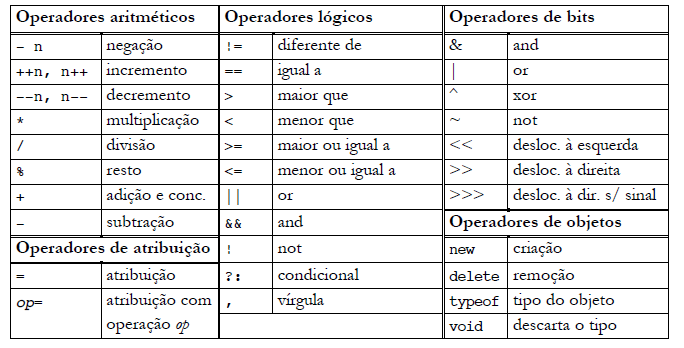

# Curso Alura: Lógica de programação: mergulhe em programação com JavaScript

## Aula 01 - Iniciando com JavaScript

### Aula 01 - Introdução - Vídeo 1

Transcrição
Mônica: Olá, estudante! Boas-vindas ao curso de Lógica de Programação. Sou a Mônica Hillman e serei sua instrutora!

> Audiodescrição: Mônica é uma mulher de pele clara. Tem olhos e cabelos castanhos, mechas loiras e franja. Usa um óculos de grau com armação redonda e piercing no septo. Está com uma camiseta rosa e usa um microfone de mesa. Ao fundo, uma iluminação da cor azul.

Guilherme: Boas-vindas! Que bom te encontrar nesse curso de lógica de programação. Eu sou o Guilherme Lima e também serei seu instrutor.

> Audiodescrição: Guilherme é um homem de pele clara. Tem olhos castanhos, cabelos curtos e barba também castanhos. Usa óculos quadrados de armação preta e está com uma camisa cinza. Ao fundo, uma parede lisa e ao lado direito uma prateleira com livros.

Guilherme: Nesse curso vamos aprender o motivo pelo qual a Lógica de Programação é importante para nossa carreira como pessoas desenvolvedoras de software. Conheceremos conceitos comuns para a maioria das linguagens.

Mônica: Para isso, desenvolveremos um projeto, o jogo do número secreto.

Nele, a pessoa usuária precisará inserir alguns números para adivinhar qual foi o número aleatório gerado pelo computador.

Guilherme: Para desenvolver esse jogo, trabalharemos com variáveis, loops, condicionais, if e else. Conceitos usados no mercado de trabalho.

Além disso, mostraremos como o mercado escreveria este código que também estamos desenvolvendo, seguindo boas práticas de programação.

Vamos começar?

### Aula 01 - Carregando o projeto base - Vídeo 2

Transcrição  
Guilherme: Vamos iniciar nossos estudos!

Fizemos o download do projeto básico Games.js que utilizaremos nesse curso. Por padrão, existem diversas ferramentas que podemos usar para criar o nosso código, editá-lo, compilá-lo e fazer várias outras coisas. Usaremos uma bem conhecida no mercado: o Visual Studio Code.

Na atividade anterior a esse vídeo, você encontra o passo a passo necessário para rodar os códigos do curso. Além disso, também temos conteúdos que comparam outros editores de código e o motivo pelo qual preferimos o VS Code.

Guilherme: Nesse temos alguns arquivos.

- img, vamos usá-lo para editar as imagens do projeto;
- app.js, que ainda não tem nenhuma linha de código;
- index.html, referente a parte visual que vamos explorar em breve;
- style.css, os estilos.

Tudo isso foi criado pelo time da Moni.

Mônica: Isso mesmo, Gui! Como o HTML e o CSS não são linguagens de programação e esse é o foco desse curso, focaremos no app.js.

**Entendendo o Jogo do Número Secreto**  
Guilherme: Na pasta do projeto, clicamos com o botão direito no arquivo index.html e abri-lo no navegador. Feito isso, na tela visualizamos o desenho de um robô e ao lado o texto "Você acertou! Você descobriu o número secreto".

Vamos entender melhor o que faremos nesse curso. Para isso, darei uma folha escrita "número secreto" e uma caneta para que a Môni escolha um número entre 1 e 100 sem me mostrar.

Mônica: Pronto!

Guilherme: Agora, vou fazer alguns chutes. O número secreto é 42?

Mônica: Não, é menor!

Guilherme: É 20?

Mônica: É maior que 20.

Guilherme: Então é 30?

Mônica: Na verdade, é menor.

Guilherme: 25, 28,29?

Mônica: É 29!

Guilherme: Descobrimos o número secreto! Nosso desafio é criar um jogo de adivinhação, exatamente como fizemos.

Para isso, será necessário que o programa escolha um número secreto e a gente interaja com a pessoa que jogará, sempre perguntando qual número ela acha que é. Nisso, a pessoa irá fazer os chutes e daremos dicas se o número é maior ou menor.

**Começando a criação do código**  
Então, no Visual Studio Code vamos começar a escrever o código. Apertamos Ctrl+ B para visualizarmos apenas o app.js.

No navegador, repare que quando o jogo começa não é exibido nada. Queremos exibir uma mensagem na tela. Na programação existem diversos comandos, funções, atalhos e ferramentas que utilizamos para resolver esse desafio.

Usaremos um código em Javascript, vamos entender um pouco sobre os padrões e como ele funciona.

Para passar uma mensagem para a pessoa que iniciou o jogo, usaremos a palavra alert seguido de parênteses.

Lembrando que usamos alert e não alerta, pois o Javascript foi desenvolvido utilizando o idioma inglês.

Ao fazer isso, repare que o cursor fica entre os parênteses. Isso significa que podemos passar uma mensagem nesse espaço. Porém, existe uma regra.

Para passar essa mensagem, adicionamos aspas.

Mônica: No caso do Javascript podemos usar tanto aspas simples como duplas. Sendo assim, a única preocupação é em manter sempre uma padronização em todo o código. Se você começar usando aspas simples, mantenha em todo o projeto.

Guilherme: Em algumas linguagens, quando passamos uma mensagem é preciso utilizar aspas duplas, já outras permitem as aspas simples. No Javascript usaremos aspas simples.

Em seguida, passaremos uma mensagem simples.

Mônica: Podemos colocar a mensagem mais tradicional para as pessoas que estão iniciando em programação, "Olá Mundo".

Guilherme: Ótimo! Feito isso, no fim da linha adicionamos ;.

No Javascript, o ponto e vírgula é inserido em um momento específico de interpretação. Esse não é nosso foco agora. No mundo real do desenvolvimento, existem ferramentas que inserem o ponto e vírgula quando nós não o fazemos.

Como não usaremos nada disso, usaremos o ; durante todo o curso. Então, Moni, se eu esquecer, por favor, me lembre.

> alert('Olá mundo');

Mônica: A falta do ponto e vírgula não daria erro no código, mas cada linguagem tem sua particularidade e no Javascript, para identificar que o comando terminou é recomendado utilizar o ponto e vírgula.

> Guilherme: Agora, salvamos o projeto apertando o comando Ctrl + S.

Em seguida, acessamos o aplicativo no navegador e atualizamos apertando "F5". Feito isso, aparece uma mensagem escrita "Olá, Mundo". Clicamos no botão "Ok" e a tela exibe a imagem do robô.

Ficou melhor! Mas, trocaremos a mensagem para "Boas-vindas ao jogo do Número Secreto". Novamente apertamos Ctrl + S para salvar.

> alert('Boas-vindas ao jogo do Número Secreto');

Lembre-se sempre de salvar todas as alterações de código!

Atualizamos a página e visualizamos a nova mensagem. Clicamos em "Ok" e a tela é exibida.

### Aula 01 - Exibindo mensagens na tela - Vídeo 3

Transcrição  
Guilherme: Môni, o número que você havia escrito era mesmo 29?

Mônica: Sim!

Guilherme: Que bacana! Te pedi para memorizar esse número, pois precisaremos desse mesmo conceito na programação. Não queremos que o computador mude o número ou esqueça dele, certo?

Mônica: O jogo deve ser justo.

Guilherme: Exatamente! Então, para conseguirmos armazenar informações no programa, utilizamos um conceito chamado variáveis.

**Criando variáveis**  
Guilherme: Em cada linguagem de programação, há uma forma diferente de criar uma variável. No Javascript, para criarmos variáveis e armazenar valores nelas, usamos a palavra-chave let.

Escrevemos isso no app.js, na linha abaixo de alert(). Isso significa que reservaremos um espaço na memória para guardar uma informação.

O conteúdo que queremos armazenar é o número secreto. Para isso, existe um padrão para declarar as variáveis, então, após let, escrevemos numeroSecreto. Sem acento e com a primeira letra da segunda palavra em maiúsculo.

Mônica: Também precisamos considerar o sentido prático do nome da variável e de outros conceitos que aprenderemos no decorrer do curso. Poderíamos colocar simplesmente número, mas seria mais útil usar NúmeroSecreto, sugerindo que esse é o número que queremos acertar no jogo.

Guilherme: Ótimo ponto! Quando pensamos no desenvolvimento de software de um programa, os nomes que atribuímos, especialmente para as variáveis e para outros conceitos, precisam ser claros.

As outras pessoas que forem trabalhar com esse projeto precisam saber o que está acontecendo no código.

Mônica: Até porque teremos muitos números no código, como os usados na tentativa de acerto, o número secreto e, se você quiser tornar o jogo mais complexo, outras variáveis que também serão números.

Guilherme: Vou utilizar o seu exemplo e definir o número secreto como 29. Para isso, na mesma linha de código, adicionamos espaço, o sinal de igual e o número 29.

```JavaScript
alert('Boas-vindas ao jogo do número secreto');  
let numeroSecreto = 29;
```

Dessa forma, temos o número secreto armazenado. O próximo desafio será perguntar para a pessoa qual é o valor do número secreto.

Se voltarmos no navegador, repare que o alert é responsável por exibir uma mensagem na tela. Não existe um campo para escrevermos o número secreto.

Após clicar em "Ok" a tela do fim do jogo aparece. Para usarmos um comando que possamos fazer uma pergunta, ou pedir para a pessoa chutar um número, usaremos o comando prompt.

Adicionamos parênteses, aspas simples e escrevemos a mensagem Escolha um número entre 1 e 30.

```JavaScript
alert('Boas-vindas ao jogo do número secreto');  
let numeroSecreto = 29;  
prompt('Escolha um número entre 1 e 30');
```

Note que, sempre que estamos lidando com mensagens ou textos, usamos aspas simples.

Mônica: Inclusive, quando definimos uma variável para receber um número, não utilizamos aspas, inserimos o número diretamente. Dessa forma, o JavaScript interpreta esse 29 como um número e não como texto.

Guilherme: Salvamos o código e voltamos no navegador. Ao atualizar a página, aparece a mensagem se boas-vindas. Ao clicar em"Ok" aparece outra mensagem escrita "Escolha um número entre 1 e 30" com um campo de texto abaixo.

Digitamos 29 e clicamos em "Ok". Feito isso, somos direcionados para a página final.

Mas, será que o nosso jogo está realmente funcionando conforme o esperado? Para isso, mudaremos o número secreto para 5 e definir um intervalo de 1 a 10 e salvamos. Depois, vamos errar propositalmente para verificar o que acontece.

```JavaScript
alert('Boas-vindas ao jogo do número secreto');  
let numeroSecreto = 5;  
prompt('Escolha um número entre 1 e 10');
```

É sempre muito importante testar os erros. Em fase de teste, sempre simulamos alguns caminhos.

Feito isso, voltamos no navegador e atualizamos a página. Clicamos no "Ok" de boas-vindas e chutamos o número 4. Ao clicar em "Ok" encontramos um bug no nosso jogo. A mensagem exibida ainda é "Parabéns, você descobriu o número secreto".

Vamos corrigir esse problema no próximo vídeo!

### Aula 01 - Comparando variáveis - Vídeo 4

Transcrição  
Guilherme: Moni, será mesmo que estamos comparando os valores inseridos no prompt com o número secreto?

Mônica: Acho que não, pois quando testamos inserindo o número 4, ainda assim ganhamos o jogo. E isso não deveria acontecer.

Guilherme: Então, vamos corrigir isso!

Para realizarmos uma comparação, existe um comando em JavaScript que podemos utilizar para verificar se um valor é igual a outro.

Mônica: Neste caso, não seria de fato uma comparação, mas sim uma condição, certo?

Guilherme: Exato! Então, damos espaço no código e no fim escrevemos if, seguido de espaço.

Agora, precisaremos seguir uma regra do JavaScript, que é adicionar parênteses e dentro a condição que queremos verificar.

Então, escrevemos numeroSecreto seguido de =. Porém, repare que há algo diferente. Anteriormente, usamos o sinal de igual para atribuir um valor a uma variável. No entanto, quando queremos fazer uma comparação, usamos um sinal de igual duplo ==.

Mas temos um problema. Como vamos comparar o valor do prompt? Afinal, ele não armazena o valor sozinho, certo?

Mônica: Para guardar esse valor precisamos de uma "caixa", que é o conceito de variáveis que acabamos de aprender.

Guilherme: Então, na Linha 3, antes de prompt, escrevemos let, pois quero que o valor digitado seja armazenado em algum lugar. Também precisamos de um nome para essa variável, que nesse caso será chute. Em seguida, adicionamos o sinal de igual.

```JavaScript
alert('Boas-vindas ao jogo do número secreto');
let numeroSecreto = 5;
let chute = prompt('Escolha um número entre 1 e 10');
```

Agora conseguimos comparar. Então, na linha 5, se o chute for igual ao número inserido, podemos comparar. Então, após o sinal de igual duplo, escrevemos chute.

Assim, se o número digitado for igual ao número secreto, algo acontecerá. Caso for verdade, adicionamos chaves no código.

Repare que ao adicionar uma chave o VS Code autocompleta com a segunda. Esse software possui vários atalhos, especialmente quando estamos escrevendo código em JavaScript.

Dentro das chaves pressionamos "Enter". Tudo o que escrevermos nesse espaço entre as chaves será executado apenas se o número secreto for igual ao chute.

Existe outro comando em JavaScript onde podemos testar e visualizar, como se fosse um ambiente quase secreto para desenvolvedoras e desenvolvedores. Esse ambiente é chamado de console.log().

Então, nas chaves escrevemos console.log('Isso ai! Você descobriu o número secreto (5)').

```JavaScript
alert('Boas-vindas ao jogo do número secreto');
let numeroSecreto = 5;
let chute = prompt('Escolha um número entre 1 e 10');

if (chute == numeroSecreto) {
        console.log("Isso aí! você descobriu o número secreto (5)");
}
```

Lembrando que quando usamos o if na linha 5, essa instrução específica não leva ponto e vírgula. Mas, quando criamos o código que será executado, caso a condição seja verdadeira, nós temos essa mensagem.

Salvamos o código e abrimos o navegador para testar. Atualizamos a página e clicamos em "Ok". Depois, chutamos o número 5, acertaremos propositalmente. Feito isso, aparece a mensagem Você acertou!".

Mônica: Gui, mas essa imagem irá aparecer mesmo se errarmos, porque configuramos como condição para exibir uma mensagem no console, mas não na tela.

Guilherme: Nós vamos corrigir isso até o final do jogo! A minha única dúvida nesse momento é onde está essa mensagem que colocamos no console.log.

Para isso, clicando com o botão direito em qualquer parte da tela do navegador e depois em inspecionar. Feito isso, encontramos uma parte do HTML e do CSS correspondente ao nosso código. Isso significa que é possível conseguirmos ver o código HTML e CSS de outras aplicações também.

Repare que na lateral superior direita encontramos um botão chamado "Console". Ao clicá-lo, encontramos o texto "Isso ai! Você descobriu o número secreto (5)".

Agora, testaremos errando propositalmente. Dessa vez, digitamos o número 3. Ao clicar em "Ok" repare que a mensagem não é exibida na janela de inspeção.

Podemos inserir algumas dicas para a pessoa, como, por exemplo, indicar que ela errou o número. Faremos isso a seguir!

#### Aula 01 - Alert e prompt

Uma pessoa está desenvolvendo a tela de boas vindas de uma aplicação feita com JavaScript e criou o seguinte código:.

```JavaScript
let mensagemDeBoasVindas = 'Boas vindas ao App';
alert('mensagemDeBoasVindas');
```

Com base nisso, analise as afirmações abaixo e marque apenas as verdadeiras em relação ao código mostrado acima.

Ao executar o programa, uma caixa será exibida com a mensagem mensagemDeBoasVindas.

Isso aí… Para a mensagem armazenada na variável seja exibida, é necessário remover as aspas simples, deixando o código do alert da seguinte forma: alert(mensagemDeBoasVindas).

O problema nesse código é que a variável mensagemDeBoasVindas não está sendo utilizada corretamente ao ser exibida na função alert.

No código apresentado, a linha alert('mensagemDeBoasVindas') está passando um texto e a variável não está sendo utilizada de forma correta.

#### Aula 01 - Alterando o valor das variáveis

Em um projeto prático dentro do curso "Iniciando com JavaScript", você está desenvolvendo um jogo no qual os usuários têm que adivinhar o número secreto. Você escreveu um código que mostra uma mensagem de boas-vindas aos jogadores, pedindo que escolham um número entre 1 e 10, e apresenta uma resposta se eles acertarem, conforme a sequência a seguir:

```JavaScript
 alert('Boas-vindas ao jogo do número secreto')
 let chute = prompt('Escolha um número entre 1 e 10')
 let numeroSecreto = 4
 if (chute == numeroSecreto) {
    alert('Acertou')
 }
```

Qual variável você precisaria alterar para mudar o número secreto a cada rodada do jogo?

> let numeroSecreto = 4

Esta linha de código está relacionada diretamente à modificação do número secreto.

#### Aula 01 - Onde está o bug?

Luis é apaixonado por tecnologia e está dando seus primeiros passos no mundo da programação. Para praticar lógica de programação, ele decidiu desenvolver um sistema de login de usuário único em que é necessário apenas informar a senha para ver o conteúdo do restante do projeto.

No entanto, ao testar o seu projeto, percebeu que não importava a senha passada para o sistema, o acesso sempre era permitido.

Sabendo que você também está estudando lógica de programação, Luis pediu sua ajuda para que vocês consigam encontrar o bug juntos. Para isso, ele disponibilizou o código que escreveu:

```JavaScript
let senhaDoSistema = "senhaTeste!";
let senha = prompt("Digite a senha do sistema:");
if (senha = senhaDoSistema){
    alert("Acesso ao sistema garantido");
}
```

De acordo com o código disponibilizado, qual é o problema?

O código apresenta um bug dentro da estrutura condicional proposta, pois o operador de comparação não está sendo utilizado.

O operador de comparação é o ==, no entanto, dentro da estrutura condicional está sendo utilizado o de atribuição =.

### Aula 01 - Desafio: hora da prática

Praticar a lógica de programação, incluindo conceitos como variáveis, condicionais (if), alert, prompt, é essencial para seu desenvolvimento. Esses fundamentos fornecem a base para resolver problemas de forma estruturada, tomar decisões no código, criar interações controladas e interagir eficazmente com as pessoas.

Compreender esses conceitos não apenas facilita o aprendizado de novas linguagens e tecnologias, mas também capacita você a criar soluções inovadoras, depurar eficientemente e manter a qualidade ao longo do ciclo de vida do software. Portanto, investir tempo nesses princípios desde cedo é fundamental para construir uma trajetória bem-sucedida no campo da programação.

Pensando nisso, criamos uma lista de atividades (não obrigatórias) focada em prática para melhorar ainda mais sua experiência de aprendizagem. Bora praticar então?

Desafios  

1. Mostre um alerta com a mensagem "Boas vindas ao nosso site!".

2. Declare uma variável chamada nome e atribua a ela o valor "Lua".

3. Crie uma variável chamada idade e atribua a ela o valor 25.

4. Defina uma variável numeroDeVendas e atribua a ela o valor 50.

5. Defina uma variável saldoDisponivel e atribua a ela o valor 1000.

6. Exiba um alerta com o texto "Erro! Preencha todos os campos"

7. Declare uma variável chamada mensagemDeErro e atribua a ela o valor "Erro! Preencha todos os campos" Agora exiba um alerta com o valor da variável mensagemDeErro.

8. Use um prompt para perguntar o nome do usuário e armazená-lo na variável nome.

9. Peça ao usuário para digitar sua idade usando um prompt e armazene-a na variável idade.

10. Agora, caso a idade seja maior ou igual que 18, exiba um alerta com a mensagem "Pode tirar a habilitação!".

Caso precise de ajuda, opções de solução das atividades estarão disponíveis na seção “Opinião da pessoa instrutora”.

Opinião do instrutor

Para te ajudar a verificar seus códigos, deixo disponibilizado de forma conjunta com a identificação dos 10 números iniciais quando foram propostos, uma possível resolução dos 10 desafios [neste link](https://github.com/alura-cursos/logica-js/tree/desafio_1) para você construir ou validar suas soluções.

Boa sorte nos estudos!

### Aula 01 - Para saber mais: documentação

A leitura da documentação oficial de uma linguagem de programação é crucial para que uma pessoa desenvolvedora de software possa utilizá-la de forma eficaz.

No caso do JavaScript, essa documentação fornece uma ampla gama de informações, incluindo conceitos sobre sintaxe, as bibliotecas e as funcionalidades disponíveis na linguagem.

Alguns links úteis para a documentação oficial do JavaScript incluem:

- A documentação da [linguagem de programação JavaScript (MDN)](https://developer.mozilla.org/pt-BR/docs/Learn/JavaScript/First_steps/What_is_JavaScript)
- [Guia de JavaScript:](https://www.alura.com.br/artigos/javascript) o que é e como aprender a linguagem mais popular do mundo?

Ao ler a documentação oficial, temos uma compreensão mais profunda da linguagem e de suas funcionalidades. Isso facilita a escrita de códigos mais limpos, claros e seguros. A documentação também pode ajudar o desenvolvedor ou desenvolvedora a economizar tempo, além de evitar a necessidade de pesquisar em fóruns ou outras fontes de informação não confiáveis.

### Aula 01 - O que aprendemos?

Aqui está um resumo dos tópicos ensinados nesta aula:

- Preparamos o ambiente de desenvolvimento com a instalação do Visual Studio Code para criar programas utilizando a linguagem JavaScript;

- Entendemos o conceito de variável para guardar informações, como números ou palavras, para usar mais tarde no nosso programa;

- Usamos o alert para exibir uma mensagem passando algumas instruções sobre o programa e usamos o prompt para interagir com a pessoa permitindo inserir um valor e armazenando em uma variável;

- Criamos um if, que é uma instrução em programação que permite ao computador tomar decisões ao executar um bloco de código apenas se uma condição específica for verdadeira.

Na próxima aula:  
Vamos seguir as boas práticas de programação e aprofundar ainda mais nossos conhecimentos!

## Aula 02 - Condicionais e Concatenação

### Aula 02 - Else e comentários - Vídeo 1

Transcrição  
Guilherme: O próximo desafio é criar uma condição que nos permita exibir uma mensagem para que a pessoa usuária entenda se acertou ou errou.

Só para reforçar o que estamos aprendendo,no Javascript, existe uma forma de escrever um texto sem que esse texto seja interpretado como um comando. Seja o alert, o let, o if que escrevemos anteriormente, todos são interpretados de maneira diferente pelo código, cada um tem uma cor de fonte correspondente ao que eles fazem.

Para eu conseguir criar um trecho de código que seja interpretado como um comentário, que o Javascript não entenda como comando, usarei o sinal de barra dupla//. Se escrevermos algo depois deste sinal //, salvarmos e executarmos o código, veremos que não influencia em nada no nosso projeto.

Existem palavras que o Javascript entende como um comando ou código, ou seja, reconhece como uma instrução a ser executada. E existem outros termos ou símbolos que ele não entende ou reconhece.

Eu quero fazer um comentário nesse código para justamente informar o que nós estamos comparando. O comando if em português significa "Se". Ou seja, estamos falando "se o chute for igual ao número secreto, podemos executar alguma coisa. Vamos deixar um comentário acima do if informando isso.

```JavaScript
// se chute for igual ao número secreto
if (chute == numeroSecreto) {
    console.log('Isso ai! Você descobriu o número secreto (5)');
}
```

Mas, se queremos que uma ação seja executada quando a condição não for alcançada, ou seja, caso o número não seja igual ao número secreto, precisamos de um comando que faça esse "contraponto".

Mônica: Para fazer isso também precisamos de uma palavra especial. A gente pode escrever, por exemplo, o termo "senão". Dá pra ver até pela cor azulada que ele não vai funcionar. O if é um comando que funciona e está com uma cor rosada, como ele está considerando o "senao" como azul, é como se estivéssemos criando alguma coisa nova.

Guilherme: No Javascript, para representar o "se não", usamos a palavra else para isso, "else" em português significa "se não".

Ao escrevermos "else", note que ele mudou a cor, a fonte está com uma cor rosada agora.

Quando escrevemos else, precisamos criar um bloco de instruções, assim como fizemos com if. Por exemplo, posso exibir um alerta, um alert, informando que a pessoa errou. Neste caso, a mensagem será: "Você errou :(".

```JavaScript
// se chute for igual ao número secreto
if (chute == numeroSecreto) {
    console.log('Isso ai! Você descobriu o número secreto (5)');
} else {
    alert('Você errou :(')
}
```

Podemos salvar e atualizar a página do navegador para testarmos o caminho feliz e o caminho triste.

No navegador, ao digitarmos, por exemplo, "3" no campo de texto da caixa de "Escolha um número entre 1 e 10". Vai aparecer a mensagem "Você errou :(".

Podemos fazer uma coisa diferente, em vez de exibir no console quando a pessoa acertar o número, que tal exibir um alerta assim como fazemos quando a pessoa erra?

Mônica: Acredito que é até melhor! Isso tornará a interação ainda mais amigável e interativa. Porque olhe tudo que a pessoa teve que fazer para visualizar o que está no console. Ele é uma ferramenta aprimorada para visualizar se há alguma interação no seu código, se está funcionando, se você conseguiu resgatar um valor corretamente.

Porém, não é recomendado para fazer essa interação com o usuário porque é uma ferramenta da pessoa desenvolvedora e não uma ferramenta direta para o usuário. Isso é do que se trata a parte do console que estamos observando.

Guilherme: Você me deu uma ideia. O que você acha se colocarmos no console apenas o valor do número secreto?

Por exemplo, vou jogar com a minha família. Dou uma olhada no console, vejo qual é o número secreto e chamo as pessoas. Legal, né? Gostei dessa ideia.

Portanto, o que vou fazer? Irei fazer uma troca aqui. Vou substituir console.log por alert e quando definimos o número secreto, vou exibir no console apenas o valor do número secreto. Com o console.log(). Como se fosse um recurso que só nós conhecemos.

E aqui tem algo diferente. Se colocarmos nesse console.log(), entre aspas simples, 'numeroSecreto', veja o que vai acontecer no nosso programa.

```JavaScript
alert('Boas vindas ao jogo do número secreto');
let numeroSecreto = 5;
console.log('numeroSecreto')
let chute = prompt('Escolha um número entre 1 e 10');
// se chute for igual ao número secreto
if (chute == numeroSecreto) {
    alert('Isso ai! Você descobriu o número secreto (5)');
} else {
    alert('Você errou :(')
}
```

Ao executarmos a aplicação no navegador, só apareceu no console a informação:

numeroSecreto

Por quê? O que fizemos de diferente aqui?

Mônica: Você colocou as aspas simples, então ele está interpretando como um texto. Até me lembro da questão do número que comentei. Quando usamos, não usamos aspas para ele entender que é um número. E nesse console.log() é o mesmo caso. Queremos pegar o valor da variável e não um texto em si.

Guilherme: Correto. Sempre que mencionamos especificamente a variável, não precisamos usar as aspas simples ,certo?

Mônica: Também gostaria de fazer uma observação, pois ele já mostrou o número secreto escrito antes de acertarmos ou erramos. Porque o JavaScript lê o nosso código linha por linha. O console.log() estava sendo lido antes do pedido de escolher um número.

Guilherme: Vamos executar mais uma vez. Vamos atualizar.

Agora apareceu o número 5 no console. Eu vi antes das demais pessoas. Vou palpitar o número 5. Olha aí, acertei. Venci as demais pessoas.

Vamos testar agora o caso que não dá certo. E ele dá a mensagem informando que a pessoa errou.

Legal. O próximo passo que precisamos realizar no nosso código é o seguinte: caso a pessoa erre, queremos dar uma esperança para ela no nosso projeto.

Todo mundo pode ter a capacidade de acertar o jogo do número secreto, assim como foi o meu caso.

Mônica: Sim. Você fez várias tentativas e eu fui dando dicas até chegar no resultado correto.

Guilherme: Então, é isso que vamos fazer na sequência!

### Aula 02 - Concatenação - Vídeo 2

Transcrição  
Mônica: Gui, nós já testamos várias vezes o caminho feliz e o caminho triste e todas as vezes o número secreto era 5. Para deixar mais empolgante, vamos trocar isso? O que você acha?

Guilherme: Vamos trocar sim! O que você sugere, Moni?

Mônica: Podemos mudar para o número 4, que é o meu número de sorte.

Guilherme: Beleza. Substituiremos o número 5 pelo número 4.

Vamos salvar e executar no navegador para verificar como a nossa aplicação está funcionando.

Com frequência nós temos que ficar atualizando a página, notou? Vamos corrigir isso mais adiante.

De volta ao nosso jogo, a mensagem de "Boas-vindas ao jogo do número secreto" aparece. Vamos pelo caminho feliz primeiro. A dica que adicionamos em nosso código foi exibida no console, ficou incrível, não é?

Mas apareceu a seguinte mensagem, o que ficou estranho já que mudamos o número secreto para 4:

Isso ai! Você descobriu o número secreto (5)

Vamos arrumar isso.

Percebe como, apesar de nós alterarmos uma linha específica no nosso código, esperávamos que outras partes deveriam ter sido alteradas automaticamente, como a linha 8 no alert.

No momento, estamos colocando o número manualmente nesse alert. Para funcionar como queremos, devemos alterar manualmente aqui também de 5 para 4.

alert('Isso ai! Você descobriu o número secreto 4');
Copiar código
Nós não deveríamos ter que alterar manualmente o valor do número secreto no nosso projeto. Vamos supor que o número secreto mudou. Jogamos uma semana inteira com toda a família, ganhamos todas as vezes porque sabemos qual é o número secreto. Agora o número secreto será 8. Teríamos que ir lá no código e alterar novamente para o número 8.

Isso não é ideal, temos o que costumamos chamar de um acoplamento muito grande: nosso código está muito interligado, uma alteração feita deveria refletir automaticamente em outras partes. Então nós precisamos fazer uma pequena mudança.

Precisamos, de alguma forma, mudar esse trecho que informa qual é o número secreto. Queremos que o valor presente nessa parte do código fosse o valor do número secreto que foi definido na parte de cima do código. Então vou escrever aqui: numeroSecreto.

> alert('Isso ai! Você descobriu o número secreto numeroSecreto');

Porém, se rodarmos o jogo novamente, o número secreto é 8, mas quando acertamos, aparece a mensagem:

Isso ai! Você descobriu o número secreto numeroSecreto

Isso não funcionou, Moni. Como podemos fazer para que sejamos capazes de combinar textos com valores de variáveis e até com diferentes números?

Template Strings
Mônica: Para juntarmos textos com valores de variáveis e até com números diferentes, existem várias maneiras de fazer isso em Javascript , e nós vamos optar por uma que se chama Template Strings.

Guilherme: O primeiro passo dessa modificação é substituir as aspas simples por crases, também conhecida como acento grave (`).

Mônica: Quando insiro acentos graves, perceba que nada parece ter mudado na linha 8. Ele continua interpretando a linha como se fosse um texto, uma string. Precisamos adicionar mais um detalhe: antes do nome da variável numeroSecreto, vamos inserir um sinal de cifrão ($) e colocar a variável dentro de chaves {}.

> alert(`Isso ai! Você descobriu o número secreto ${numeroSecreto}`);

Nosso código da condição if vai ficar assim:

```JavaScript
// se chute for igual ao número secreto
if (chute == numeroSecreto) {
    alert(`Isso ai! Você descobriu o número secreto ${numeroSecreto}`);
} else {
    alert('Você errou :(')
}
```

Guilherme: Agora, vamos salvar as alterações e verificar se funciona corretamente.

Vamos mais uma vez ao navegador para testar. Vamos testar o caminho feliz. O número secreto será 8. O que esperamos? Que seja exibida uma mensagem dizendo "Você descobriu o número secreto 8".

E foi o que apareceu ao colocarmos o número 8.

Isso ai! Você descobriu o número secreto 8

Agora, vamos alterar o número secreto para 4, let numeroSecreto = 4;. Salvar e testar novamente no navegador.

Ai inserirmos o número 4, ele exibe a seguinte mensagem:

Isso ai! Você descobriu o número secreto 4

Mônica: Ótimo! Agora, a nossa mensagem está bastante dinâmica.

Continuaremos no próximo vídeo.

### Aula 02 - Live server - Vídeo 3

Transcrição  
Guilherme: Eu gostei do aspecto dinâmico que deixamos na frase que informa o número secreto do nosso jogo.

Mas tem um ponto que me deixa um pouco triste no nosso jogo, todas as vezes que fazemos uma alteração no Javascript, precisamos atualizar a página antes de poder começar a jogar.

Mônica: E o pior é que é muito comum esquecermos de atualizar e, por isso, ao testar acharmos que o que fizemos no código não está funcionando. Tem como facilitar isso?

Guilherme: Vamos solucionar isso e facilitar a vida das pessoas.

O que nós queremos? Queremos modificar nosso código e quando acessarmos o navegador já estar com o código atualizado. Assim, quando formos ao navegador, teremos a versão mais recente possível do nosso código.

Há várias ferramentas que podem nos auxiliar com isso. No Visual Studio Code, que é o editor que recomendamos para o uso, o que farei é o seguinte:

Note que, na barra lateral do VS Code, temos a funcionalidade Extensions (Extensões) que também pode ser acessada com o atalho "Ctrl + Shift + X".

Ao clicar no menu "Extensions", será aberto um painel onde podemos buscar extensões para o VS Code.

Mônica: Extensões são algo a mais que colocaremos dentro do VS Code para facilitar nossa vida. É muito comum as pessoas usarem extensões no navegador também para facilitar algum processo durante a navegação.

Guilherme: Uma das extensões que usaremos no VS Code chama-se Live Server. Vamos pesquisar por "live server" no campo de busca de extensões.

Podemos clicar em "Live Server" e, em seguida, clicar no botão "Install" para instalar. Será instalada, e se bem me lembro, será solicitado um recarregamento do Visual Studio Code. Sei que seria mais fácil mencionar pelo ícone do Servidor ao Vivo que usaremos.

Mônica: O Live Server que usaremos é a extensão criada pelo Ritwick Dey, ela é a opção que tem mais downloads, então fica em primeiro na lista de busca de extensões.

O VS Code não pediu para reiniciar, já diz que está habilitado. Ótimo!

Guilherme: Agora, podemos clicar em "Explorer" ou usar o atalho "Ctrl + Shift + E" para visualizarmos a estrutura de todos os arquivos que temos.

No Explorer, clicaremos com o botão direito no arquivo index.html e selecionaremos a opção "Open with Live Server".

O que isso vai fazer? Isso abrirá um servidor local. Se você não sabe o que é um servidor, tudo bem. Não é nosso foco no momento. Mas ele abrirá um servidor que sempre atualizará automaticamente sempre que fizermos uma alteração no HTML, Javascript ou em qualquer outra parte da aplicação.

Ao clicarmos em "Open with Live Server", ele vai abrir uma página do navegador.

Já podemos também abrir o console de inspeção dessa página. No console, está sendo exibida uma mensagem informando que ele não encontrou o ícone do Live Server. Isso não é um problema. Podemos corrigir isso mais tarde. E veja só, o número 4 está sendo exibido no console. Não vou jogar. Só vamos mudar os valores Vou mudar o valor de numeroSecreto para 2, por exemplo. Podemos salvar o código.

Mônica: Note que, agora, o navegador que abrimos com o Live Server exibe uma série de números na barra de endereços, não mais o diretório de pastas, assim fica até mais fácil para identificarmos que é essa página que devemos usar daqui em diante. Na barra de endereços está sendo exibido: 127.0.0.1:5500/index.html.

Guilherme: Ao testarmos a aplicação, ele reconheceu a alteração que fizemos e já atualizou automaticamente.

Dessa forma, tudo que alterarmos no código será visto.

Mas, como o Live Server faz isso? Não precisamos saber especificamente os detalhes aprofundados, mas se pedirmos para inspecionar o código, observamos que na parte de script tem uma linha escrita assim: <!-- Code injected by live server -->, ou seja, "Código injetado pelo Live Server".

Este código que ele injeta é um código Javascript com o qual não precisamos nos preocupar no momento. Esse código é responsável por verificar as alterações, as mudanças que fazemos em nosso projeto para mantê-lo atualizado.

Para garantir que de fato está atualizando, vamos alterar o número secreto novamente. Agora o número secreto será 9. Podemos salvar o código e ir para o navegador que abrimos com o Live Server.

Perceba que o navegador já carregou a aplicação sem precisarmos atualizar. Ele executou o alerta automaticamente. E se acessarmos o console veremos a mensagem com o número nove. Tudo certo, a aplicação está funcionando corretamente.

Continuaremos no próximo vídeo!

#### Aula 02 - Alterando a mensagem do alert

Você é uma pessoa desenvolvedora de software em uma clínica médica chamada Médica Voll. A empresa deseja que você crie um pequeno jogo de adivinhação para seus pacientes enquanto eles estão na sala de espera. Então, você decide criar um jogo do número secreto usando JavaScript, conforme a seguir:

```JavaScript
alert('Bem-vindo ao jogo do número secreto')
let chute = prompt('Escolha um número entre 1 e 10')
let numeroSecreto = 4
console.log(chute == numeroSecreto)
if (chute == numeroSecreto) {
    alert('Acertou')
} else {
    alert('O número secreto era ' + numeroSecreto)
}
```

Dada essa estrutura básica de código que você criou, como você modificaria a mensagem do alerta para incluir o número que o usuário escolheu, caso não acertasse o número secreto? Escolha a alternativa correta:

Obs: Note que o "+" usado serve como uma alternativa ao `-> template de strings já apresentado para realizarmos concatenação de strings/caracteres/valores de varíaveis no JavaScript.

> alert('O número secreto era ' + numeroSecreto + ', mas você escolheu ' + chute);

Este código corretamente concatena o número secreto e a escolha do paciente na mensagem de alerta.

#### Aula 02 - Detran

Você é uma pessoa desenvolvedora de software que desenvolve aplicações para o Detran, que é o órgão responsável pela fiscalização e regulamentação do trânsito, habilitação de condutores, registro e licenciamento de veículos no Brasil.

A idade mínima para dirigir no Brasil é 18 anos. Sabendo disso, uma equipe criou o seguinte programa:

```JavaScript
let idade = prompt("Digite sua idade:");
if (idade >= 18) {
  console.log("Você é maior de idade.");
} else {
  console.log("Você é menor de idade.");
}
```

Com essa base, analise as afirmações abaixo e marque apenas as verdadeiras.

Caso a idade seja igual a 18, a mensagem do console que será exibida será: Você é maior de idade.

Esta afirmação está correta. Se a idade digitada for igual a 18, a condição no if será verdadeira (idade >= 18 é verdadeiro), e a mensagem "Você é maior de idade" será exibida, pois o operador >= inclui o valor 18. O bloco de código dentro do else será ignorado.

Caso a idade seja menor que 18, a mensagem do console que será exibida será: Você é menor de idade.

Esta afirmação está correta. Se a idade digitada for menor que 18, a condição no if será falsa (idade >= 18 é falso), e o fluxo de execução seguirá para o bloco do else, exibindo a mensagem "Você é menor de idade".

#### Aula 02 - Trabalhando com condicionais - Vídeo 5

Trabalhando com condicionais
Próxima Questão

Você é uma pessoa recém-chegada à equipe de desenvolvimento do Jornada Milhas, um site de compra de pacotes de viagens para os principais destinos do mundo.

Como primeira tarefa, sua liderança pediu para que você corrigisse um bug que tem acontecido quando uma pessoa cliente do site tenta utilizar suas milhas do cartão de crédito para obter desconto nos pacotes de viagem. Para isso, foi apresentado o seguinte código:

```JavaScript
let porcentagemDesconto = 0;
if(quantidadeMilhas > 5000){
    porcentagemDesconto = porcentagemDesconto + 10;
}
if(quantidadeMilhas >= 30000){
    porcentagemDesconto = porcentagemDesconto + 20;
} else {
    porcentagemDesconto = 0;
}
```

Para te ajudar a compreender a origem do bug, sua liderança explicou a regra de negócio utilizada para compras de pacotes de viagens com milhas:

Pessoas com uma quantidade de milhas inferior a 5.000 não recebem desconto.
Pessoas com uma quantidade de milhas igual ou superior a 30.000 recebem 20% de desconto.
Pessoas com uma quantidade de milhas superior a 5.000, mas inferior a 30.000, recebem 10% de desconto.
Mas, segundo relatos de clientes, ao tentar utilizar o desconto referente a 5.000 milhas, não ocorre nenhum desconto. Já clientes com mais de 30.000 milhas estão recebendo desconto excedente ao que deveriam receber.

Como você poderia modificar o código para que ele funcione corretamente? Selecione a opção correta:

Fazendo a utilização de um bloco if dentro do bloco else, como:

```JavaScript
let porcentagemDesconto = 0;
if(quantidadeMilhas >= 30000){
    porcentagemDesconto = porcentagemDesconto + 20;
} else {
    if(quantidadeMilhas > 5000){
    porcentagemDesconto = porcentagemDesconto + 10;
}
}
```

A utilização do bloco if dentro do bloco else garante que, caso a quantidade de milhas for superior a 30000, o desconto será de 20%, e caso não for superior a este valor, mas for superior a 5000, o desconto será de 10%. Para o caso da quantidade de milhas ser inferior a 5000, o desconto permanecerá zerado, pois não existe a quantidade mínima para ganhar desconto.

#### Aula 02 - Faça como eu fiz: console.log

O console.log é uma função muito importante em linguagens de programação, especialmente quando se trabalha com JavaScript. Sua principal função é imprimir mensagens no console do ambiente de desenvolvimento, o que permite testar informações relevantes durante a execução de um programa.

Sua vez: inclua comandos console.log em diferentes partes do código para verificar o fluxo do programa, os valores das variáveis e outras informações relevantes durante a fase de desenvolvimento.

Ver opinião do instrutor
Opinião do instrutor

No código a seguir temos uma sugestão da inclusão do comando console.log adicionado para verificar se os valores estão sendo atribuídos corretamente às variáveis e se as condições estão sendo avaliadas como esperado. Confira:

```JavaScript
alert('Boas vindas ao jogo do número secreto');
// Adicione um console.log para verificar o valor de "chute" após a entrada do usuário
let chute = prompt('Escolha um número entre 1 e 10');
console.log('Valor do chute:', chute);
let numeroSecreto = 4;
// Adicione um console.log para verificar a comparação entre "chute" e "numeroSecreto"
console.log('Resultado da comparação:', chute == numeroSecreto);
if (chute == numeroSecreto) {
    alert('Acertou');
} else {
    // Adicione um console.log para verificar o valor de "numeroSecreto" quando o jogador erra
    console.log('Valor do número secreto:', numeroSecreto);
    alert('O número secreto era ' + numeroSecreto);
}
```

É importante lembrar que, quando o projeto ficar disponível para todas as pessoas, o que chamamos no contexto de software de ambiente de produção, os comandos console.log devem ser removidos ou desabilitados, pois podem causar problemas de desempenho e segurança.

### Aula 02 - Desafio: hora da prática

Programação é prática! Criamos mais uma lista de atividades (não obrigatórias) para você exercitar e reforçar ainda mais seu aprendizado.Bora praticar?

Desafios  
Pergunte ao usuário qual é o dia da semana. Se a resposta for "Sábado" ou "Domingo", mostre "Bom fim de semana!". Caso contrário, mostre "Boa semana!".

Verifique se um número digitado pelo usuário é positivo ou negativo. Mostre um alerta informando.

Crie um sistema de pontuação para um jogo. Se a pontuação for maior ou igual a 100, mostre "Parabéns, você venceu!". Caso contrário, mostre "Tente novamente para ganhar.".

Crie uma mensagem que informa o usuário sobre o saldo da conta, usando uma template string para incluir o valor do saldo.

Peça ao usuário para inserir seu nome usando prompt. Em seguida, mostre um alerta de boas-vindas usando esse nome.

Caso precise de ajuda, opções de solução das atividades estarão disponíveis na seção “Opinião da pessoa instrutora”.

### Aula 02 - Para saber mais: ponto e vírgula no JavaScript
Próxima Questão

No JavaScript, o uso do ponto e vírgula (;) é uma prática recomendada. A linguagem possui um mecanismo chamado "inserção automática de ponto e vírgula" (automatic semicolon insertion - ASI), que tenta adicionar ponto e vírgulas automaticamente em certos pontos do código onde eles são ausentes.

Isso significa que, em alguns casos, o JavaScript tentará "corrigir" a falta de ponto e vírgula inserindo-o automaticamente. No entanto, a interpretação do ASI pode levar a comportamentos inesperados e erros sutis, especialmente quando as regras não são claras.

Portanto, para evitar possíveis problemas e garantir a clareza do código, muitos desenvolvedores preferem adicionar explicitamente ponto e vírgula em seus programas.

Apesar da inserção automática de ponto e vírgula poder ajudar a mitigar erros de sintaxe, é uma boa prática adicionar ponto e vírgula manualmente para evitar ambiguidades e problemas de interpretação. Isso é particularmente importante em situações como quando várias instruções estão em uma mesma linha, ao usar declarações de retorno de valor ou ao minificar o código.

Em projetos colaborativos ou de grande escala, a consistência no estilo de codificação e a clareza do código são cruciais, e o uso explícito de ponto e vírgula contribui para um código mais legível e menos sujeito a erros de interpretação por parte dos programadores e do próprio mecanismo de ASI.

Leitura complementar da [documentação sobre o JavaScript](https://developer.mozilla.org/pt-BR/docs/Web/JavaScript/Reference/Lexical_grammar#automatic_semicolon_insertion).

Quer saber o que a comunidade recomenda? Leia mais neste [link do Stack Overflow](https://pt.stackoverflow.com/questions/3341/utilizar-ou-n%C3%A3o-ponto-e-v%C3%ADrgula-no-fim-das-linhas-em-javascript).

### Aula 02 - O que aprendemos?

**Nesta aula:**  
Utilizamos o console para testar e depurar nosso código, exibindo mensagens e valores durante a execução do programa;

- Aprendemos a utilizar estruturas condicionais (if/else) para criar lógicas que permitem ao programa tomar decisões com base em condições específicas;

- Implementamos um bloco de código para exibir uma mensagem caso o chute do usuário não seja igual ao número secreto;

- Usamos template strings para concatenar o número secreto com o valor armazenado em uma variável e exibir uma mensagem personalizada.

Na próxima aula:
Vamos aprender como trabalhar com estruturas de repetição!

## Aula 03 - Loop e Tentativas

### Aula 03 - Novas condições - Vídeo 1

Transcrição  
Guilherme: Nosso jogo agora está similar ao que fizemos no início, quando você escolheu o número 29. Não tínhamos combinado essa escolha.

Agora, ao errar, exibimos uma mensagem de erro, lembrando da frase "Errou!" Seria interessante fornecer uma dica à pessoa jogadora, concorda? Quando testei isso contigo, você indicou se o número era menor ou maior. Foram dadas dicas até que você encontrasse o número secreto.

Vamos criar essas dicas?

Mônica: Vamos.

Criando as dicas
Arquivo app.js no repositório do GitHub

Guilherme: Primeiramente, precisamos decidir em que ponto do nosso código introduziremos essas dicas. Vamos ao arquivo app.js.

app.js

```JavaScript
alert('Boas vindas ao jogo do número secreto');
let numeroSecreto = 2;
console.log(numeroSecreto)
let chute = prompt('Escolha um número entre 1 e 10');
// se chute for igual ao número secreto
if (chute == numeroSecreto) {
    alert(`Isso ai! Você descobriu o número secreto ${numeroSecreto}`);
} else {
    alert('Você errou :(' )
}
```

Se o palpite coincidir com o número correto, o jogo se encerra; não ocorre mais nada. Caso contrário, poderíamos implementar novas condições para informar se o número secreto é maior ou menor. Concorda com essa abordagem?

Vamos estabelecer mais uma condição dentro do else, podemos remover o alert(). Utilizaremos o if(), abrindo parênteses e inserindo a condição.

Se o número secreto for maior do que o chute, exibimos uma mensagem assim informando que o número secreto é maior. Faremos isso através de um alert(). Usando as aspas simples, que é nosso padrão nesse projeto, escreveria "O número secreto é maior que", e incluiria o valor.

Que tal aplicar uma template string? Usamos: "O número secreto é maior que ${chute}" Usaremos o cifrão, as chaves, a palavra "chute", e fechamos as chaves. Quando lidamos com template strings, empregamos crases e encerraremos a condição com um ponto e vírgula.

app.js

```JavaScript
// código omitido
    } else {
            if (numeroSecreto > chute) {
                    alert(`O número secreto é maior que ${chute}`);
            }
}
```

Se o chute for menor que o número secreto, entramos em outra condição. Após o fechamento das chaves, implementamos mais um else e utilizamos um alert() para informar que o número secreto é menor.

Para manter a padronização, o termo "chute" será sempre a primeira variável. Vamos alterar o código anterior. Portanto, se o chute for maior que o numeroSecreto o número secreto é menor:

app.js

```JavaScript
// código omitido
    } else {
            if (chute > numeroSecreto) {
                    alert(`O número secreto é menor que ${chute}`);
            } else {
                    alert()
            }
}
```

Se chutarmos o número 3, por exemplo, é exibida a mensagem informando que o número secreto é menor. Caso não seja menor, ele vai para a condição else(), onde vamos inserir uma mensagem parecida com a anterior.

Mônica: O que temos na linha 11, agora vamos copiar e colar na linha 13 mas com a mensagem informando que o número secreto é maior.

app.js

```JavaScript
// código omitido
} else {
        if (chute > numeroSecreto) {
                alert(`O número secreto é menor que ${chute}`);
        } else {
                alert(`O número secreto é maior que ${chute}`);
        }
}
```

Guilherme: Vamos testar isso? Vamos definir o número secreto como 5 para facilitar a lembrança se é maior ou menor. Isso em let numeroSecreto onde vamos inserir o valor 5:

app.js

```JavaScript
// código omitido
let numeroSecreto = 5;
// código omitido
```

Agora acessamos a aplicação pelo navegador através do endereço 127.0.0.1:5500/index.html.

No pop-up com a frase "boas-vindas ao jogo do número secreto" clicamos no botão "Ok". No pop-up seguinte temos a frase "escolha um número entre 1 e 10".

Vamos chutar e clicar em "Ok". Temos como retorno a mensagem "O número secreto é menor que 7", e selecionamos "Ok". E o jogo será interrompido. Não há mais nenhuma ação ocorrendo.

Tudo bem, vamos resolver esse problema em breve. Vamos atualizar novamente para jogar e clicar em "OK". Agora escolhemos um número menor, vou selecionar 4. Pressionamos "OK".

Nesse cenário, a mensagem indicará que o número secreto é maior, o que faz sentido, pois o número secreto é 5. Ao clicarmos em "OK", o jogo se encerra. E pior ainda, ele até exibe a mensagem: "Você acertou. Descobriu o número secreto."

Isso não era exatamente o que desejávamos.

Mônica: O comportamento segue a lógica de execução do JavaScript, que processa o código linha por linha. Está executando precisamente o que instruímos. Embora não seja o resultado que almejamos, é o que escrevemos.

Guilherme: Nosso próximo desafio é pensar em como continuar jogando até acertarmos a resposta correta.

Vamos resolver isso a seguir!

### Aula 03 - Enquanto... - Vídeo 2

Transcrição  
Mônica: Quando estávamos interagindo com o jogo de forma mais manual, usando um pequeno pedaço de papel, você conseguiu fazer várias tentativas até acertar. No entanto, atualmente, estamos limitados a uma única tentativa em nosso computador. É essencial abordar essa questão.

Guilherme: Na programação, existe uma maneira de indicar: "Execute essas instruções apenas enquanto uma determinada condição permanecer verdadeira". Esse conceito é conhecido como loop ou, em inglês, while. A estrutura do while é bastante similar à do if.

Para empregar o while, escrevemos a palavra seguida por parênteses e chaves para delinear as condições. Dentro do "enquanto", o que ocorre?

Arquivo app.js no repositório do GitHub

app.js

```JavaScript
// código omitido
// enquanto
while (condição) {
    // instruções a serem executadas
}
// código omitido
```

Mônica: Aconselhamos a fazer uma anotação do que significa cada uma desses comandos em JavaScript, que também se aplica a outras linguagens de programação. Isso será útil quando precisar procurar como fazer essas coisas, lembrando do que estamos falando.

Guilherme: No nosso jogo, como regra, queremos que as tentativas continuem apenas enquanto o chute não for igual ao número secreto. Caso contrário, se acertar, o jogo termina.

app.js

```JavaScript
// código omitido
// enquanto chute não for igual ao n.s.
while () {
}
// código omitido
```

Então, como vamos aplicar isso na lógica da nossa aplicação?

Vamos pedir um chute para a pessoa jogadora quando estivermos dentro da condição do while ou ainda não entramos?

Mônica: Já entramos, porque queremos iniciar o jogo, fazer a pergunta, a pessoa dá o chute, fazemos a pergunta de novo.

Guilherme: Então, dentro da variável let chute, vamos remover a parte do prompt('Escolha um número entre 1 e 10'), deixando a variável let chute; vazia, indicando um espaço na memória onde armazenaremos o chute, que ainda não foi preenchido.

Dentro do while(){} passamos que o valor do chute será o valor que pedimos na condição.

app.js

```JavaScript
// código omitido
// enquanto chute não for igual ao n.s.
while () {
   chute = prompt('Escolha um número entre 1 e 100');
}
// código omitido
```

Agora, necessitamos verificar a validade da condição. Como determinamos se a executamos ou não? Até quando repetimos? Vamos escrever essa parte agora no código.

Vamos compor com base nas informações anteriores. O termo "enquanto" equivale ao while. A menção ao chute diz respeito ao chute que foi mencionado anteriormente dentro do while().

O "Não for igual" tem um código específico em JavaScript que podemos usar para representar essa expressão. Portanto, para representar "não é igual", usamos != em JavaScript.

Portanto, enquanto o chute não for igual ao número secreto, manteremos essa repetição. Por exemplo, pergunte e o chute, pergunte e o chute.

app.js

```JavaScript
// código omitido
// enquanto chute não for igual ao n.s.
while (chute != numeroSecreto) {
   chute = prompt('Escolha um número entre 1 e 100');
}
// código omitido
```

Agora, se eu executar isso agora (não execute o programa assim!), recebemos um loop infinito de solicitações de chutes.

Ele pergunta, o chute, o chute, o chute, e assim por diante, infinitamente. Passaríamos o resto da nossa vida dizendo qual é o valor do palpite e nada mais aconteceria.

Mônica: Por causa da execução de códigos sequenciais, quando ele chega à linha o while, repete indefinidamente porque a condição nunca é atendida, então ele nunca avança para o próximo número.

Guilherme: Para corrigir isso, precisamos pegar as condições if que estão fora do while e movê-las para dentro do nosso laço while.

Mônica: Portanto, vamos copiar da linha 10 à linha 19. Com "CTRL + X" e depois da linha 8, damos um enter e na linha 9 colamos tudo que copiamos.

Por enquanto, temos:

app.js

```JavaScript
// código omitido
alert('Boas vindas ao jogo do número secreto');
let numeroSecreto = 5;
console.log(numeroSecreto)
let chute
// enquanto chute não for igual ao n.s.
while (chute != numeroSecreto) {
    chute = prompt('Escolha um número entre 1 e 10');
    // se chute for igual ao número secreto
if (chute == numeroSecreto) { 
        alert(`Isso ai! Você descobriu o número secreto ${numeroSecreto}`);
} else {
    if (chute > numeroSecreto) {
            alert(`O número secreto é menor que ${chute}`);
} else {
        alert(`0 número secreto é maior que ${chute}`)
}
// código omitido
```

Guilherme: Isso leva a um ponto importante.

Vamos analisar o código. Notem que sempre que começamos uma nova instrução, iniciamos no início da linha à esquerda, está bem alinhado à esquerda. No âmbito do while, onde normalmente usamos chaves {} para delimitar esse escopo, há um recuo à esquerda.

Essa prática é recomendada para garantir a legibilidade do código. No entanto, ao copiar ("Ctrl+C") e colar ("Ctrl+V") dentro do if(), os códigos não foram inseridos dentro do escopo apropriado, seja do while ou do if. Consequentemente, eles ficaram nesse formato. Isso não é apropriado.

Selecionamos da linha 10 até a linha 18 (começo do if() até o else()). Pressionamos "Shift" e o caractere "{" ("Shift + {"), o caractere "{" foi inserido corretamente.

app.js

```JavaScript
// código omitido
// enquanto chute não for igual ao n.s.
while (chute != numeroSecreto) {
    chute = prompt('Escolha um número entre 1 e 100');
    // se chute for igual ao número secreto
    if (chute == numeroSecreto) {
        alert(`Isso ai! Você descobriu o número secreto ${numeroSecreto}`);
    } else {
        if (chute > numeroSecreto) {
            alert(`O número secreto é menor que ${chute}`);
        } else {
            alert(`O número secreto é maior que ${chute}`);
        }
// código omitido
```

Note que adicionamos um espaço entre cada uma dessas instruções. Por que isso torna a compreensão mais simples? Pois compreendemos que todo esse código está inserido no while.

Agora vamos analisar se a lógica é coerente. No while(), o chute é idêntico ao número secreto na primeira tentativa? Não, ele começa com um valor vazio (let chute). No entanto, o número secreto está definido.

Quando ingressamos no while pela primeira vez, a seguinte instrução ocorrerá: solicitaremos um valor de 1 a 10 para o chute. Após inserirmos o valor, a primeira verificação acontecerá. O chute é igual ao número secreto após essa verificação? Se for o caso, um alerta será exibido. Caso contrário, receberemos informações sobre se o chute é menor ou maior.

Vamos testar isso e observar o resultado?

Mônica: Gostaria de comentar algo sobre os operadores de comparação que estamos usando, como: o sinal de diferença !=, o de igualdade == e o de maior >. São operações que vemos na escola, quando comparamos números em problemas matemáticos. Só que aqui, em vez de comparar o número em si, comparamos variáveis.

Também podemos comparar números, se quisermos. Vamos jogar?

Guilherme: Vamos ao jogo no navegador.

Sabemos que o número secreto é 5. Obrigado, console, por nos mostrar o resultado final do jogo, que não faz nenhum sentido agora, mas depois removeremos essa visualização.

Mônica: Por enquanto, estamos apenas desenvolvendo o resultado final.

Guilherme: No desenvolvimento, inserimos o resultado esperado, um fluxo otimista, e depois retiramos essas informações.

Vamos começar com um número inferior ao número secreto, por exemplo 8. A mensagem "O número secreto é menor que 8" será exibida. Faremos um processo passo a passo. Se digitarmos 7, a mensagem "O número secreto é menor que 7" será exibida, e assim por diante... Até chegarmos no número secreto 5 e a mensagem "Você acertou o número secreto" será exibida.

Clicamos em "Ok".

Depois disso, testaremos o caminho oposto. Queremos digitar um número menor do que o número secreto. Então, se digitarmos 1, a mensagem "O número secreto é maior que 1" será exibida. E assim seguimos, até digitarmos o número 5 e "Você acertou o número secreto" será exibido novamente, pois o número secreto é 5.

Conclusão
Guilherme: Isso significa que nosso jogo está funcionando de acordo com o esperado. Ele é muito inspirado no que fizemos no início do curso.

### Aula 03 - Tentativas - Vídeo 3

Transcrição  
Mônica: Então, você está de prova que Guilherme me pediu para corrigir quando ele não utilizar ponto e vírgula. Antes de qualquer coisa, vamos, aproximadamente na terceira linha, colocar um ponto e vírgula no final do console.log, e também na linha 4, no let shoot, assim como na linha 16 no último alert.

Depois disso, agora nós podemos adicionar um pouco acrescentar mais coisas ao jogo, deixá-lo mais agradável, ou seja, a adição da funcionalidade que contabiliza quantas tentativas a pessoa demorou para acertar.

Guilherme: Vamos fazer isso! A ideia é pensar em quantas tentativas foram necessárias para descobrir o número secreto. Como fazemos isso?

Mônica: Primeiro, temos que armazenar esse valor em algum lugar, quantas tentativas a pessoa fez. Então, podemos criar uma variável, mais ou menos na linha 5, utilizando um let tentativas que vai iniciar com o valor 1, porque o jogo já começa com a pessoa realizando a primeira tentativa.

Guilherme: Não se esqueça do ponto e vírgula.

app.js

```JavaScript
// código omitido
let chute;
let tentativas = 1;
// código omitido
```

Depois, quando entramos no while, note que em algum momento nós precisaremos informar: "Você perdeu uma tentativa". Então, teremos que subtrair, quando a pessoa fizer o chute, mas não é na linha 9 onde temos chute = prompt('Escolha um número entre 1 e 100'); que vamos somar.

Mônica: Se fizermos isso muito próximo disso, pode ser que esta soma aconteça antes mesmo da pessoa fazer a tentativa. Muitas coisas têm que acontecer para podermos somar.

Guilherme: Se adicionamos a tentativa somando após o while(chute != numeroSecreto) na primeira vez, o que vai acontecer?

Mônica: Já iniciou na primeira tentativa, perguntou qual é o número secreto e já está somando mais uma, ou seja, duas tentativas na primeira vez.

Guilherme: Sendo que a pessoa que está jogando fez apenas uma tentativa, então não será aqui que vamos somar essa tentativa.

No if, quando acertamos o número secreto, também acho que não é o lugar de adicionar a tentativa.

Mônica: Senão, essa contagem só vai acontecer quando a pessoa acertar, e isso não é o que queremos.

Guilherme: Quando chegamos no else, temos uma possibilidade. Aqui faz mais sentido, pois a pessoa não acertou o número secreto e perdeu a tentativa dela. Então, independente do número secreto ser maior ou menor, notamos que estamos finalizando a instrução do else.

Quando colocamos o cursor sobre o colchete {}, ele ilumina o colchete correspondente que está fechando. Se formos para a próxima linha, note que eu ainda estou na instrução do else. O que podemos fazer? Aqui temos certeza que a pessoa errou, que a pessoa não acertou e perdeu uma tentativa.

Portanto, podemos fazer assim: tentativas = tentativas + 1;. Isto é, a tentativa é igual ao valor que temos na variável tentativas mais um, +1.

app.js

```JavaScript
// código omitido
    // se chute for igual ao número secreto
    if (chute == numeroSecreto) {
        alert(`Isso ai! Você descobriu o número secreto ${numeroSecreto}`);
    } else {
        if (chute > numeroSecreto) {
            alert(`O número secreto é menor que ${chute}`);
        } else {
            alert(`O número secreto é maior que ${chute}`);
        }
        tentativas = tentativas + 1;
    }
// código omitido
```

O que você achou deste código aqui, Moni?

Mônica: Eu acho que poderia seguir com ele, mas aí precisamos analisar a regra de negócio. A tentativa que é certa, ela conta como uma tentativa?

Guilherme: Conta.

Mônica: Então, não deveria ficar dentro do else. Ela deveria ficar fora para contar também quando a pessoa acerta.

Guilherme: Boa, Moni. tentativas = tentativas + 1;. Faz sentido?

Mônica: Faz, mas tem uma maneira que podemos escrever a mesma coisa, só que de forma mais concisa e clara.

Guilherme: Certo. E é provavelmente mais utilizada no dia a dia.

Mônica: Isso.

Guilherme: Como podemos fazer isso?

Mônica: Para isso, vamos colocar em outra linha para conseguir fazer a comparação entre as duas maneiras. Então, na linha 20, coloca tentativas++;. Com esse Tentativas++ irá ter o mesmo comportamento da linha acima.

Guilherme: Podemos comentar a última forma que aplicamos. Então, sempre que quiser pegar o valor de uma variável, somar, atribuir um, incrementar um, que é o nome que utilizamos, utilizamos tentativas++ e não esqueça do ponto e vírgula.

++ Atribuir +1

app.js

```JavaScript
// código omitido
    // se chute for igual ao número secreto
    if (chute == numeroSecreto) {
        alert(`Isso ai! Você descobriu o número secreto ${numeroSecreto}`);
    } else {
        if (chute > numeroSecreto) {
            alert(`O número secreto é menor que ${chute}`);
        } else {
            alert(`O número secreto é maior que ${chute}`);
        }
        // tentativas = tentativas + 1;
                tentativas++;
    }
// código omitido
```

A última coisa que nos resta agora é falar: Quantas tentativas foram necessárias para descobrir o número secreto?

Quando acertamos é informado que descobrimos o número secreto vamos inserir o sinal de cifrão após o template string e abrir chaves. Dentro dessas chaves escreveremos tentativas. Isso retornará o valor contido na variável tentativas, que é exatamente o que queremos. Adicionaremos também um texto explicativo.

app.js

```JavaScript
// código omitido
    // se chute for igual ao número secreto
    if (chute == numeroSecreto) {
        alert(`Isso ai! Você descobriu o número secreto ${numeroSecreto} com ${tentativas} tentativas`);
    } 
// código omitido
```

Podemos fazer um teste agora. Vamos jogar voltando ao jogo no navegador. Môni, vou deixar você escolher os números, tudo bem?

Mônica: Tudo bem!

Guilherme: E não esqueça de fazer o controle das tentativas também. Vá em frente!

Mônica: Assim sendo, damos as boas-vindas ao jogo do número secreto. Quero escolher o número um. Depois o número oito. E para finalizar, o número cinco.

A mensagem exibida foi que eu descobri o número secreto em três tentativas. Isso porque ele conta as duas tentativas que eu errei e também a tentativa correta.

#### Aula 03 - Contador 1

Saber trabalhar com loops de repetição, como o while, é essencial na programação! Os loops permitem automatizar tarefas repetitivas e lidar com grandes quantidades de dados de forma eficiente.

Contudo, é importante usá-los com cuidado para evitar loops infinitos (quando a condição nunca se torna falsa - o que pode travar o programa).

É recomendado sempre ter uma lógica que faça com que a condição eventualmente se torne falsa para que o loop termine corretamente.

Abaixo, temos um código de exemplo:

```JavaScript
let contador = 1;
while (contador < 4) {
  console.log('Executando a iteração ' + contador);
  contador = contador + 1;
}
```

Ao executar código, podemos afirmar que:

while (contador < 4){ } começa o loop while. Ele continuará repetindo o bloco de código entre as chaves { } enquanto a condição contador < 4 for verdadeira.

Isso aí! Essa condição significa que o loop continuará enquanto o valor da variável contador for menor que 4.

Alternativa correta
O resultado final será a impressão das mensagens "Executando a iteração 1", "Executando a iteração 2" e "Executando a iteração 3" no console.

Isso aí! O loop foi executado três vezes, e o valor final da variável contador é 4. Na quarta iteração, o valor de contador é 4. Neste momento, a condição contador < 4 se torna falsa, pois 4 não é menor que 4. O loop não executa mais o código dentro das chaves e termina.

#### Aula 03 - Loop infinito

Willian está iniciando no mundo da programação e recentemente descobriu que existe uma maneira de executar um bloco de comandos repetidamente enquanto uma condição pré-estabelecida não for satisfeita.

Animado com as possibilidades, ele decidiu treinar a utilização da estrutura while() em um projeto pessoal, de cálculo de médias aritméticas. No entanto, acabou se deparando com um loop infinito, e não conseguiu descobrir o por quê.

Sabendo que você também está estudando lógica de programação, Willian pediu sua ajuda para localizar onde está o erro em seu código:

```JavaScript
let qtdNumeros = prompt('Digite a quantidade de números para o cálculo da média:');
let soma = 0;
let contador = qtdNumeros;
while(contador > 0){
    let numero = parseInt(prompt('Digite o numero:'));
    soma += numero;
}
let media = soma / qtdNumeros;
console.log(media);
```

Qual alteração você poderia sugerir a Willian para que o código tenha o resultado esperado?

Quando utilizamos loops com contadores, precisamos garantir que um dia eles cheguem até a condição de parada do loop. No código acima, o contador não tem seu valor alterado e para resolver o loop infinito basta decrementá-lo a cada iteração, adicionando a linha contador-- dentro do loop.

Ao decrementar o valor da variável contadora a cada iteração, eventualmente ela vai ser menor ou igual a 0, o que vai parar a execução do loop.

### Aula 03 - Desafio: hora da prática

Chegamos em mais uma lista de atividades (não obrigatórias) para você praticar e reforçar ainda mais seu aprendizado.Bora?!

Desafios  

- Crie um contador que comece em 1 e vá até 10 usando um loop while. Mostre cada número.

- Crie um contador que começa em 10 e vá até 0 usando um loop while. Mostre cada número.

- Crie um programa de contagem regressiva. Peça um número e conte deste número até 0, usando um loop while no console do navegador.

- Crie um programa de contagem progressiva. Peça um número e conte de 0 até esse número, usando um loop while no console do navegador.

Caso precise de ajuda, opções de solução das atividades estarão disponíveis na seção “Opinião da pessoa instrutora”.

### Aula 03 - Para saber mais: operadores lógicos

Quando escrevemos programas em JavaScript, frequentemente nos deparamos com a necessidade de tomar decisões com base em condições. É aqui que os operadores lógicos entram em cena e nos ajudam a criar uma lógica robusta e eficaz.

A seguir, vamos explorar os operadores lógicos de uma forma simples e fácil de entender. Teremos exemplos claros para ilustrar seu funcionamento.

**AND (&&)**  
O operador AND, representado pelos símbolos "&&", é utilizado para combinar duas condições e avaliar se ambas são verdadeiras. Se ambas as condições forem verdadeiras, o resultado será… verdadeiro. Caso contrário, logicamente será falso. Por exemplo:

```Javascript
let idade = 25;
let possuiCarteira = true;
// se idade é maior que 18 e possui carteira…
if (idade > 18 && possuiCarteira) {
  console.log("Pode dirigir!");
} else {
  console.log("Não pode dirigir.");
}
```

***OR (||)***  
O operador OR, representado pelos símbolos "||", é usado para verificar se pelo menos uma das condições é verdadeira. Se uma das condições for verdadeira, o resultado será verdadeiro. Se ambas forem falsas, o resultado será falso. Veja um exemplo:

```Javascript
let temMaça = false;
let temBanana = true;
// se tem maça ou tem banana…
if (temMaça || temBanana) {
  console.log("Você tem frutas!");
} else {
  console.log("Não tem frutas.");
}
```

**Outros tipos de operadores lógicos**  
> Operador	Nome	Exemplo	Resultado  
==	Igual	A == B	Verdadeiro se A for igual a B  
!=	Diferente	A != B	Verdadeiro se A não for igual a B  
<	Menor que	A < B	Verdadeiro se A for menor que B  
>	Maior que	A > B	Verdadeiro se A for maior que B  
<=	Menor ou igual	A <= B	Verdadeiro se A for menor ou igual a B.  
>=	Maior ou igual	A >= B	Verdadeiro se A for maior ou igual a B.  

Operadores Lógicos

> Operador	Nome	Exemplo	Resultado  
&&	E / AND	(A > B) && (B == C)	Verdadeiro se A fo maior que B E B for igual a C  
ǀǀ	OU / OR	(A > B) ǀǀ (B == C)	Verdadeiro se A for maior que B OU B for igual a C  
!	NEGAÇÃO	!(A == B)	Verdadeiro se A NÃO for igual a B  

Gostou desse conhecimento e quer mais? A Rafa Ballerini tem um artigo incrível falando sobre Como utilizar [operadores de comparação em Javascript](https://www.alura.com.br/artigos/operadores-matematicos-em-javascript) que vale a pena a leitura.

Tabela completa  


### Aula 03 - O que aprendemos?

Nesta aula:  

- Aprendemos a verificar se um número é maior ou menor do que outro utilizando estruturas condicionais (if/else) em nosso programa;

- Utilizamos o loop "while" para repetir um bloco de código enquanto uma determinada condição for verdadeira, e permitir assim que o programa execute uma ação várias vezes;

- Implementamos um contador de tentativas para acompanhar e exibir a quantidade de vezes que o usuário tentou adivinhar um número secreto. Podemos fazer isso, por exemplo, em um jogo de adivinhação.

Na próxima aula:  
Vamos aprender como evitar código duplicado e aplicar boas práticas de programação. Além disso, vamos gerar um número realmente "aleatório"!

## Aula 04 - Boas Práticas de Programação

### Aula 04 - Break - Vídeo 1

### Aula 04 -  - Vídeo 2
### Aula 04 -  - Vídeo 3
### Aula 04 -  - Vídeo 4
### Aula 04 -  - Vídeo 5
### Aula 04 -  - Vídeo 6
